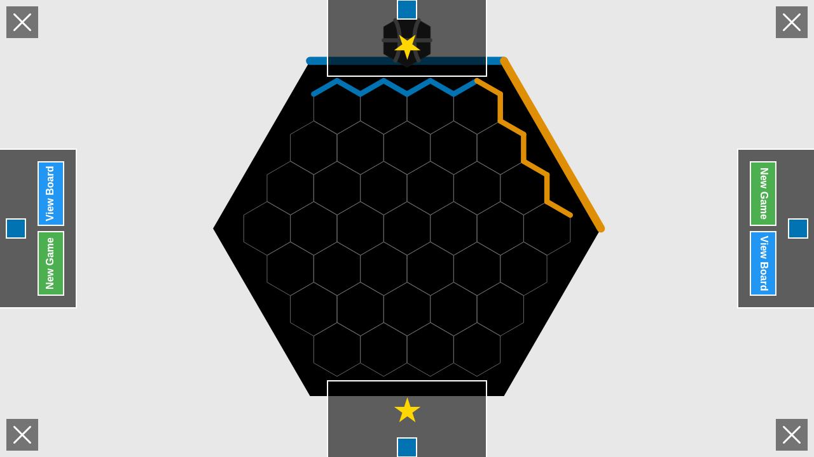
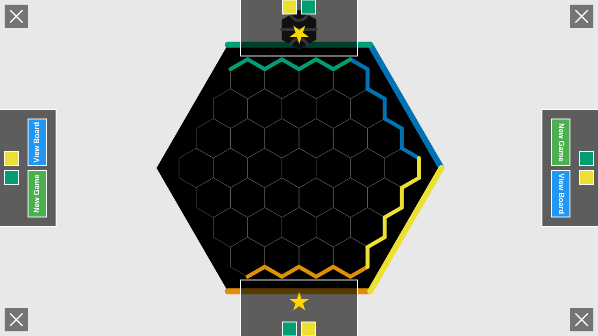

# Victory Animation Implementation

This directory contains screenshots demonstrating the victory animation feature implemented according to the ../designs/UI_DESIGN.md specifications.

## Overview

The victory animation replaces the placeholder victory screen with a fully animated experience using the animation framework. When a player or team wins, the game displays:

1. **Pulsing Flow Effect**: The winning player's flow path pulses with a glowing effect
2. **Victory Modals**: Four victory modals appear in each corner of the screen, rotated to face each edge (0°, 90°, 180°, 270°)
3. **Winner Indicators**: Gold star icon and colored squares showing the winning player or team
4. **Action Buttons**: "New Game" and "View Board" buttons in each modal

## Screenshots

### Early Animation (Modal Fade-in)

The initial phase of the animation where modals begin fading in. The board remains visible underneath.

### Modal Fully Visible

After ~300ms, the victory modals are fully visible in all four corners. Each modal displays:
- Semi-transparent black background (#00000099)
- Gold star (★) victory icon
- Winner's color square(s)
- "New Game" (green) and "View Board" (blue) buttons

### Pulse Animation

The winning flow path pulses with a glowing effect that continues throughout the victory screen, making it clear which player/team won.

### Team Victory

For team games (4-6 players), the victory modals show two colored squares representing both team members.

## Technical Implementation

### Animation Framework Integration

The victory animation uses the game's animation framework with:

- **Modal fade-in**: 18 frames (~300ms) fade from opacity 0 to 1
- **Flow pulse**: 120 frames (~2 seconds) continuous pulse effect using sine wave (0.5 + 0.5 * sin(t * π * 4))
- **Glow effect**: Canvas shadow blur with pulsing intensity on winning flow paths

### Key Features

1. **Non-blocking rendering**: Board remains visible underneath modals
2. **Multi-corner display**: Victory information accessible from any viewing angle
3. **Animated transitions**: Smooth fade-in for professional appearance
4. **Continuous feedback**: Pulsing glow keeps the winning path highlighted

### Code Structure

- `src/animation/victoryAnimations.ts` - Animation definitions and registration
- `src/rendering/gameOverRenderer.ts` - Victory modal rendering
- `src/rendering/gameplayRenderer.ts` - Pulsing flow glow effect
- `tests/victoryAnimation.test.ts` - Unit tests for animation state
- `tests/e2e/victory-animation.spec.ts` - E2E tests with screenshots

## Specifications Followed

This implementation follows the specifications in:
- `../designs/UI_DESIGN.md` - Section "Victory Animation"
- `../designs/ANIMATION_FRAMEWORK.md` - Frame-based animation system

All animations are implemented using the standard animation framework with proper frame timing and easing.
