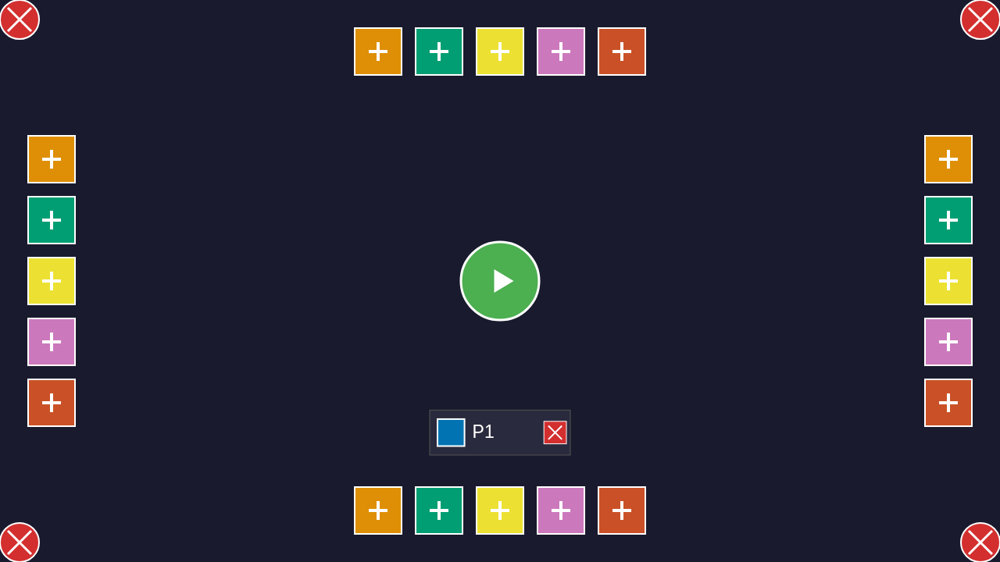
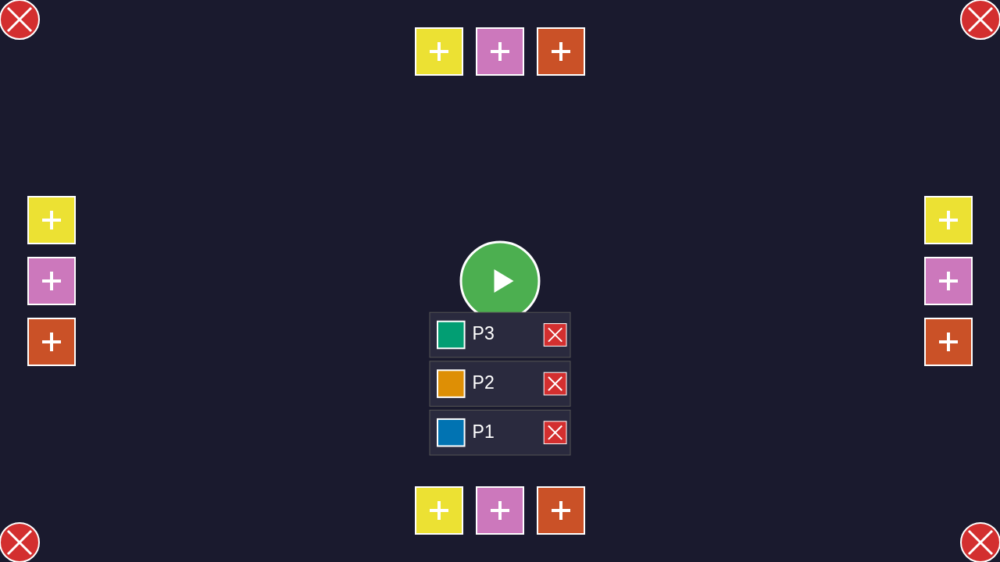
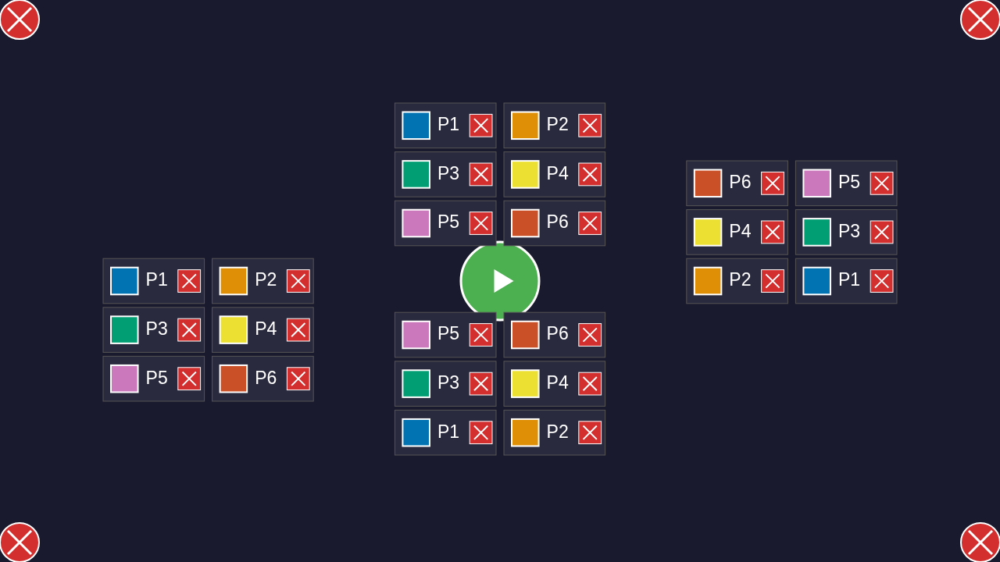
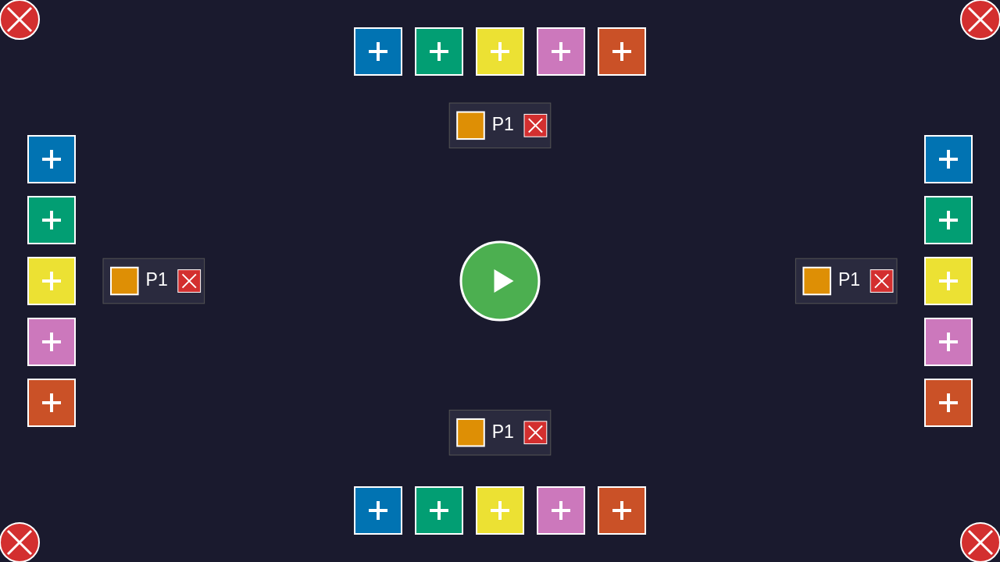

# User Story: Player Configuration

**As a user, I want to configure players before starting a game**

## Flow Description

This story demonstrates a complete, continuous user journey through player configuration. Each screenshot shows the next step from the previous one, telling a cohesive story of setting up players and starting a game.

## Screenshots

### 001-initial-state.png

- **Action**: User loads the application
- **State**: Configuration screen with color buttons around the edges and a START button in the center
- **Redux State**: `configPlayers.length = 0`, `screen = 'configuration'`
- **What to verify**: No players listed, all 6 color buttons visible

### 002-player-added.png

- **Action**: User clicks the Blue color button at the bottom edge
- **State**: One player entry appears with blue color
- **Redux State**: `configPlayers.length = 1`, first player has color `#0173B2` (Blue)
- **What to verify**: Player entry visible with blue color indicator and remove button (X)

### 003-multiple-players.png

- **Action**: User clicks Orange button (right edge) then Green button (top edge)
- **State**: Three players listed with Blue, Orange, and Green colors
- **Redux State**: `configPlayers.length = 3`, colors are unique
- **What to verify**: Three distinct player entries, each with different color

### 004-max-players.png

- **Action**: User continues clicking available color buttons (Yellow, Purple, Red)
- **State**: Six players shown (MAX_PLAYERS = 6), no color buttons visible
- **Redux State**: `configPlayers.length = 6`, all colors in use
- **What to verify**: All 6 players listed, no available color buttons to add more

### 005-player-removed.png

- **Action**: User clicks X button on the first player (Blue)
- **State**: Five players remaining, Blue color now available again
- **Redux State**: `configPlayers.length = 5`, first player's color is no longer Blue
- **What to verify**: Five player entries visible, first player now has Orange color (shifted up)

### 006-player-re-added.png

- **Action**: User removes another player, then adds a player with a previously removed color
- **State**: Five players with a newly added player
- **Redux State**: `configPlayers.length = 5`, demonstrates color reuse
- **What to verify**: Player list shows the color change through remove/re-add workflow

### 007-two-players-ready.png

- **Action**: User removes players until only 2 remain
- **State**: Two players ready to start a game
- **Redux State**: `configPlayers.length = 2`
- **What to verify**: Exactly 2 players shown, START button should be enabled

### 008-game-started.png

- **Action**: User clicks the START button in the center
- **State**: Transitioned to gameplay screen with hexagonal board
- **Redux State**: `screen = 'gameplay'`, seating phase completed
- **What to verify**: Game board visible, player edges assigned, tiles ready for placement

## Continuous Flow

This user story is generated by a **single continuous test** that:
1. Starts from the initial state (0 players)
2. Progressively adds players one by one
3. Demonstrates removal and re-adding
4. Reduces to 2 players for starting a game
5. Transitions to the gameplay screen

Each step builds on the previous state, with **no restarts or hidden steps**. The test verifies Redux state at each step to ensure the documented behavior matches the actual implementation.

## Test Coverage

This story validates:
- Initial configuration screen rendering
- Progressive player addition (1 → 3 → 6 players)
- Removing players with Redux state verification
- Color availability after removal
- Re-adding players with different colors
- Starting game with valid configuration
- Screen transition from configuration → seating → gameplay

## Related Files
- Test: `tests/e2e/configuration.spec.ts` (User Story: Complete player configuration flow)
- Redux: `src/redux/gameReducer.ts`
- Rendering: `src/rendering/lobbyRenderer.ts`, `src/rendering/lobbyLayout.ts`
