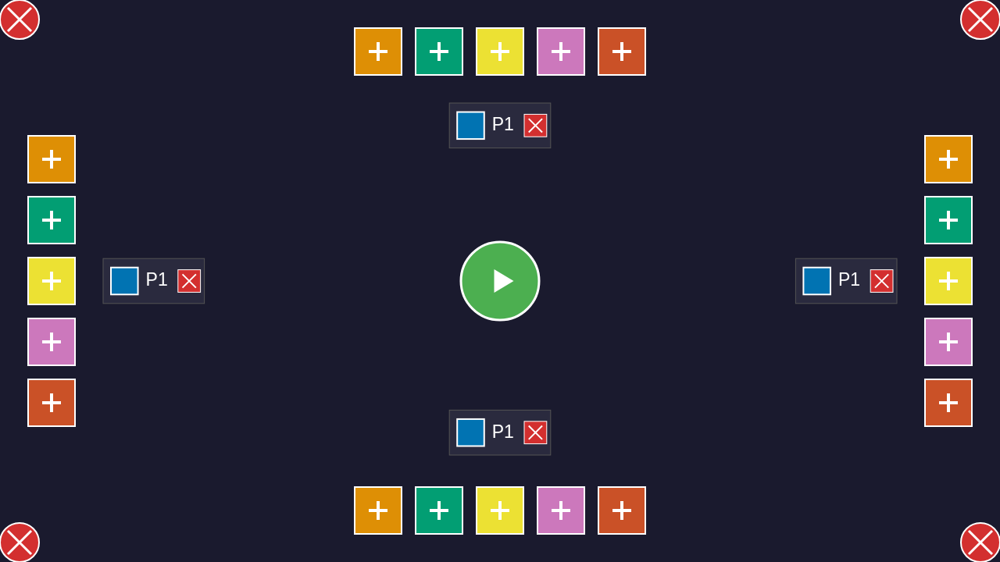

# User Story: Player Configuration

**As a user, I want to configure players before starting a game**

## Flow Description

This story demonstrates a complete, continuous user journey through player configuration. Each screenshot shows the result of a SINGLE user action from the previous state, with no hidden steps.

## Screenshots

### 001-initial-state.png

- **Action**: User loads the application
- **State**: Configuration screen with color buttons around the edges and a START button in the center
- **Redux State**: `configPlayers.length = 0`, `screen = 'configuration'`
- **What to verify**: No players listed, all 6 color buttons visible

### 002-player-added.png

- **Action**: User clicks the Blue color button at the bottom edge
- **State**: One player entry appears with blue color
- **Redux State**: `configPlayers.length = 1`, player color = `#0173B2` (Blue)
- **What to verify**: Player entry visible with blue color indicator and remove button (X)

### 003-second-player-added.png

- **Action**: User clicks Orange color button at the right edge
- **State**: Two players listed with Blue and Orange colors
- **Redux State**: `configPlayers.length = 2`, second player color = `#DE8F05` (Orange)
- **What to verify**: Two distinct player entries, each with different color

### 004-third-player-added.png

- **Action**: User clicks Green color button at the top edge
- **State**: Three players listed with Blue, Orange, and Green colors
- **Redux State**: `configPlayers.length = 3`, third player color = `#029E73` (Green)
- **What to verify**: Three player entries, all with unique colors

### 005-fourth-player-added.png

- **Action**: User clicks Yellow color button
- **State**: Four players listed
- **Redux State**: `configPlayers.length = 4`, fourth player color = `#ECE133` (Yellow)
- **What to verify**: Four player entries visible

### 006-fifth-player-added.png

- **Action**: User clicks Purple color button
- **State**: Five players listed
- **Redux State**: `configPlayers.length = 5`, fifth player color = `#CC78BC` (Purple)
- **What to verify**: Five player entries visible

### 007-max-players.png

- **Action**: User clicks Red color button (last available color)
- **State**: Six players shown (MAX_PLAYERS = 6), no color buttons visible
- **Redux State**: `configPlayers.length = 6`, sixth player color = `#CA5127` (Red)
- **What to verify**: All 6 players listed, no available color buttons to add more

### 008-player-removed.png

- **Action**: User clicks X button on the first player (Blue)
- **State**: Five players remaining, Blue color now available again
- **Redux State**: `configPlayers.length = 5`, first player's color changed (was Blue)
- **What to verify**: Five player entries visible, Blue button available again

### 009-second-player-removed.png

- **Action**: User clicks X button on the first player again
- **State**: Four players remaining
- **Redux State**: `configPlayers.length = 4`
- **What to verify**: Four player entries visible

### 010-third-player-removed.png

- **Action**: User clicks X button on the first player again
- **State**: Three players remaining
- **Redux State**: `configPlayers.length = 3`
- **What to verify**: Three player entries visible

### 011-two-players-ready.png

- **Action**: User clicks X button on the first player again
- **State**: Two players remaining, ready to start game
- **Redux State**: `configPlayers.length = 2`
- **What to verify**: Exactly 2 players shown, START button should be enabled

### 012-game-started.png

- **Action**: User clicks the START button in the center
- **State**: Transitioned to gameplay screen with hexagonal board
- **Redux State**: `screen = 'gameplay'`, seating phase completed
- **What to verify**: Game board visible, player edges assigned, tiles ready for placement

## Continuous Flow

This user story is generated by a **single continuous test** that captures a screenshot after EVERY user action:
1. Starts from the initial state (0 players)
2. Adds players one by one (screenshots after each: 1, 2, 3, 4, 5, 6 players)
3. Removes players one by one (screenshots after each: 5, 4, 3, 2 players)
4. Starts the game (transition to gameplay)

Each step builds on the previous state with **exactly one user action** between screenshots. No hidden steps, no restarts. The test verifies Redux state at each step to ensure the documented behavior matches the actual implementation.

## Test Coverage

This story validates:
- Initial configuration screen rendering
- Progressive player addition (1 → 3 → 6 players)
- Removing players with Redux state verification
- Color availability after removal
- Re-adding players with different colors
- Starting game with valid configuration
- Screen transition from configuration → seating → gameplay

## Related Files
- Test: `tests/e2e/configuration.spec.ts` (User Story: Complete player configuration flow)
- Redux: `src/redux/gameReducer.ts`
- Rendering: `src/rendering/lobbyRenderer.ts`, `src/rendering/lobbyLayout.ts`
