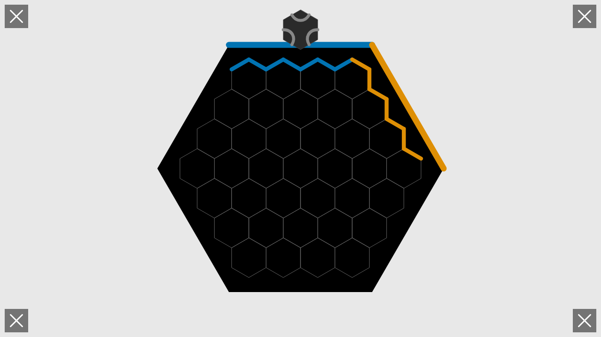

# User Story: Gameplay Screen Rendering

**As a user, I want to see the game board properly rendered when gameplay begins and demonstrate tile placement**

## Flow Description

This story demonstrates a complete gameplay workflow that picks up from where the 001-player-configuration story left off. The same two players (Purple and Red) that finished player configuration now proceed to demonstrate initial gameplay by placing, rotating, and confirming tile placements.

## Screenshots

### 001-two-players.png

- **Action**: Game started with Purple and Red players (continuing from 001-player-configuration)
- **State**: Gameplay screen showing full board with first tile ready
- **Redux State**: `screen = 'gameplay'`, `phase = 'playing'`, players: Purple (#CC78BC) and Red (#CA5127)
- **What to verify**: 
  - Hexagonal game board visible
  - Two player edges colored Purple and Red (matching end of 001-)
  - Current tile preview shown
  - Canvas has content (not blank)

### 002-player1-position-selected.png

- **Action**: Player 1 (Purple) selects a position for tile placement (center of board)
- **State**: Position (0, 0) selected, tile preview shown at selected location
- **Redux State**: `ui.selectedPosition = {row: 0, col: 0}`
- **What to verify**:
  - Selected position highlighted on board
  - Tile preview appears at selected position
  - Selection indicator visible

### 003-player1-tile-rotated.png

- **Action**: Player 1 rotates the tile to rotation 2
- **State**: Tile at selected position shown with rotation 2
- **Redux State**: `ui.rotation = 2`
- **What to verify**:
  - Tile preview shows rotated orientation
  - Flow paths updated to match rotation
  - Tile remains at selected position

### 004-player1-tile-placed.png

- **Action**: Player 1 confirms tile placement
- **State**: Tile permanently placed at (0, 0) with rotation 2
- **Redux State**: `game.board['0,0']` defined, `ui.selectedPosition = null`
- **What to verify**:
  - Tile now part of the board
  - Flows updated if connected to player edge
  - Selection cleared
  - Tile rendered with proper player colors if flows present

### 005-player2-turn.png

- **Action**: Game advances to Player 2 (Red), new tile drawn
- **State**: Player 2's turn with new current tile
- **Redux State**: `currentPlayerIndex = 1`, new `currentTile` drawn
- **What to verify**:
  - Turn indicator shows Player 2 (Red)
  - New tile preview visible
  - Previous tile remains on board

### 006-player2-position-selected.png

- **Action**: Player 2 (Red) selects position (1, 0) for tile placement
- **State**: Position (1, 0) selected, adjacent to first tile
- **Redux State**: `ui.selectedPosition = {row: 1, col: 0}`
- **What to verify**:
  - New position highlighted on board
  - Tile preview appears at new position
  - Previous tile still visible

### 007-player2-tile-rotated.png

- **Action**: Player 2 rotates the tile to rotation 4
- **State**: Tile at selected position shown with rotation 4
- **Redux State**: `ui.rotation = 4`
- **What to verify**:
  - Tile preview shows different rotation than Player 1's tile
  - Flow paths updated to match rotation
  - Both tiles visible on board

### 008-player2-tile-placed.png

- **Action**: Player 2 confirms tile placement
- **State**: Two tiles now on board, both players have placed one tile
- **Redux State**: `game.board['1,0']` defined, 2 tiles total on board
- **What to verify**:
  - Both tiles rendered on board
  - Each tile maintains its rotation
  - Flows updated for both players if applicable
  - Game ready for next turn

## Continuous Flow

This user story is generated by a **single continuous test** that demonstrates the complete tile placement workflow:
1. Start with Purple and Red players (matching end of 001-player-configuration)
2. Player 1 (Purple) selects a position
3. Player 1 rotates the tile
4. Player 1 confirms placement
5. Advance to Player 2's turn
6. Player 2 (Red) selects a position
7. Player 2 rotates the tile
8. Player 2 confirms placement

Each step builds on the previous state with **exactly one user action** between screenshots. This creates a coherent narrative from player configuration through initial gameplay.

## Test Coverage

This story validates:
- Continuity with 001-player-configuration (same colors)
- Gameplay screen initialization with specific player colors
- Position selection workflow
- Tile rotation mechanics
- Tile placement confirmation
- Turn advancement between players
- Multiple tiles on board
- UI state management (selectedPosition, rotation)
- Board state updates

## Related Files
- Test: `tests/e2e/gameplay.spec.ts`
- Redux: `src/redux/gameReducer.ts`, `src/redux/uiReducer.ts`
- Rendering: `src/rendering/gameplayScreen.ts`
- Board Logic: `src/game/board.ts`
