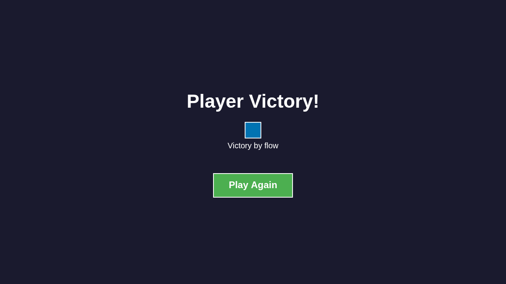

# User Story: Complete 2-Player Game

**As a user, I want to play a complete 2-player game from start to finish**

## Flow Description

This story demonstrates a full game experience from initial configuration through multiple turns, showing how tiles are placed, flows propagate, and the game progresses toward victory. It captures the complete user journey of a competitive 2-player game.

## Test Scenario

- **Seed**: 999
- **Players**: 2 (assigned to adjacent edges 1 and 2)
- **Moves**: Tiles placed until victory or board full
- **Outcome**: Victory determined by flow connections

## Screenshots

### 001-initial-screen.png

- **Action**: User loads the application
- **State**: Configuration screen ready for player setup
- **What to verify**: Clean configuration interface, ready for player addition

### 002-players-added.png

- **Action**: Two players added to the game
- **State**: Configuration screen with two players
- **What to verify**: 
  - Two player entries displayed
  - Each player has a unique color
  - "Start Game" button available

### 003-game-started.png

- **Action**: Game started with two players
- **State**: Gameplay screen with empty board
- **What to verify**:
  - Hexagonal game board visible
  - Player 1 edge (blue) at position 1 (right side)
  - Player 2 edge (orange) at position 2 (top side)
  - Preview tile shown
  - Board ready for first move

### 004-move-1.png through 038-move-35.png

- **Action**: Progressive tile placements by alternating players
- **State**: Board filling with tiles, flows extending
- **What to verify** (across all moves):
  - Players alternate turns correctly
  - Tiles placed systematically across the board
  - Flows propagate from player edges through connected tiles
  - Blue flows (Player 1) extend from edge 1 (right side)
  - Orange flows (Player 2) extend from edge 2 (top side)
  - Flow coloring updates correctly after each placement
  - Board state consistent throughout the game
  - Strategic positioning creates flow networks

#### Move Progression Highlights:

- **Early Game (Moves 1-10)**: Initial tile placements near player edges, establishing flow entry points
- **Mid Game (Moves 11-20)**: Flow networks begin to extend across the board, players establish territory
- **Late Game (Moves 21-35)**: Board fills up, flows reach maximum extent, game approaches conclusion

### victory-final.png

- **Action**: Final game state reached
- **State**: Game concluded with victory condition met
- **What to verify**:
  - Game phase: finished
  - Victory type: tie
  - Both players' flows extended across board
  - Final board state shows complete tile placement pattern
  - Winner(s) determined correctly

## Game Mechanics Demonstrated

### Turn Management
- Players alternate turns systematically
- Current player tracked throughout game
- Turn transitions work correctly

### Tile Placement
- Tiles placed across all valid hexagonal positions
- Systematic coverage of board positions
- No invalid placements or overlaps
- Rotation applied correctly to each tile

### Flow Propagation
- Flows enter from player edges
- Connected tiles propagate player colors
- Disconnected tiles remain grey
- Flow networks extend naturally
- Multiple player flows coexist independently

### Victory Conditions
- Game detects end conditions
- Winner(s) identified correctly
- Victory type recorded (tie in this case)
- Final state preserved

## Test Coverage

This story validates:
- Complete game flow from configuration to victory
- Player setup and game initialization
- Screen transitions (config → gameplay → finished)
- Tile placement mechanics over many moves
- Flow propagation across connected tiles
- Turn-based gameplay with player alternation
- Flow tracking and updates
- Board state management
- Victory detection
- Game completion handling
- Tie condition detection

## Related Files
- Test: `tests/e2e/complete-game.spec.ts`
- Redux: `src/redux/gameReducer.ts`
- Flow Logic: `src/game/flows.ts`
- Board Logic: `src/game/board.ts`
- Victory Logic: `src/game/victory.ts`

## Deterministic Testing
- **Seed 999**: Ensures reproducible tile shuffle
- **Systematic positions**: Tiles placed in predictable pattern
- **Safety limit**: MAX_MOVES_LIMIT = 50 prevents infinite loops
- Covers full 40-tile deck possibility
- Same game plays out identically on each test run
