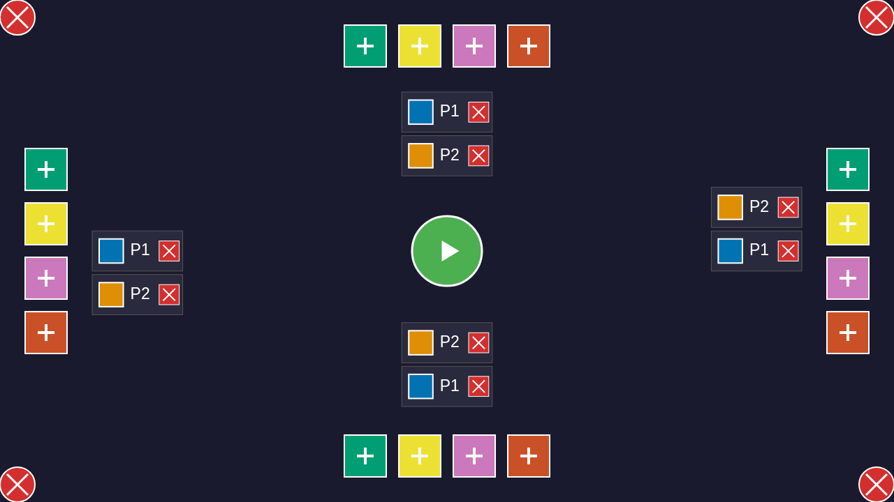
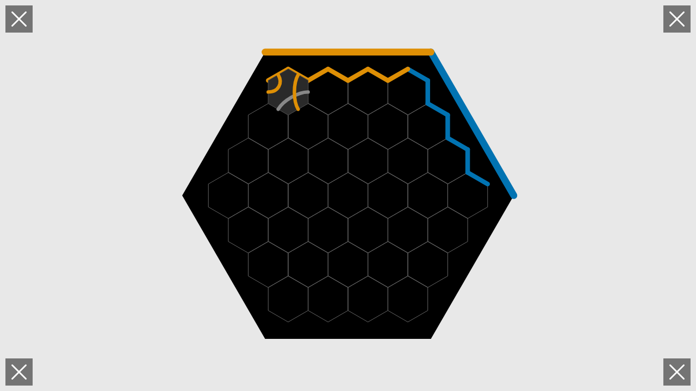
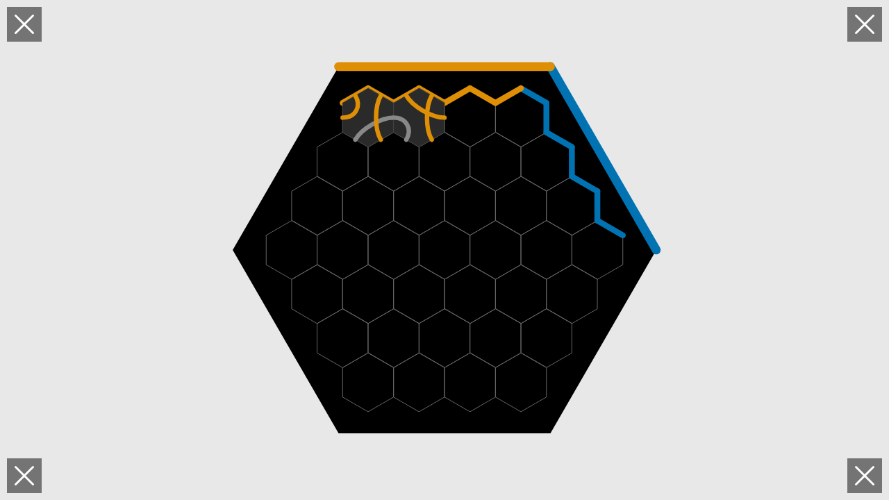
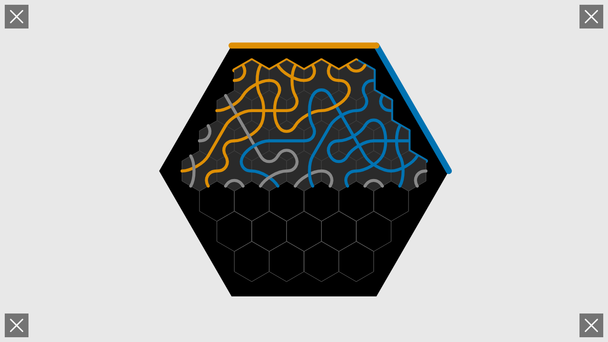

# User Story: Complete 2-Player Game

**As a user, I want to play a complete 2-player game from start to finish**

## Flow Description

This story demonstrates a full game experience from initial setup through multiple turns, showing how tiles are placed, flows propagate, and the game progresses toward victory. The test uses deterministic seeding (seed 999) to ensure reproducible gameplay.

## Test Configuration

- **Seed**: 999 (deterministic tile shuffle)
- **Players**: 2 players
  - Player 1 (Blue, #0173B2) at edge 1 (NE - top-right)
  - Player 2 (Orange, #DE8F05) at edge 3 (SE - bottom-right)
- **Method**: Direct Redux actions for tile placement
- **Moves**: 37 tiles placed total
- **Outcome**: Game continues until victory condition or board full

## Screenshots

### 001-initial-screen.png

- **Action**: User loads the application
- **State**: Configuration screen ready for player setup
- **Redux State**: `screen = 'configuration'`, `configPlayers.length = 0`
- **What to verify**: 
  - Clean configuration interface visible
  - Color buttons arranged around the board edges
  - START button in center
  - No players listed yet

### 002-players-added.png

- **Action**: Two players set up directly via SETUP_GAME action
- **State**: Game configured with Blue and Orange players
- **Redux State**: `players.length = 2`, `screen = 'gameplay'`, `phase = 'playing'`
- **What to verify**: 
  - Gameplay screen now visible (bypassed configuration UI)
  - Board is empty, ready for tiles
  - Two player edges visible: Blue at NE (edge 1), Orange at SE (edge 3)

### 003-game-started.png

- **Action**: Tiles shuffled with seed 999, first tile drawn
- **State**: Ready to place first tile
- **Redux State**: `currentTile` is set, `availableTiles` contains remaining 39 tiles
- **What to verify**:
  - Hexagonal game board visible with proper player edges
  - Player 1 edge (Blue) visible at NE position (top-right)
  - Player 2 edge (Orange) visible at SE position (bottom-right)
  - Preview tile visible at player's edge position
  - Board is empty (no tiles placed yet)

### 004-move-1.png

- **Action**: Player 1 (Blue) places first tile at position (-3, 0) with rotation 1
- **State**: First tile on board
- **Redux State**: `board['-3,0']` contains tile, `moveHistory.length = 1`, `currentPlayerIndex = 0`
- **What to verify**:
  - One tile visible on board
  - Tile at position (-3, 0)
  - Check if tile connects to Blue edge (edge 1)
  - Flows may appear if tile connects to player edge
  - Current player index tracked correctly

### 005-move-2.png

- **Action**: Player 2 (Orange) places tile at position (-3, 1) with rotation 2
- **State**: Two tiles on board
- **Redux State**: `board['-3,1']` contains tile, `moveHistory.length = 2`, `currentPlayerIndex = 1`
- **What to verify**:
  - Two tiles visible
  - New tile at position (-3, 1)
  - Players alternating correctly (now Player 2's turn was executed)
  - Orange flows may appear if tile connects to Orange edge

### 006-move-3.png

- **Action**: Player 1 places tile at position (-3, 2) with rotation 3
- **State**: Three tiles on board, game progressing
- **Redux State**: `board['-3,2']` contains tile, `moveHistory.length = 3`
- **What to verify**:
  - Three tiles now visible
  - Tiles placed in systematic pattern
  - Flow propagation working correctly if tiles connect

### 007-move-4.png through 024-move-21.png

*(Moves 4-21 follow the same pattern: alternating players, systematic tile placement)*

- **Actions**: Players continue alternating, placing tiles systematically across the board
- **State**: Board gradually fills with tiles
- **Redux State**: `board` Map grows, `moveHistory` increases
- **What to verify for each**:
  - Tile count increases by 1
  - Players alternate correctly (P1, P2, P1, P2...)
  - Tiles placed at predicted positions based on test algorithm
  - Flows extend when tiles connect
  - No overlapping tiles (each position used only once)
  - Board state remains consistent

### 025-move-22.png

- **Action**: Player 2 places tile (move 22)
- **State**: 22 tiles on board, game more than halfway through
- **Redux State**: `moveHistory.length = 22`, flows visible for both players
- **What to verify**:
  - 22 tiles visible on board
  - Flow networks extending from both player edges
  - Blue flows from NE edge
  - Orange flows from SE edge
  - Flows colored correctly (Blue #0173B2, Orange #DE8F05)
  - No game over condition triggered yet

### 026-move-23.png

- **Action**: Player 1 places tile (move 23)
- **State**: 23 tiles on board
- **Redux State**: `moveHistory.length = 23`
- **What to verify**:
  - 23 tiles placed
  - Game continues (no victory yet)
  - Move legality validated (tile placement doesn't block any player completely)
  - Flow propagation correct

### 027-move-24.png through 031-move-28.png

*(Moves 24-28 continue the game progression)*

- **Actions**: Continuing tile placements
- **State**: Board approaching full capacity
- **Redux State**: Board Map growing, approaching end game
- **What to verify**:
  - Each screenshot shows one additional tile
  - Flow networks becoming more complex
  - Game state consistent
  - No premature victory

### 032-move-29.png

- **Action**: Player 1 places tile (move 29)
- **State**: 29 tiles on board
- **Redux State**: `moveHistory.length = 29`, game may end after this move or next
- **What to verify**:
  - 29 tiles visible
  - Flow networks nearly complete
  - Check if victory condition triggered
  - Players' flow positions tracked in `game.flows`

### 033-move-30.png through 040-move-37.png

- **Actions**: Final moves of the game (moves 30-37)
- **State**: Board continuing to fill
- **Redux State**: Game progressing toward conclusion
- **What to verify**:
  - Each move adds one tile
  - Victory condition may trigger at any point
  - Final positions recorded correctly
  - Flow calculations accurate throughout

### victory-final.png

- **Action**: Game reaches conclusion
- **State**: Game ended with victory or tie
- **Redux State**: `phase = 'finished'`, `winners` array populated, `winType` set
- **What to verify**:
  - Game phase is 'finished'
  - Winners array contains player ID(s)
  - Win type identified: 'flow', 'constraint', or 'tie'
  - Final board state preserved
  - All tile placements visible
  - Final flow networks visible
  - Victory properly detected

## Game Mechanics Demonstrated

### Deterministic Gameplay

- **Seed 999**: Ensures same tile sequence every test run
- **Systematic placement**: Tiles placed in predictable pattern (row-by-row)
- **Rotation pattern**: Rotation calculated as `(moveNumber + 1) % 6`

### Turn Management

- **Alternating players**: P1, P2, P1, P2, etc.
- **Turn tracking**: `currentPlayerIndex` updates after each placement
- **Move history**: Every move recorded with player ID, tile, and timestamp

### Tile Placement

- **Position selection**: Systematic traversal of board positions
- **Occupied check**: Skips already-occupied positions
- **Direct Redux dispatch**: Uses PLACE_TILE action (bypasses UI)

### Flow Propagation

- **Edge connections**: Flows enter from player edges (NE and SE)
- **Tile connections**: Flows propagate through connected tile paths
- **Color preservation**: Blue flows stay blue, Orange flows stay orange
- **Multiple flows**: Both players' flows coexist independently
- **Flow edges**: Each tile tracks which edges have which player's flow

### Victory Detection

- **Flow victory**: Player connects their edge to opposite edge
- **Constraint victory**: Player draws unplaceable tile
- **Tie**: Multiple players achieve victory simultaneously
- **Phase transition**: Game phase changes to 'finished'

## Test Coverage

This test validates:

- Complete game setup with deterministic configuration
- Systematic tile placement across entire board
- Flow propagation from player edges through connected tiles  
- Turn alternation between players
- Move history tracking
- Board state consistency throughout game
- Victory condition detection
- Final game state preservation
- Redux state integrity across all game phases

## Differences from Test 006

- **Input method**: Direct Redux PLACE_TILE actions vs mouse clicks
- **Legality**: No UI-based legality enforcement (Redux accepts placements)
- **Screenshot count**: One per move (41 total) vs multiple per move
- **Purpose**: Tests game logic directly vs tests UI interactions

## Related Files

- Test: `tests/e2e/complete-game.spec.ts`
- Redux: `src/redux/gameReducer.ts`
- Game Logic: `src/game/board.ts`, `src/game/flows.ts`, `src/game/victory.ts`
- Types: `src/game/types.ts`
