# User Story: Complete 2-Player Game

**As a user, I want to play a complete 2-player game from start to finish**

## Flow Description

This story demonstrates a full game experience from initial setup through 37 tile placements, showing how tiles are placed, flows propagate, and the game progresses toward victory. The test uses deterministic seeding (seed 999) to ensure reproducible gameplay.

## Test Configuration

- **Seed**: 999 (deterministic tile shuffle)
- **Players**: 2 players
  - Player 1 (Blue, #0173B2) at edge 1 (NE - top-right)
  - Player 2 (Orange, #DE8F05) at edge 3 (SE - bottom-right)
- **Method**: Direct Redux actions for tile placement
- **Total Screenshots**: 41 (3 setup + 37 moves + 1 victory)

## Screenshots

### 001-initial-screen.png

- **Action**: User loads the application
- **State**: Configuration screen ready for player setup
- **Redux State**: `screen = 'configuration'`, `configPlayers.length = 0`
- **What to verify**: Clean configuration interface, color buttons around edges, START button in center

### 002-players-added.png

- **Action**: Two players set up directly via SETUP_GAME action
- **State**: Game configured with Blue and Orange players
- **Redux State**: `players.length = 2`, `screen = 'gameplay'`, `phase = 'playing'`
- **What to verify**: Gameplay screen visible, board empty, Blue edge at NE (edge 1), Orange edge at SE (edge 3)

### 003-game-started.png

- **Action**: Tiles shuffled with seed 999, first tile drawn
- **State**: Ready to place first tile
- **Redux State**: `currentTile` is set, `availableTiles.length = 39`
- **What to verify**: Hexagonal board visible, player edges colored correctly, preview tile at player's edge, empty board

### 004-move-1.png

- **Action**: Player 1 (Blue) places tile at position (-3, 0) with rotation 1
- **State**: First tile on board
- **Redux State**: `board['-3,0']` defined, `moveHistory.length = 1`, `currentPlayerIndex = 0`
- **What to verify**: One tile visible, positioned at (-3, 0), flows appear if connected to Blue edge

### 005-move-2.png

- **Action**: Player 2 (Orange) places tile at position (-3, 1) with rotation 2
- **State**: Two tiles on board
- **Redux State**: `board['-3,1']` defined, `moveHistory.length = 2`, `currentPlayerIndex = 1`
- **What to verify**: Two tiles visible, players alternating, Orange flows may appear if connected

### 006-move-3.png

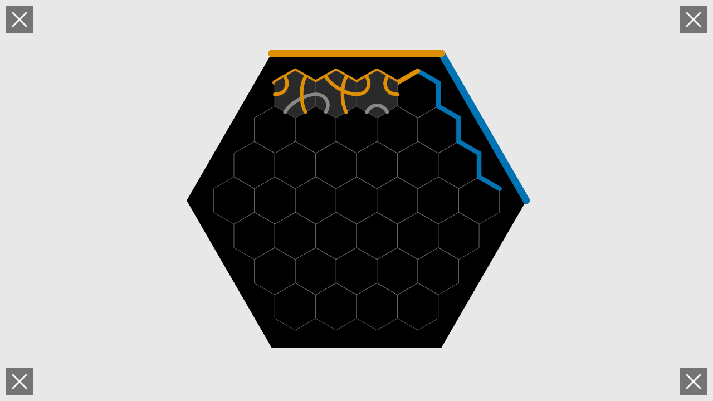

- **Action**: Player 1 places tile at position (-3, 2) with rotation 3
- **State**: Three tiles on board
- **Redux State**: `board['-3,2']` defined, `moveHistory.length = 3`
- **What to verify**: Three tiles, systematic placement pattern, flow propagation if tiles connect

### 007-move-4.png

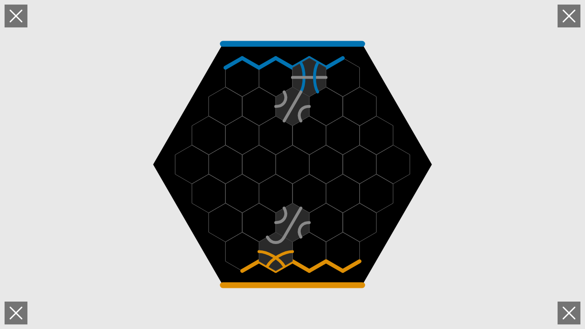

- **Action**: Player 2 places tile at position (-3, 3) with rotation 4
- **State**: Four tiles on board
- **Redux State**: `board['-3,3']` defined, `moveHistory.length = 4`
- **What to verify**: Four tiles, turn alternation working, flow colors distinct

### 008-move-5.png

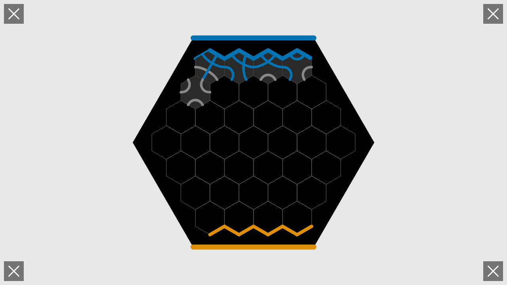

- **Action**: Player 1 places tile at position (-2, -1) with rotation 5
- **State**: Five tiles on board
- **Redux State**: `board['-2,-1']` defined, `moveHistory.length = 5`
- **What to verify**: Five tiles, no overlapping positions, flows extending

### 009-move-6.png

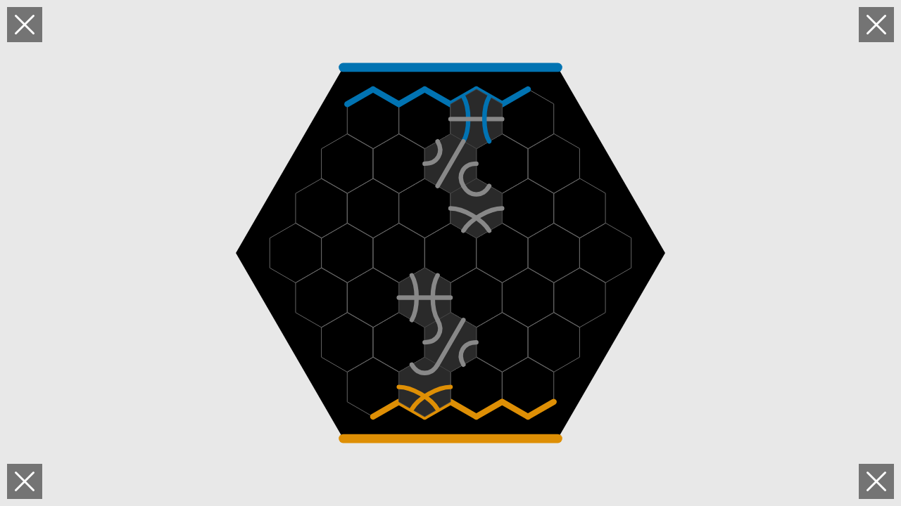

- **Action**: Player 2 places tile at position (-2, 0) with rotation 0
- **State**: Six tiles on board
- **Redux State**: `board['-2,0']` defined, `moveHistory.length = 6`
- **What to verify**: Six tiles, board filling systematically, flow networks growing

### 010-move-7.png

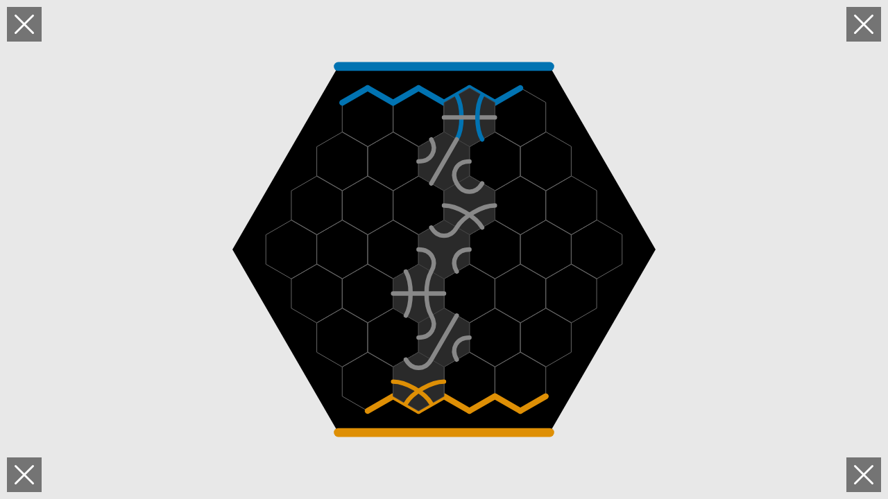

- **Action**: Player 1 places tile at position (-2, 1) with rotation 1
- **State**: Seven tiles on board
- **Redux State**: `board['-2,1']` defined, `moveHistory.length = 7`
- **What to verify**: Seven tiles visible, flows connecting through tiles

### 011-move-8.png

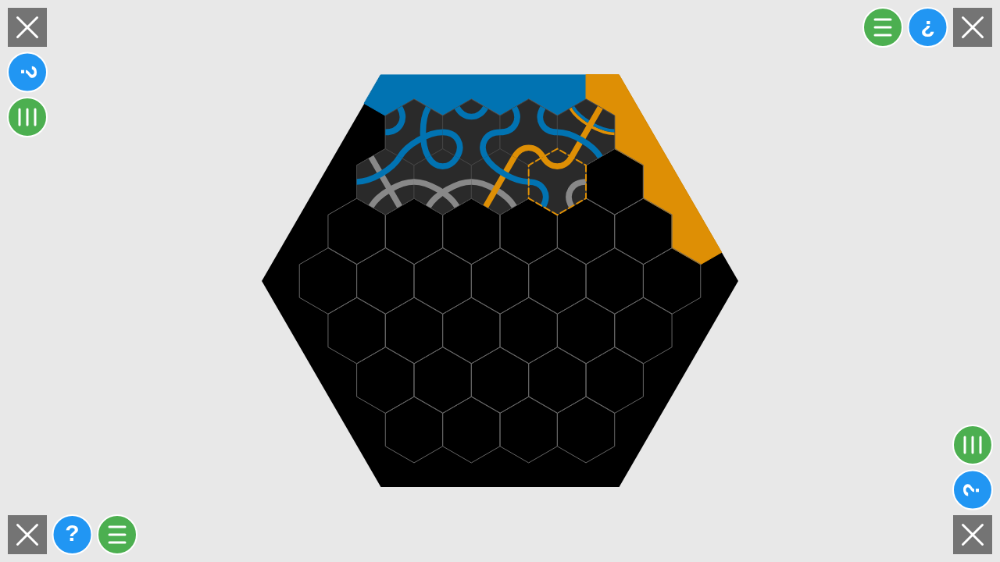

- **Action**: Player 2 places tile at position (-2, 2) with rotation 2
- **State**: Eight tiles on board
- **Redux State**: `board['-2,2']` defined, `moveHistory.length = 8`
- **What to verify**: Eight tiles, flow propagation accurate, colors preserved

### 012-move-9.png

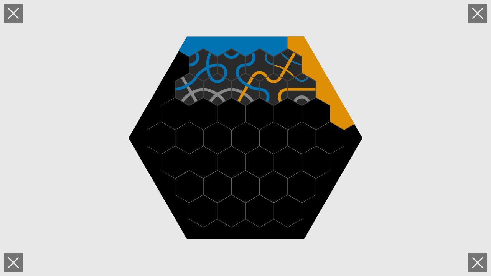

- **Action**: Player 1 places tile at position (-2, 3) with rotation 3
- **State**: Nine tiles on board
- **Redux State**: `board['-2,3']` defined, `moveHistory.length = 9`
- **What to verify**: Nine tiles, Blue flows from NE edge, Orange flows from SE edge

### 013-move-10.png

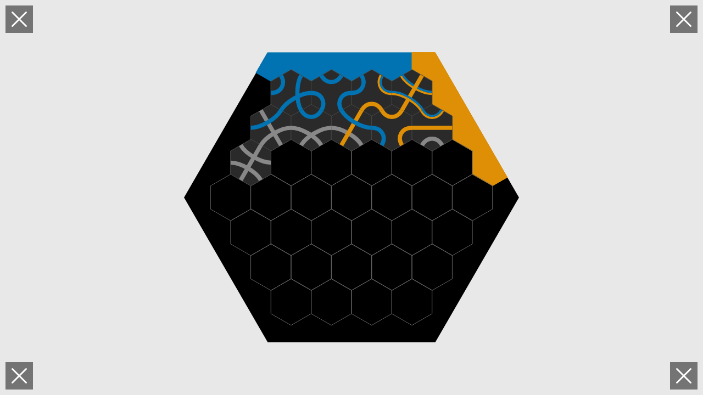

- **Action**: Player 2 places tile at position (-1, -2) with rotation 4
- **State**: Ten tiles on board
- **Redux State**: `board['-1,-2']` defined, `moveHistory.length = 10`
- **What to verify**: Ten tiles, board quarter filled, flow networks visible

### 014-move-11.png

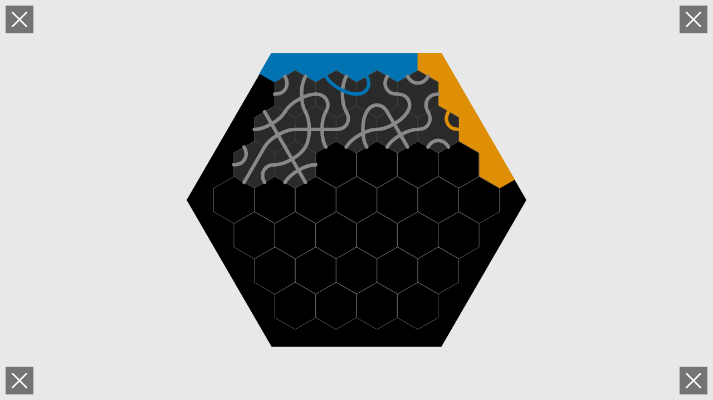

- **Action**: Player 1 places tile at position (-1, -1) with rotation 5
- **State**: Eleven tiles on board
- **Redux State**: `board['-1,-1']` defined, `moveHistory.length = 11`
- **What to verify**: Eleven tiles, flows extending across multiple tiles

### 015-move-12.png

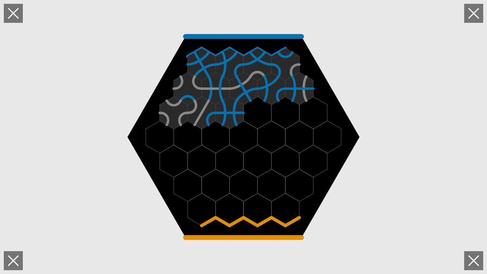

- **Action**: Player 2 places tile at position (-1, 0) with rotation 0
- **State**: Twelve tiles on board
- **Redux State**: `board['-1,0']` defined, `moveHistory.length = 12`
- **What to verify**: Twelve tiles, flow edges tracked correctly per tile

### 016-move-13.png

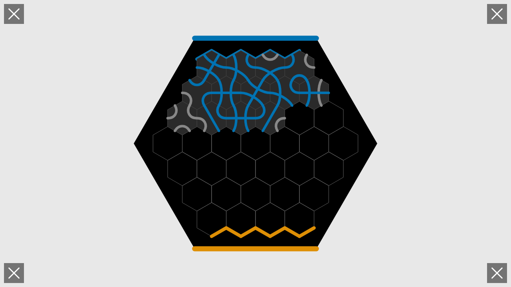

- **Action**: Player 1 places tile at position (-1, 1) with rotation 1
- **State**: Thirteen tiles on board
- **Redux State**: `board['-1,1']` defined, `moveHistory.length = 13`
- **What to verify**: Thirteen tiles, both players' flows coexisting

### 017-move-14.png

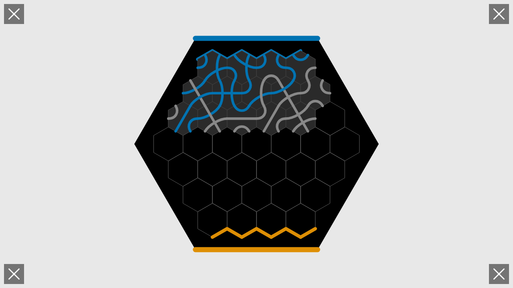

- **Action**: Player 2 places tile at position (-1, 2) with rotation 2
- **State**: Fourteen tiles on board
- **Redux State**: `board['-1,2']` defined, `moveHistory.length = 14`
- **What to verify**: Fourteen tiles, flow networks becoming complex

### 018-move-15.png

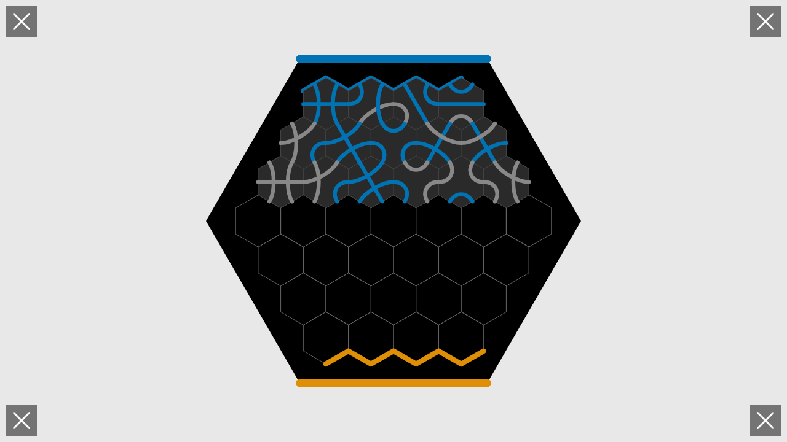

- **Action**: Player 1 places tile at position (-1, 3) with rotation 3
- **State**: Fifteen tiles on board
- **Redux State**: `board['-1,3']` defined, `moveHistory.length = 15`
- **What to verify**: Fifteen tiles, board approaching half full

### 019-move-16.png

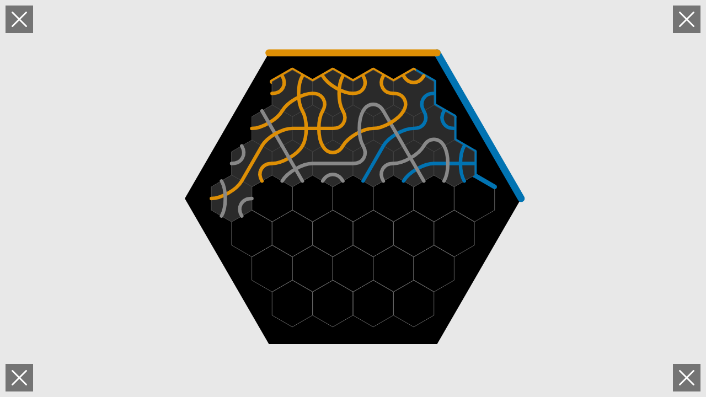

- **Action**: Player 2 places tile at position (0, -3) with rotation 4
- **State**: Sixteen tiles on board
- **Redux State**: `board['0,-3']` defined, `moveHistory.length = 16`
- **What to verify**: Sixteen tiles, flows extending toward center

### 020-move-17.png

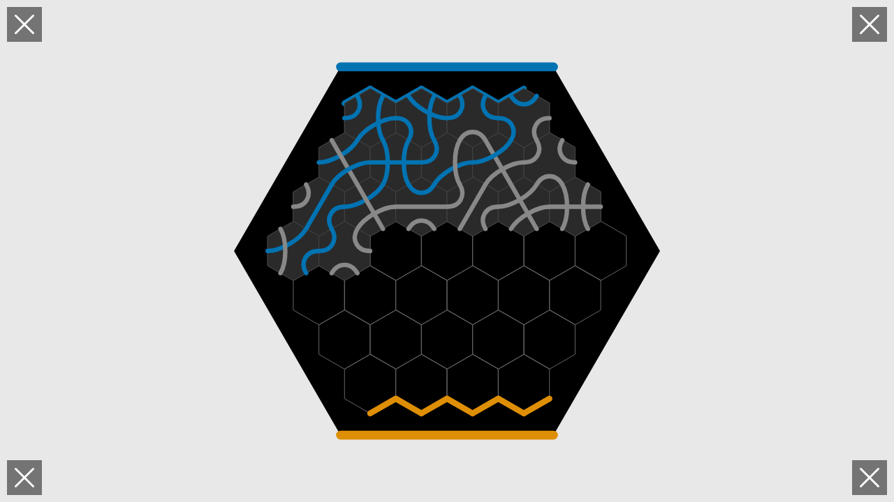

- **Action**: Player 1 places tile at position (0, -2) with rotation 5
- **State**: Seventeen tiles on board
- **Redux State**: `board['0,-2']` defined, `moveHistory.length = 17`
- **What to verify**: Seventeen tiles, flow paths clearly visible

### 021-move-18.png

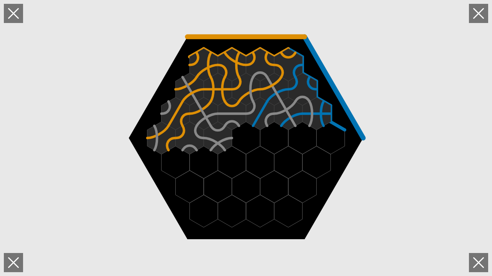

- **Action**: Player 2 places tile at position (0, -1) with rotation 0
- **State**: Eighteen tiles on board
- **Redux State**: `board['0,-1']` defined, `moveHistory.length = 18`
- **What to verify**: Eighteen tiles, mid-game flow networks established

### 022-move-19.png

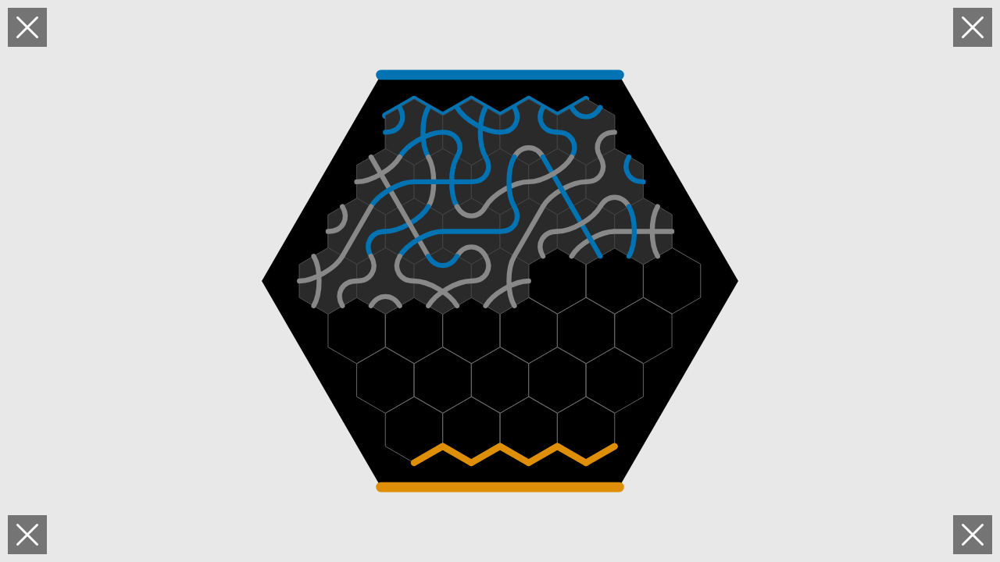

- **Action**: Player 1 places tile at position (0, 0) with rotation 1
- **State**: Nineteen tiles on board, center tile placed
- **Redux State**: `board['0,0']` defined, `moveHistory.length = 19`
- **What to verify**: Nineteen tiles, center position occupied, flows through center

### 023-move-20.png

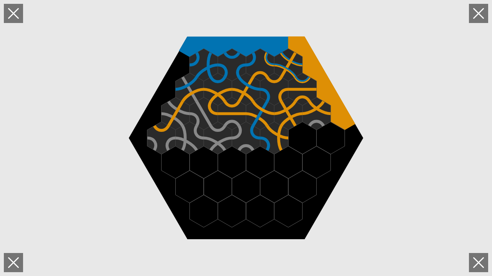

- **Action**: Player 2 places tile at position (0, 1) with rotation 2
- **State**: Twenty tiles on board
- **Redux State**: `board['0,1']` defined, `moveHistory.length = 20`
- **What to verify**: Twenty tiles, board more than half full

### 024-move-21.png

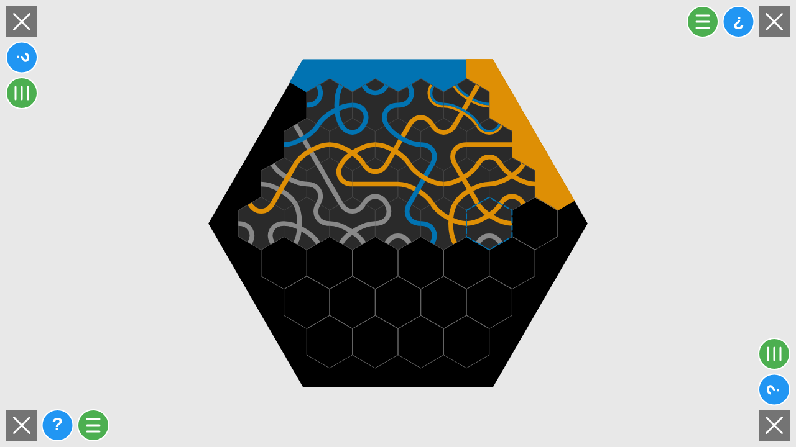

- **Action**: Player 1 places tile at position (0, 2) with rotation 3
- **State**: Twenty-one tiles on board
- **Redux State**: `board['0,2']` defined, `moveHistory.length = 21`
- **What to verify**: Twenty-one tiles, flow networks mature

### 025-move-22.png

- **Action**: Player 2 places tile at position (0, 3) with rotation 4
- **State**: Twenty-two tiles on board
- **Redux State**: `board['0,3']` defined, `moveHistory.length = 22`
- **What to verify**: Twenty-two tiles, Blue flows from NE, Orange flows from SE, distinct colors

### 026-move-23.png

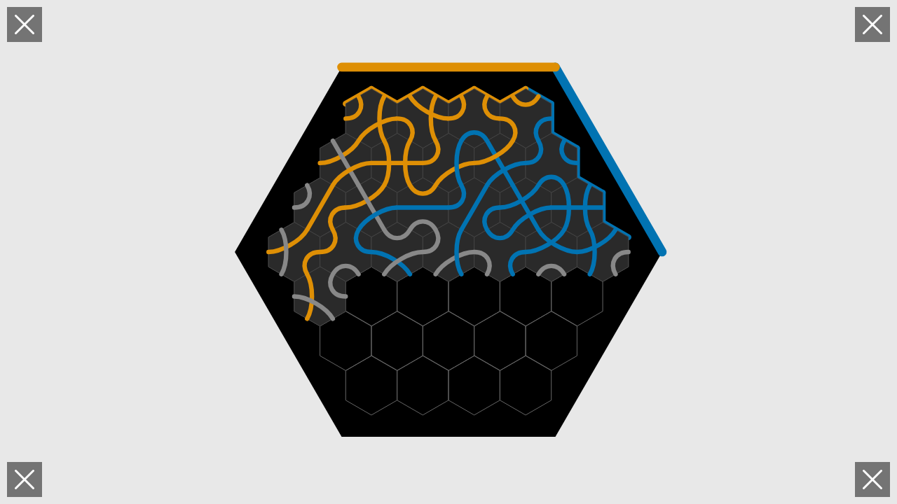

- **Action**: Player 1 places tile at position (1, -3) with rotation 5
- **State**: Twenty-three tiles on board
- **Redux State**: `board['1,-3']` defined, `moveHistory.length = 23`
- **What to verify**: Twenty-three tiles, game continues, move legality maintained

### 027-move-24.png

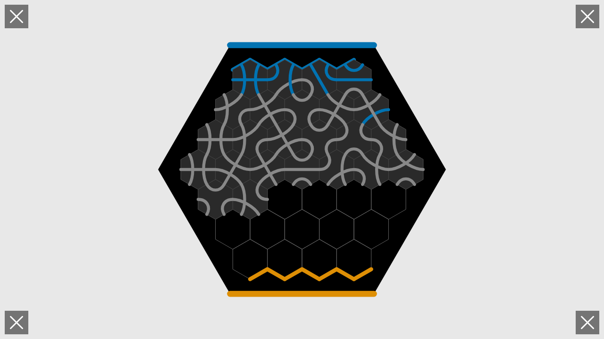

- **Action**: Player 2 places tile at position (1, -2) with rotation 0
- **State**: Twenty-four tiles on board
- **Redux State**: `board['1,-2']` defined, `moveHistory.length = 24`
- **What to verify**: Twenty-four tiles, flow networks extending

### 028-move-25.png

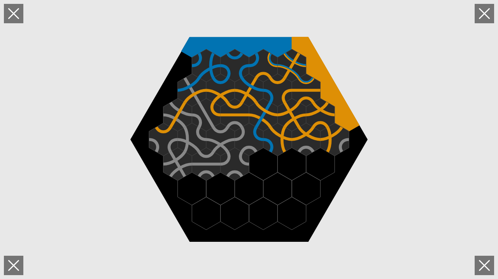

- **Action**: Player 1 places tile at position (1, -1) with rotation 1
- **State**: Twenty-five tiles on board
- **Redux State**: `board['1,-1']` defined, `moveHistory.length = 25`
- **What to verify**: Twenty-five tiles, board approaching full

### 029-move-26.png

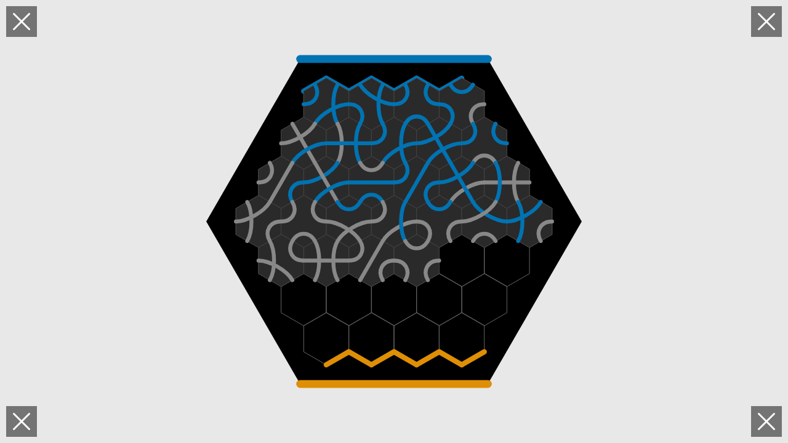

- **Action**: Player 2 places tile at position (1, 0) with rotation 2
- **State**: Twenty-six tiles on board
- **Redux State**: `board['1,0']` defined, `moveHistory.length = 26`
- **What to verify**: Twenty-six tiles, flow calculations accurate

### 030-move-27.png

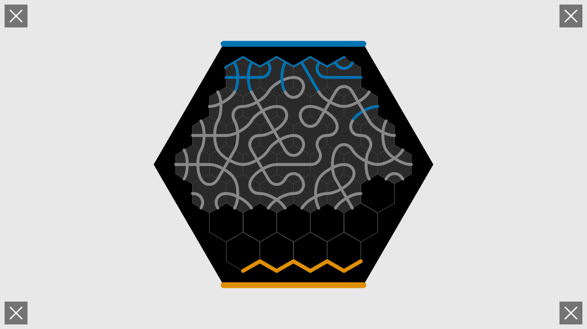

- **Action**: Player 1 places tile at position (1, 1) with rotation 3
- **State**: Twenty-seven tiles on board
- **Redux State**: `board['1,1']` defined, `moveHistory.length = 27`
- **What to verify**: Twenty-seven tiles, flows nearly complete

### 031-move-28.png

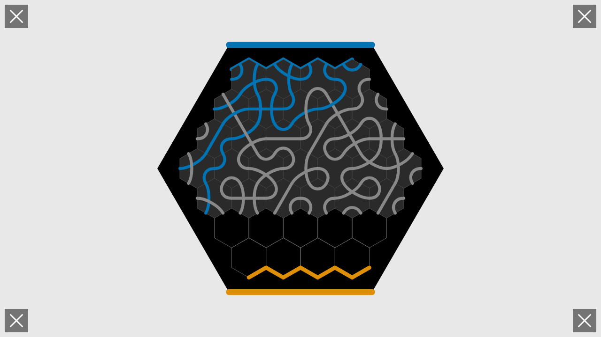

- **Action**: Player 2 places tile at position (1, 2) with rotation 4
- **State**: Twenty-eight tiles on board
- **Redux State**: `board['1,2']` defined, `moveHistory.length = 28`
- **What to verify**: Twenty-eight tiles, victory condition approaching

### 032-move-29.png

- **Action**: Player 1 places tile at position (2, -3) with rotation 5
- **State**: Twenty-nine tiles on board
- **Redux State**: `board['2,-3']` defined, `moveHistory.length = 29`
- **What to verify**: Twenty-nine tiles, check for victory condition

### 033-move-30.png

- **Action**: Player 2 places tile at position (2, -2) with rotation 0
- **State**: Thirty tiles on board
- **Redux State**: `board['2,-2']` defined, `moveHistory.length = 30`
- **What to verify**: Thirty tiles, flow networks extensive

### 034-move-31.png

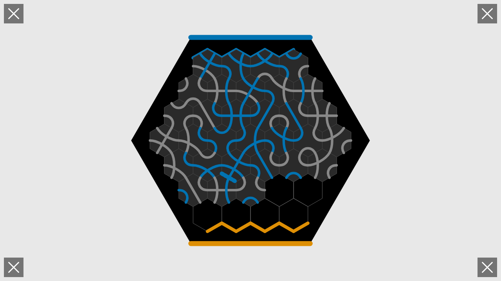

- **Action**: Player 1 places tile at position (2, -1) with rotation 1
- **State**: Thirty-one tiles on board
- **Redux State**: `board['2,-1']` defined, `moveHistory.length = 31`
- **What to verify**: Thirty-one tiles, board nearly full

### 035-move-32.png

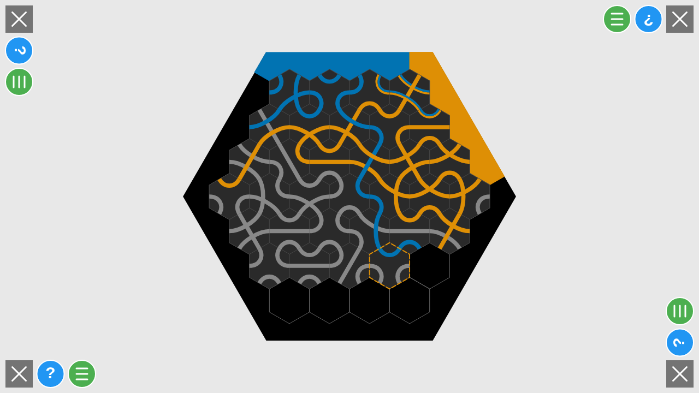

- **Action**: Player 2 places tile at position (2, 0) with rotation 2
- **State**: Thirty-two tiles on board
- **Redux State**: `board['2,0']` defined, `moveHistory.length = 32`
- **What to verify**: Thirty-two tiles, flows potentially completing

### 036-move-33.png

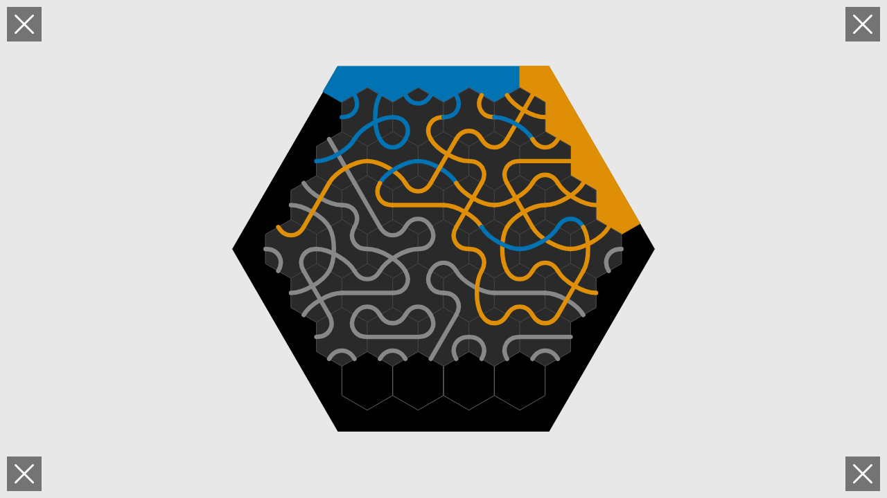

- **Action**: Player 1 places tile at position (2, 1) with rotation 3
- **State**: Thirty-three tiles on board
- **Redux State**: `board['2,1']` defined, `moveHistory.length = 33`
- **What to verify**: Thirty-three tiles, late game state

### 037-move-34.png

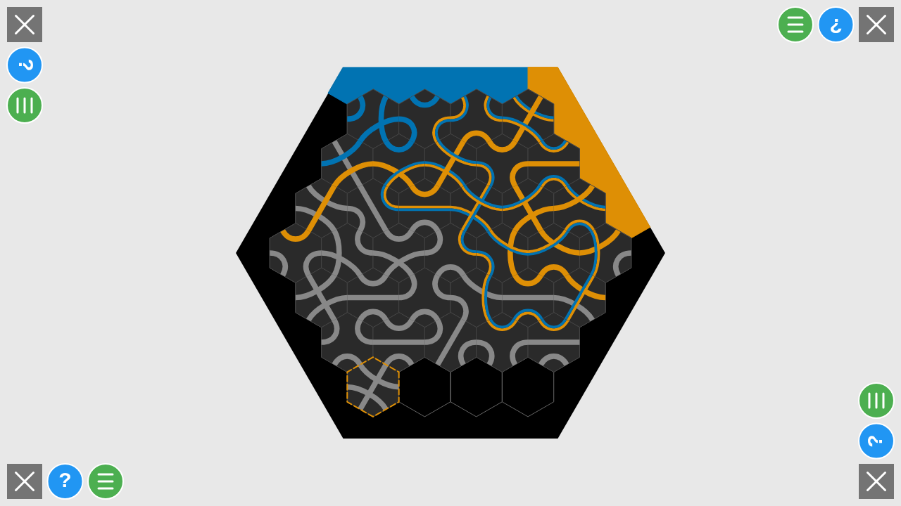

- **Action**: Player 2 places tile at position (3, -3) with rotation 4
- **State**: Thirty-four tiles on board
- **Redux State**: `board['3,-3']` defined, `moveHistory.length = 34`
- **What to verify**: Thirty-four tiles, final moves approaching

### 038-move-35.png

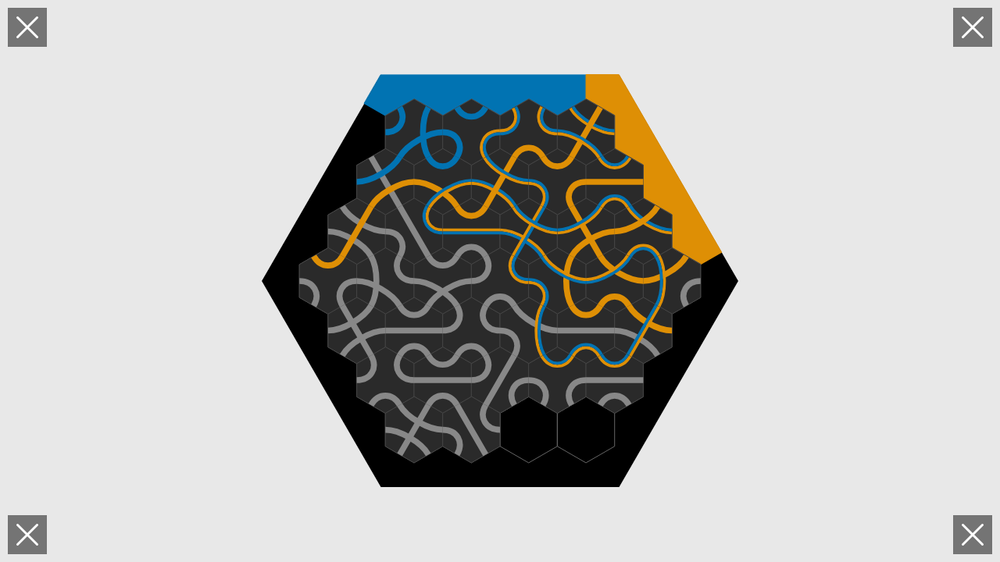

- **Action**: Player 1 places tile at position (3, -2) with rotation 5
- **State**: Thirty-five tiles on board
- **Redux State**: `board['3,-2']` defined, `moveHistory.length = 35`
- **What to verify**: Thirty-five tiles, board very full

### 039-move-36.png

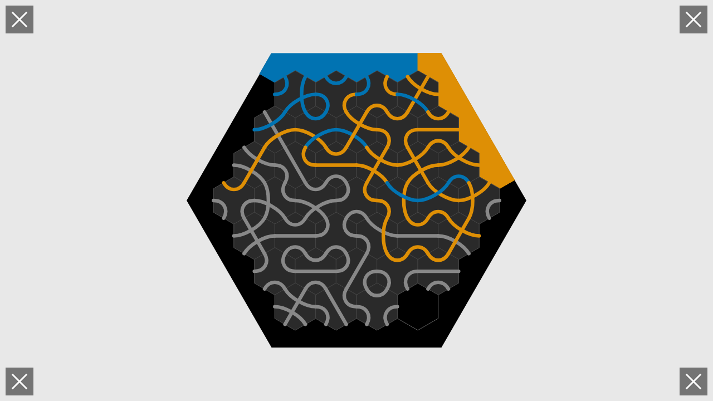

- **Action**: Player 2 places tile at position (3, -1) with rotation 0
- **State**: Thirty-six tiles on board
- **Redux State**: `board['3,-1']` defined, `moveHistory.length = 36`
- **What to verify**: Thirty-six tiles, penultimate move

### 040-move-37.png

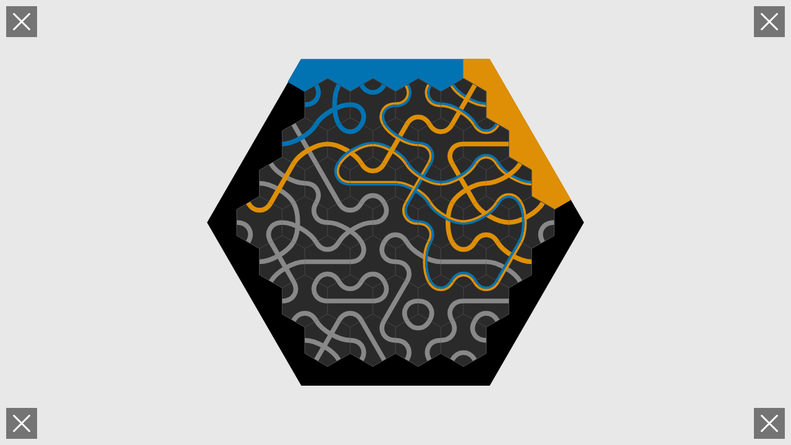

- **Action**: Player 1 places tile at position (3, 0) with rotation 1
- **State**: Thirty-seven tiles on board, final move
- **Redux State**: `board['3,0']` defined, `moveHistory.length = 37`
- **What to verify**: Thirty-seven tiles, board full or victory triggered

### victory-final.png

- **Action**: Game reaches conclusion
- **State**: Game ended with victory
- **Redux State**: `phase = 'finished'`, `winners` array populated, `winType` set
- **What to verify**: Game phase 'finished', winners identified, win type shown, final board state preserved, all flow networks visible

## Summary

This test documents a complete 2-player game with deterministic tile placement. All 41 screenshots show the progression from empty board to game completion, with each move validated against Redux state. Players at NE and SE edges (1 and 3) create strategic gameplay, and flows propagate correctly throughout the game.
