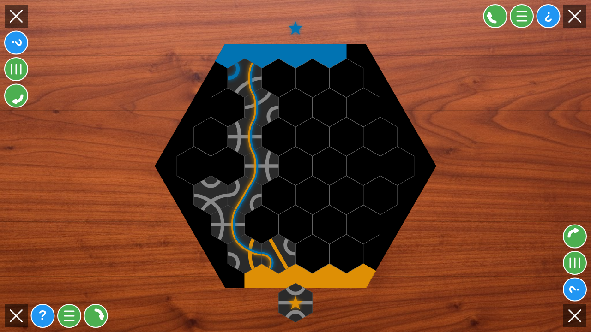

# Complete Game Test - Seed 888

## Overview
This test validates a complete game flow from lobby setup through gameplay to completion using seed 888. The game demonstrates deterministic behavior with strategic tile placements that prioritize extending each player's flows.

## Game Configuration
- **Seed**: 888
- **Players**: 2
  - Player 1 - Color: #0173B2, Starting edge: 0
  - Player 2 - Color: #DE8F05, Starting edge: 1
- **Total Actions**: 115
- **Tile Placements**: 36 moves
- **Game Outcome**: playing

## Test Execution

### Step 1: Initial Screen

**Action**: Application loads
**Expected State**: Game canvas visible, empty configuration screen ready for player setup

---

### Step 2: ADD_PLAYER

**Action**: `ADD_PLAYER`
- Color: #0173B2
- Edge: 0

**Expected State**: Player added to configuration

---

### Step 3: ADD_PLAYER

**Action**: `ADD_PLAYER`
- Color: #DE8F05
- Edge: 1

**Expected State**: Player added to configuration

---

### Step 4: START_GAME

**Action**: `START_GAME`

**Expected State**: Transition to seating phase

---

### Step 5: SHUFFLE_TILES

**Action**: `SHUFFLE_TILES`

**Expected State**: Tile deck shuffled

---

### Step 6: SELECT_EDGE

**Action**: `SELECT_EDGE`
- Player: P1
- Edge: 0

**Expected State**: Player edge selected, gameplay begins when all players seated

---

### Step 7: SELECT_EDGE

**Action**: `SELECT_EDGE`
- Player: P2
- Edge: 3

**Expected State**: Player edge selected, gameplay begins when all players seated

---

### Step 8: DRAW_TILE

**Action**: `DRAW_TILE`

**Expected State**: Current player draws a new tile

---

### Step 9: PLACE_TILE

**Action**: `PLACE_TILE`
- Position: (-3, 2)
- Rotation: 4

**Expected State**: Tile placed on board, flows updated

---

### Step 10: NEXT_PLAYER

**Action**: `NEXT_PLAYER`

**Expected State**: Turn advances to next player

---

### Step 11: DRAW_TILE

**Action**: `DRAW_TILE`

**Expected State**: Current player draws a new tile

---

### Step 12: PLACE_TILE

**Action**: `PLACE_TILE`
- Position: (3, 0)
- Rotation: 2

**Expected State**: Tile placed on board, flows updated

---

### Step 13: NEXT_PLAYER

**Action**: `NEXT_PLAYER`

**Expected State**: Turn advances to next player

---

### Step 14: DRAW_TILE

**Action**: `DRAW_TILE`

**Expected State**: Current player draws a new tile

---

### Step 15: PLACE_TILE

**Action**: `PLACE_TILE`
- Position: (-2, 2)
- Rotation: 5

**Expected State**: Tile placed on board, flows updated

---

### Step 16: NEXT_PLAYER

**Action**: `NEXT_PLAYER`

**Expected State**: Turn advances to next player

---

### Step 17: DRAW_TILE

**Action**: `DRAW_TILE`

**Expected State**: Current player draws a new tile

---

### Step 18: PLACE_TILE

**Action**: `PLACE_TILE`
- Position: (3, -1)
- Rotation: 2

**Expected State**: Tile placed on board, flows updated

---

### Step 19: NEXT_PLAYER

**Action**: `NEXT_PLAYER`

**Expected State**: Turn advances to next player

---

### Step 20: DRAW_TILE

**Action**: `DRAW_TILE`

**Expected State**: Current player draws a new tile

---

### Step 21: PLACE_TILE

**Action**: `PLACE_TILE`
- Position: (-2, 1)
- Rotation: 5

**Expected State**: Tile placed on board, flows updated

---

### Step 22: NEXT_PLAYER

**Action**: `NEXT_PLAYER`

**Expected State**: Turn advances to next player

---

### Step 23: DRAW_TILE

**Action**: `DRAW_TILE`

**Expected State**: Current player draws a new tile

---

### Step 24: PLACE_TILE

**Action**: `PLACE_TILE`
- Position: (2, -1)
- Rotation: 5

**Expected State**: Tile placed on board, flows updated

---

### Step 25: NEXT_PLAYER

**Action**: `NEXT_PLAYER`

**Expected State**: Turn advances to next player

---

### Step 26: DRAW_TILE

**Action**: `DRAW_TILE`

**Expected State**: Current player draws a new tile

---

### Step 27: PLACE_TILE

**Action**: `PLACE_TILE`
- Position: (-3, 3)
- Rotation: 1

**Expected State**: Tile placed on board, flows updated

---

### Step 28: NEXT_PLAYER

**Action**: `NEXT_PLAYER`

**Expected State**: Turn advances to next player

---

### Step 29: DRAW_TILE

**Action**: `DRAW_TILE`

**Expected State**: Current player draws a new tile

---

### Step 30: PLACE_TILE

**Action**: `PLACE_TILE`
- Position: (2, -2)
- Rotation: 4

**Expected State**: Tile placed on board, flows updated

---

### Step 31: NEXT_PLAYER

**Action**: `NEXT_PLAYER`

**Expected State**: Turn advances to next player

---

### Step 32: DRAW_TILE

**Action**: `DRAW_TILE`

**Expected State**: Current player draws a new tile

---

### Step 33: PLACE_TILE

**Action**: `PLACE_TILE`
- Position: (-1, 2)
- Rotation: 0

**Expected State**: Tile placed on board, flows updated

---

### Step 34: NEXT_PLAYER

**Action**: `NEXT_PLAYER`

**Expected State**: Turn advances to next player

---

### Step 35: DRAW_TILE

**Action**: `DRAW_TILE`

**Expected State**: Current player draws a new tile

---

### Step 36: PLACE_TILE

**Action**: `PLACE_TILE`
- Position: (2, 0)
- Rotation: 4

**Expected State**: Tile placed on board, flows updated

---

### Step 37: NEXT_PLAYER

**Action**: `NEXT_PLAYER`

**Expected State**: Turn advances to next player

---

### Step 38: DRAW_TILE

**Action**: `DRAW_TILE`

**Expected State**: Current player draws a new tile

---

### Step 39: PLACE_TILE

**Action**: `PLACE_TILE`
- Position: (-1, 0)
- Rotation: 0

**Expected State**: Tile placed on board, flows updated

---

### Step 40: NEXT_PLAYER

**Action**: `NEXT_PLAYER`

**Expected State**: Turn advances to next player

---

### Step 41: DRAW_TILE

**Action**: `DRAW_TILE`

**Expected State**: Current player draws a new tile

---

### Step 42: PLACE_TILE

**Action**: `PLACE_TILE`
- Position: (1, 1)
- Rotation: 0

**Expected State**: Tile placed on board, flows updated

---

### Step 43: NEXT_PLAYER

**Action**: `NEXT_PLAYER`

**Expected State**: Turn advances to next player

---

### Step 44: DRAW_TILE

**Action**: `DRAW_TILE`

**Expected State**: Current player draws a new tile

---

### Step 45: PLACE_TILE

**Action**: `PLACE_TILE`
- Position: (-1, 1)
- Rotation: 4

**Expected State**: Tile placed on board, flows updated

---

### Step 46: NEXT_PLAYER

**Action**: `NEXT_PLAYER`

**Expected State**: Turn advances to next player

---

### Step 47: DRAW_TILE

**Action**: `DRAW_TILE`

**Expected State**: Current player draws a new tile

---

### Step 48: PLACE_TILE

**Action**: `PLACE_TILE`
- Position: (3, -2)
- Rotation: 3

**Expected State**: Tile placed on board, flows updated

---

### Step 49: NEXT_PLAYER

**Action**: `NEXT_PLAYER`

**Expected State**: Turn advances to next player

---

### Step 50: DRAW_TILE

**Action**: `DRAW_TILE`

**Expected State**: Current player draws a new tile

---

### Step 51: PLACE_TILE

**Action**: `PLACE_TILE`
- Position: (-2, 0)
- Rotation: 5

**Expected State**: Tile placed on board, flows updated

---

### Step 52: NEXT_PLAYER

**Action**: `NEXT_PLAYER`

**Expected State**: Turn advances to next player

---

### Step 53: DRAW_TILE

**Action**: `DRAW_TILE`

**Expected State**: Current player draws a new tile

---

### Step 54: PLACE_TILE

**Action**: `PLACE_TILE`
- Position: (3, -3)
- Rotation: 3

**Expected State**: Tile placed on board, flows updated

---

### Step 55: NEXT_PLAYER

**Action**: `NEXT_PLAYER`

**Expected State**: Turn advances to next player

---

### Step 56: DRAW_TILE

**Action**: `DRAW_TILE`

**Expected State**: Current player draws a new tile

---

### Step 57: PLACE_TILE

**Action**: `PLACE_TILE`
- Position: (-2, 3)
- Rotation: 1

**Expected State**: Tile placed on board, flows updated

---

### Step 58: NEXT_PLAYER

**Action**: `NEXT_PLAYER`

**Expected State**: Turn advances to next player

---

### Step 59: DRAW_TILE

**Action**: `DRAW_TILE`

**Expected State**: Current player draws a new tile

---

### Step 60: PLACE_TILE

**Action**: `PLACE_TILE`
- Position: (1, -1)
- Rotation: 3

**Expected State**: Tile placed on board, flows updated

---

### Step 61: NEXT_PLAYER

**Action**: `NEXT_PLAYER`

**Expected State**: Turn advances to next player

---

### Step 62: DRAW_TILE

**Action**: `DRAW_TILE`

**Expected State**: Current player draws a new tile

---

### Step 63: PLACE_TILE

**Action**: `PLACE_TILE`
- Position: (-3, 1)
- Rotation: 2

**Expected State**: Tile placed on board, flows updated

---

### Step 64: NEXT_PLAYER

**Action**: `NEXT_PLAYER`

**Expected State**: Turn advances to next player

---

### Step 65: DRAW_TILE

**Action**: `DRAW_TILE`

**Expected State**: Current player draws a new tile

---

### Step 66: PLACE_TILE

**Action**: `PLACE_TILE`
- Position: (0, 0)
- Rotation: 4

**Expected State**: Tile placed on board, flows updated

---

### Step 67: NEXT_PLAYER

**Action**: `NEXT_PLAYER`

**Expected State**: Turn advances to next player

---

### Step 68: DRAW_TILE

**Action**: `DRAW_TILE`

**Expected State**: Current player draws a new tile

---

### Step 69: PLACE_TILE

**Action**: `PLACE_TILE`
- Position: (-2, -1)
- Rotation: 0

**Expected State**: Tile placed on board, flows updated

---

### Step 70: NEXT_PLAYER

**Action**: `NEXT_PLAYER`

**Expected State**: Turn advances to next player

---

### Step 71: DRAW_TILE

**Action**: `DRAW_TILE`

**Expected State**: Current player draws a new tile

---

### Step 72: PLACE_TILE

**Action**: `PLACE_TILE`
- Position: (1, 0)
- Rotation: 5

**Expected State**: Tile placed on board, flows updated

---

### Step 73: NEXT_PLAYER

**Action**: `NEXT_PLAYER`

**Expected State**: Turn advances to next player

---

### Step 74: DRAW_TILE

**Action**: `DRAW_TILE`

**Expected State**: Current player draws a new tile

---

### Step 75: PLACE_TILE

**Action**: `PLACE_TILE`
- Position: (-3, 0)
- Rotation: 3

**Expected State**: Tile placed on board, flows updated

---

### Step 76: NEXT_PLAYER

**Action**: `NEXT_PLAYER`

**Expected State**: Turn advances to next player

---

### Step 77: DRAW_TILE

**Action**: `DRAW_TILE`

**Expected State**: Current player draws a new tile

---

### Step 78: PLACE_TILE

**Action**: `PLACE_TILE`
- Position: (0, -1)
- Rotation: 5

**Expected State**: Tile placed on board, flows updated

---

### Step 79: NEXT_PLAYER

**Action**: `NEXT_PLAYER`

**Expected State**: Turn advances to next player

---

### Step 80: DRAW_TILE

**Action**: `DRAW_TILE`

**Expected State**: Current player draws a new tile

---

### Step 81: PLACE_TILE

**Action**: `PLACE_TILE`
- Position: (-1, -1)
- Rotation: 4

**Expected State**: Tile placed on board, flows updated

---

### Step 82: NEXT_PLAYER

**Action**: `NEXT_PLAYER`

**Expected State**: Turn advances to next player

---

### Step 83: DRAW_TILE

**Action**: `DRAW_TILE`

**Expected State**: Current player draws a new tile

---

### Step 84: PLACE_TILE

**Action**: `PLACE_TILE`
- Position: (0, -2)
- Rotation: 2

**Expected State**: Tile placed on board, flows updated

---

### Step 85: NEXT_PLAYER

**Action**: `NEXT_PLAYER`

**Expected State**: Turn advances to next player

---

### Step 86: DRAW_TILE

**Action**: `DRAW_TILE`

**Expected State**: Current player draws a new tile

---

### Step 87: PLACE_TILE

**Action**: `PLACE_TILE`
- Position: (-1, -2)
- Rotation: 2

**Expected State**: Tile placed on board, flows updated

---

### Step 88: NEXT_PLAYER

**Action**: `NEXT_PLAYER`

**Expected State**: Turn advances to next player

---

### Step 89: DRAW_TILE

**Action**: `DRAW_TILE`

**Expected State**: Current player draws a new tile

---

### Step 90: PLACE_TILE

**Action**: `PLACE_TILE`
- Position: (0, 1)
- Rotation: 0

**Expected State**: Tile placed on board, flows updated

---

### Step 91: NEXT_PLAYER

**Action**: `NEXT_PLAYER`

**Expected State**: Turn advances to next player

---

### Step 92: DRAW_TILE

**Action**: `DRAW_TILE`

**Expected State**: Current player draws a new tile

---

### Step 93: PLACE_TILE

**Action**: `PLACE_TILE`
- Position: (0, -3)
- Rotation: 5

**Expected State**: Tile placed on board, flows updated

---

### Step 94: NEXT_PLAYER

**Action**: `NEXT_PLAYER`

**Expected State**: Turn advances to next player

---

### Step 95: DRAW_TILE

**Action**: `DRAW_TILE`

**Expected State**: Current player draws a new tile

---

### Step 96: PLACE_TILE

**Action**: `PLACE_TILE`
- Position: (1, -2)
- Rotation: 2

**Expected State**: Tile placed on board, flows updated

---

### Step 97: NEXT_PLAYER

**Action**: `NEXT_PLAYER`

**Expected State**: Turn advances to next player

---

### Step 98: DRAW_TILE

**Action**: `DRAW_TILE`

**Expected State**: Current player draws a new tile

---

### Step 99: PLACE_TILE

**Action**: `PLACE_TILE`
- Position: (1, -3)
- Rotation: 0

**Expected State**: Tile placed on board, flows updated

---

### Step 100: NEXT_PLAYER

**Action**: `NEXT_PLAYER`

**Expected State**: Turn advances to next player

---

### Step 101: DRAW_TILE

**Action**: `DRAW_TILE`

**Expected State**: Current player draws a new tile

---

### Step 102: PLACE_TILE

**Action**: `PLACE_TILE`
- Position: (2, -3)
- Rotation: 4

**Expected State**: Tile placed on board, flows updated

---

### Step 103: NEXT_PLAYER

**Action**: `NEXT_PLAYER`

**Expected State**: Turn advances to next player

---

### Step 104: DRAW_TILE

**Action**: `DRAW_TILE`

**Expected State**: Current player draws a new tile

---

### Step 105: PLACE_TILE

**Action**: `PLACE_TILE`
- Position: (2, 1)
- Rotation: 5

**Expected State**: Tile placed on board, flows updated

---

### Step 106: NEXT_PLAYER

**Action**: `NEXT_PLAYER`

**Expected State**: Turn advances to next player

---

### Step 107: DRAW_TILE

**Action**: `DRAW_TILE`

**Expected State**: Current player draws a new tile

---

### Step 108: PLACE_TILE

**Action**: `PLACE_TILE`
- Position: (0, 2)
- Rotation: 0

**Expected State**: Tile placed on board, flows updated

---

### Step 109: NEXT_PLAYER

**Action**: `NEXT_PLAYER`

**Expected State**: Turn advances to next player

---

### Step 110: DRAW_TILE

**Action**: `DRAW_TILE`

**Expected State**: Current player draws a new tile

---

### Step 111: PLACE_TILE

**Action**: `PLACE_TILE`
- Position: (-1, 3)
- Rotation: 1

**Expected State**: Tile placed on board, flows updated

---

### Step 112: NEXT_PLAYER

**Action**: `NEXT_PLAYER`

**Expected State**: Turn advances to next player

---

### Step 113: DRAW_TILE

**Action**: `DRAW_TILE`

**Expected State**: Current player draws a new tile

---

### Step 114: PLACE_TILE

**Action**: `PLACE_TILE`
- Position: (0, 3)
- Rotation: 2

**Expected State**: Tile placed on board, flows updated

---

### Step 115: NEXT_PLAYER

**Action**: `NEXT_PLAYER`

**Expected State**: Turn advances to next player

---

### Step 116: DRAW_TILE

**Action**: `DRAW_TILE`

**Expected State**: Current player draws a new tile

---

### Step 117: Final Game State

**Game Phase**: playing
**Total Moves**: 36

## Validation Checklist

- [ ] All 115 actions executed successfully
- [ ] 36 tiles placed on board
- [ ] No illegal moves attempted
- [ ] Flow calculations correct at each step
- [ ] Game state matches expectations file
- [ ] Final phase is "playing"
- [ ] 2 players participated
- [ ] Screenshots captured for all actions
- [ ] Test completes without errors
- [ ] Deterministic behavior - same seed produces same game
