# Complete Game Test - Seed 888

## Overview
This test validates a complete game flow from lobby setup through gameplay to completion using seed 888. The game demonstrates deterministic behavior with strategic tile placements that prioritize extending each player's flows.

## Game Configuration
- **Seed**: 888
- **Players**: 2
  - Player 1 - Color: #0173B2, Starting edge: 0
  - Player 2 - Color: #DE8F05, Starting edge: 1
- **Total Actions**: 26
- **Tile Placements**: 7 moves
- **Game Outcome**: finished

## Test Execution

### Step 1: Initial Screen

**Action**: Application loads
**Expected State**: Game canvas visible, empty configuration screen ready for player setup

---

### Step 2: ADD_PLAYER

**Action**: `ADD_PLAYER`
- Color: #0173B2
- Edge: 0

**Expected State**: Player added to configuration

---

### Step 3: ADD_PLAYER
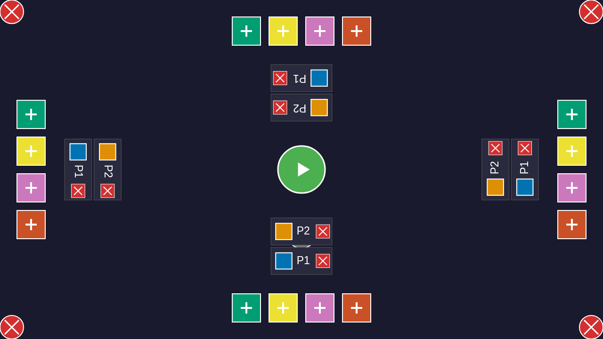

**Action**: `ADD_PLAYER`
- Color: #DE8F05
- Edge: 1

**Expected State**: Player added to configuration

---

### Step 4: START_GAME
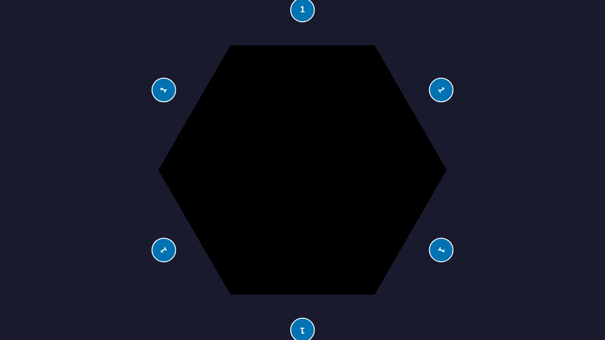

**Action**: `START_GAME`

**Expected State**: Transition to seating phase

---

### Step 5: SHUFFLE_TILES

**Action**: `SHUFFLE_TILES`

**Expected State**: Tile deck shuffled

---

### Step 6: SELECT_EDGE
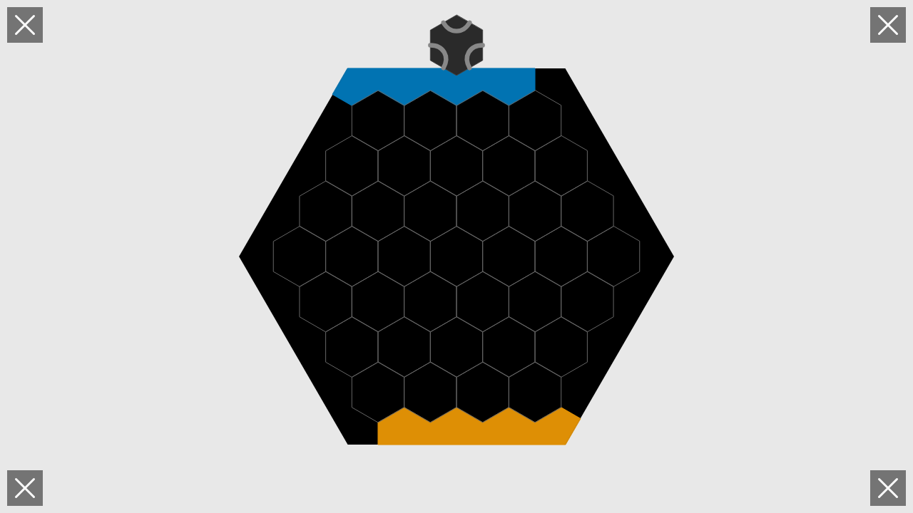

**Action**: `SELECT_EDGE`
- Player: P1
- Edge: 0

**Expected State**: Player edge selected, gameplay begins when all players seated

---

### Step 7: SELECT_EDGE
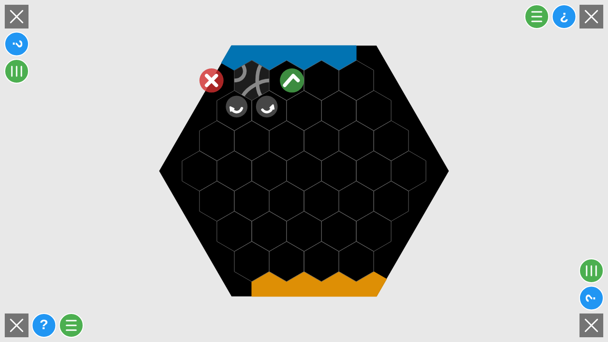

**Action**: `SELECT_EDGE`
- Player: P2
- Edge: 3

**Expected State**: Player edge selected, gameplay begins when all players seated

---

### Step 8: DRAW_TILE

**Action**: `DRAW_TILE`

**Expected State**: Current player draws a new tile

---

### Step 9: PLACE_TILE

**Action**: `PLACE_TILE`
- Position: (-3, 0)
- Rotation: 0

**Expected State**: Tile placed on board, flows updated

---

### Step 10: NEXT_PLAYER
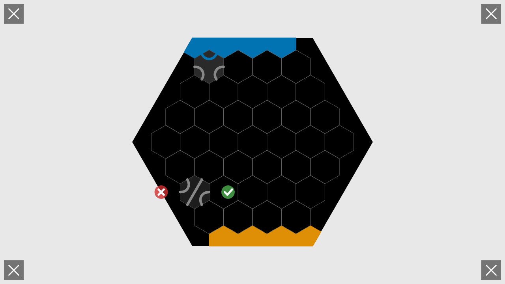

**Action**: `NEXT_PLAYER`

**Expected State**: Turn advances to next player

---

### Step 11: DRAW_TILE

**Action**: `DRAW_TILE`

**Expected State**: Current player draws a new tile

---

### Step 12: PLACE_TILE
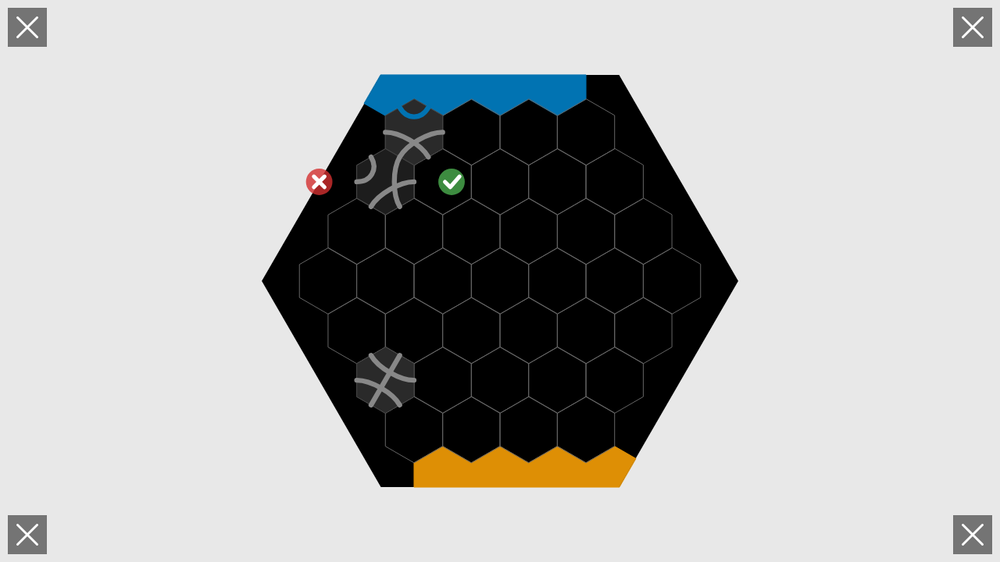

**Action**: `PLACE_TILE`
- Position: (2, -3)
- Rotation: 1

**Expected State**: Tile placed on board, flows updated

---

### Step 13: NEXT_PLAYER
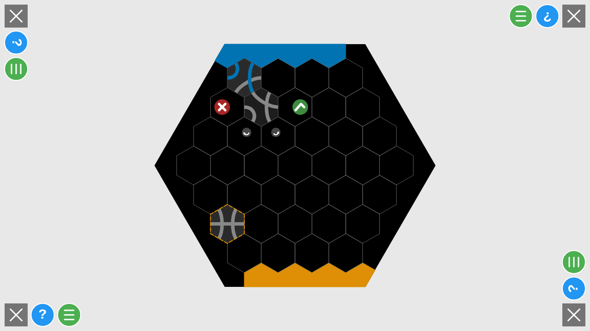

**Action**: `NEXT_PLAYER`

**Expected State**: Turn advances to next player

---

### Step 14: DRAW_TILE

**Action**: `DRAW_TILE`

**Expected State**: Current player draws a new tile

---

### Step 15: PLACE_TILE
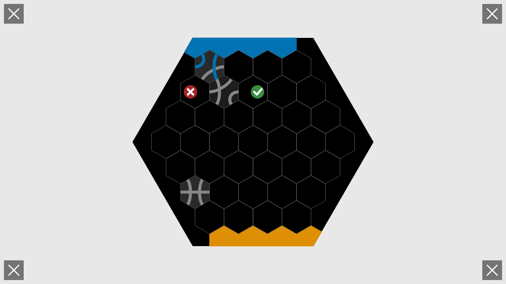

**Action**: `PLACE_TILE`
- Position: (-2, -1)
- Rotation: 1

**Expected State**: Tile placed on board, flows updated

---

### Step 16: NEXT_PLAYER
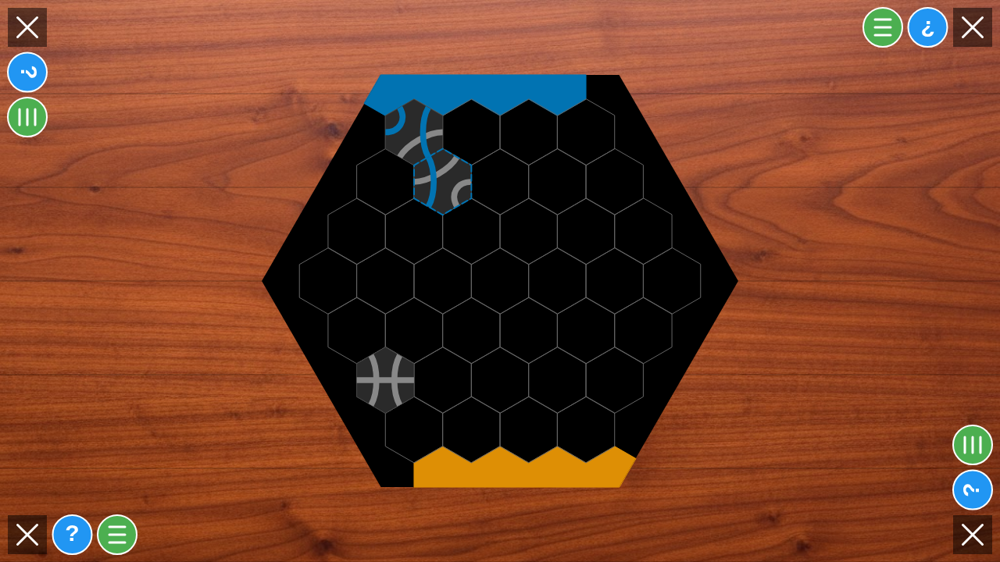

**Action**: `NEXT_PLAYER`

**Expected State**: Turn advances to next player

---

### Step 17: DRAW_TILE
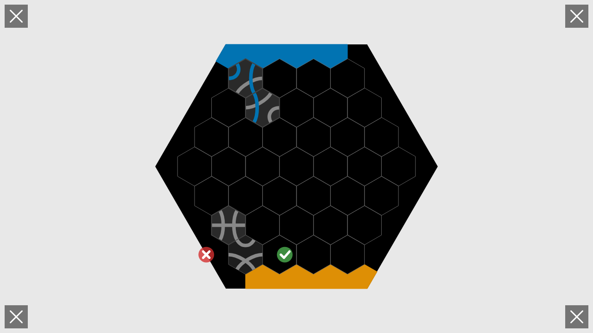

**Action**: `DRAW_TILE`

**Expected State**: Current player draws a new tile

---

### Step 18: PLACE_TILE

**Action**: `PLACE_TILE`
- Position: (3, -3)
- Rotation: 2

**Expected State**: Tile placed on board, flows updated

---

### Step 19: NEXT_PLAYER
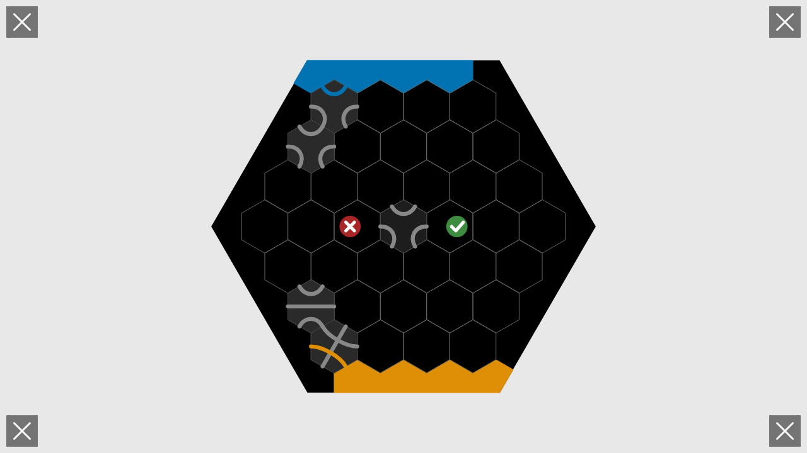

**Action**: `NEXT_PLAYER`

**Expected State**: Turn advances to next player

---

### Step 20: DRAW_TILE
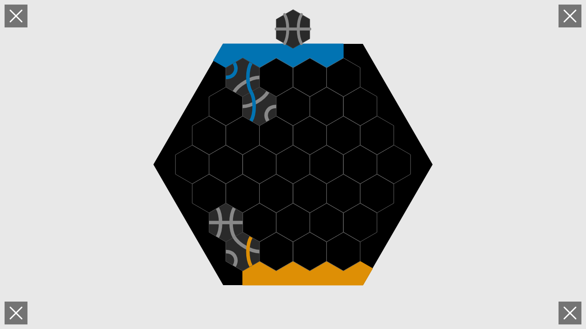

**Action**: `DRAW_TILE`

**Expected State**: Current player draws a new tile

---

### Step 21: PLACE_TILE
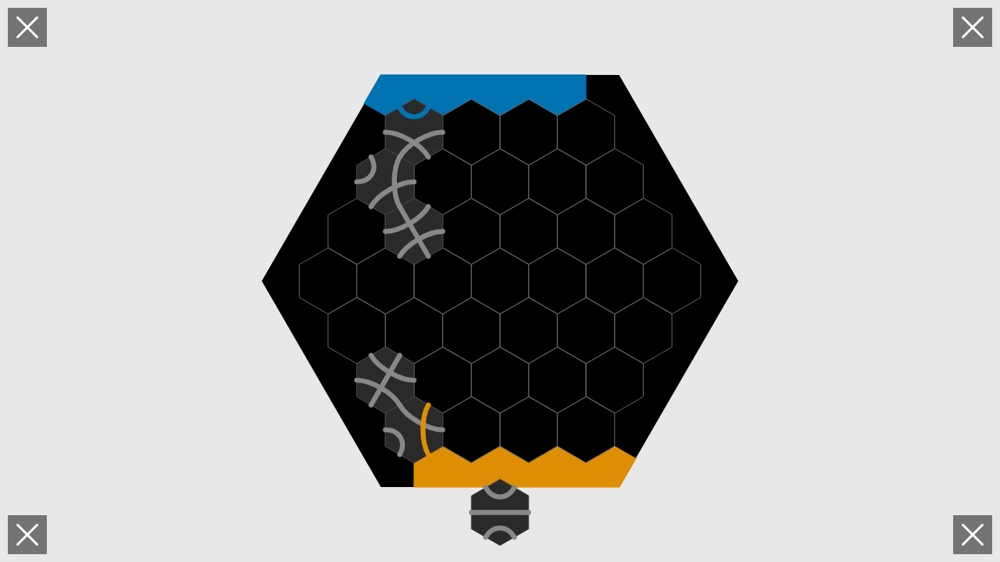

**Action**: `PLACE_TILE`
- Position: (-1, -1)
- Rotation: 2

**Expected State**: Tile placed on board, flows updated

---

### Step 22: NEXT_PLAYER
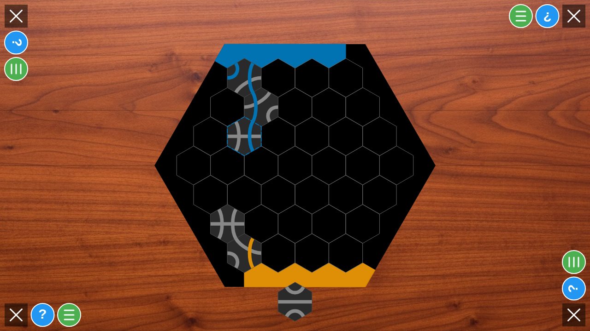

**Action**: `NEXT_PLAYER`

**Expected State**: Turn advances to next player

---

### Step 23: DRAW_TILE
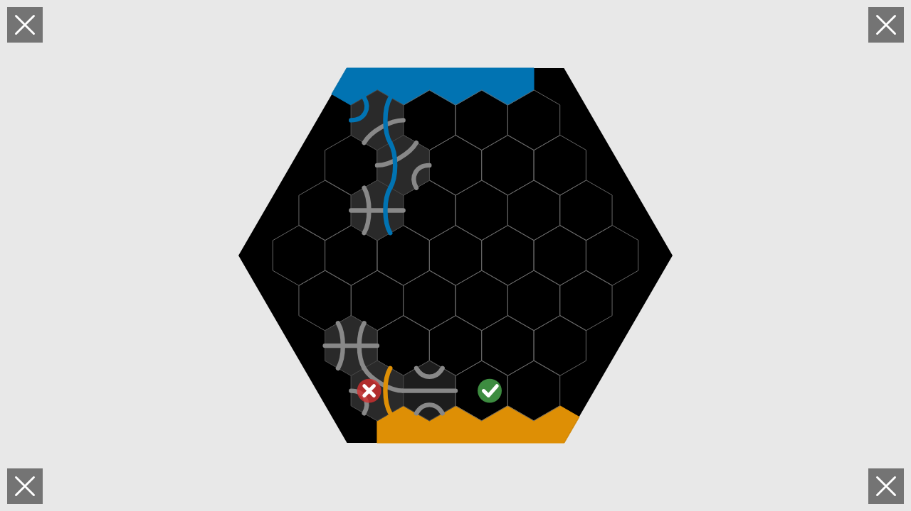

**Action**: `DRAW_TILE`

**Expected State**: Current player draws a new tile

---

### Step 24: PLACE_TILE
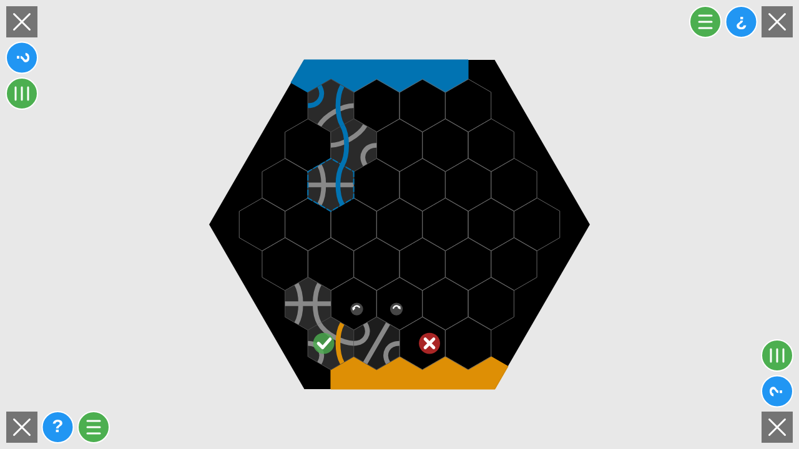

**Action**: `PLACE_TILE`
- Position: (1, -2)
- Rotation: 1

**Expected State**: Tile placed on board, flows updated

---

### Step 25: NEXT_PLAYER
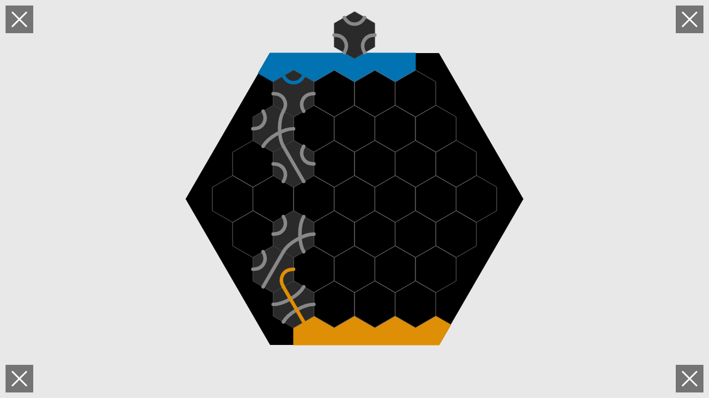

**Action**: `NEXT_PLAYER`

**Expected State**: Turn advances to next player

---

### Step 26: DRAW_TILE
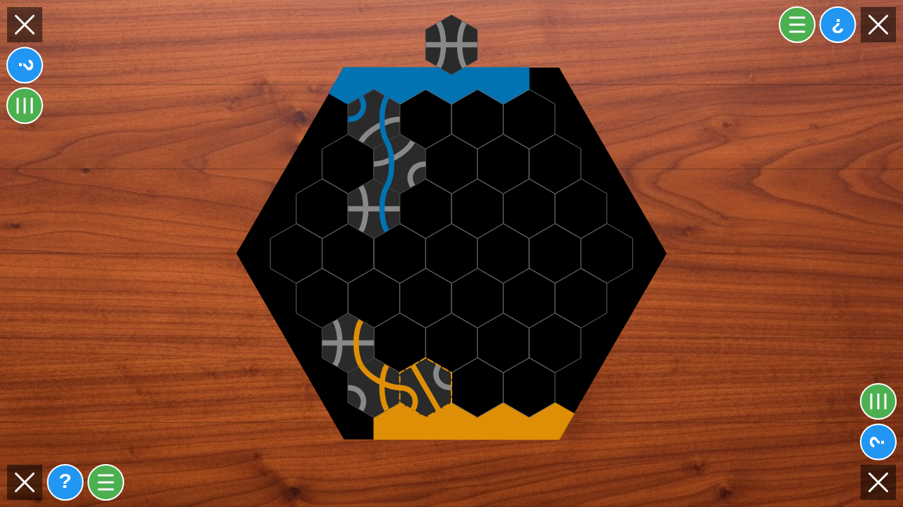

**Action**: `DRAW_TILE`

**Expected State**: Current player draws a new tile

---

### Step 27: PLACE_TILE

**Action**: `PLACE_TILE`
- Position: (0, -1)
- Rotation: 4

**Expected State**: Tile placed on board, flows updated

---

### Step 28: Final Game State

**Game Phase**: finished
**Total Moves**: 7

## Validation Checklist

- [ ] All 26 actions executed successfully
- [ ] 7 tiles placed on board
- [ ] No illegal moves attempted
- [ ] Flow calculations correct at each step
- [ ] Game state matches expectations file
- [ ] Final phase is "finished"
- [ ] 2 players participated
- [ ] Screenshots captured for all actions
- [ ] Test completes without errors
- [ ] Deterministic behavior - same seed produces same game
