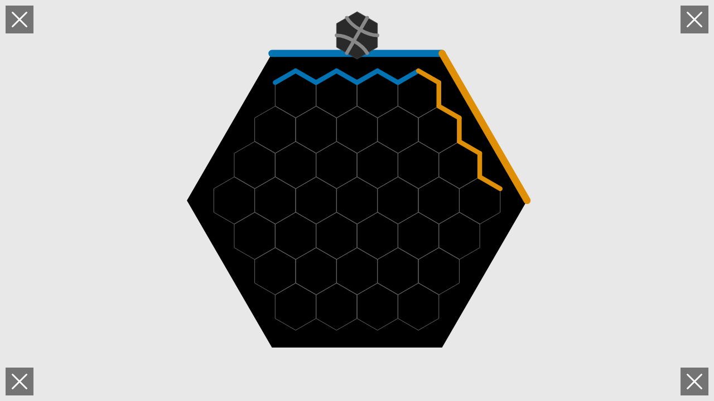
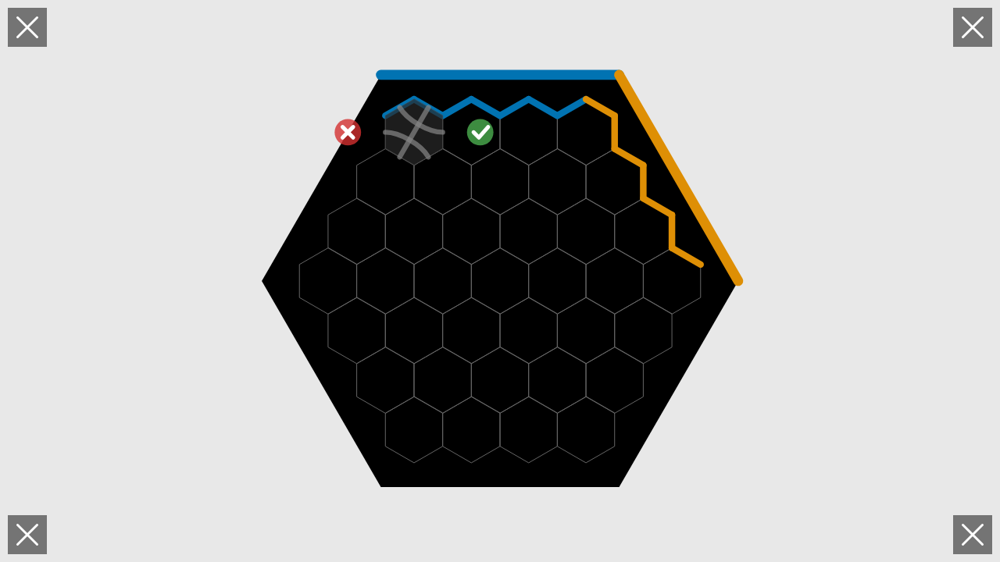

# User Story: Complete 2-Player Game with Mouse Interactions

**As a user, I want to play a complete 2-player game using only mouse clicks**

## Flow Description

This story demonstrates a full game experience from initial setup through multiple turns, using **only mouse interactions**. Unlike test 005 which uses Redux actions directly, this test validates that the UI correctly handles all user interactions: tile rotation via clicks, position selection via clicks, and confirmation/cancellation through UI buttons.

## Test Configuration

- **Seed**: 999 (same as test 005 for consistency)
- **Players**: 2 players
  - Player 1 (Blue, #0173B2) at edge 1 (NE - top-right)
  - Player 2 (Orange, #DE8F05) at edge 3 (SE - bottom-right)
- **Method**: Mouse clicks only (no Redux action "cheating")
- **Screenshot granularity**: Multiple screenshots per move showing rotation steps, placement, confirmation
- **Outcome**: Victory determined by flow connections

## Screenshots

### 0001-initial-screen.png

- **Action**: User loads the application
- **State**: Configuration screen ready for player setup
- **Redux State**: `screen = 'configuration'`, `configPlayers.length = 0`
- **What to verify**: 
  - Clean configuration interface visible
  - Color buttons arranged around the board edges
  - START button visible in center
  - No players listed yet

### 0002-players-added.png

- **Action**: Two players set up via SETUP_GAME action (setup only, not gameplay)
- **State**: Game configured with Blue and Orange players
- **Redux State**: `players.length = 2`, `screen = 'gameplay'`, `phase = 'playing'`
- **What to verify**: 
  - Gameplay screen now visible
  - Board is empty, ready for tiles
  - Two player edges visible: Blue at NE (edge 1), Orange at SE (edge 3)
  - No tiles placed yet

### 0003-game-started.png

- **Action**: Tiles shuffled with seed 999, first tile drawn (via Redux for deterministic setup)
- **State**: Ready to place first tile
- **Redux State**: `currentTile` is set, `currentRotation = 0`, `selectedPosition = null`
- **What to verify**:
  - Hexagonal game board visible
  - Player 1 edge (Blue) at NE position (top-right)
  - Player 2 edge (Orange) at SE position (bottom-right)
  - Preview tile visible at Blue player's edge position
  - Board is empty (no tiles placed yet)
  - Current tile ready for Player 1

## Move Pattern (Repeated for Each Move)

Each move follows this interaction pattern with multiple screenshots:

### Before Move Screenshot (e.g., 0004-before-move-1.png)

- **Action**: New tile available for current player
- **State**: Waiting for player to interact with tile
- **Redux State**: `currentTile` set, `currentRotation = 0`, `selectedPosition = null`
- **What to verify**:
  - Current tile preview visible at player's edge position
  - No tile selected on board yet
  - Previous moves' tiles visible on board
  - Correct player's turn indicator

### Rotation Screenshots (e.g., 0005-move-1-rotation-1.png)

- **Action**: Player clicks on tile preview to rotate it
- **State**: Tile rotated to rotation 1 (60 degrees clockwise)
- **Redux State**: `currentRotation = 1`
- **What to verify**:
  - Tile preview shows new orientation
  - Flow paths on tile visually rotated
  - Tile still at player's edge position (not placed yet)
  - Rotation achieved through mouse click (not Redux action)

*Note: Multiple rotation screenshots may appear (rotation-1, rotation-2, etc.) as player clicks repeatedly to reach desired rotation*

### Tile Placed Screenshot (e.g., 0006-move-1-tile-placed.png)

- **Action**: Player clicks on hex position to place tile there
- **State**: Tile tentatively placed at selected position with confirmation buttons visible
- **Redux State**: `selectedPosition = {row: X, col: Y}`, tile shown at selected position
- **What to verify**:
  - Tile now appears at clicked hex position
  - Checkmark (✓) button visible to the right of tile
  - X button visible to the left of tile
  - Tile not yet committed to board (can still cancel)
  - Selected position highlighted

### Move Complete Screenshot (e.g., 0007-move-1-complete.png)

- **Action**: Player clicks checkmark (✓) button to confirm placement
- **State**: Tile committed to board, turn advances to next player
- **Redux State**: `board['X,Y']` contains tile, `selectedPosition = null`, `currentPlayerIndex` incremented
- **What to verify**:
  - Tile permanently placed on board
  - Confirmation buttons disappeared
  - Flows updated if tile connects to player edge
  - Turn advanced to next player
  - Next player's tile preview appears
  - Move achieved entirely through mouse clicks

## Example Moves

### Move 1: Player 1 (Blue)

- **0004-before-move-1.png**: Blue tile at NE edge, rotation 0
- **0005-move-1-rotation-1.png**: After 1 click, rotation 1
- **0006-move-1-tile-placed.png**: Clicked on position (-3, 0), checkmark visible
- **0007-move-1-complete.png**: Confirmed, tile on board, P2's turn begins

### Move 2: Player 2 (Orange)

- **0008-before-move-2.png**: Orange tile at SE edge, rotation 0
- **0009-move-2-rotation-1.png**: After 1 click, rotation 1
- **0010-move-2-rotation-2.png**: After 2 clicks, rotation 2 (desired)
- **0011-move-2-tile-placed.png**: Clicked on position (-3, 1), checkmark visible
- **0012-move-2-complete.png**: Confirmed, tile on board, P1's turn begins

### Move 3: Player 1 (Blue)

- **0013-before-move-3.png**: Blue tile ready
- **0014-move-3-rotation-1.png**: Rotation 1
- **0015-move-3-rotation-2.png**: Rotation 2
- **0016-move-3-rotation-3.png**: Rotation 3 (final)
- **0017-move-3-tile-placed.png**: Placed at position
- **0018-move-3-complete.png**: Confirmed

*This pattern repeats for all subsequent moves...*

## Key Screenshots to Verify

### Mid-Game (Around Move 15-20)

- **Flow propagation**: Both Blue and Orange flows visible extending from edges
- **Board filling**: Approximately half the board filled with tiles
- **Turn alternation**: Players alternating correctly throughout
- **UI responsiveness**: All interactions via mouse clicks working correctly

### Late Game (Around Move 25-30)

- **Complex flows**: Flow networks extending across many tiles
- **Board nearly full**: Most positions occupied
- **Legal moves**: UI enforcing move legality (checkmark only for legal placements)
- **Victory approach**: Game nearing conclusion

### victory-final.png

- **Action**: Game reaches conclusion (victory or constraint)
- **State**: Game finished
- **Redux State**: `phase = 'finished'`, `winners` array populated, `winType` set
- **What to verify**:
  - Game phase is 'finished'
  - Winners array contains player ID(s)
  - Win type identified correctly
  - Victory screen displayed
  - Final board state shows all placed tiles
  - Final flow networks visible

## Mouse Interaction Flow

### 1. Tile Rotation
- **Action**: Click on tile preview at player's edge
- **Effect**: Tile rotates 60° clockwise
- **Multiple clicks**: Continue clicking for more rotations
- **Redux**: `currentRotation` updates
- **Visual**: Tile preview shows new orientation

### 2. Position Selection
- **Action**: Click on hex position on board
- **Effect**: Tile tentatively placed there
- **Redux**: `selectedPosition` set
- **Visual**: Tile appears at position, confirmation buttons appear

### 3. Confirmation
- **Action**: Click checkmark (✓) button
- **Effect**: Tile committed to board, turn advances
- **Redux**: Tile added to `board` Map, `currentPlayerIndex` increments
- **Visual**: Tile permanent, next player's tile appears

### 4. Cancellation (if needed)
- **Action**: Click X button
- **Effect**: Selection cleared, tile returns to edge
- **Redux**: `selectedPosition = null`
- **Visual**: Tile back at player's edge, no confirmation buttons

## UI Validation Demonstrated

### Legal Move Enforcement

- **Checkmark availability**: Only shown for legal moves
- **Illegal moves**: Checkmark doesn't appear, preventing placement
- **UI feedback**: Silent rejection of illegal moves (no error messages)
- **Game integrity**: UI prevents rule violations

### Turn Management

- **Automatic advancement**: Turn changes after checkmark click
- **No manual NEXT_PLAYER**: Turn advances automatically
- **Visual feedback**: Current player indicator updates
- **Tile drawing**: Next tile appears automatically

### Flow Propagation

- **Real-time updates**: Flows update after each confirmation
- **Color coding**: Blue and Orange flows distinct
- **Edge connections**: Flows enter from correct player edges
- **Path visualization**: Flow networks clearly visible

## Test Coverage

This test validates:

- **Mouse-only interaction**: All gameplay via mouse clicks
- **UI rotation mechanism**: Clicking tile rotates it (no Redux ROTATE)
- **UI placement mechanism**: Clicking hex positions works correctly
- **Confirmation/cancellation**: Buttons function properly
- **Legal move enforcement**: UI prevents illegal moves
- **Automatic turn progression**: No manual turn advancement needed
- **Flow propagation**: Works correctly with UI-placed tiles
- **Victory detection**: Triggers appropriately during mouse-driven gameplay
- **Complete user experience**: Full game playable via UI alone

## Differences from Test 005

| Aspect | Test 005 | Test 006 (This Test) |
|--------|----------|----------------------|
| **Input method** | Direct Redux PLACE_TILE | Mouse clicks only |
| **Rotation** | Direct Redux SET_ROTATION | Click on tile to rotate |
| **Placement** | Redux action | Click on hex position |
| **Confirmation** | Automatic | Click checkmark button |
| **Legality** | Not enforced | UI enforces |
| **Screenshots** | One per move (41 total) | Multiple per move (200+) |
| **Purpose** | Test game logic | Test UI interactions |
| **Turn advance** | Manual NEXT_PLAYER | Automatic after confirm |

## Related Files

- Test: `tests/e2e/complete-game-mouse.spec.ts`
- Input Handling: `src/input/gameplayInputHandler.ts`
- Redux: `src/redux/gameReducer.ts`, `src/redux/uiReducer.ts`
- Game Logic: `src/game/legality.ts`, `src/game/flows.ts`
- Rendering: `src/rendering/gameplayRenderer.ts`

## Deterministic Testing

- **Same seed (999)**: Ensures same tiles as test 005
- **Same edge positions**: Players at edges 1 and 3
- **Systematic placement**: Tiles placed in predictable order
- **Mouse coordinates**: Calculated deterministically from hex layout
- **Reproducible**: Same test run produces same screenshots every time
