# User Story: Complete 2-Player Game with Mouse Interactions

**As a user, I want to play a complete 2-player game using only mouse clicks**

## Flow Description

This story demonstrates a full game experience using **only mouse interactions**. Every tile rotation, position selection, and confirmation is performed via mouse clicks. The test validates that the UI correctly handles all user interactions from start to finish.

## Test Configuration

- **Seed**: 999 (same as test 005)
- **Players**: 2 players
  - Player 1 (Blue, #0173B2) at edge 1 (NE - top-right)
  - Player 2 (Orange, #DE8F05) at edge 3 (SE - bottom-right)
- **Method**: Mouse clicks only (no Redux "cheating" during gameplay)
- **Total Screenshots**: 199 (3 setup + 196 gameplay screenshots)

## Screenshots

### 0001-initial-screen.png

- **Action**: User loads the application
- **State**: Configuration screen ready
- **Redux State**: `screen = 'configuration'`, `configPlayers.length = 0`
- **What to verify**: Clean interface, color buttons visible, START button in center

### 0002-players-added.png

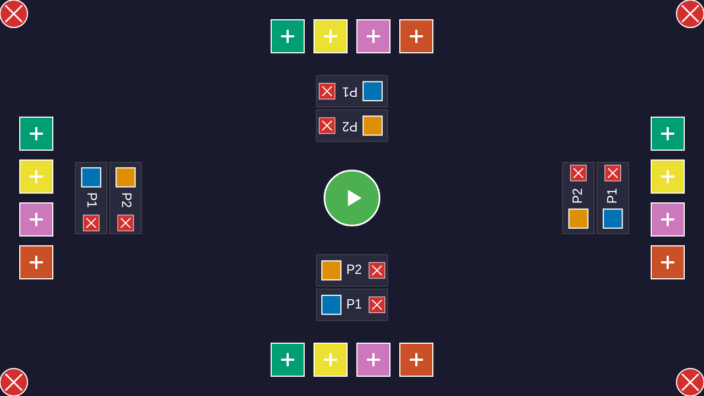

- **Action**: Players set up via SETUP_GAME (setup only, not gameplay)
- **State**: Game configured
- **Redux State**: `players.length = 2`, `screen = 'gameplay'`, `phase = 'playing'`
- **What to verify**: Gameplay screen visible, Blue edge at NE (edge 1), Orange edge at SE (edge 3)

### 0003-game-started.png

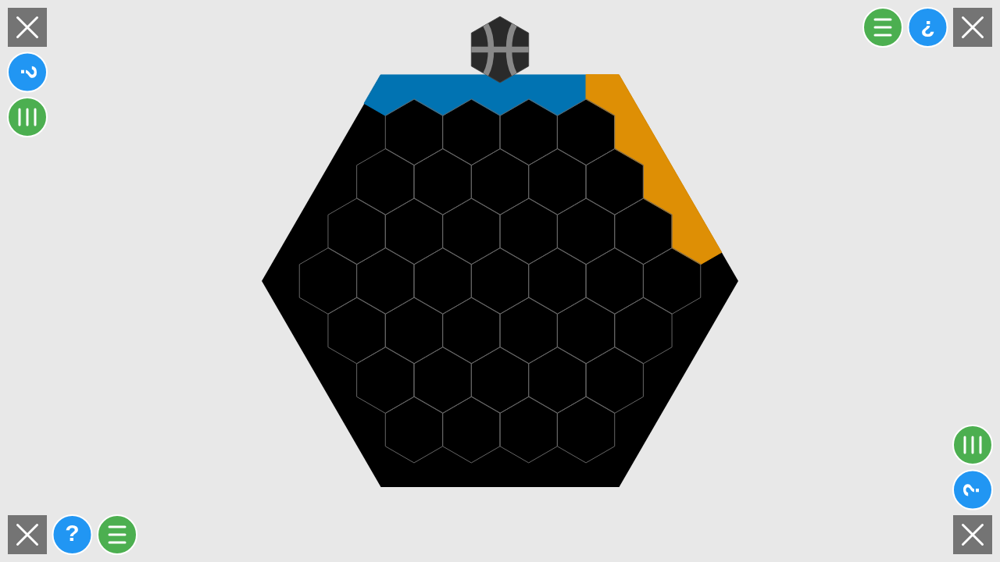

- **Action**: Tiles shuffled, first tile drawn
- **State**: Ready for first move
- **Redux State**: `currentTile` set, `currentRotation = 0`
- **What to verify**: Board empty, preview tile at Blue player's edge, ready for mouse interaction

### 0004-before-move-1.png

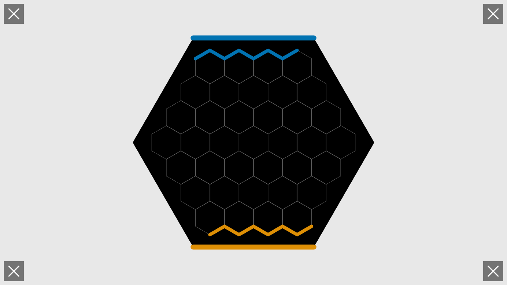

- **Action**: New tile available for Player 1 (Blue)
- **State**: Waiting for player interaction
- **Redux State**: `currentTile` set, `currentRotation = 0`, `selectedPosition = null`
- **What to verify**: Current tile preview at player's edge, previous tiles on board, correct turn

### 0005-move-1-rotation-1.png

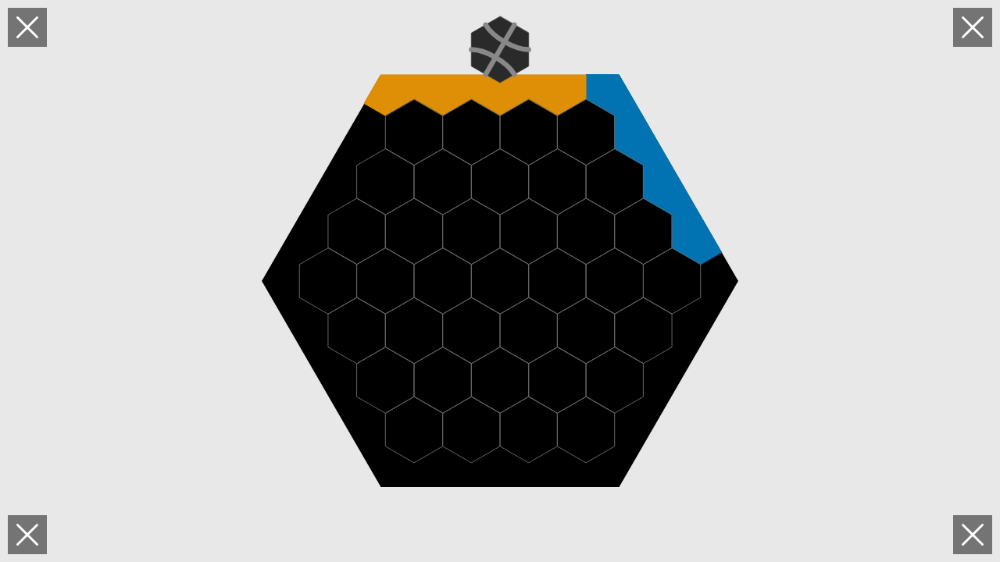

- **Action**: Player 1 clicks tile to rotate (rotation 1)
- **State**: Tile rotated via mouse click
- **Redux State**: `currentRotation = 1`
- **What to verify**: Tile preview shows rotation 1, achieved by clicking tile

### 0006-move-1-tile-placed.png

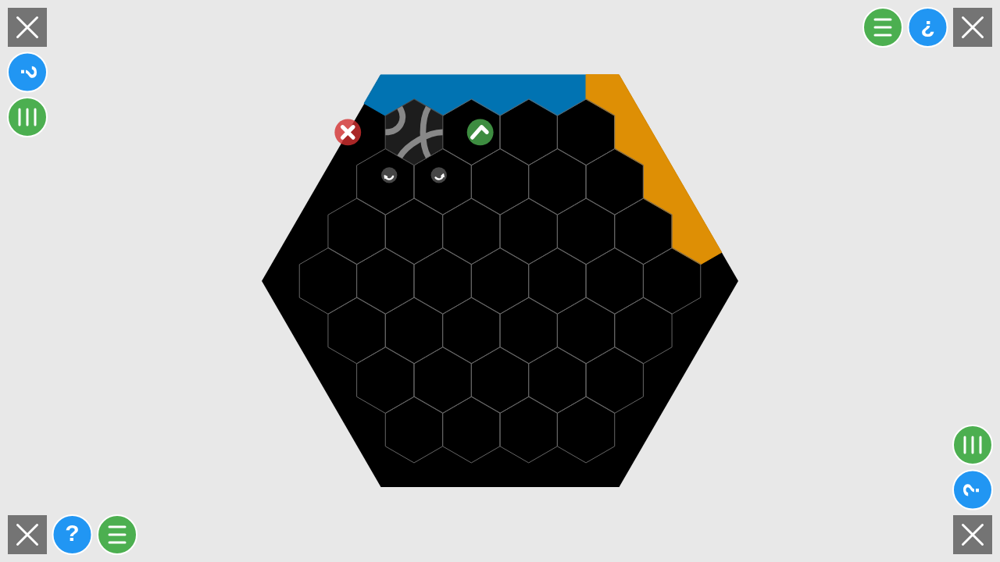

- **Action**: Player 1 clicks hex position to place tile
- **State**: Tile tentatively placed, awaiting confirmation
- **Redux State**: `selectedPosition` set to clicked position
- **What to verify**: Tile at selected position, checkmark (✓) and X buttons visible

### 0007-move-1-complete.png

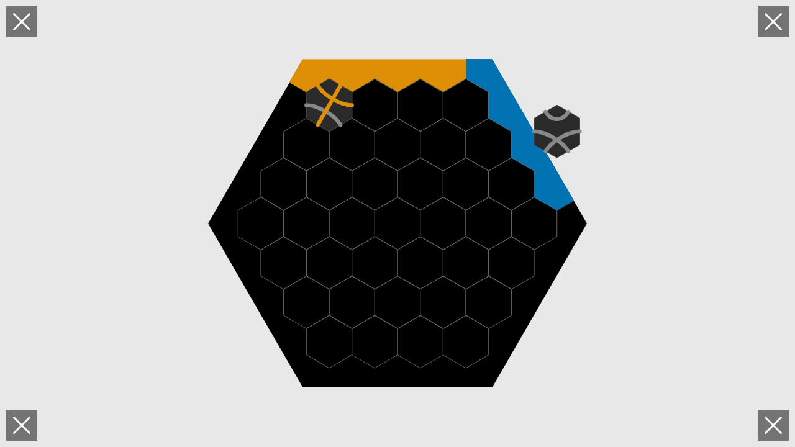

- **Action**: Player 1 clicks checkmark (✓) to confirm
- **State**: Tile committed, turn advances
- **Redux State**: Tile in `board` Map, `selectedPosition = null`, turn advanced
- **What to verify**: Tile permanent on board, confirmation buttons gone, flows updated, next player's turn

### 0008-before-move-2.png

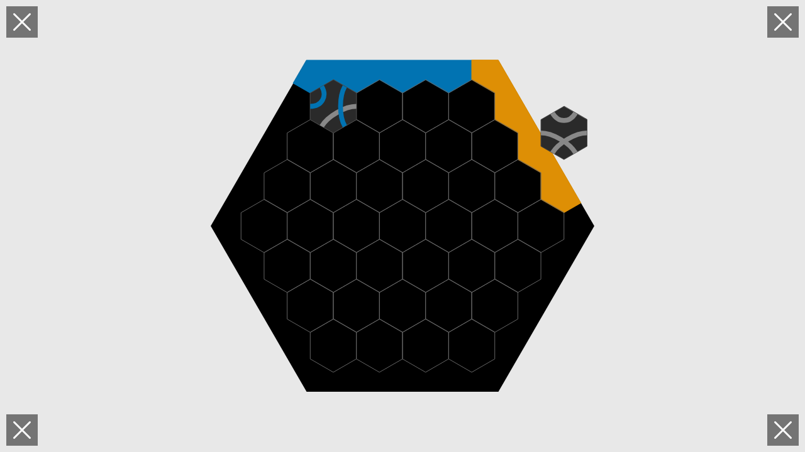

- **Action**: New tile available for Player 2 (Orange)
- **State**: Waiting for player interaction
- **Redux State**: `currentTile` set, `currentRotation = 0`, `selectedPosition = null`
- **What to verify**: Current tile preview at player's edge, previous tiles on board, correct turn

### 0009-move-2-rotation-1.png

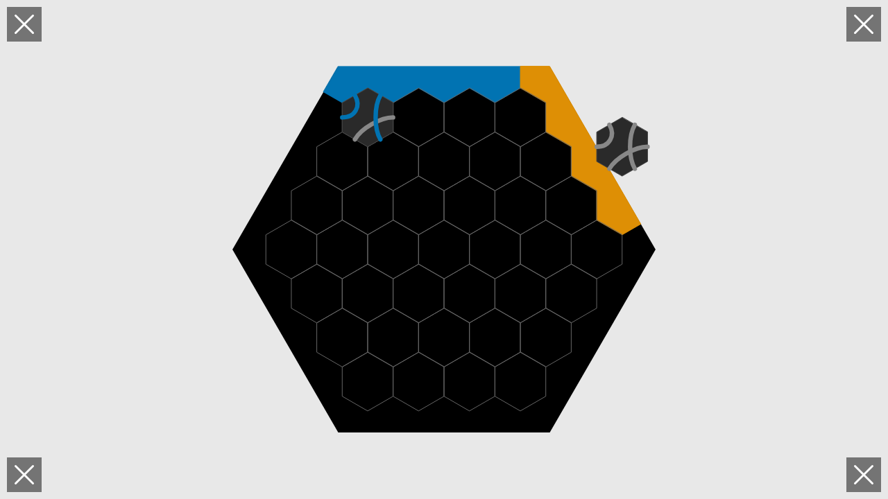

- **Action**: Player 2 clicks tile to rotate (rotation 1)
- **State**: Tile rotated via mouse click
- **Redux State**: `currentRotation = 1`
- **What to verify**: Tile preview shows rotation 1, achieved by clicking tile

### 0010-move-2-rotation-2.png

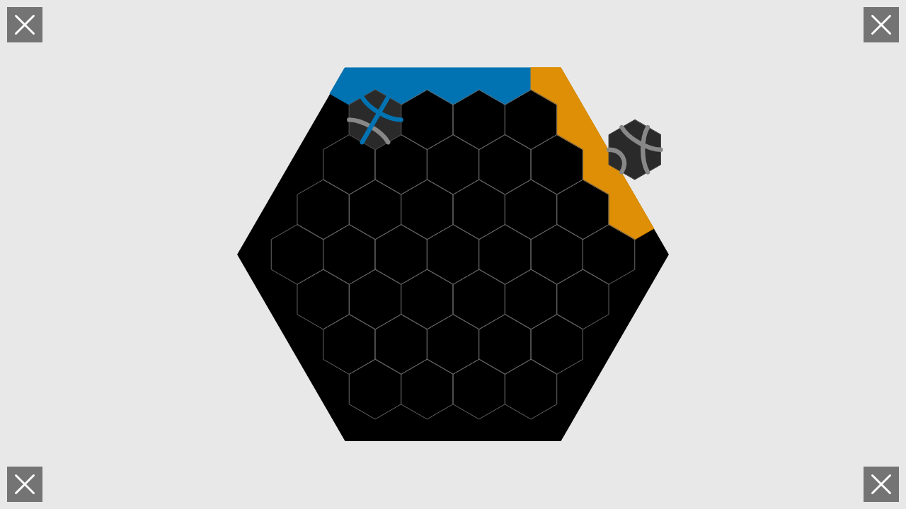

- **Action**: Player 2 clicks tile to rotate (rotation 2)
- **State**: Tile rotated via mouse click
- **Redux State**: `currentRotation = 2`
- **What to verify**: Tile preview shows rotation 2, achieved by clicking tile

### 0011-move-2-tile-placed.png

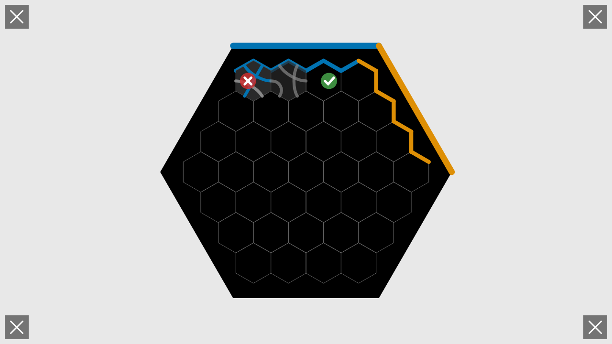

- **Action**: Player 2 clicks hex position to place tile
- **State**: Tile tentatively placed, awaiting confirmation
- **Redux State**: `selectedPosition` set to clicked position
- **What to verify**: Tile at selected position, checkmark (✓) and X buttons visible

### 0012-move-2-complete.png

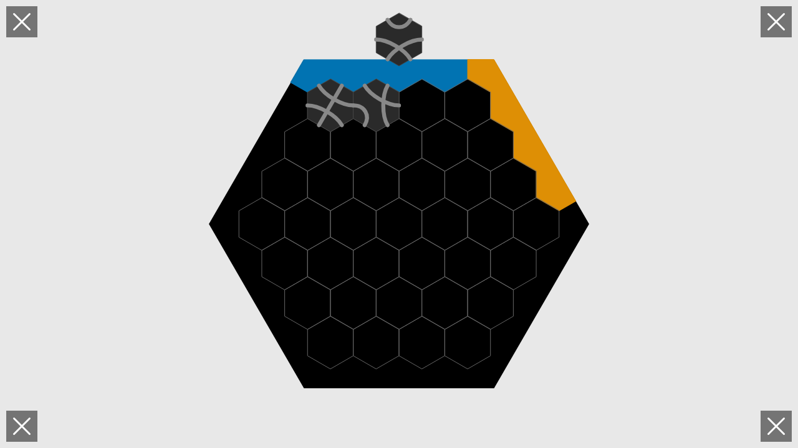

- **Action**: Player 2 clicks checkmark (✓) to confirm
- **State**: Tile committed, turn advances
- **Redux State**: Tile in `board` Map, `selectedPosition = null`, turn advanced
- **What to verify**: Tile permanent on board, confirmation buttons gone, flows updated, next player's turn

### 0013-before-move-3.png

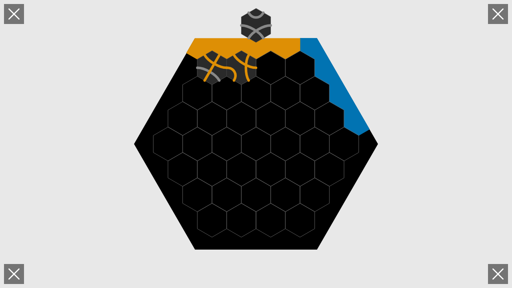

- **Action**: New tile available for Player 1 (Blue)
- **State**: Waiting for player interaction
- **Redux State**: `currentTile` set, `currentRotation = 0`, `selectedPosition = null`
- **What to verify**: Current tile preview at player's edge, previous tiles on board, correct turn

### 0014-move-3-rotation-1.png

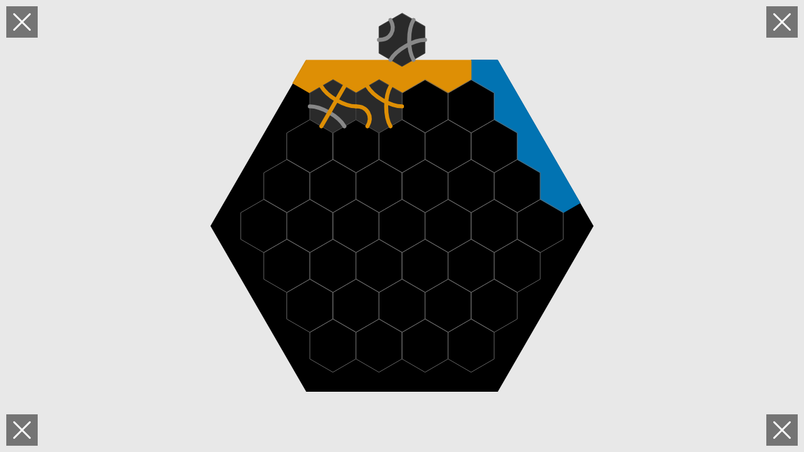

- **Action**: Player 1 clicks tile to rotate (rotation 1)
- **State**: Tile rotated via mouse click
- **Redux State**: `currentRotation = 1`
- **What to verify**: Tile preview shows rotation 1, achieved by clicking tile

### 0015-move-3-rotation-2.png

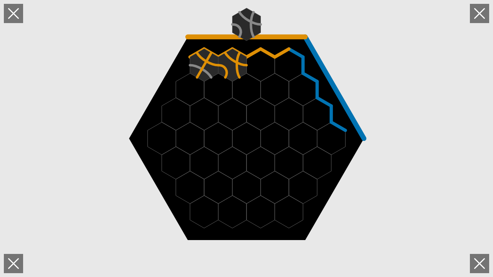

- **Action**: Player 1 clicks tile to rotate (rotation 2)
- **State**: Tile rotated via mouse click
- **Redux State**: `currentRotation = 2`
- **What to verify**: Tile preview shows rotation 2, achieved by clicking tile

### 0016-move-3-rotation-3.png

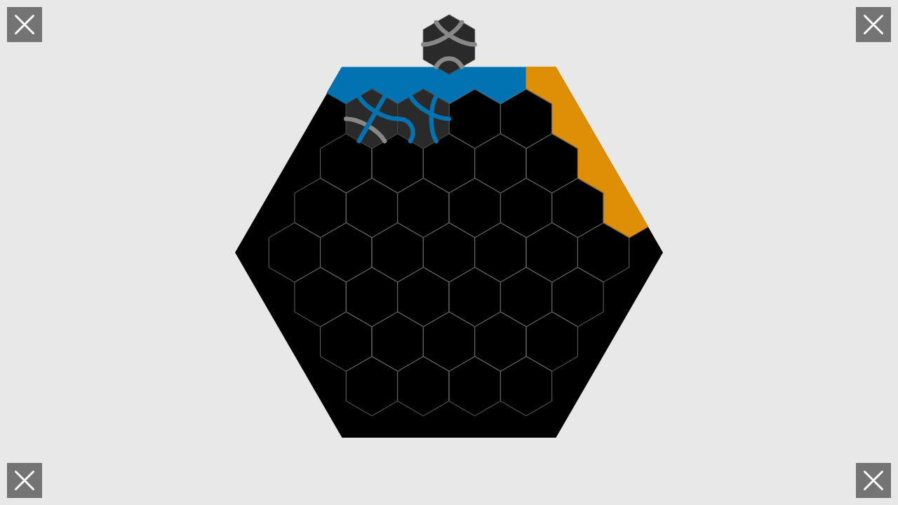

- **Action**: Player 1 clicks tile to rotate (rotation 3)
- **State**: Tile rotated via mouse click
- **Redux State**: `currentRotation = 3`
- **What to verify**: Tile preview shows rotation 3, achieved by clicking tile

### 0017-move-3-tile-placed.png

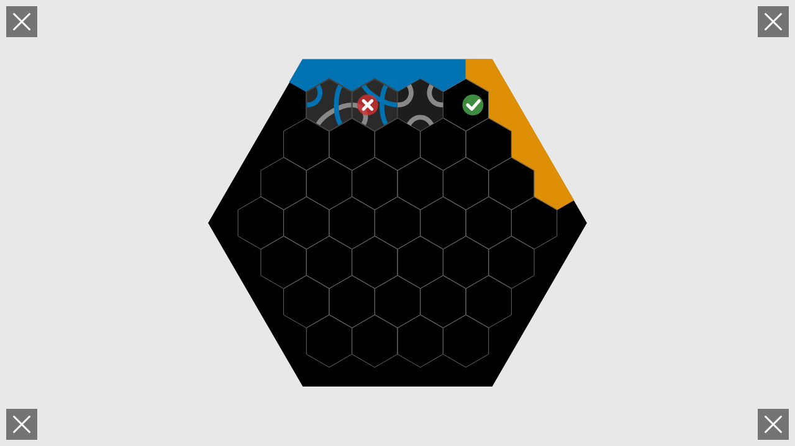

- **Action**: Player 1 clicks hex position to place tile
- **State**: Tile tentatively placed, awaiting confirmation
- **Redux State**: `selectedPosition` set to clicked position
- **What to verify**: Tile at selected position, checkmark (✓) and X buttons visible

### 0018-move-3-complete.png

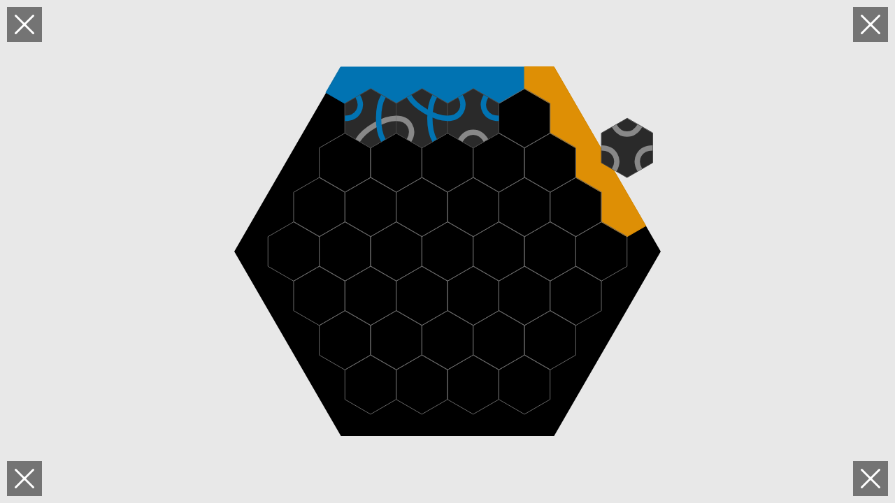

- **Action**: Player 1 clicks checkmark (✓) to confirm
- **State**: Tile committed, turn advances
- **Redux State**: Tile in `board` Map, `selectedPosition = null`, turn advanced
- **What to verify**: Tile permanent on board, confirmation buttons gone, flows updated, next player's turn

### 0019-before-move-4.png

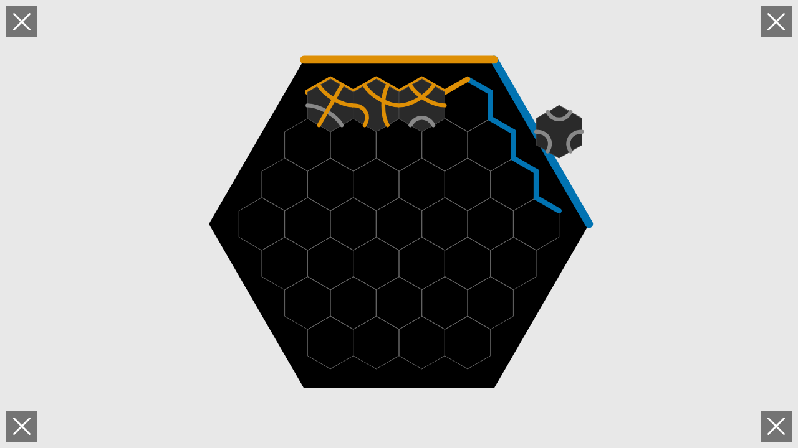

- **Action**: New tile available for Player 2 (Orange)
- **State**: Waiting for player interaction
- **Redux State**: `currentTile` set, `currentRotation = 0`, `selectedPosition = null`
- **What to verify**: Current tile preview at player's edge, previous tiles on board, correct turn

### 0020-move-4-rotation-1.png

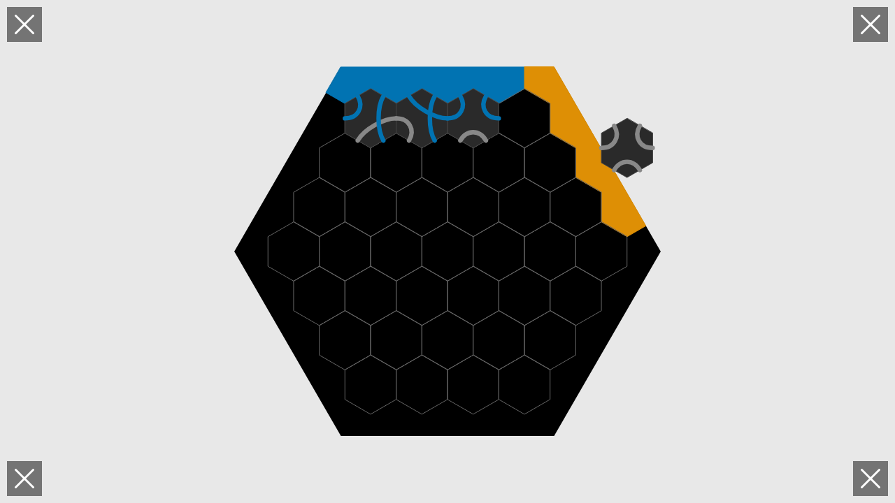

- **Action**: Player 2 clicks tile to rotate (rotation 1)
- **State**: Tile rotated via mouse click
- **Redux State**: `currentRotation = 1`
- **What to verify**: Tile preview shows rotation 1, achieved by clicking tile

### 0021-move-4-rotation-2.png

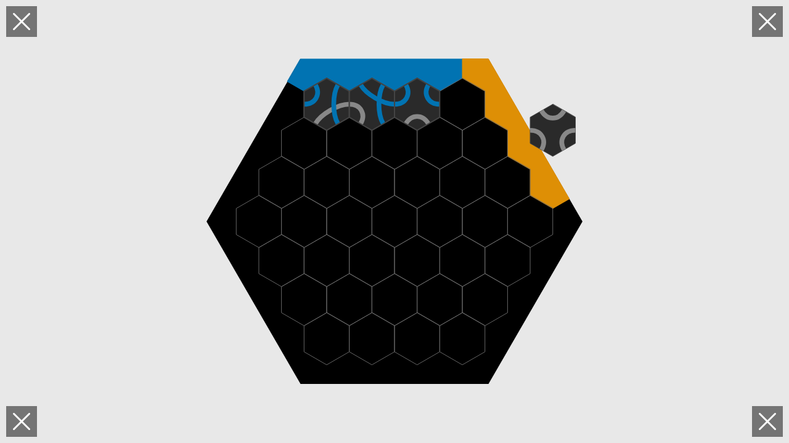

- **Action**: Player 2 clicks tile to rotate (rotation 2)
- **State**: Tile rotated via mouse click
- **Redux State**: `currentRotation = 2`
- **What to verify**: Tile preview shows rotation 2, achieved by clicking tile

### 0022-move-4-rotation-3.png

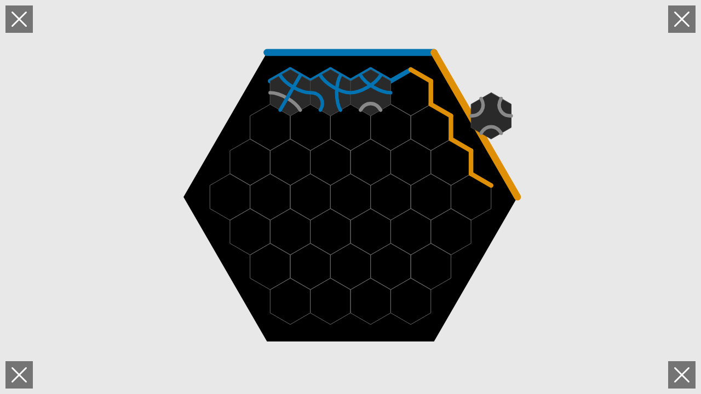

- **Action**: Player 2 clicks tile to rotate (rotation 3)
- **State**: Tile rotated via mouse click
- **Redux State**: `currentRotation = 3`
- **What to verify**: Tile preview shows rotation 3, achieved by clicking tile

### 0023-move-4-rotation-4.png

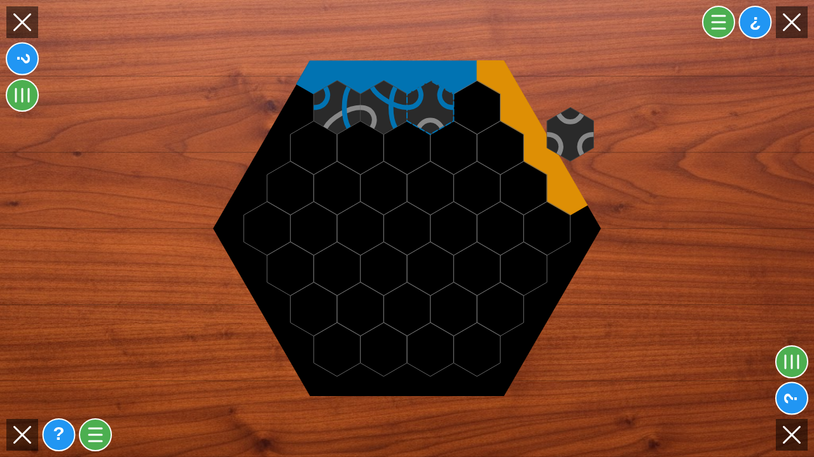

- **Action**: Player 2 clicks tile to rotate (rotation 4)
- **State**: Tile rotated via mouse click
- **Redux State**: `currentRotation = 4`
- **What to verify**: Tile preview shows rotation 4, achieved by clicking tile

### 0024-move-4-tile-placed.png

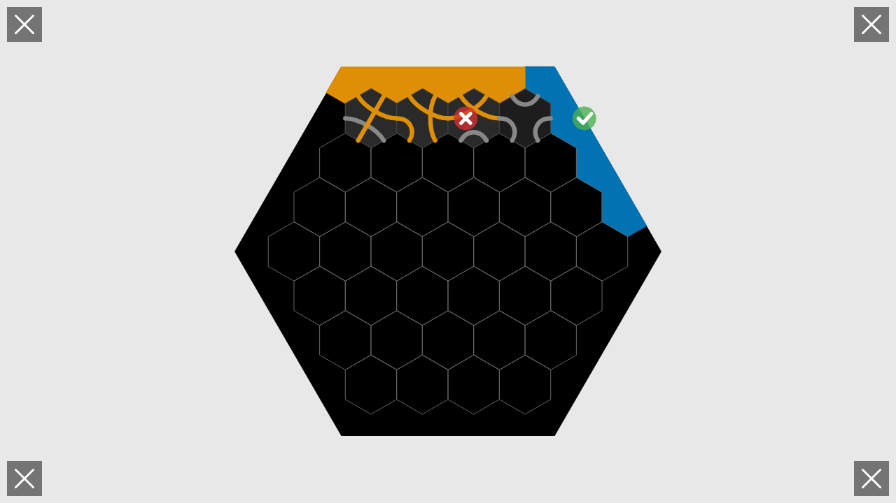

- **Action**: Player 2 clicks hex position to place tile
- **State**: Tile tentatively placed, awaiting confirmation
- **Redux State**: `selectedPosition` set to clicked position
- **What to verify**: Tile at selected position, checkmark (✓) and X buttons visible

### 0025-move-4-complete.png

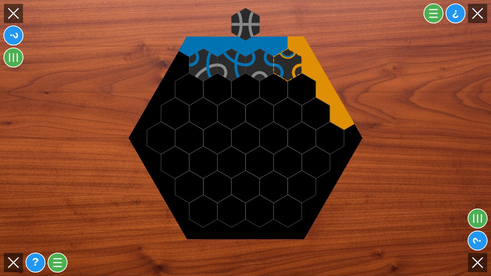

- **Action**: Player 2 clicks checkmark (✓) to confirm
- **State**: Tile committed, turn advances
- **Redux State**: Tile in `board` Map, `selectedPosition = null`, turn advanced
- **What to verify**: Tile permanent on board, confirmation buttons gone, flows updated, next player's turn

### 0026-before-move-5.png

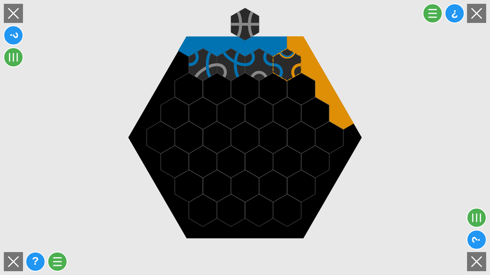

- **Action**: New tile available for Player 1 (Blue)
- **State**: Waiting for player interaction
- **Redux State**: `currentTile` set, `currentRotation = 0`, `selectedPosition = null`
- **What to verify**: Current tile preview at player's edge, previous tiles on board, correct turn

### 0027-move-5-rotation-1.png

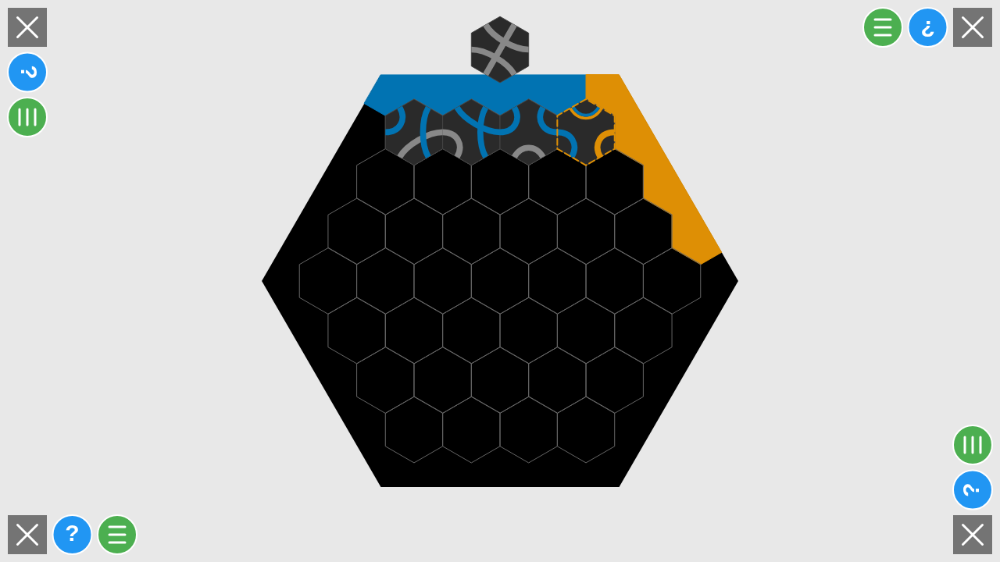

- **Action**: Player 1 clicks tile to rotate (rotation 1)
- **State**: Tile rotated via mouse click
- **Redux State**: `currentRotation = 1`
- **What to verify**: Tile preview shows rotation 1, achieved by clicking tile

### 0028-move-5-rotation-2.png

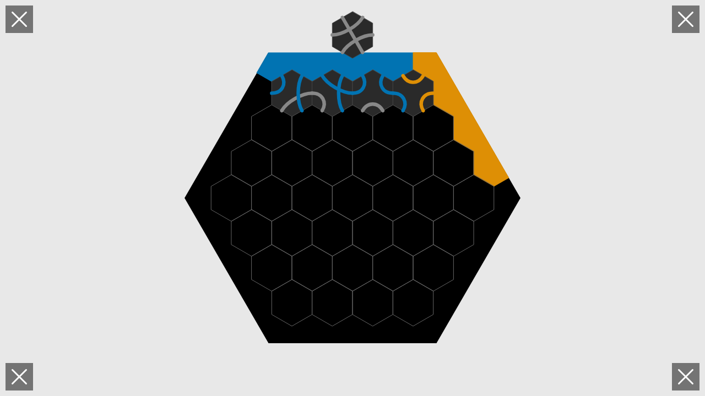

- **Action**: Player 1 clicks tile to rotate (rotation 2)
- **State**: Tile rotated via mouse click
- **Redux State**: `currentRotation = 2`
- **What to verify**: Tile preview shows rotation 2, achieved by clicking tile

### 0029-move-5-rotation-3.png

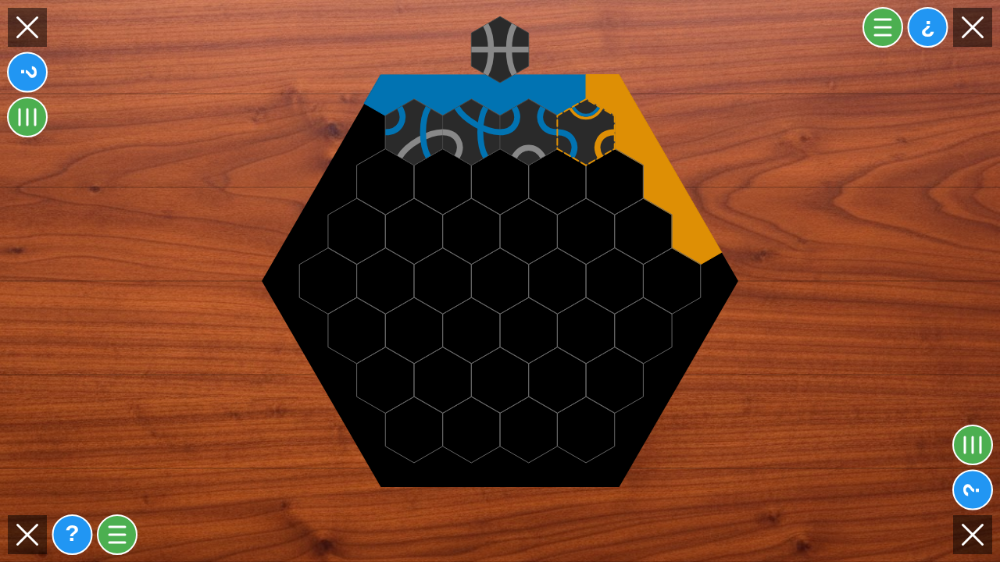

- **Action**: Player 1 clicks tile to rotate (rotation 3)
- **State**: Tile rotated via mouse click
- **Redux State**: `currentRotation = 3`
- **What to verify**: Tile preview shows rotation 3, achieved by clicking tile

### 0030-move-5-rotation-4.png

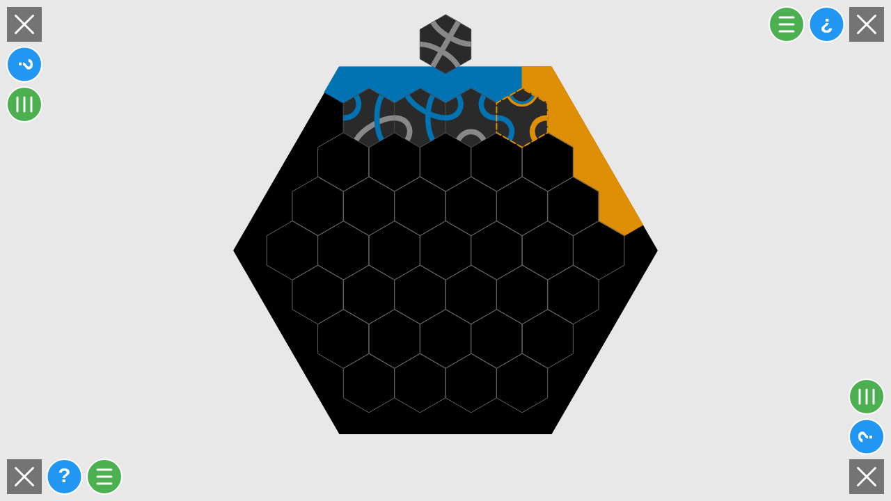

- **Action**: Player 1 clicks tile to rotate (rotation 4)
- **State**: Tile rotated via mouse click
- **Redux State**: `currentRotation = 4`
- **What to verify**: Tile preview shows rotation 4, achieved by clicking tile

### 0031-move-5-rotation-5.png

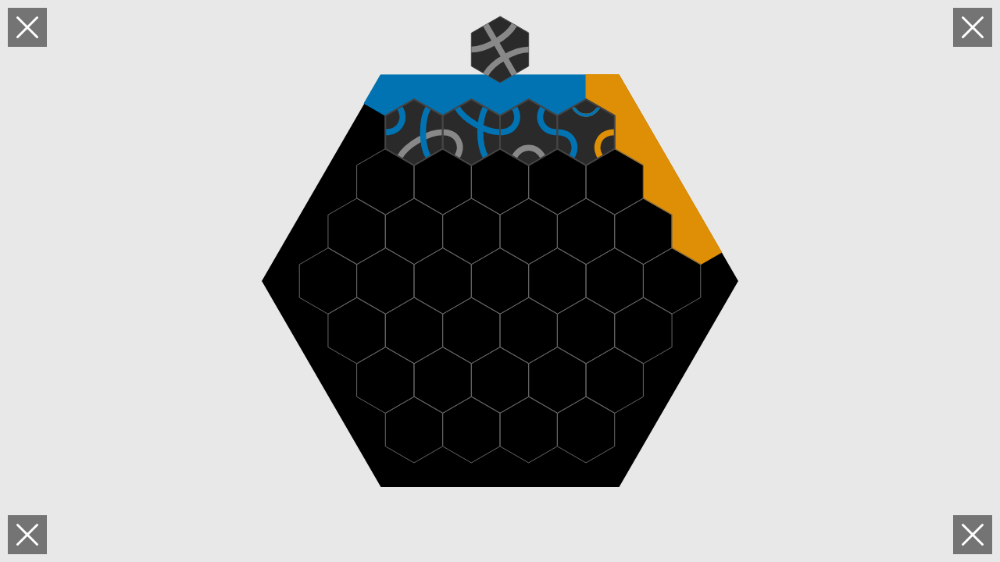

- **Action**: Player 1 clicks tile to rotate (rotation 5)
- **State**: Tile rotated via mouse click
- **Redux State**: `currentRotation = 5`
- **What to verify**: Tile preview shows rotation 5, achieved by clicking tile

### 0032-move-5-tile-placed.png

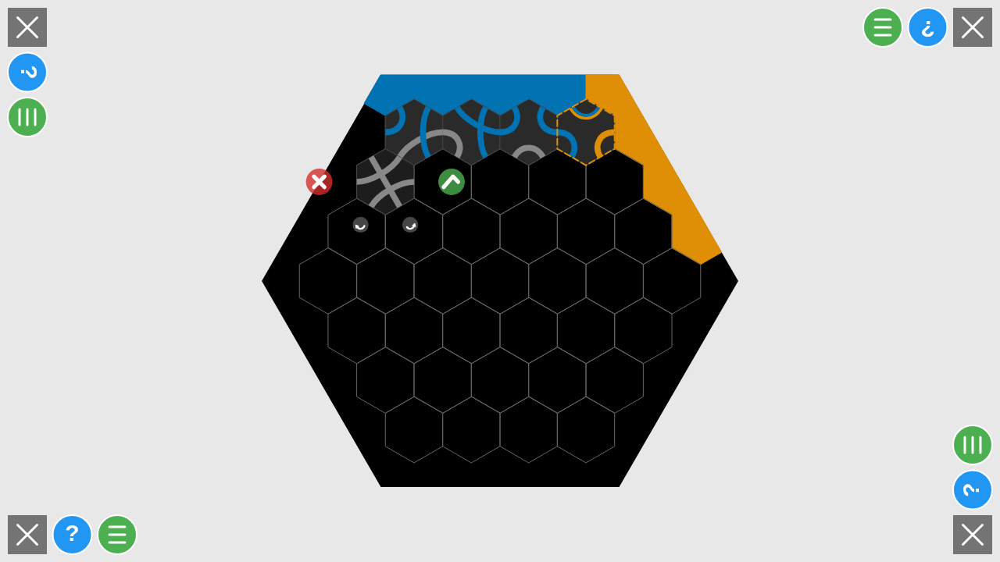

- **Action**: Player 1 clicks hex position to place tile
- **State**: Tile tentatively placed, awaiting confirmation
- **Redux State**: `selectedPosition` set to clicked position
- **What to verify**: Tile at selected position, checkmark (✓) and X buttons visible

### 0033-move-5-complete.png

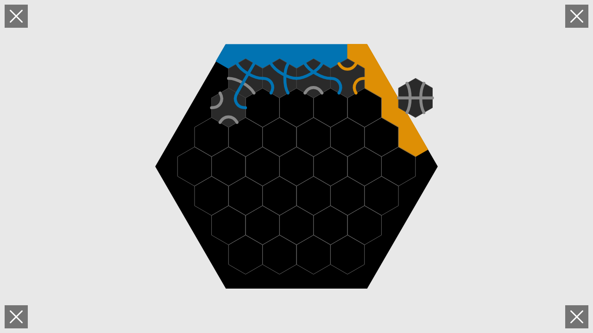

- **Action**: Player 1 clicks checkmark (✓) to confirm
- **State**: Tile committed, turn advances
- **Redux State**: Tile in `board` Map, `selectedPosition = null`, turn advanced
- **What to verify**: Tile permanent on board, confirmation buttons gone, flows updated, next player's turn

### 0034-before-move-6.png

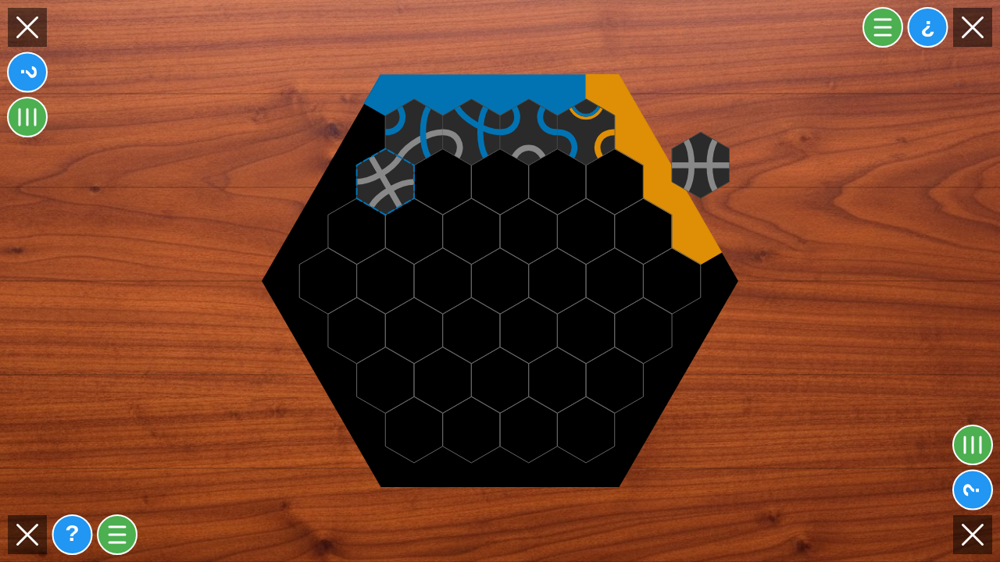

- **Action**: New tile available for Player 2 (Orange)
- **State**: Waiting for player interaction
- **Redux State**: `currentTile` set, `currentRotation = 0`, `selectedPosition = null`
- **What to verify**: Current tile preview at player's edge, previous tiles on board, correct turn

### 0035-move-6-tile-placed.png

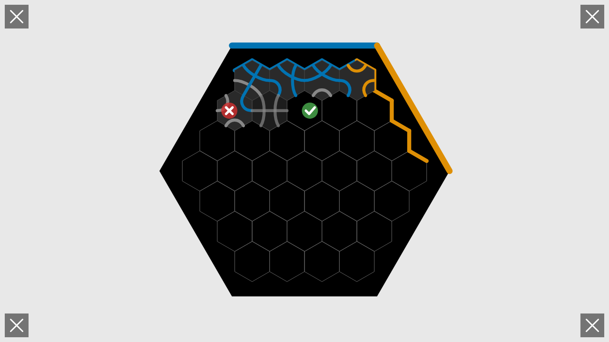

- **Action**: Player 2 clicks hex position to place tile
- **State**: Tile tentatively placed, awaiting confirmation
- **Redux State**: `selectedPosition` set to clicked position
- **What to verify**: Tile at selected position, checkmark (✓) and X buttons visible

### 0036-move-6-complete.png

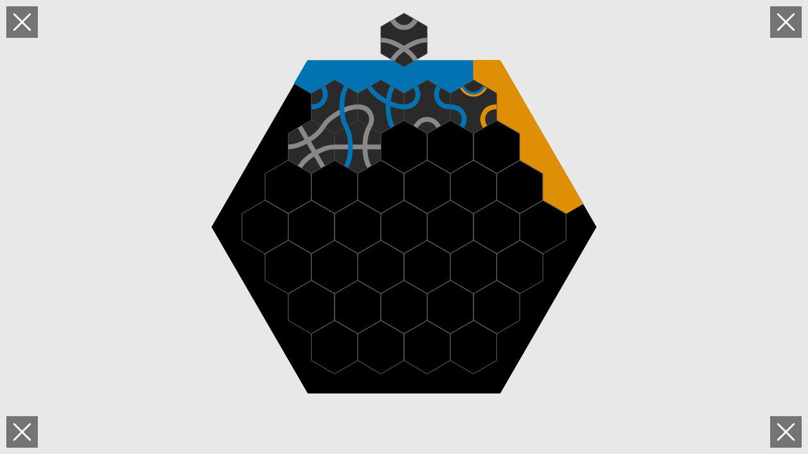

- **Action**: Player 2 clicks checkmark (✓) to confirm
- **State**: Tile committed, turn advances
- **Redux State**: Tile in `board` Map, `selectedPosition = null`, turn advanced
- **What to verify**: Tile permanent on board, confirmation buttons gone, flows updated, next player's turn

### 0037-before-move-7.png

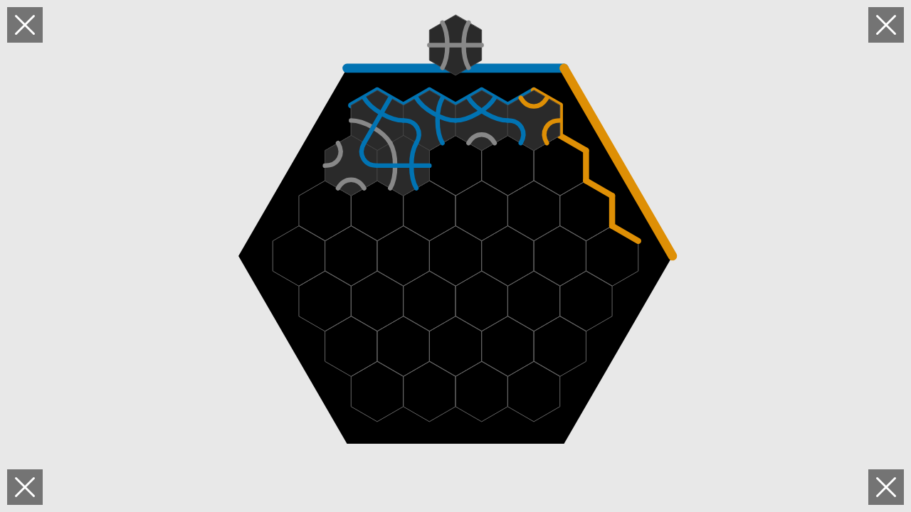

- **Action**: New tile available for Player 1 (Blue)
- **State**: Waiting for player interaction
- **Redux State**: `currentTile` set, `currentRotation = 0`, `selectedPosition = null`
- **What to verify**: Current tile preview at player's edge, previous tiles on board, correct turn

### 0038-move-7-rotation-1.png

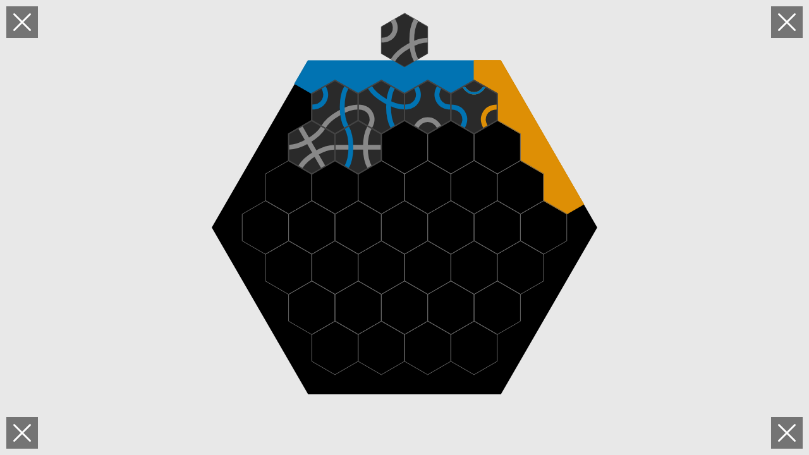

- **Action**: Player 1 clicks tile to rotate (rotation 1)
- **State**: Tile rotated via mouse click
- **Redux State**: `currentRotation = 1`
- **What to verify**: Tile preview shows rotation 1, achieved by clicking tile

### 0039-move-7-tile-placed.png

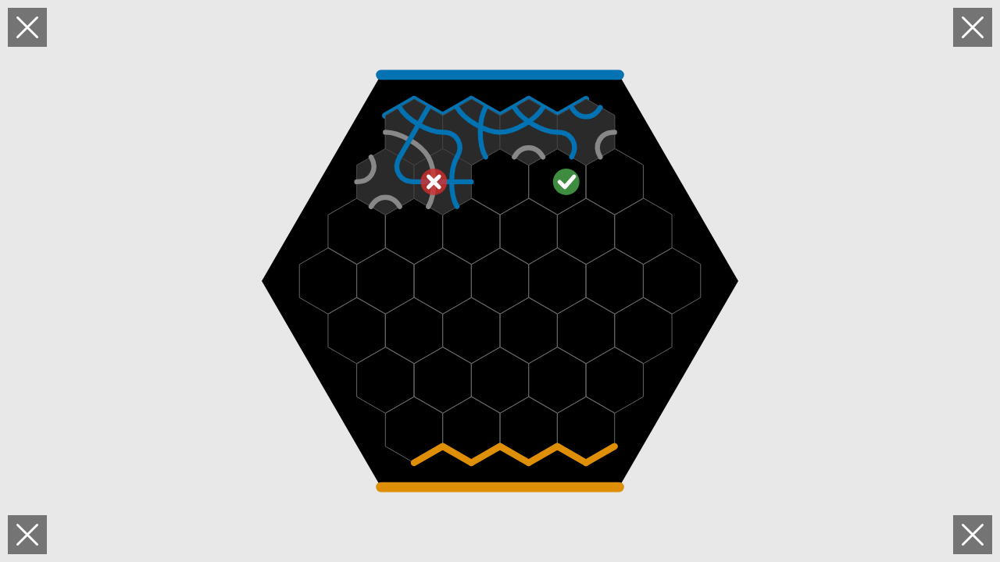

- **Action**: Player 1 clicks hex position to place tile
- **State**: Tile tentatively placed, awaiting confirmation
- **Redux State**: `selectedPosition` set to clicked position
- **What to verify**: Tile at selected position, checkmark (✓) and X buttons visible

### 0040-move-7-complete.png

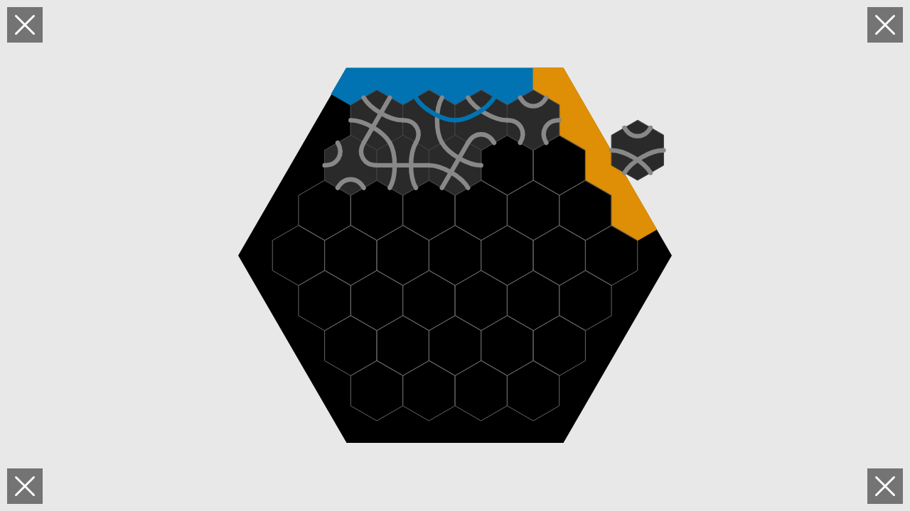

- **Action**: Player 1 clicks checkmark (✓) to confirm
- **State**: Tile committed, turn advances
- **Redux State**: Tile in `board` Map, `selectedPosition = null`, turn advanced
- **What to verify**: Tile permanent on board, confirmation buttons gone, flows updated, next player's turn

### 0041-before-move-8.png

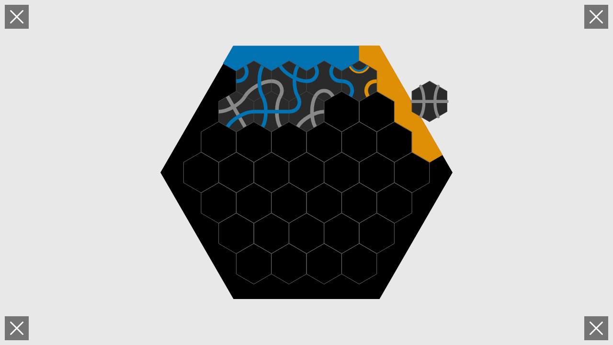

- **Action**: New tile available for Player 2 (Orange)
- **State**: Waiting for player interaction
- **Redux State**: `currentTile` set, `currentRotation = 0`, `selectedPosition = null`
- **What to verify**: Current tile preview at player's edge, previous tiles on board, correct turn

### 0042-move-8-rotation-1.png

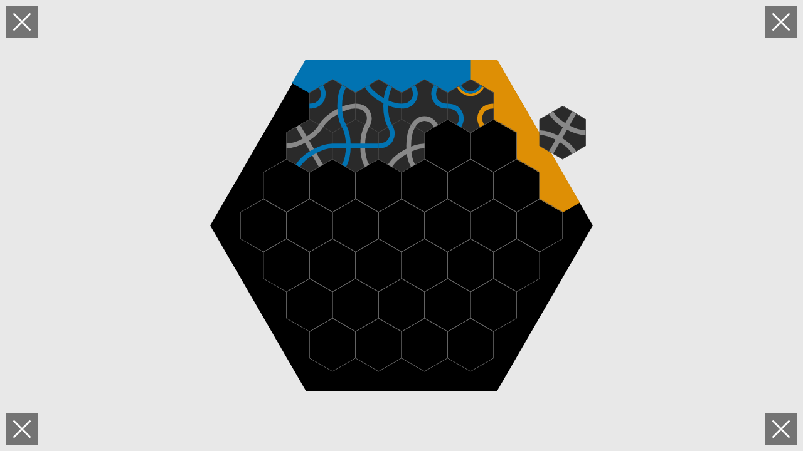

- **Action**: Player 2 clicks tile to rotate (rotation 1)
- **State**: Tile rotated via mouse click
- **Redux State**: `currentRotation = 1`
- **What to verify**: Tile preview shows rotation 1, achieved by clicking tile

### 0043-move-8-rotation-2.png

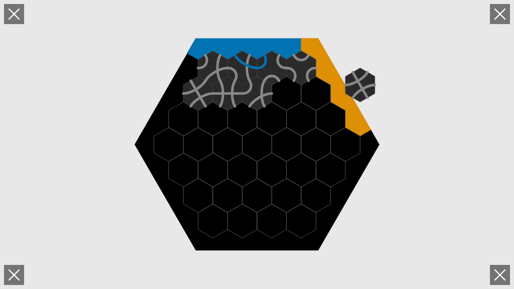

- **Action**: Player 2 clicks tile to rotate (rotation 2)
- **State**: Tile rotated via mouse click
- **Redux State**: `currentRotation = 2`
- **What to verify**: Tile preview shows rotation 2, achieved by clicking tile

### 0044-move-8-tile-placed.png

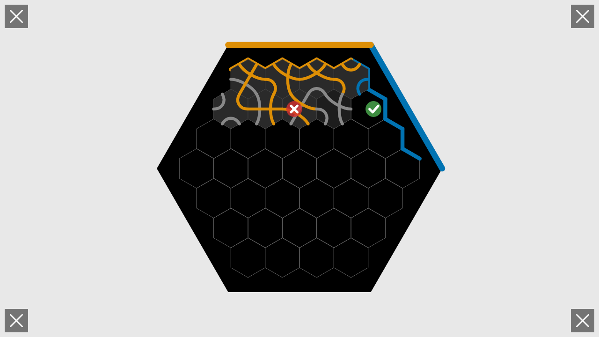

- **Action**: Player 2 clicks hex position to place tile
- **State**: Tile tentatively placed, awaiting confirmation
- **Redux State**: `selectedPosition` set to clicked position
- **What to verify**: Tile at selected position, checkmark (✓) and X buttons visible

### 0045-move-8-complete.png

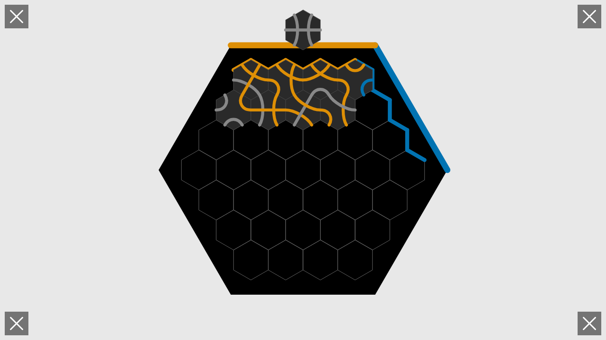

- **Action**: Player 2 clicks checkmark (✓) to confirm
- **State**: Tile committed, turn advances
- **Redux State**: Tile in `board` Map, `selectedPosition = null`, turn advanced
- **What to verify**: Tile permanent on board, confirmation buttons gone, flows updated, next player's turn

### 0046-before-move-9.png

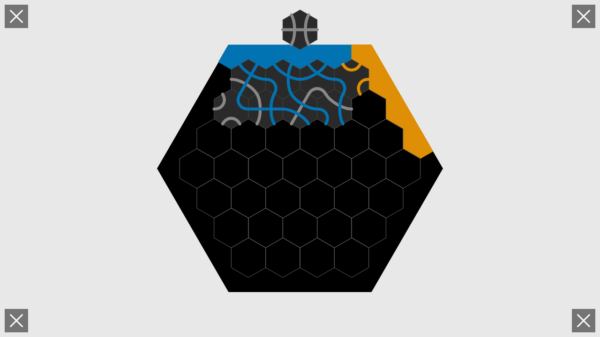

- **Action**: New tile available for Player 1 (Blue)
- **State**: Waiting for player interaction
- **Redux State**: `currentTile` set, `currentRotation = 0`, `selectedPosition = null`
- **What to verify**: Current tile preview at player's edge, previous tiles on board, correct turn

### 0047-move-9-rotation-1.png

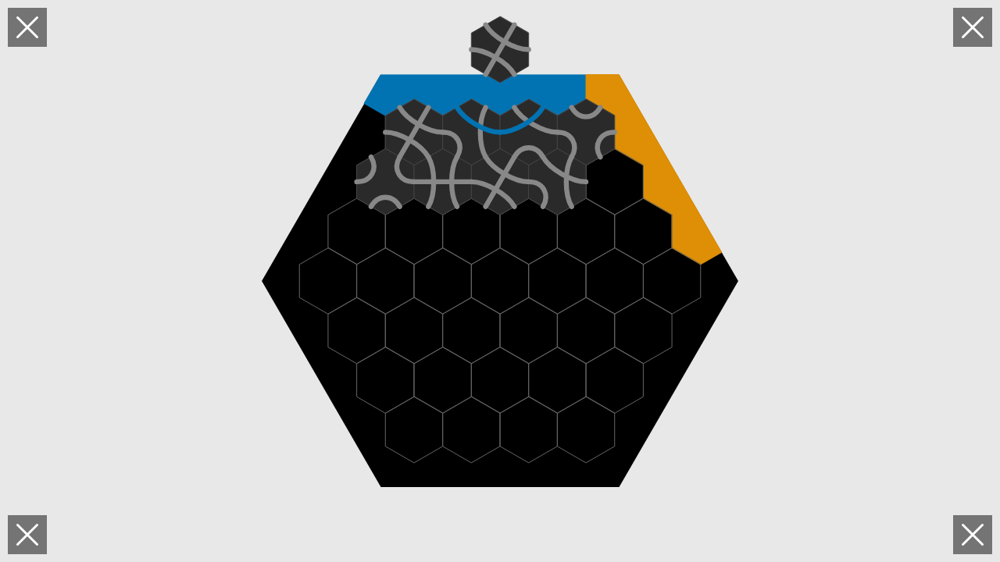

- **Action**: Player 1 clicks tile to rotate (rotation 1)
- **State**: Tile rotated via mouse click
- **Redux State**: `currentRotation = 1`
- **What to verify**: Tile preview shows rotation 1, achieved by clicking tile

### 0048-move-9-rotation-2.png

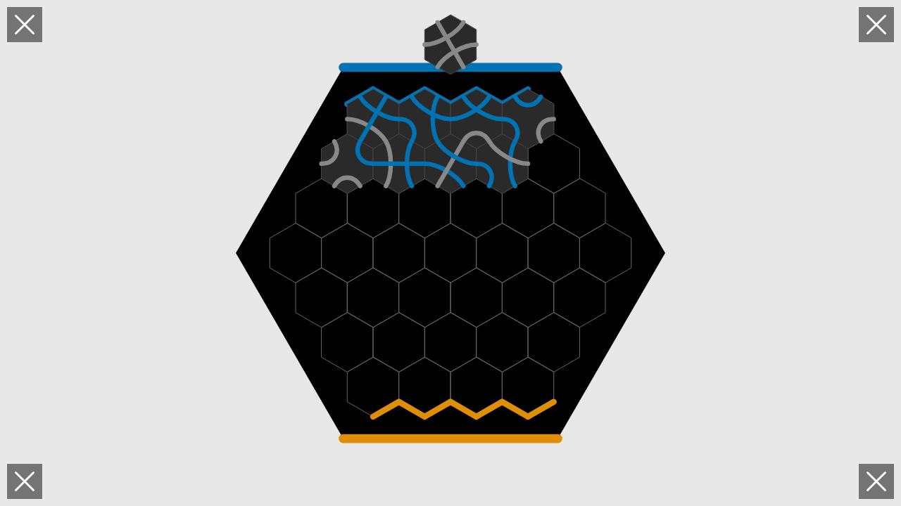

- **Action**: Player 1 clicks tile to rotate (rotation 2)
- **State**: Tile rotated via mouse click
- **Redux State**: `currentRotation = 2`
- **What to verify**: Tile preview shows rotation 2, achieved by clicking tile

### 0049-move-9-rotation-3.png

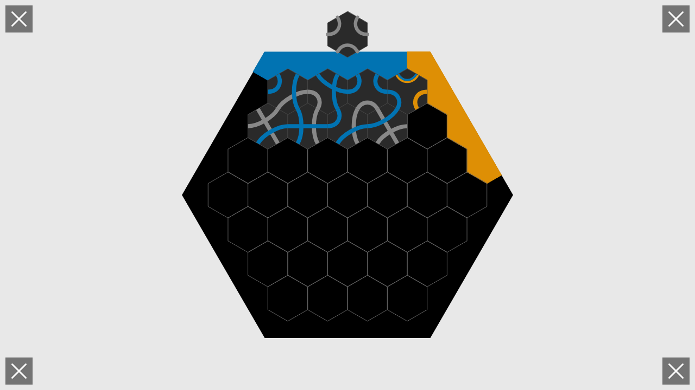

- **Action**: Player 1 clicks tile to rotate (rotation 3)
- **State**: Tile rotated via mouse click
- **Redux State**: `currentRotation = 3`
- **What to verify**: Tile preview shows rotation 3, achieved by clicking tile

### 0050-move-9-tile-placed.png

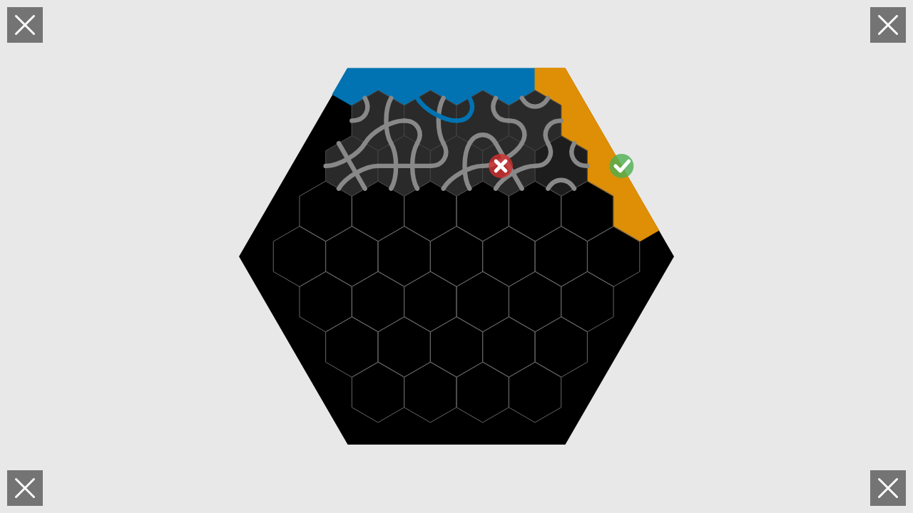

- **Action**: Player 1 clicks hex position to place tile
- **State**: Tile tentatively placed, awaiting confirmation
- **Redux State**: `selectedPosition` set to clicked position
- **What to verify**: Tile at selected position, checkmark (✓) and X buttons visible

### 0051-move-9-complete.png

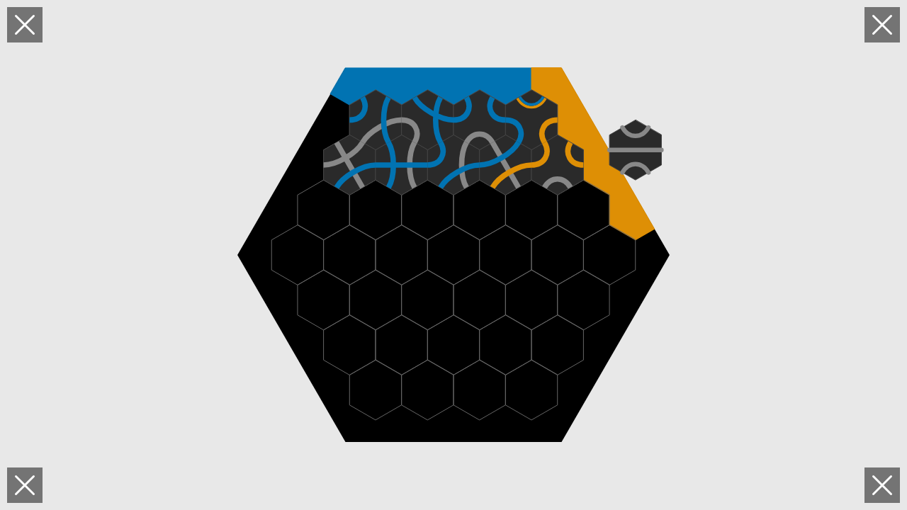

- **Action**: Player 1 clicks checkmark (✓) to confirm
- **State**: Tile committed, turn advances
- **Redux State**: Tile in `board` Map, `selectedPosition = null`, turn advanced
- **What to verify**: Tile permanent on board, confirmation buttons gone, flows updated, next player's turn

### 0052-before-move-10.png

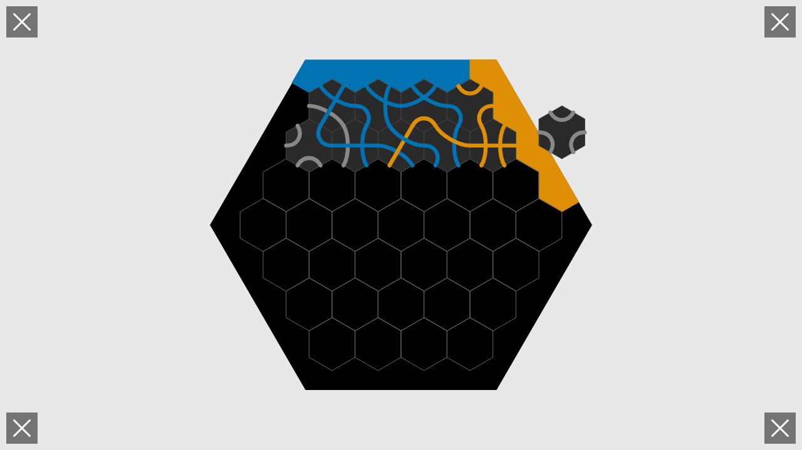

- **Action**: New tile available for Player 2 (Orange)
- **State**: Waiting for player interaction
- **Redux State**: `currentTile` set, `currentRotation = 0`, `selectedPosition = null`
- **What to verify**: Current tile preview at player's edge, previous tiles on board, correct turn

### 0053-move-10-rotation-1.png

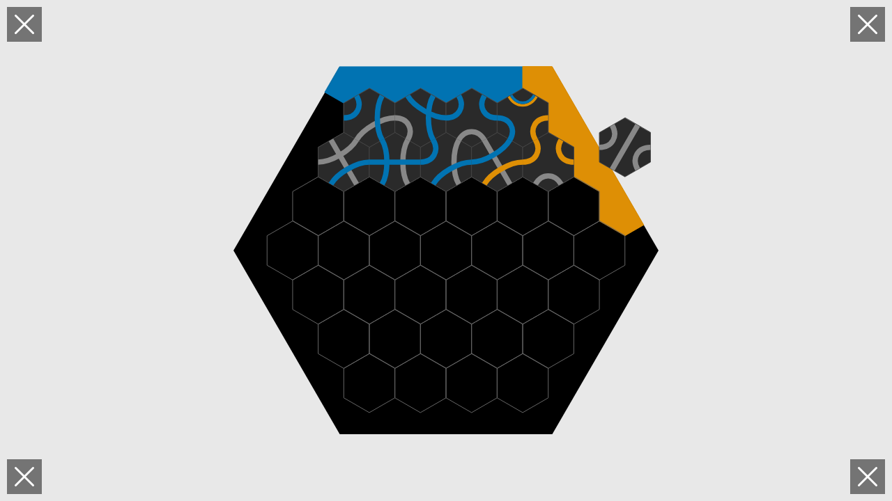

- **Action**: Player 2 clicks tile to rotate (rotation 1)
- **State**: Tile rotated via mouse click
- **Redux State**: `currentRotation = 1`
- **What to verify**: Tile preview shows rotation 1, achieved by clicking tile

### 0054-move-10-rotation-2.png

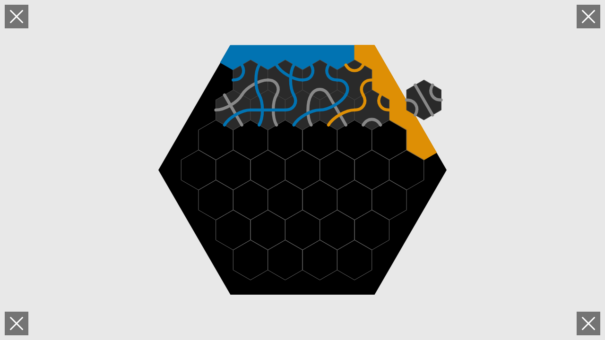

- **Action**: Player 2 clicks tile to rotate (rotation 2)
- **State**: Tile rotated via mouse click
- **Redux State**: `currentRotation = 2`
- **What to verify**: Tile preview shows rotation 2, achieved by clicking tile

### 0055-move-10-rotation-3.png

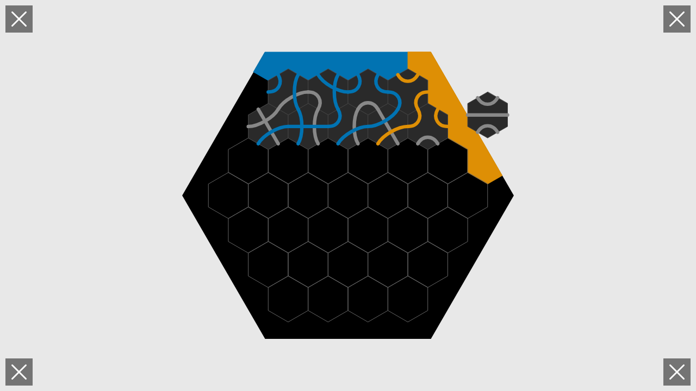

- **Action**: Player 2 clicks tile to rotate (rotation 3)
- **State**: Tile rotated via mouse click
- **Redux State**: `currentRotation = 3`
- **What to verify**: Tile preview shows rotation 3, achieved by clicking tile

### 0056-move-10-rotation-4.png

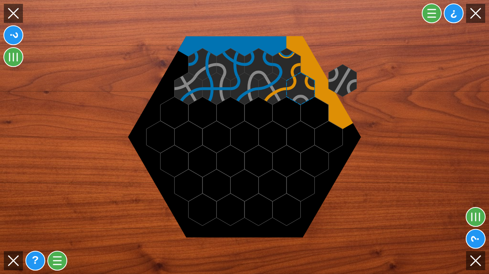

- **Action**: Player 2 clicks tile to rotate (rotation 4)
- **State**: Tile rotated via mouse click
- **Redux State**: `currentRotation = 4`
- **What to verify**: Tile preview shows rotation 4, achieved by clicking tile

### 0057-move-10-tile-placed.png

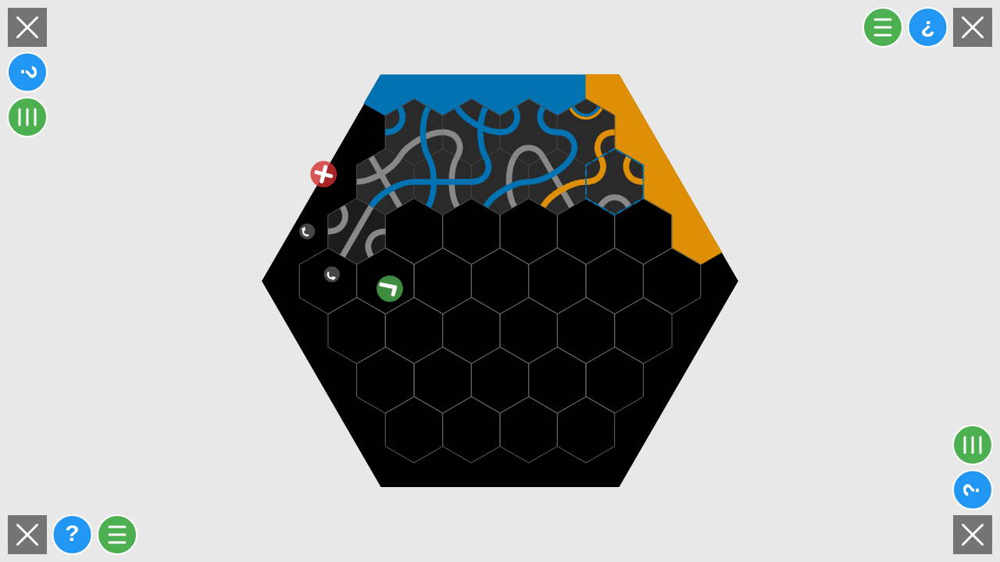

- **Action**: Player 2 clicks hex position to place tile
- **State**: Tile tentatively placed, awaiting confirmation
- **Redux State**: `selectedPosition` set to clicked position
- **What to verify**: Tile at selected position, checkmark (✓) and X buttons visible

### 0058-move-10-complete.png

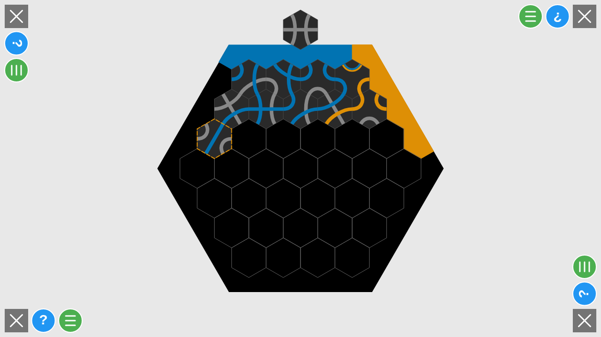

- **Action**: Player 2 clicks checkmark (✓) to confirm
- **State**: Tile committed, turn advances
- **Redux State**: Tile in `board` Map, `selectedPosition = null`, turn advanced
- **What to verify**: Tile permanent on board, confirmation buttons gone, flows updated, next player's turn

### 0059-before-move-11.png

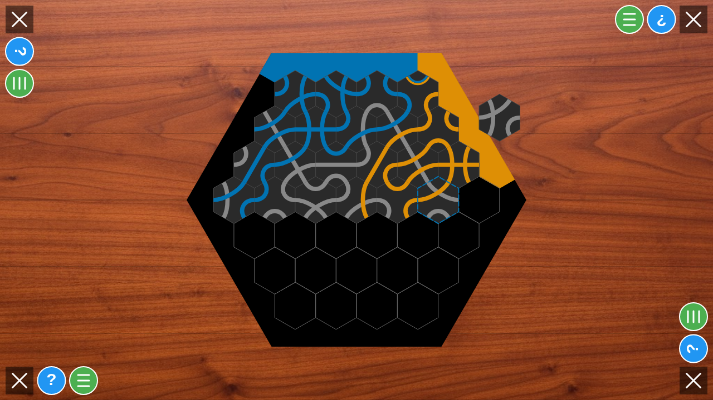

- **Action**: New tile available for Player 1 (Blue)
- **State**: Waiting for player interaction
- **Redux State**: `currentTile` set, `currentRotation = 0`, `selectedPosition = null`
- **What to verify**: Current tile preview at player's edge, previous tiles on board, correct turn

### 0060-move-11-rotation-1.png

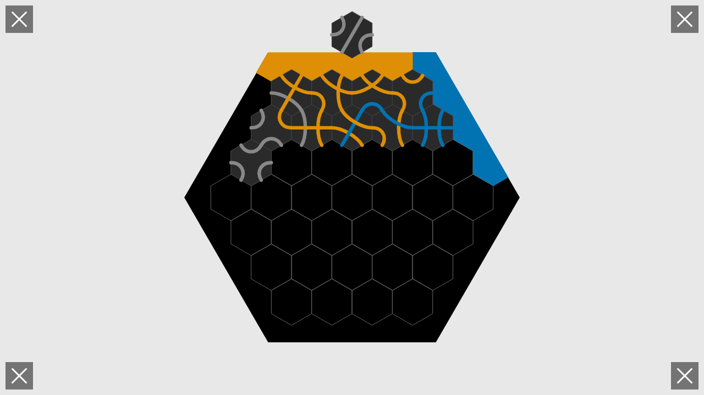

- **Action**: Player 1 clicks tile to rotate (rotation 1)
- **State**: Tile rotated via mouse click
- **Redux State**: `currentRotation = 1`
- **What to verify**: Tile preview shows rotation 1, achieved by clicking tile

### 0061-move-11-rotation-2.png

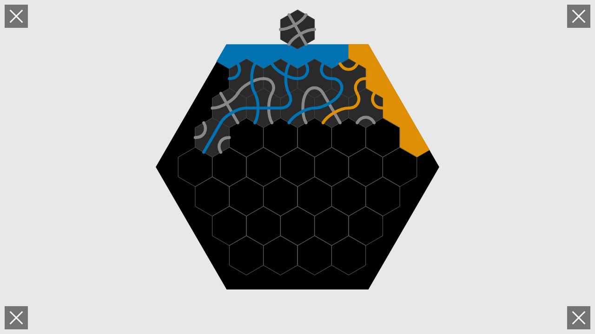

- **Action**: Player 1 clicks tile to rotate (rotation 2)
- **State**: Tile rotated via mouse click
- **Redux State**: `currentRotation = 2`
- **What to verify**: Tile preview shows rotation 2, achieved by clicking tile

### 0062-move-11-rotation-3.png

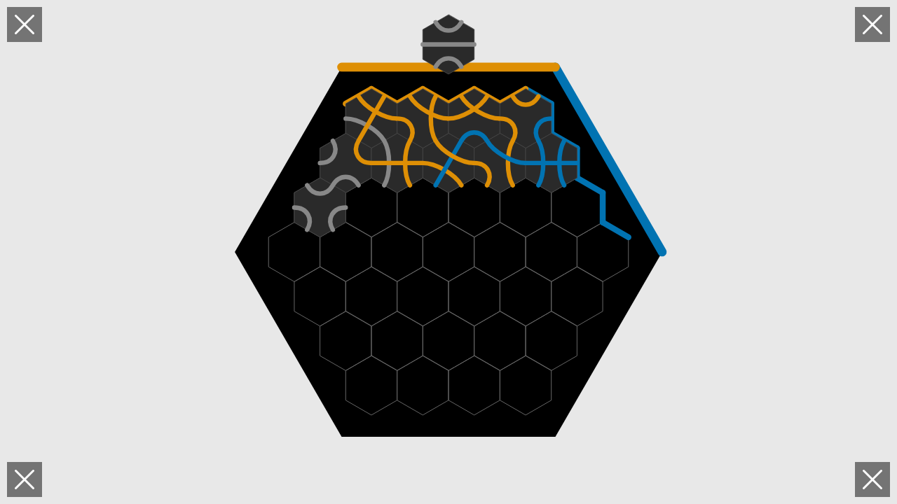

- **Action**: Player 1 clicks tile to rotate (rotation 3)
- **State**: Tile rotated via mouse click
- **Redux State**: `currentRotation = 3`
- **What to verify**: Tile preview shows rotation 3, achieved by clicking tile

### 0063-move-11-rotation-4.png

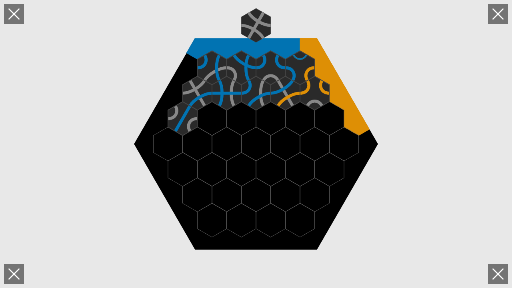

- **Action**: Player 1 clicks tile to rotate (rotation 4)
- **State**: Tile rotated via mouse click
- **Redux State**: `currentRotation = 4`
- **What to verify**: Tile preview shows rotation 4, achieved by clicking tile

### 0064-move-11-rotation-5.png

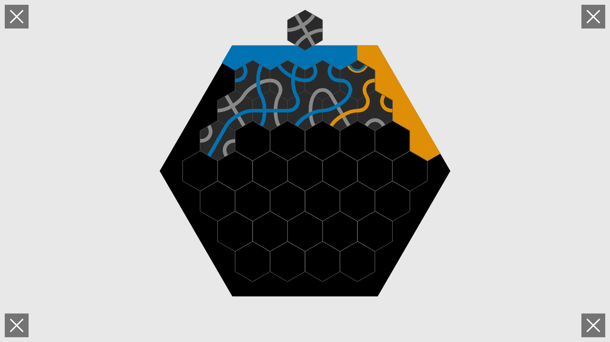

- **Action**: Player 1 clicks tile to rotate (rotation 5)
- **State**: Tile rotated via mouse click
- **Redux State**: `currentRotation = 5`
- **What to verify**: Tile preview shows rotation 5, achieved by clicking tile

### 0065-move-11-tile-placed.png

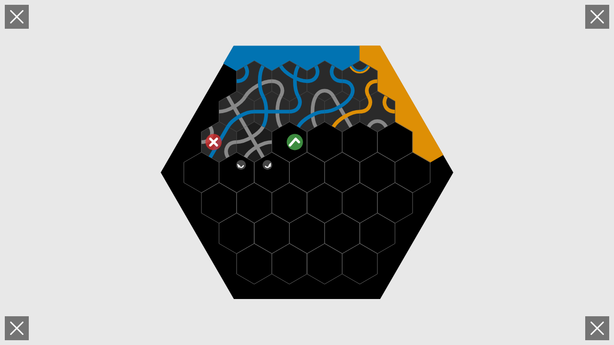

- **Action**: Player 1 clicks hex position to place tile
- **State**: Tile tentatively placed, awaiting confirmation
- **Redux State**: `selectedPosition` set to clicked position
- **What to verify**: Tile at selected position, checkmark (✓) and X buttons visible

### 0066-move-11-complete.png

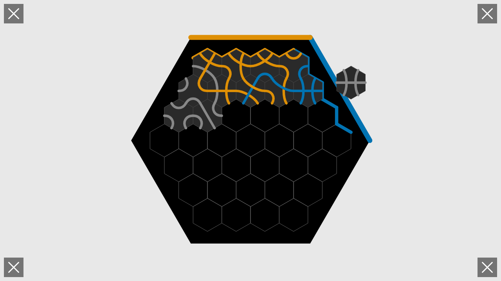

- **Action**: Player 1 clicks checkmark (✓) to confirm
- **State**: Tile committed, turn advances
- **Redux State**: Tile in `board` Map, `selectedPosition = null`, turn advanced
- **What to verify**: Tile permanent on board, confirmation buttons gone, flows updated, next player's turn

### 0067-before-move-12.png

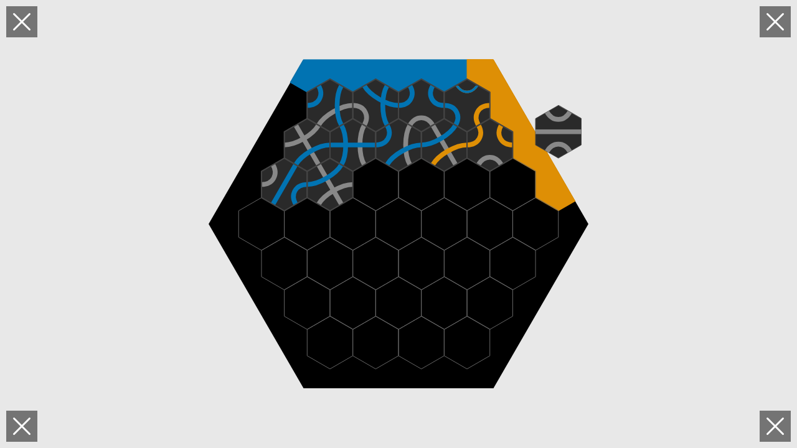

- **Action**: New tile available for Player 2 (Orange)
- **State**: Waiting for player interaction
- **Redux State**: `currentTile` set, `currentRotation = 0`, `selectedPosition = null`
- **What to verify**: Current tile preview at player's edge, previous tiles on board, correct turn

### 0068-move-12-tile-placed.png

- **Action**: Player 2 clicks hex position to place tile
- **State**: Tile tentatively placed, awaiting confirmation
- **Redux State**: `selectedPosition` set to clicked position
- **What to verify**: Tile at selected position, checkmark (✓) and X buttons visible

### 0069-move-12-complete.png

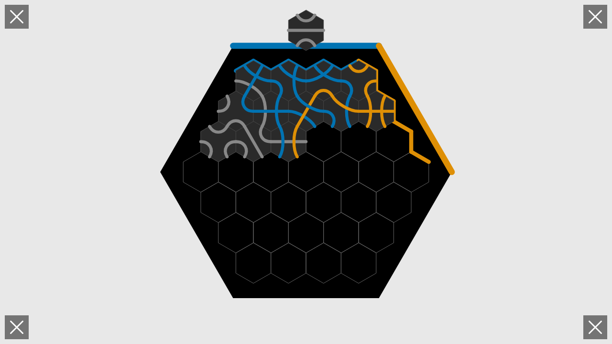

- **Action**: Player 2 clicks checkmark (✓) to confirm
- **State**: Tile committed, turn advances
- **Redux State**: Tile in `board` Map, `selectedPosition = null`, turn advanced
- **What to verify**: Tile permanent on board, confirmation buttons gone, flows updated, next player's turn

### 0070-before-move-13.png

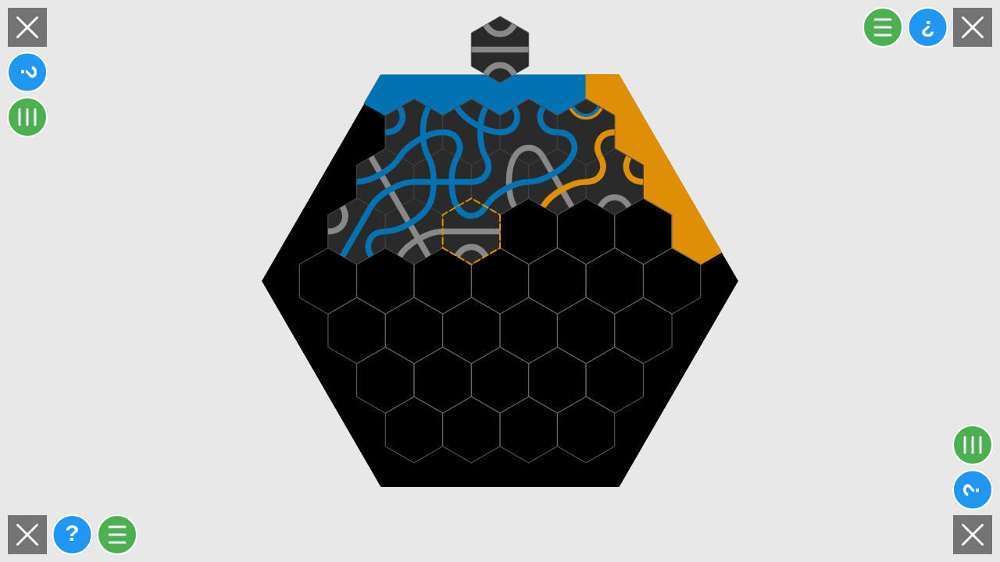

- **Action**: New tile available for Player 1 (Blue)
- **State**: Waiting for player interaction
- **Redux State**: `currentTile` set, `currentRotation = 0`, `selectedPosition = null`
- **What to verify**: Current tile preview at player's edge, previous tiles on board, correct turn

### 0071-move-13-rotation-1.png

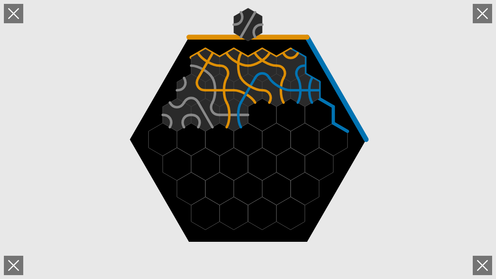

- **Action**: Player 1 clicks tile to rotate (rotation 1)
- **State**: Tile rotated via mouse click
- **Redux State**: `currentRotation = 1`
- **What to verify**: Tile preview shows rotation 1, achieved by clicking tile

### 0072-move-13-tile-placed.png

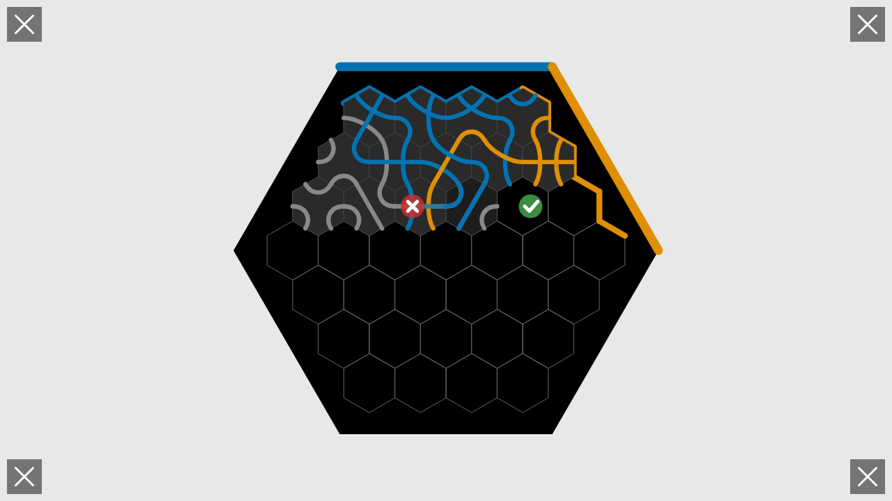

- **Action**: Player 1 clicks hex position to place tile
- **State**: Tile tentatively placed, awaiting confirmation
- **Redux State**: `selectedPosition` set to clicked position
- **What to verify**: Tile at selected position, checkmark (✓) and X buttons visible

### 0073-move-13-complete.png

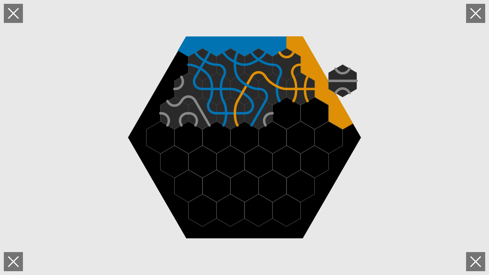

- **Action**: Player 1 clicks checkmark (✓) to confirm
- **State**: Tile committed, turn advances
- **Redux State**: Tile in `board` Map, `selectedPosition = null`, turn advanced
- **What to verify**: Tile permanent on board, confirmation buttons gone, flows updated, next player's turn

### 0074-before-move-14.png

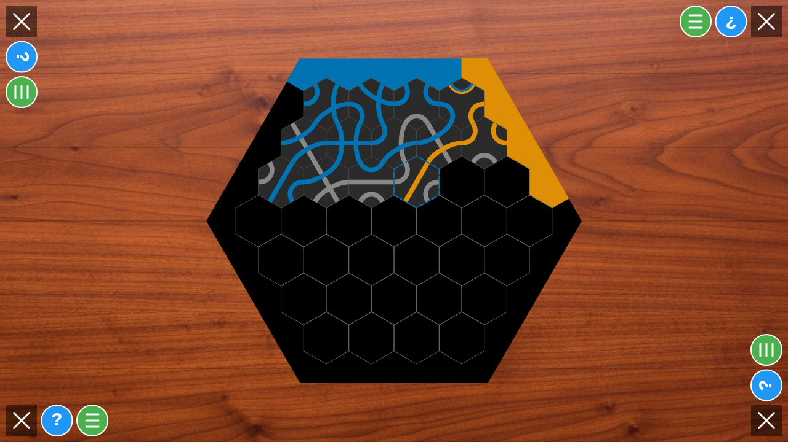

- **Action**: New tile available for Player 2 (Orange)
- **State**: Waiting for player interaction
- **Redux State**: `currentTile` set, `currentRotation = 0`, `selectedPosition = null`
- **What to verify**: Current tile preview at player's edge, previous tiles on board, correct turn

### 0075-move-14-rotation-1.png

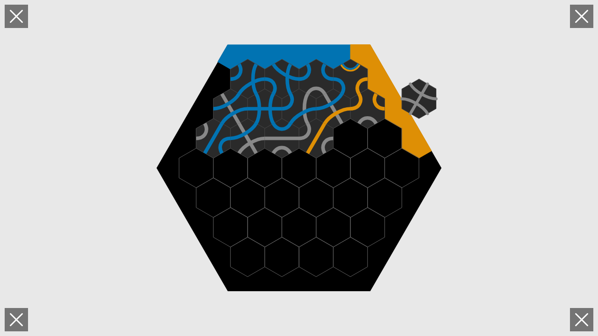

- **Action**: Player 2 clicks tile to rotate (rotation 1)
- **State**: Tile rotated via mouse click
- **Redux State**: `currentRotation = 1`
- **What to verify**: Tile preview shows rotation 1, achieved by clicking tile

### 0076-move-14-rotation-2.png

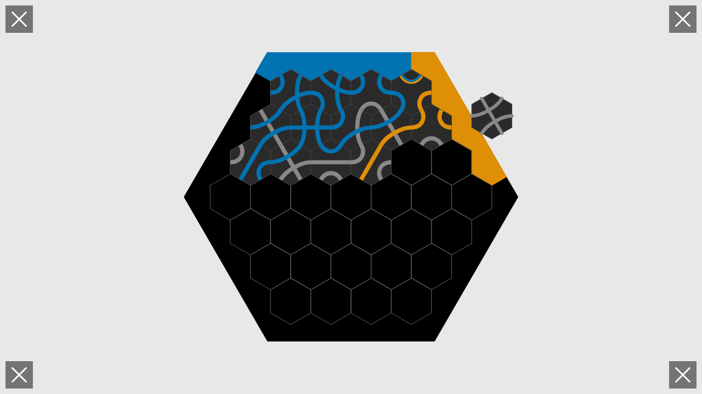

- **Action**: Player 2 clicks tile to rotate (rotation 2)
- **State**: Tile rotated via mouse click
- **Redux State**: `currentRotation = 2`
- **What to verify**: Tile preview shows rotation 2, achieved by clicking tile

### 0077-move-14-tile-placed.png

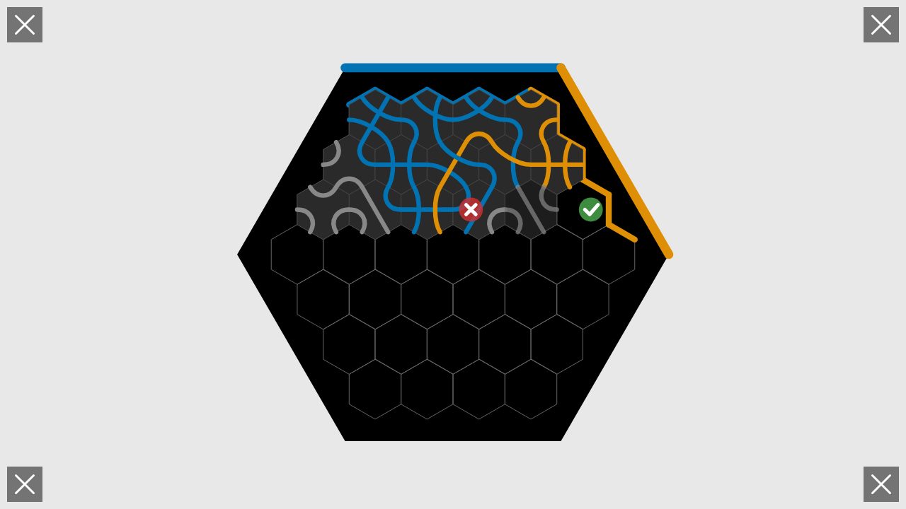

- **Action**: Player 2 clicks hex position to place tile
- **State**: Tile tentatively placed, awaiting confirmation
- **Redux State**: `selectedPosition` set to clicked position
- **What to verify**: Tile at selected position, checkmark (✓) and X buttons visible

### 0078-move-14-complete.png

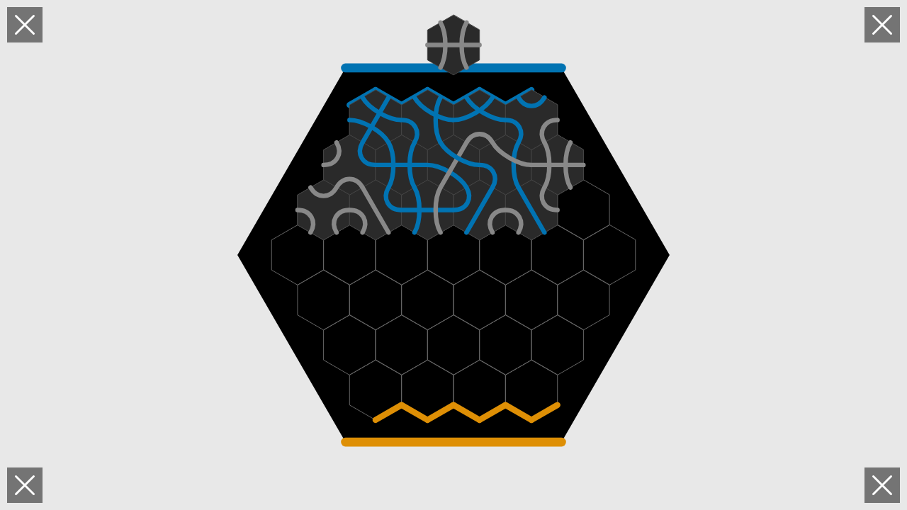

- **Action**: Player 2 clicks checkmark (✓) to confirm
- **State**: Tile committed, turn advances
- **Redux State**: Tile in `board` Map, `selectedPosition = null`, turn advanced
- **What to verify**: Tile permanent on board, confirmation buttons gone, flows updated, next player's turn

### 0079-before-move-15.png

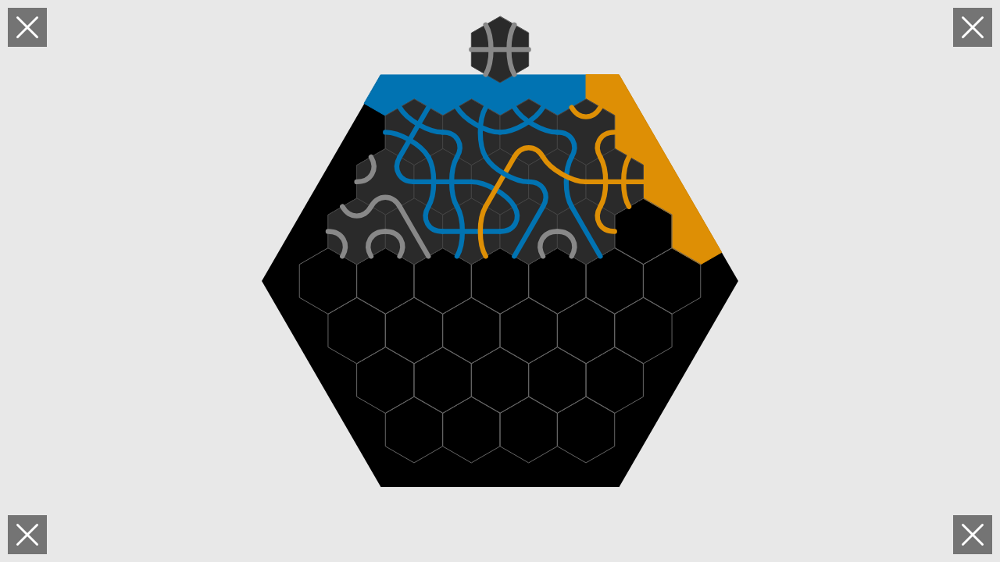

- **Action**: New tile available for Player 1 (Blue)
- **State**: Waiting for player interaction
- **Redux State**: `currentTile` set, `currentRotation = 0`, `selectedPosition = null`
- **What to verify**: Current tile preview at player's edge, previous tiles on board, correct turn

### 0080-move-15-rotation-1.png

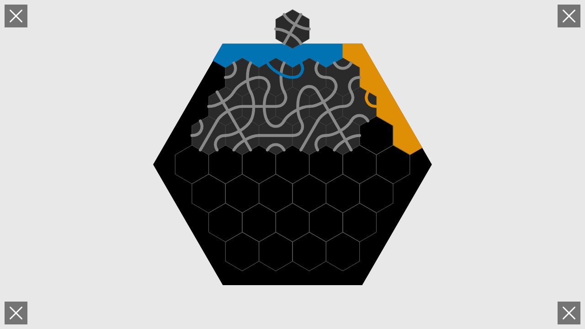

- **Action**: Player 1 clicks tile to rotate (rotation 1)
- **State**: Tile rotated via mouse click
- **Redux State**: `currentRotation = 1`
- **What to verify**: Tile preview shows rotation 1, achieved by clicking tile

### 0081-move-15-rotation-2.png

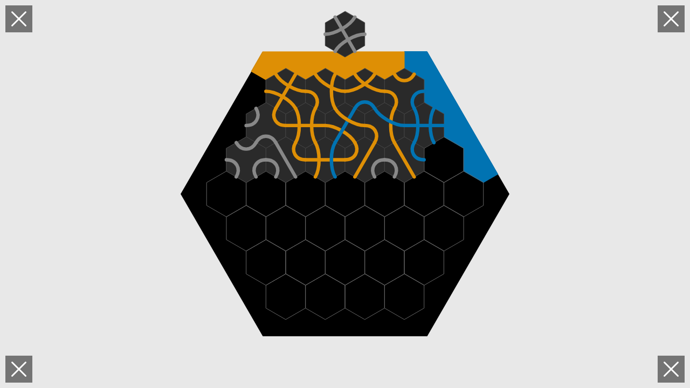

- **Action**: Player 1 clicks tile to rotate (rotation 2)
- **State**: Tile rotated via mouse click
- **Redux State**: `currentRotation = 2`
- **What to verify**: Tile preview shows rotation 2, achieved by clicking tile

### 0082-move-15-rotation-3.png

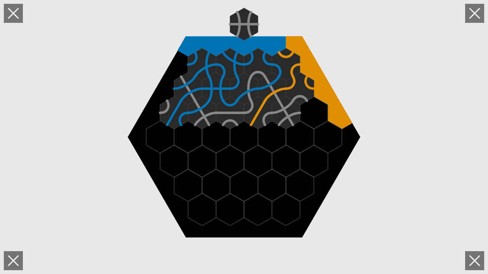

- **Action**: Player 1 clicks tile to rotate (rotation 3)
- **State**: Tile rotated via mouse click
- **Redux State**: `currentRotation = 3`
- **What to verify**: Tile preview shows rotation 3, achieved by clicking tile

### 0083-move-15-tile-placed.png

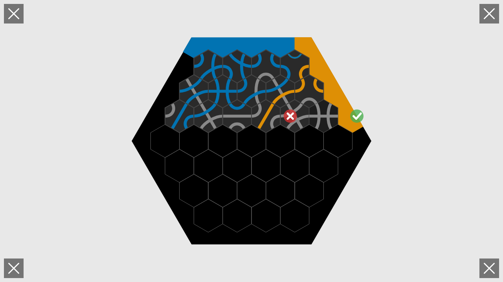

- **Action**: Player 1 clicks hex position to place tile
- **State**: Tile tentatively placed, awaiting confirmation
- **Redux State**: `selectedPosition` set to clicked position
- **What to verify**: Tile at selected position, checkmark (✓) and X buttons visible

### 0084-move-15-complete.png

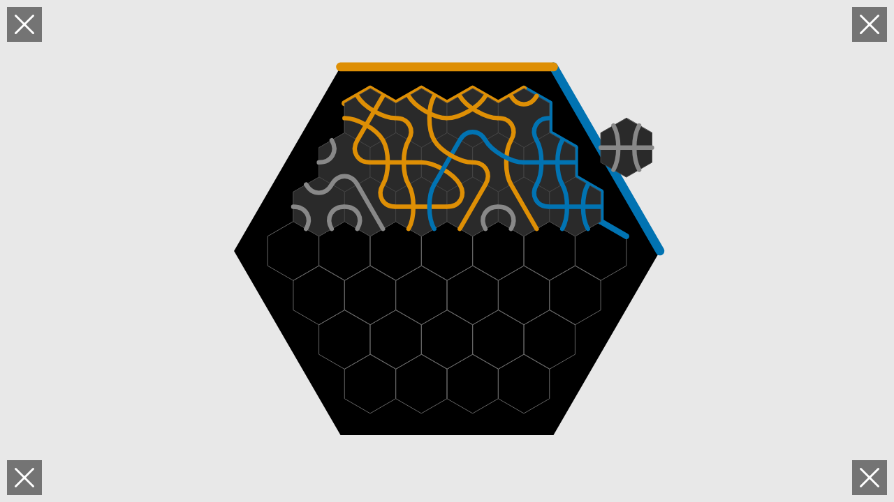

- **Action**: Player 1 clicks checkmark (✓) to confirm
- **State**: Tile committed, turn advances
- **Redux State**: Tile in `board` Map, `selectedPosition = null`, turn advanced
- **What to verify**: Tile permanent on board, confirmation buttons gone, flows updated, next player's turn

### 0085-before-move-16.png

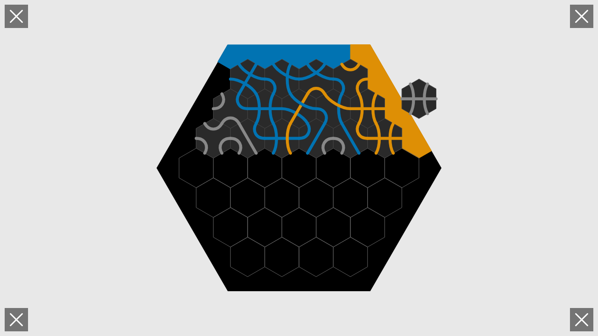

- **Action**: New tile available for Player 2 (Orange)
- **State**: Waiting for player interaction
- **Redux State**: `currentTile` set, `currentRotation = 0`, `selectedPosition = null`
- **What to verify**: Current tile preview at player's edge, previous tiles on board, correct turn

### 0086-move-16-rotation-1.png

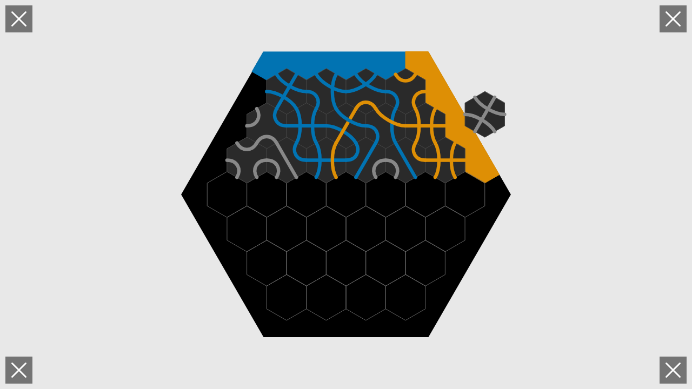

- **Action**: Player 2 clicks tile to rotate (rotation 1)
- **State**: Tile rotated via mouse click
- **Redux State**: `currentRotation = 1`
- **What to verify**: Tile preview shows rotation 1, achieved by clicking tile

### 0087-move-16-rotation-2.png

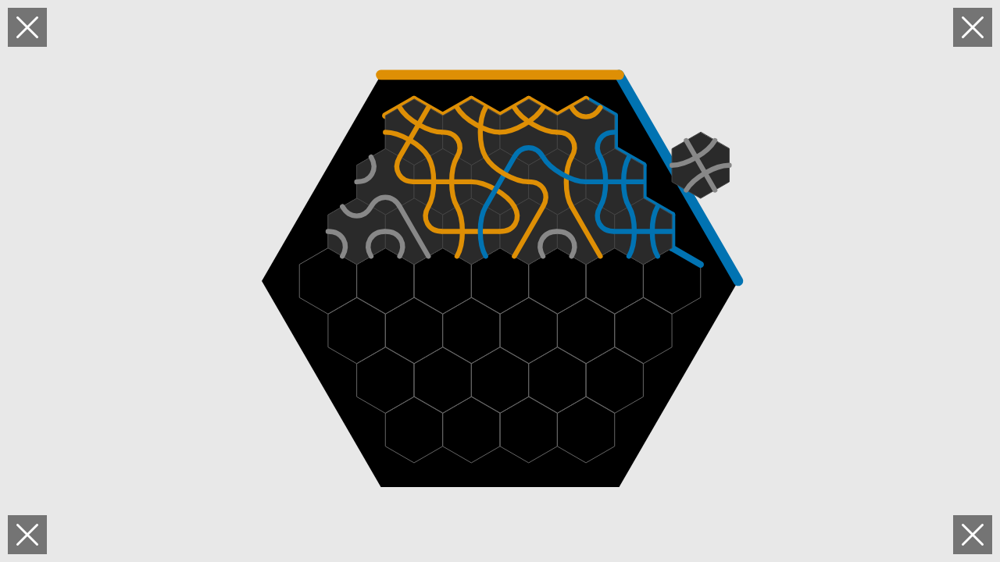

- **Action**: Player 2 clicks tile to rotate (rotation 2)
- **State**: Tile rotated via mouse click
- **Redux State**: `currentRotation = 2`
- **What to verify**: Tile preview shows rotation 2, achieved by clicking tile

### 0088-move-16-rotation-3.png

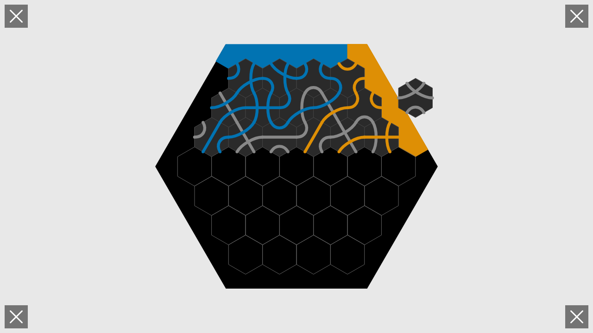

- **Action**: Player 2 clicks tile to rotate (rotation 3)
- **State**: Tile rotated via mouse click
- **Redux State**: `currentRotation = 3`
- **What to verify**: Tile preview shows rotation 3, achieved by clicking tile

### 0089-move-16-rotation-4.png

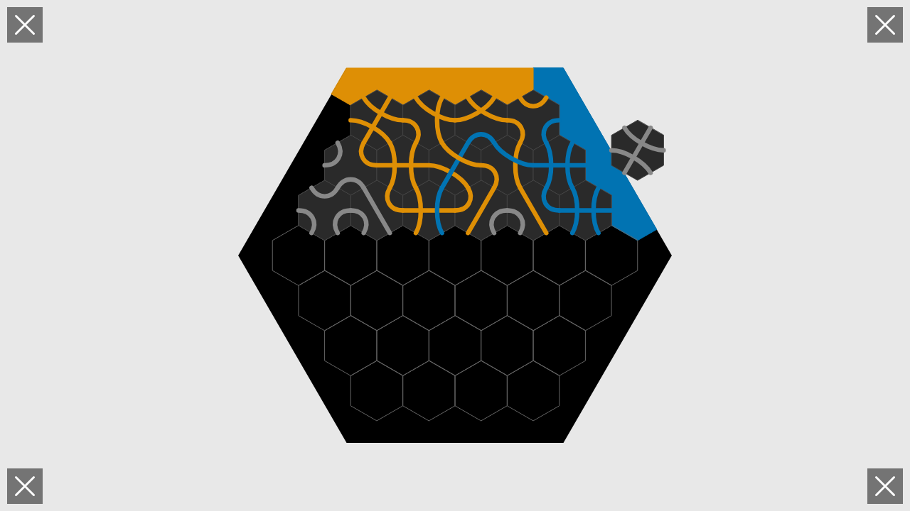

- **Action**: Player 2 clicks tile to rotate (rotation 4)
- **State**: Tile rotated via mouse click
- **Redux State**: `currentRotation = 4`
- **What to verify**: Tile preview shows rotation 4, achieved by clicking tile

### 0090-move-16-tile-placed.png

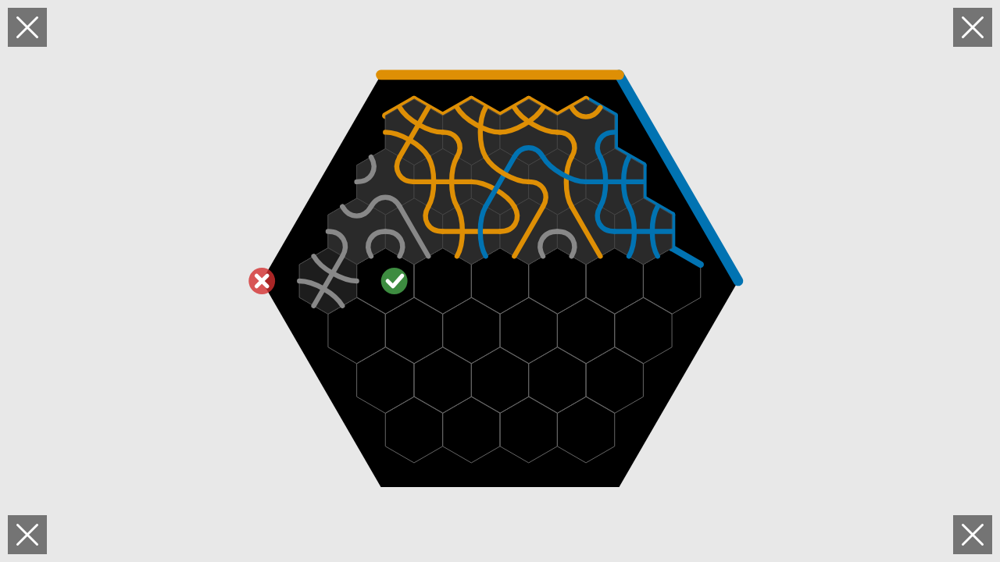

- **Action**: Player 2 clicks hex position to place tile
- **State**: Tile tentatively placed, awaiting confirmation
- **Redux State**: `selectedPosition` set to clicked position
- **What to verify**: Tile at selected position, checkmark (✓) and X buttons visible

### 0091-move-16-complete.png

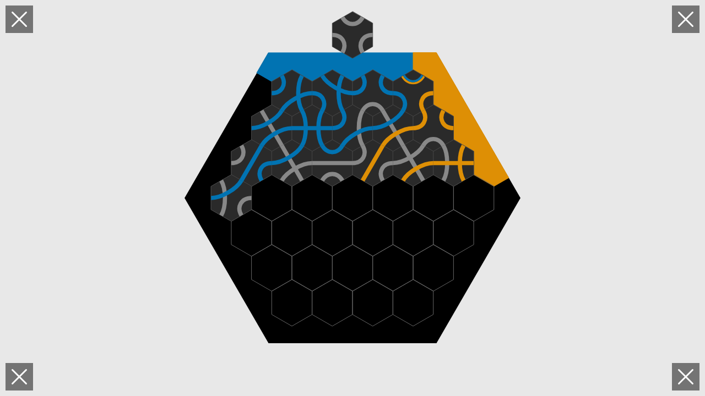

- **Action**: Player 2 clicks checkmark (✓) to confirm
- **State**: Tile committed, turn advances
- **Redux State**: Tile in `board` Map, `selectedPosition = null`, turn advanced
- **What to verify**: Tile permanent on board, confirmation buttons gone, flows updated, next player's turn

### 0092-before-move-17.png

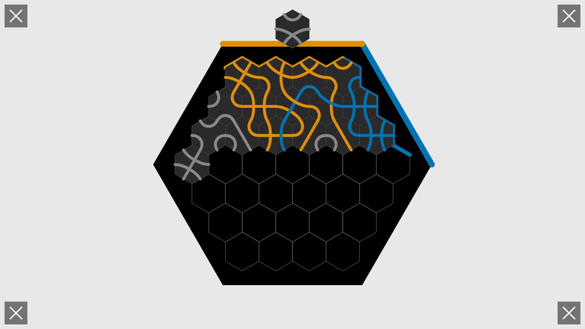

- **Action**: New tile available for Player 1 (Blue)
- **State**: Waiting for player interaction
- **Redux State**: `currentTile` set, `currentRotation = 0`, `selectedPosition = null`
- **What to verify**: Current tile preview at player's edge, previous tiles on board, correct turn

### 0093-move-17-rotation-1.png

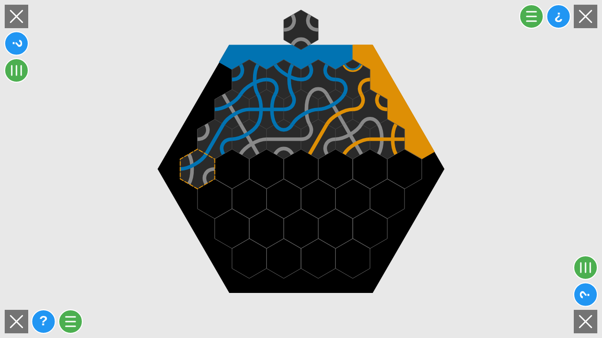

- **Action**: Player 1 clicks tile to rotate (rotation 1)
- **State**: Tile rotated via mouse click
- **Redux State**: `currentRotation = 1`
- **What to verify**: Tile preview shows rotation 1, achieved by clicking tile

### 0094-move-17-rotation-2.png

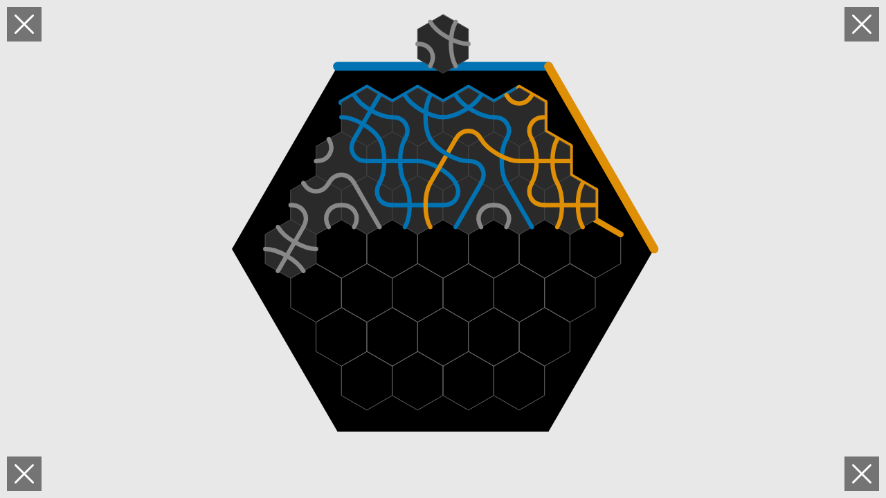

- **Action**: Player 1 clicks tile to rotate (rotation 2)
- **State**: Tile rotated via mouse click
- **Redux State**: `currentRotation = 2`
- **What to verify**: Tile preview shows rotation 2, achieved by clicking tile

### 0095-move-17-rotation-3.png

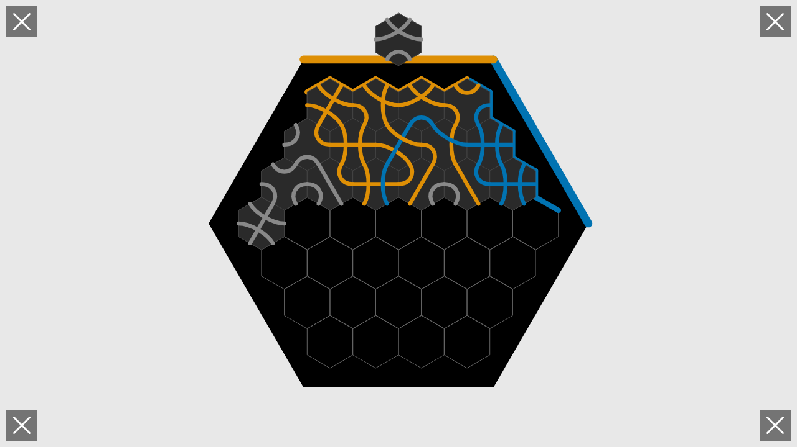

- **Action**: Player 1 clicks tile to rotate (rotation 3)
- **State**: Tile rotated via mouse click
- **Redux State**: `currentRotation = 3`
- **What to verify**: Tile preview shows rotation 3, achieved by clicking tile

### 0096-move-17-rotation-4.png

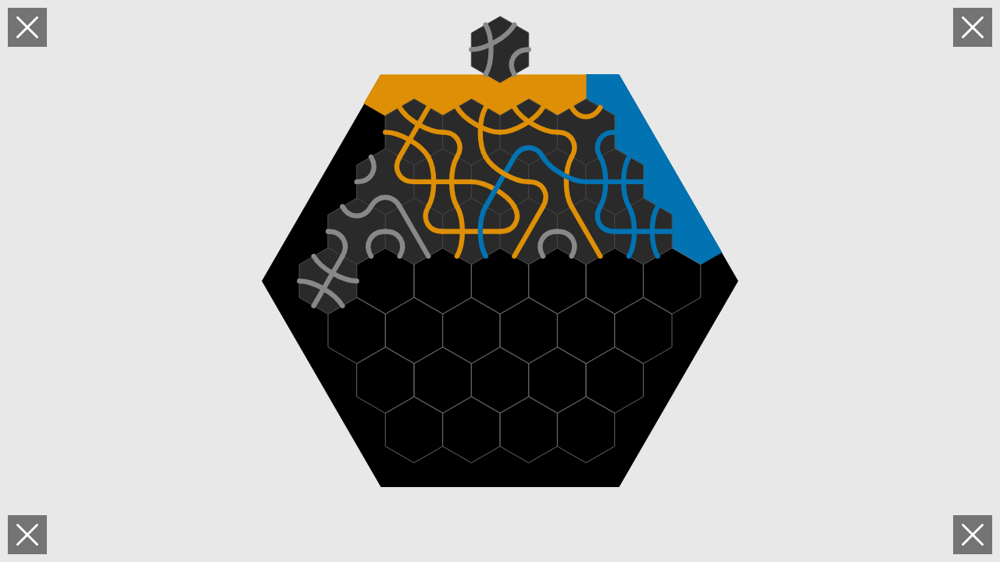

- **Action**: Player 1 clicks tile to rotate (rotation 4)
- **State**: Tile rotated via mouse click
- **Redux State**: `currentRotation = 4`
- **What to verify**: Tile preview shows rotation 4, achieved by clicking tile

### 0097-move-17-rotation-5.png

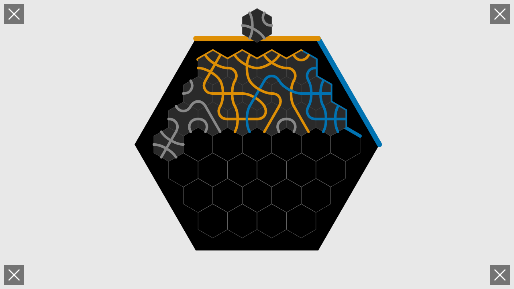

- **Action**: Player 1 clicks tile to rotate (rotation 5)
- **State**: Tile rotated via mouse click
- **Redux State**: `currentRotation = 5`
- **What to verify**: Tile preview shows rotation 5, achieved by clicking tile

### 0098-move-17-tile-placed.png

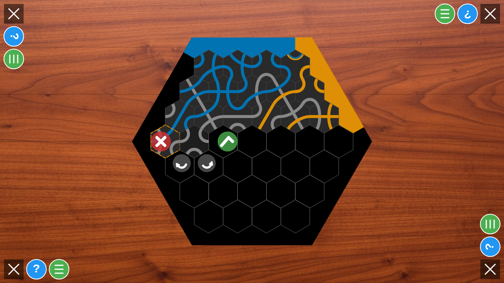

- **Action**: Player 1 clicks hex position to place tile
- **State**: Tile tentatively placed, awaiting confirmation
- **Redux State**: `selectedPosition` set to clicked position
- **What to verify**: Tile at selected position, checkmark (✓) and X buttons visible

### 0099-move-17-complete.png

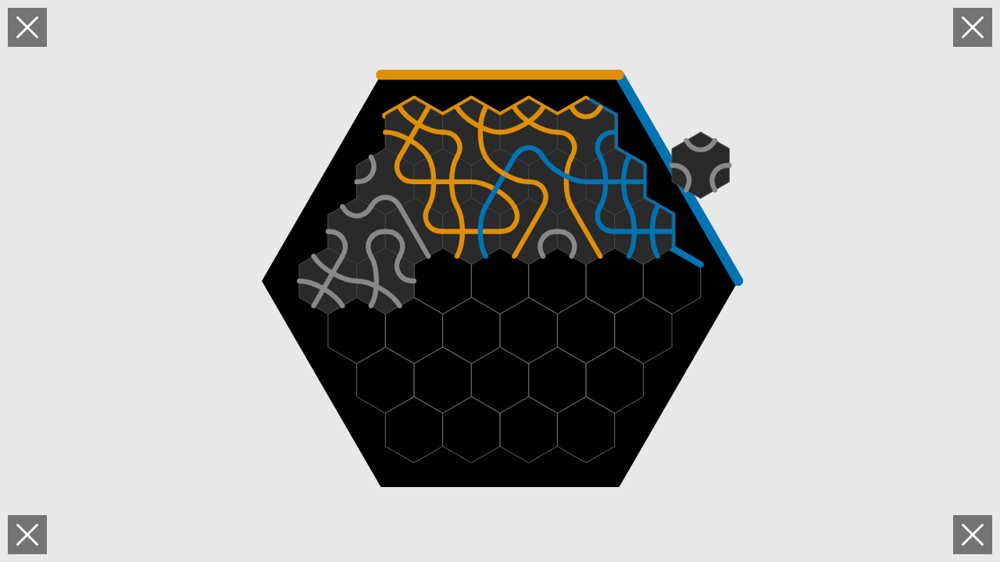

- **Action**: Player 1 clicks checkmark (✓) to confirm
- **State**: Tile committed, turn advances
- **Redux State**: Tile in `board` Map, `selectedPosition = null`, turn advanced
- **What to verify**: Tile permanent on board, confirmation buttons gone, flows updated, next player's turn

### 0100-before-move-18.png

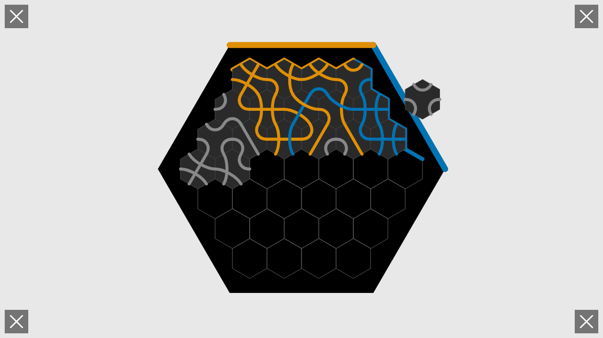

- **Action**: New tile available for Player 2 (Orange)
- **State**: Waiting for player interaction
- **Redux State**: `currentTile` set, `currentRotation = 0`, `selectedPosition = null`
- **What to verify**: Current tile preview at player's edge, previous tiles on board, correct turn

### 0101-move-18-tile-placed.png

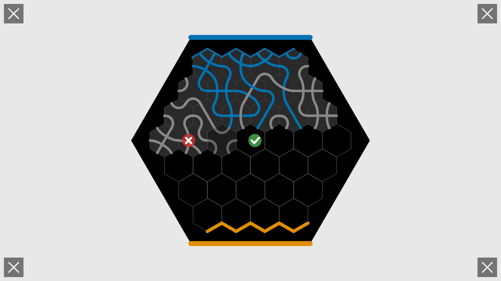

- **Action**: Player 2 clicks hex position to place tile
- **State**: Tile tentatively placed, awaiting confirmation
- **Redux State**: `selectedPosition` set to clicked position
- **What to verify**: Tile at selected position, checkmark (✓) and X buttons visible

### 0102-move-18-complete.png

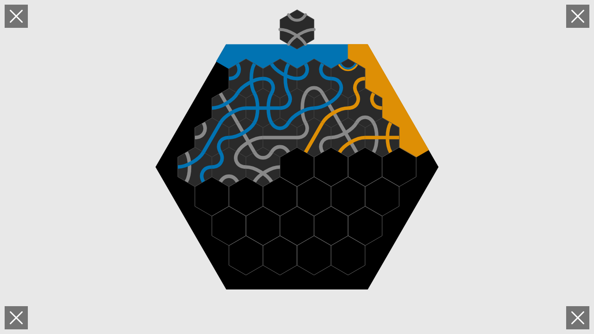

- **Action**: Player 2 clicks checkmark (✓) to confirm
- **State**: Tile committed, turn advances
- **Redux State**: Tile in `board` Map, `selectedPosition = null`, turn advanced
- **What to verify**: Tile permanent on board, confirmation buttons gone, flows updated, next player's turn

### 0103-before-move-19.png

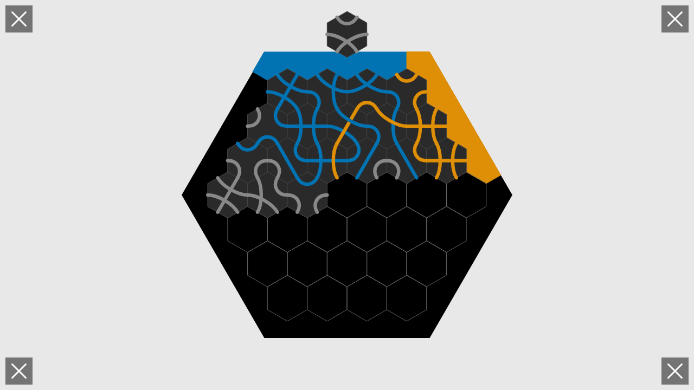

- **Action**: New tile available for Player 1 (Blue)
- **State**: Waiting for player interaction
- **Redux State**: `currentTile` set, `currentRotation = 0`, `selectedPosition = null`
- **What to verify**: Current tile preview at player's edge, previous tiles on board, correct turn

### 0104-move-19-rotation-1.png

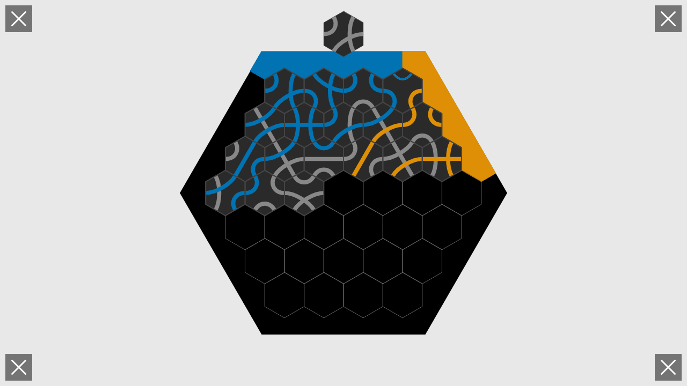

- **Action**: Player 1 clicks tile to rotate (rotation 1)
- **State**: Tile rotated via mouse click
- **Redux State**: `currentRotation = 1`
- **What to verify**: Tile preview shows rotation 1, achieved by clicking tile

### 0105-move-19-tile-placed.png

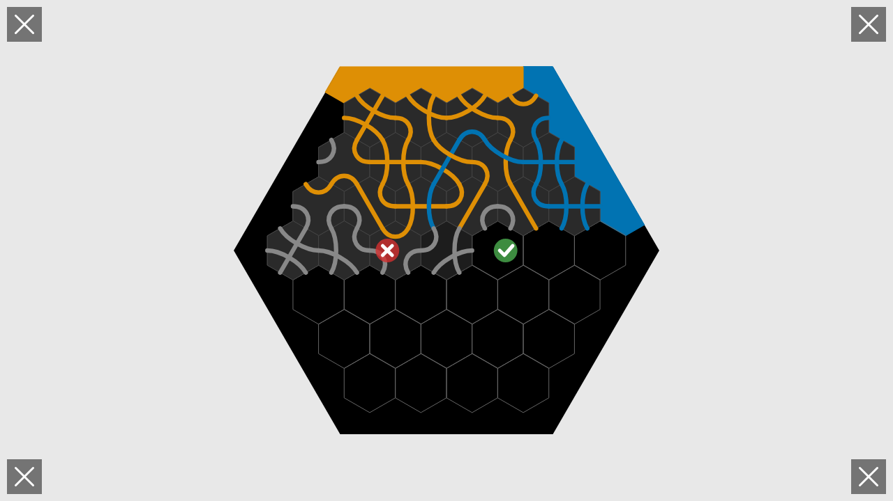

- **Action**: Player 1 clicks hex position to place tile
- **State**: Tile tentatively placed, awaiting confirmation
- **Redux State**: `selectedPosition` set to clicked position
- **What to verify**: Tile at selected position, checkmark (✓) and X buttons visible

### 0106-move-19-complete.png

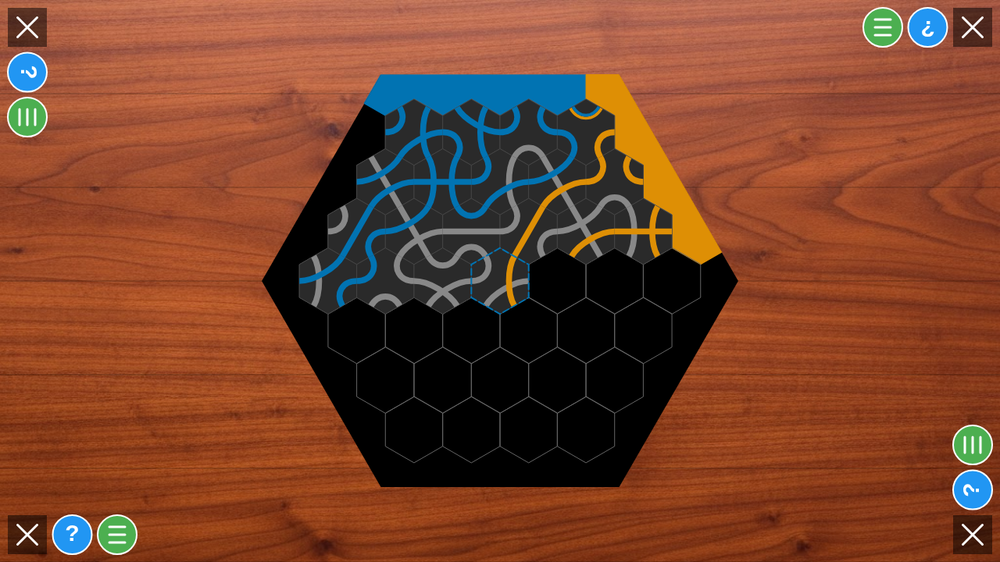

- **Action**: Player 1 clicks checkmark (✓) to confirm
- **State**: Tile committed, turn advances
- **Redux State**: Tile in `board` Map, `selectedPosition = null`, turn advanced
- **What to verify**: Tile permanent on board, confirmation buttons gone, flows updated, next player's turn

### 0107-before-move-20.png

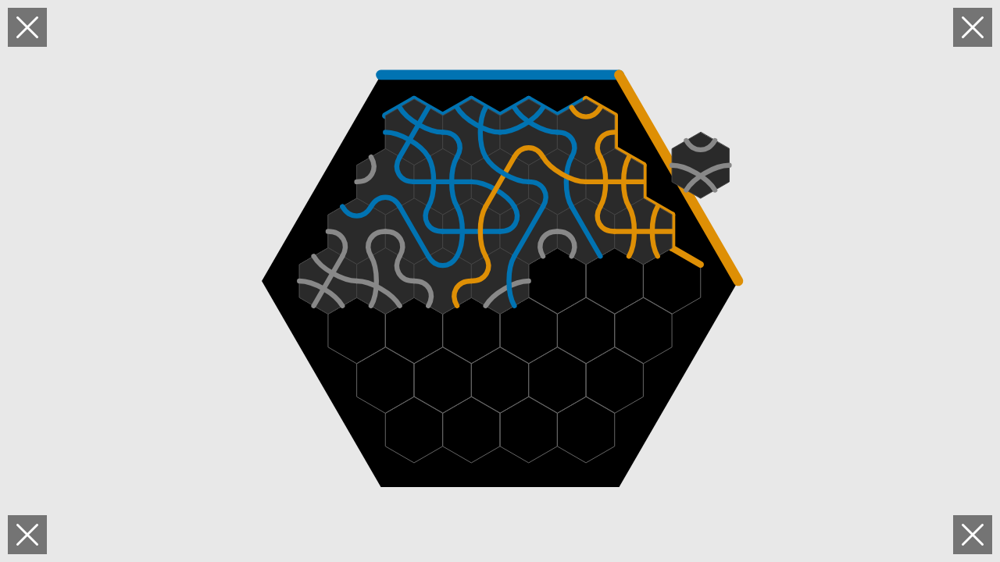

- **Action**: New tile available for Player 2 (Orange)
- **State**: Waiting for player interaction
- **Redux State**: `currentTile` set, `currentRotation = 0`, `selectedPosition = null`
- **What to verify**: Current tile preview at player's edge, previous tiles on board, correct turn

### 0108-move-20-rotation-1.png

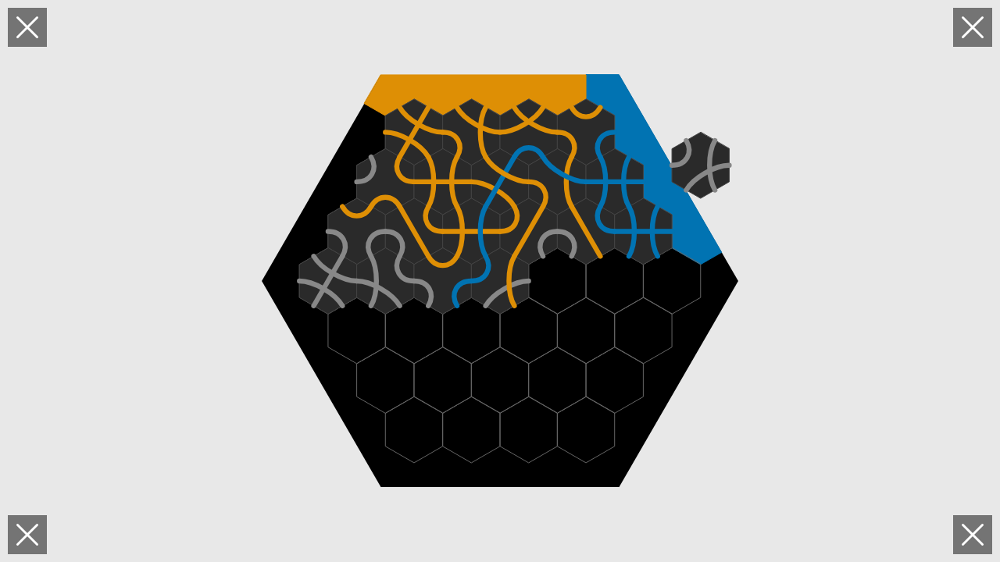

- **Action**: Player 2 clicks tile to rotate (rotation 1)
- **State**: Tile rotated via mouse click
- **Redux State**: `currentRotation = 1`
- **What to verify**: Tile preview shows rotation 1, achieved by clicking tile

### 0109-move-20-rotation-2.png

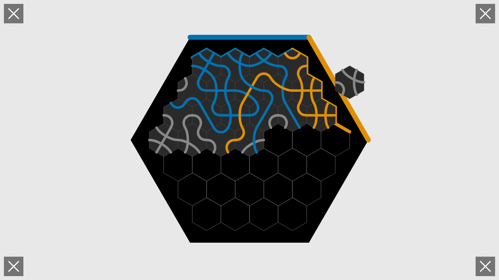

- **Action**: Player 2 clicks tile to rotate (rotation 2)
- **State**: Tile rotated via mouse click
- **Redux State**: `currentRotation = 2`
- **What to verify**: Tile preview shows rotation 2, achieved by clicking tile

### 0110-move-20-tile-placed.png

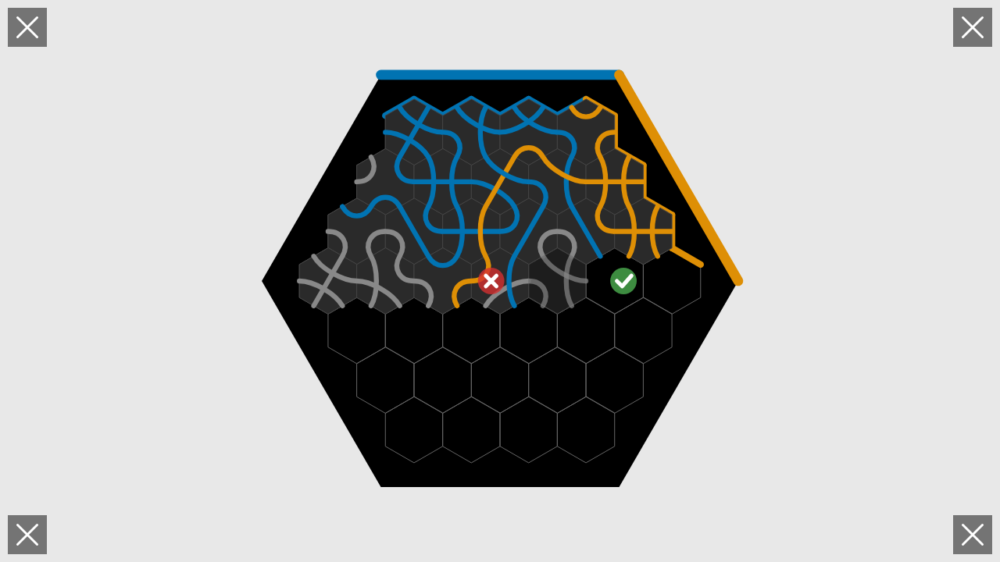

- **Action**: Player 2 clicks hex position to place tile
- **State**: Tile tentatively placed, awaiting confirmation
- **Redux State**: `selectedPosition` set to clicked position
- **What to verify**: Tile at selected position, checkmark (✓) and X buttons visible

### 0111-move-20-complete.png

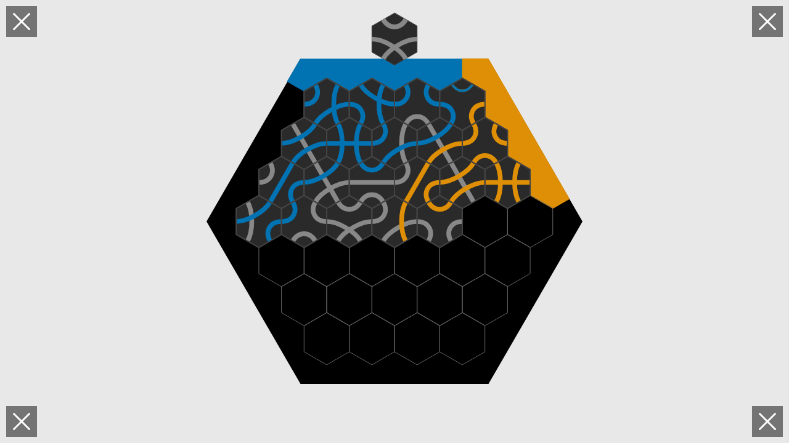

- **Action**: Player 2 clicks checkmark (✓) to confirm
- **State**: Tile committed, turn advances
- **Redux State**: Tile in `board` Map, `selectedPosition = null`, turn advanced
- **What to verify**: Tile permanent on board, confirmation buttons gone, flows updated, next player's turn

### 0112-before-move-21.png

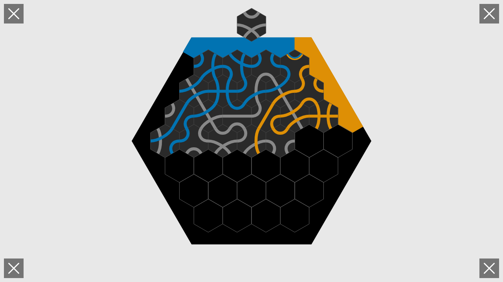

- **Action**: New tile available for Player 1 (Blue)
- **State**: Waiting for player interaction
- **Redux State**: `currentTile` set, `currentRotation = 0`, `selectedPosition = null`
- **What to verify**: Current tile preview at player's edge, previous tiles on board, correct turn

### 0113-move-21-rotation-1.png

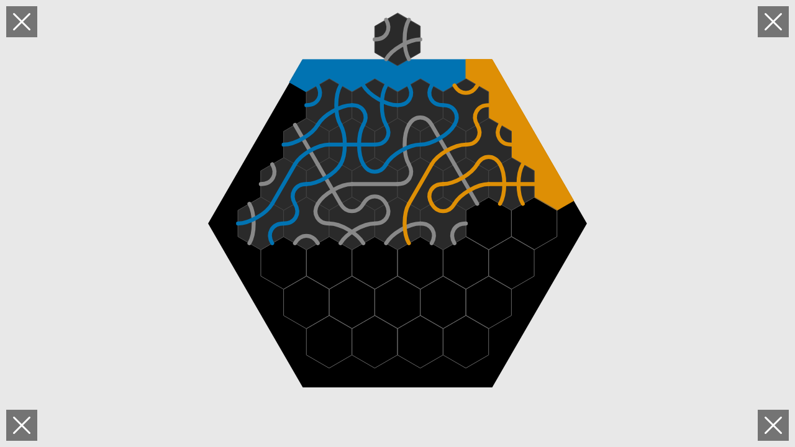

- **Action**: Player 1 clicks tile to rotate (rotation 1)
- **State**: Tile rotated via mouse click
- **Redux State**: `currentRotation = 1`
- **What to verify**: Tile preview shows rotation 1, achieved by clicking tile

### 0114-move-21-rotation-2.png

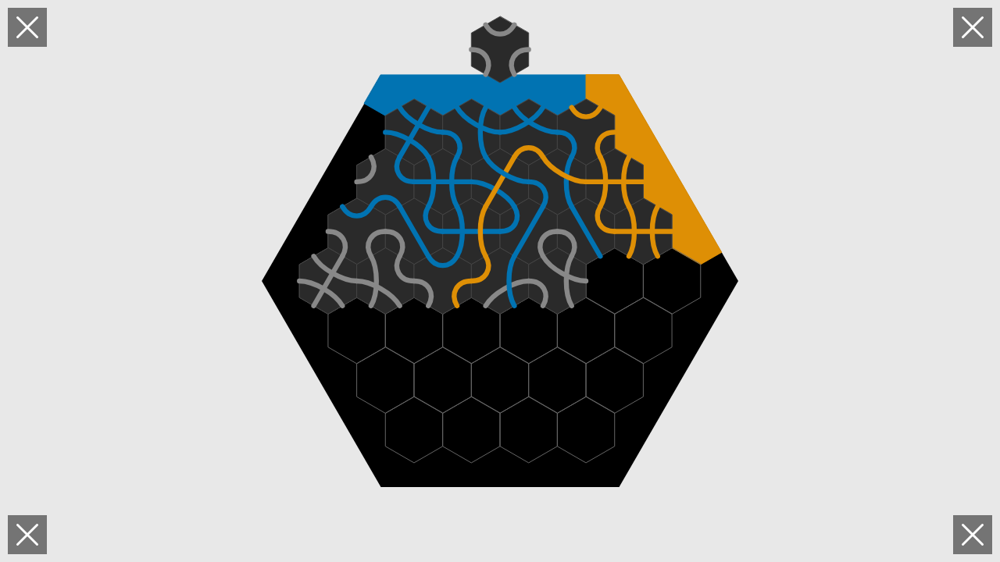

- **Action**: Player 1 clicks tile to rotate (rotation 2)
- **State**: Tile rotated via mouse click
- **Redux State**: `currentRotation = 2`
- **What to verify**: Tile preview shows rotation 2, achieved by clicking tile

### 0115-move-21-rotation-3.png

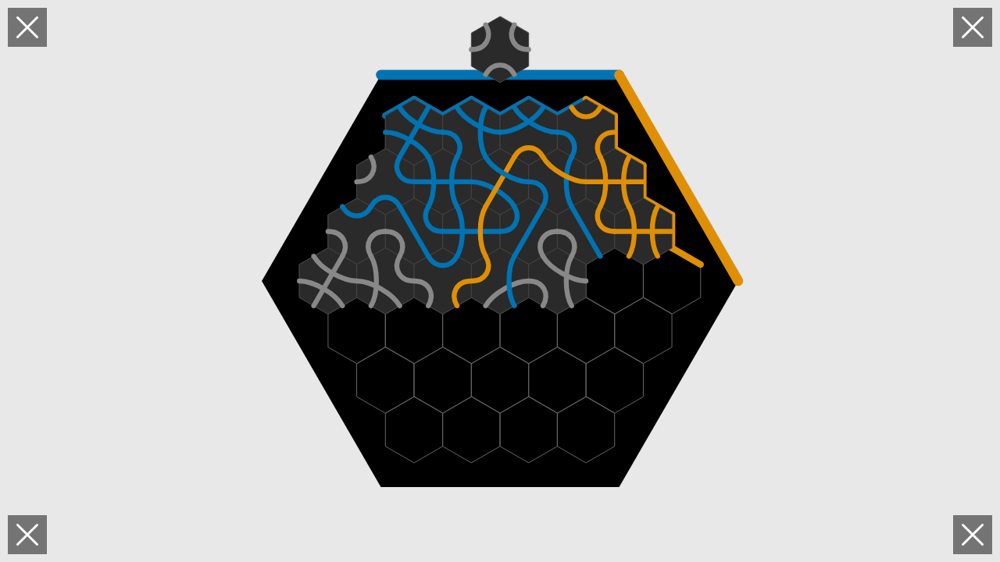

- **Action**: Player 1 clicks tile to rotate (rotation 3)
- **State**: Tile rotated via mouse click
- **Redux State**: `currentRotation = 3`
- **What to verify**: Tile preview shows rotation 3, achieved by clicking tile

### 0116-move-21-tile-placed.png

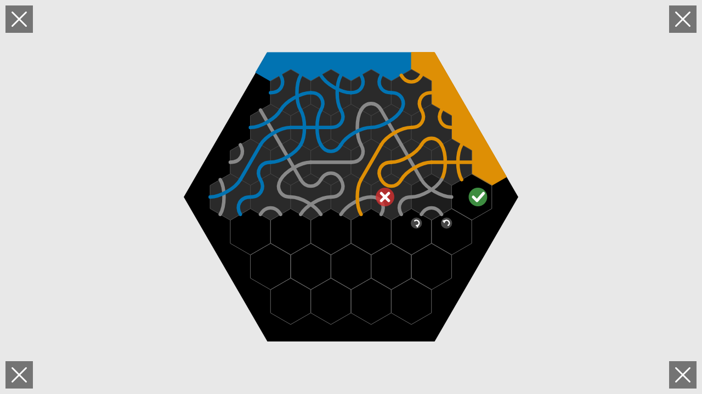

- **Action**: Player 1 clicks hex position to place tile
- **State**: Tile tentatively placed, awaiting confirmation
- **Redux State**: `selectedPosition` set to clicked position
- **What to verify**: Tile at selected position, checkmark (✓) and X buttons visible

### 0117-move-21-complete.png

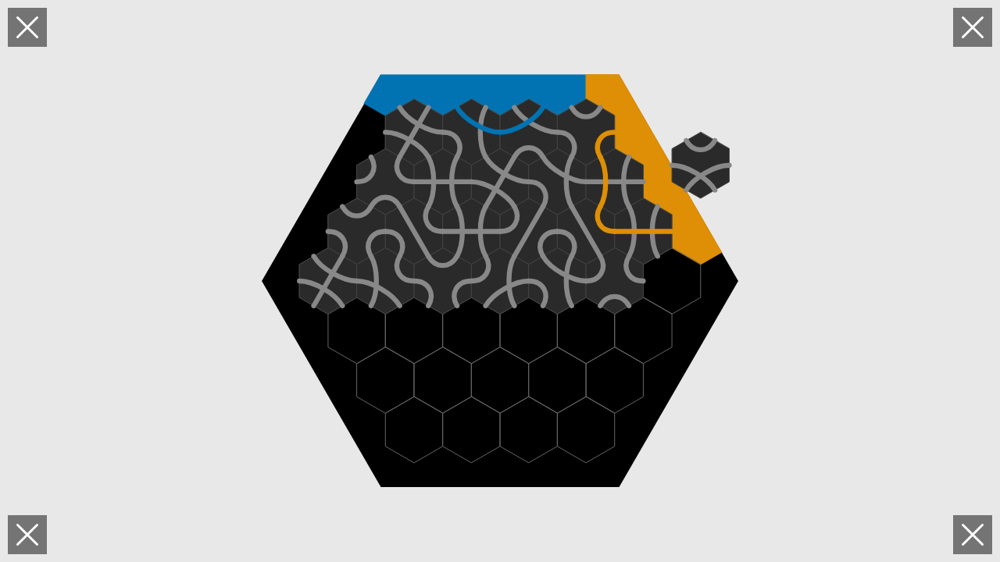

- **Action**: Player 1 clicks checkmark (✓) to confirm
- **State**: Tile committed, turn advances
- **Redux State**: Tile in `board` Map, `selectedPosition = null`, turn advanced
- **What to verify**: Tile permanent on board, confirmation buttons gone, flows updated, next player's turn

### 0118-before-move-22.png

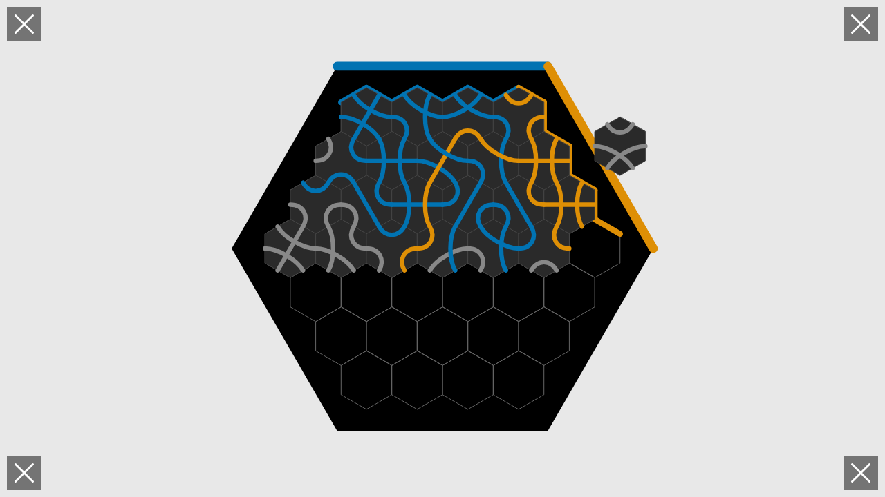

- **Action**: New tile available for Player 2 (Orange)
- **State**: Waiting for player interaction
- **Redux State**: `currentTile` set, `currentRotation = 0`, `selectedPosition = null`
- **What to verify**: Current tile preview at player's edge, previous tiles on board, correct turn

### 0119-move-22-rotation-1.png

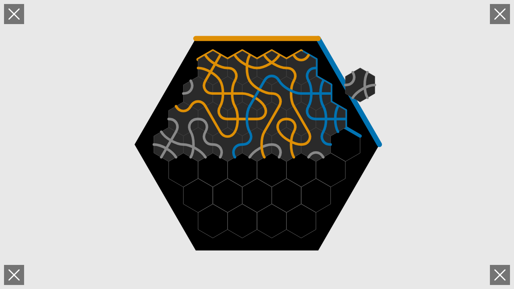

- **Action**: Player 2 clicks tile to rotate (rotation 1)
- **State**: Tile rotated via mouse click
- **Redux State**: `currentRotation = 1`
- **What to verify**: Tile preview shows rotation 1, achieved by clicking tile

### 0120-move-22-rotation-2.png

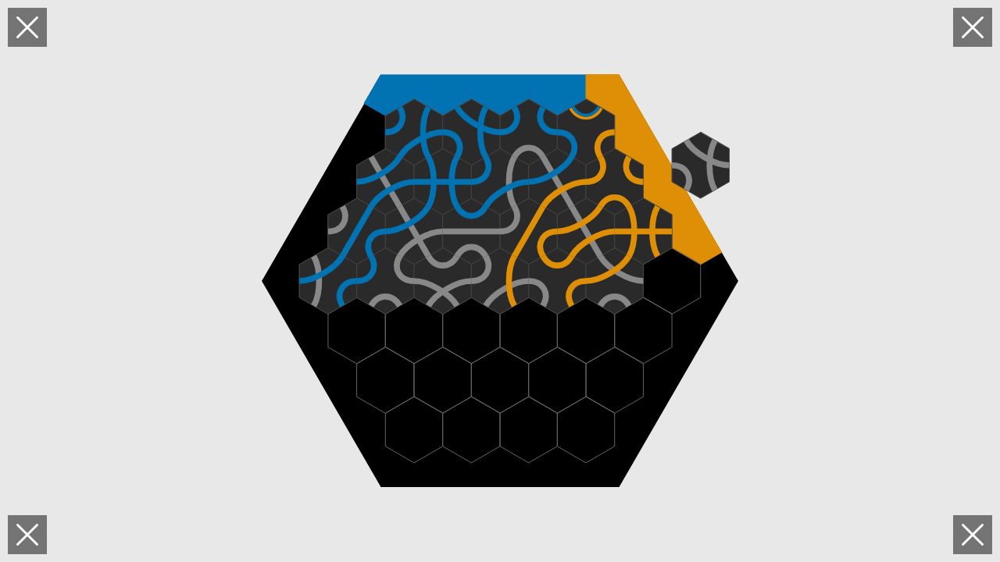

- **Action**: Player 2 clicks tile to rotate (rotation 2)
- **State**: Tile rotated via mouse click
- **Redux State**: `currentRotation = 2`
- **What to verify**: Tile preview shows rotation 2, achieved by clicking tile

### 0121-move-22-rotation-3.png

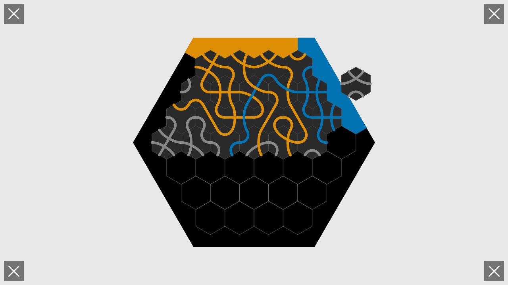

- **Action**: Player 2 clicks tile to rotate (rotation 3)
- **State**: Tile rotated via mouse click
- **Redux State**: `currentRotation = 3`
- **What to verify**: Tile preview shows rotation 3, achieved by clicking tile

### 0122-move-22-rotation-4.png

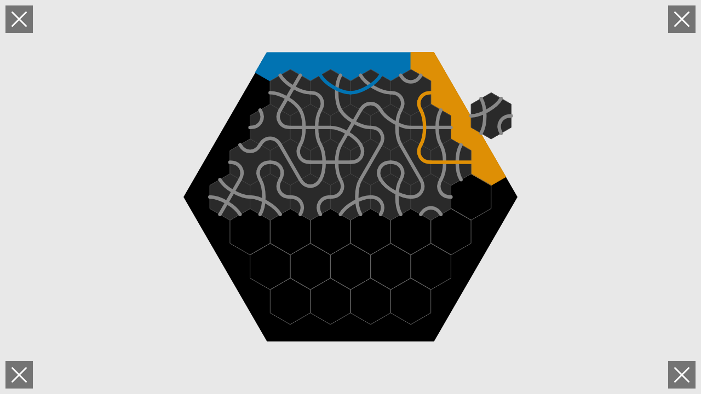

- **Action**: Player 2 clicks tile to rotate (rotation 4)
- **State**: Tile rotated via mouse click
- **Redux State**: `currentRotation = 4`
- **What to verify**: Tile preview shows rotation 4, achieved by clicking tile

### 0123-move-22-tile-placed.png

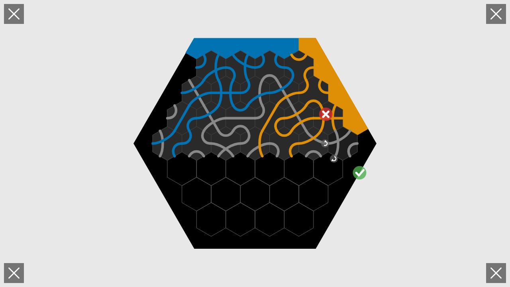

- **Action**: Player 2 clicks hex position to place tile
- **State**: Tile tentatively placed, awaiting confirmation
- **Redux State**: `selectedPosition` set to clicked position
- **What to verify**: Tile at selected position, checkmark (✓) and X buttons visible

### 0124-move-22-complete.png

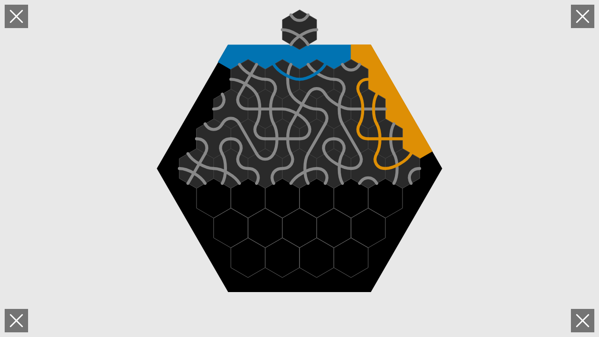

- **Action**: Player 2 clicks checkmark (✓) to confirm
- **State**: Tile committed, turn advances
- **Redux State**: Tile in `board` Map, `selectedPosition = null`, turn advanced
- **What to verify**: Tile permanent on board, confirmation buttons gone, flows updated, next player's turn

### 0125-before-move-23.png

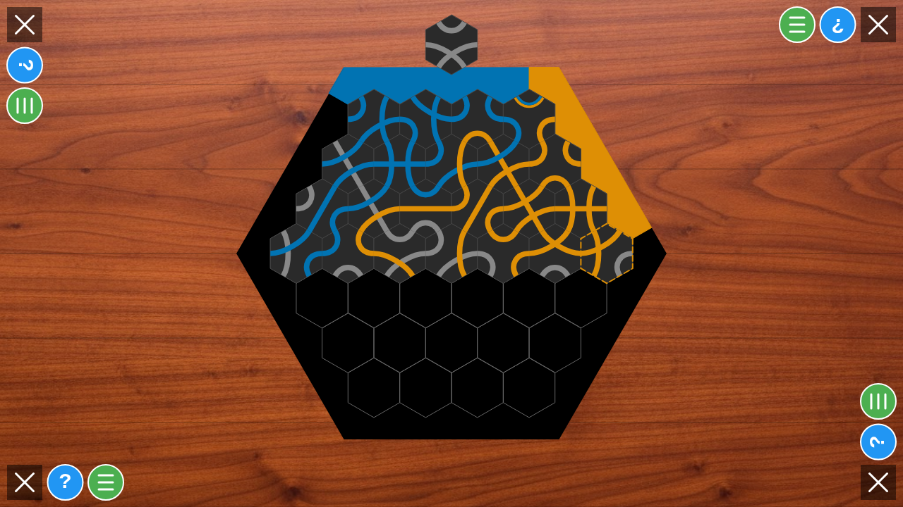

- **Action**: New tile available for Player 1 (Blue)
- **State**: Waiting for player interaction
- **Redux State**: `currentTile` set, `currentRotation = 0`, `selectedPosition = null`
- **What to verify**: Current tile preview at player's edge, previous tiles on board, correct turn

### 0126-move-23-rotation-1.png

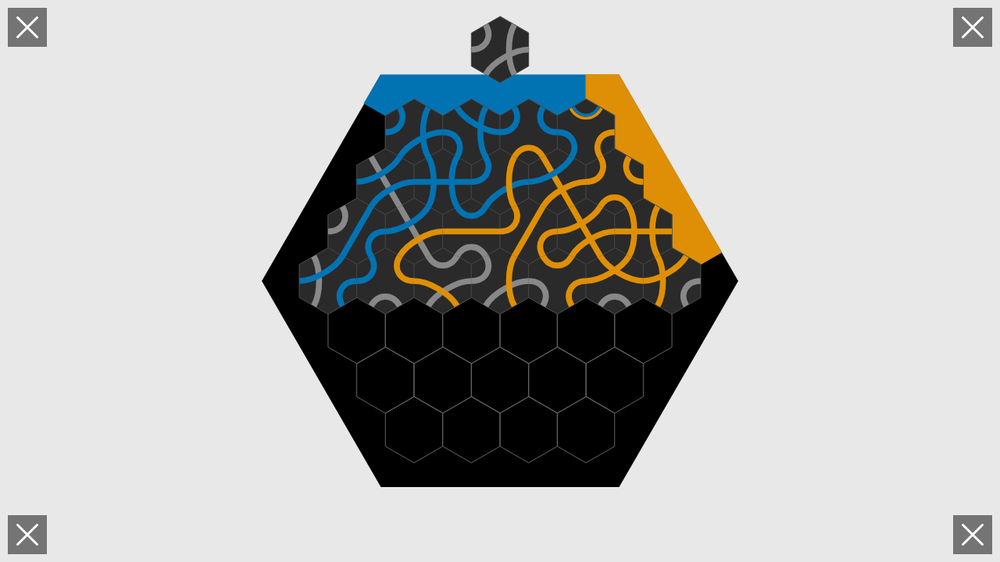

- **Action**: Player 1 clicks tile to rotate (rotation 1)
- **State**: Tile rotated via mouse click
- **Redux State**: `currentRotation = 1`
- **What to verify**: Tile preview shows rotation 1, achieved by clicking tile

### 0127-move-23-rotation-2.png

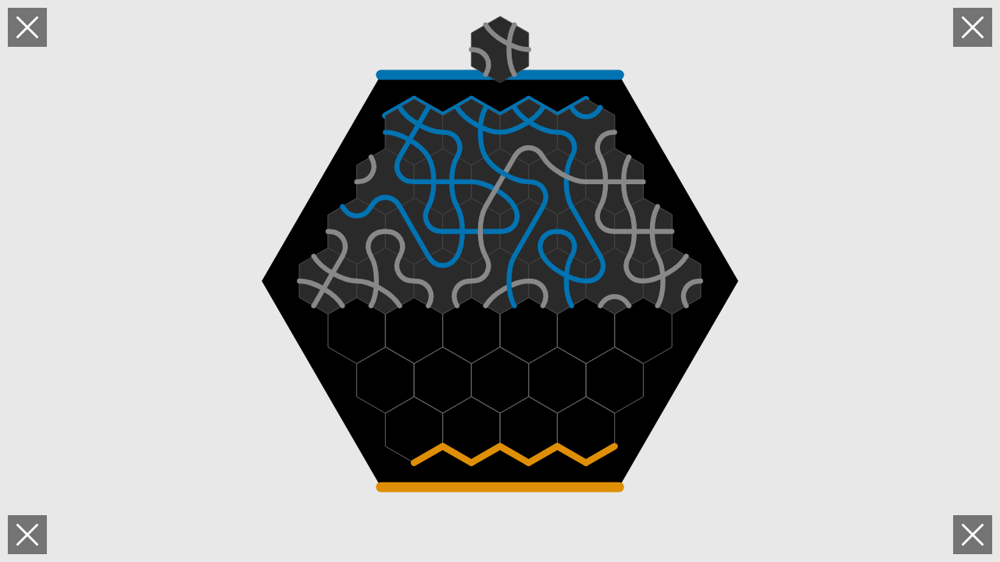

- **Action**: Player 1 clicks tile to rotate (rotation 2)
- **State**: Tile rotated via mouse click
- **Redux State**: `currentRotation = 2`
- **What to verify**: Tile preview shows rotation 2, achieved by clicking tile

### 0128-move-23-rotation-3.png

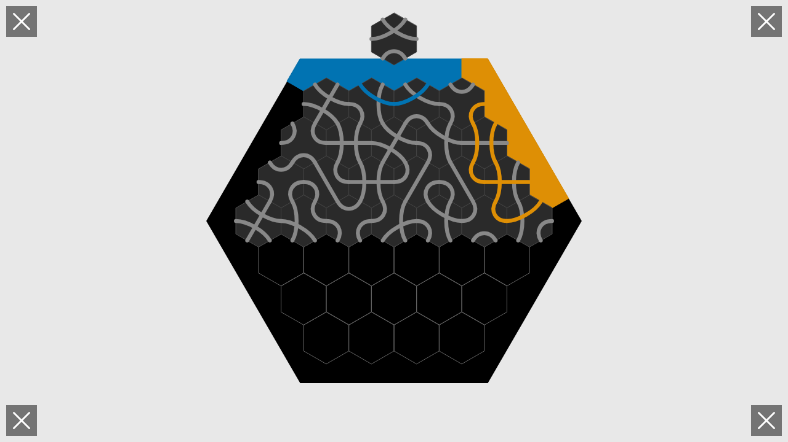

- **Action**: Player 1 clicks tile to rotate (rotation 3)
- **State**: Tile rotated via mouse click
- **Redux State**: `currentRotation = 3`
- **What to verify**: Tile preview shows rotation 3, achieved by clicking tile

### 0129-move-23-rotation-4.png

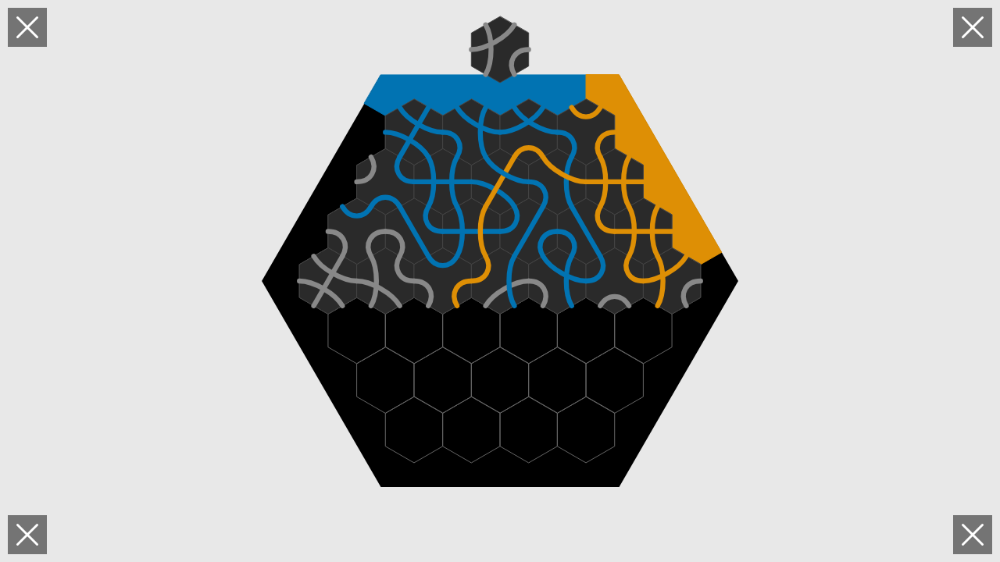

- **Action**: Player 1 clicks tile to rotate (rotation 4)
- **State**: Tile rotated via mouse click
- **Redux State**: `currentRotation = 4`
- **What to verify**: Tile preview shows rotation 4, achieved by clicking tile

### 0130-move-23-rotation-5.png

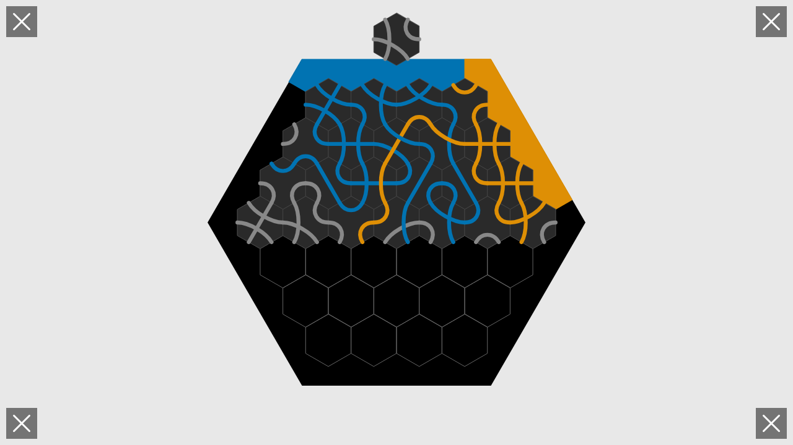

- **Action**: Player 1 clicks tile to rotate (rotation 5)
- **State**: Tile rotated via mouse click
- **Redux State**: `currentRotation = 5`
- **What to verify**: Tile preview shows rotation 5, achieved by clicking tile

### 0131-move-23-tile-placed.png

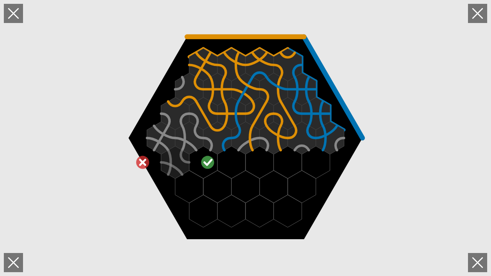

- **Action**: Player 1 clicks hex position to place tile
- **State**: Tile tentatively placed, awaiting confirmation
- **Redux State**: `selectedPosition` set to clicked position
- **What to verify**: Tile at selected position, checkmark (✓) and X buttons visible

### 0132-move-23-complete.png

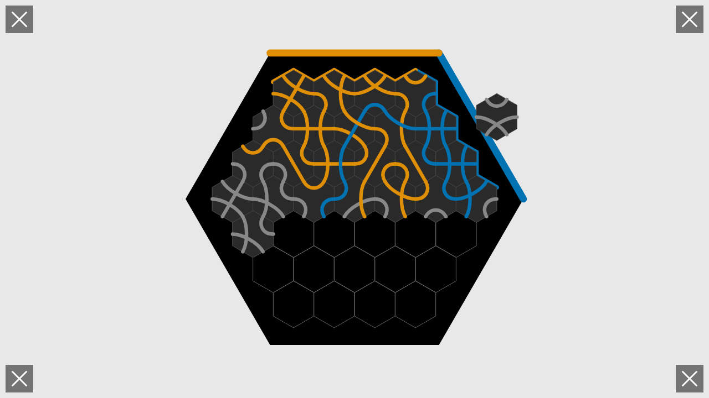

- **Action**: Player 1 clicks checkmark (✓) to confirm
- **State**: Tile committed, turn advances
- **Redux State**: Tile in `board` Map, `selectedPosition = null`, turn advanced
- **What to verify**: Tile permanent on board, confirmation buttons gone, flows updated, next player's turn

### 0133-before-move-24.png

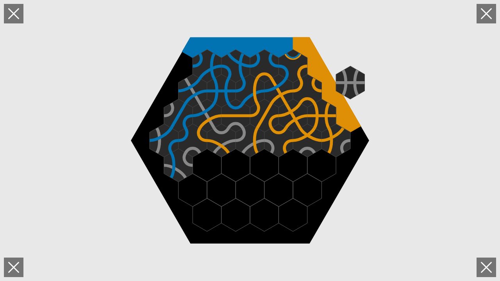

- **Action**: New tile available for Player 2 (Orange)
- **State**: Waiting for player interaction
- **Redux State**: `currentTile` set, `currentRotation = 0`, `selectedPosition = null`
- **What to verify**: Current tile preview at player's edge, previous tiles on board, correct turn

### 0134-move-24-tile-placed.png

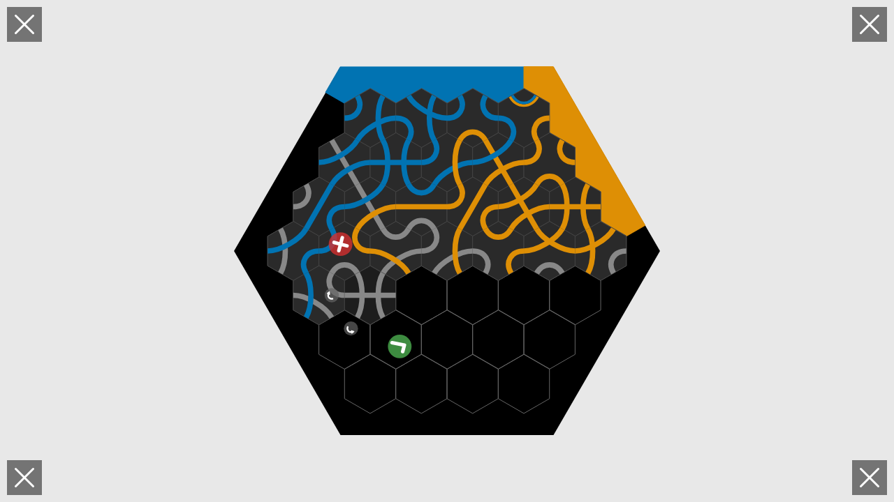

- **Action**: Player 2 clicks hex position to place tile
- **State**: Tile tentatively placed, awaiting confirmation
- **Redux State**: `selectedPosition` set to clicked position
- **What to verify**: Tile at selected position, checkmark (✓) and X buttons visible

### 0135-move-24-complete.png

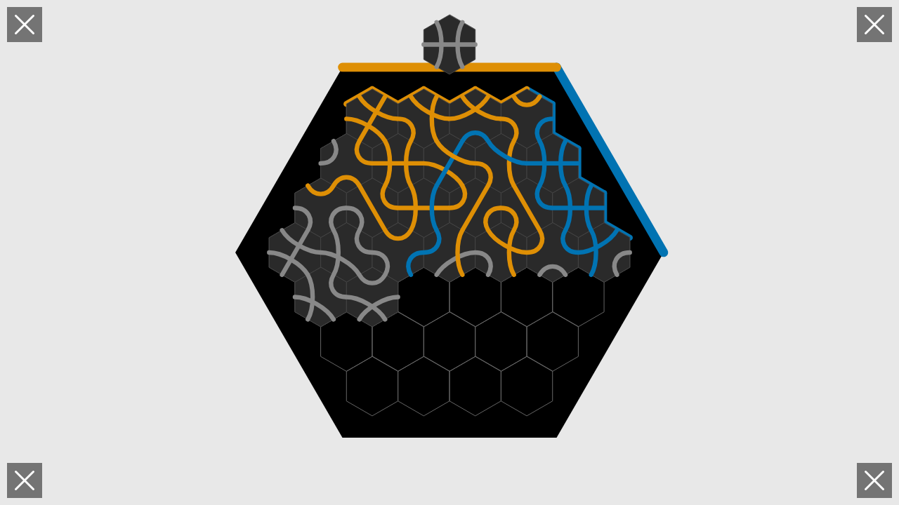

- **Action**: Player 2 clicks checkmark (✓) to confirm
- **State**: Tile committed, turn advances
- **Redux State**: Tile in `board` Map, `selectedPosition = null`, turn advanced
- **What to verify**: Tile permanent on board, confirmation buttons gone, flows updated, next player's turn

### 0136-before-move-25.png

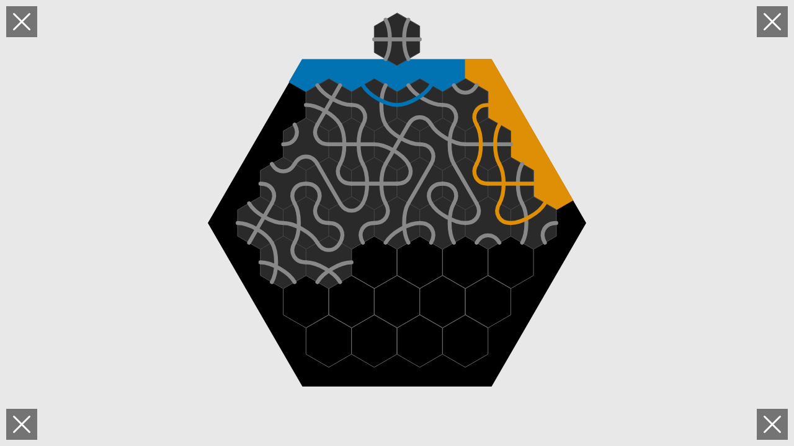

- **Action**: New tile available for Player 1 (Blue)
- **State**: Waiting for player interaction
- **Redux State**: `currentTile` set, `currentRotation = 0`, `selectedPosition = null`
- **What to verify**: Current tile preview at player's edge, previous tiles on board, correct turn

### 0137-move-25-rotation-1.png

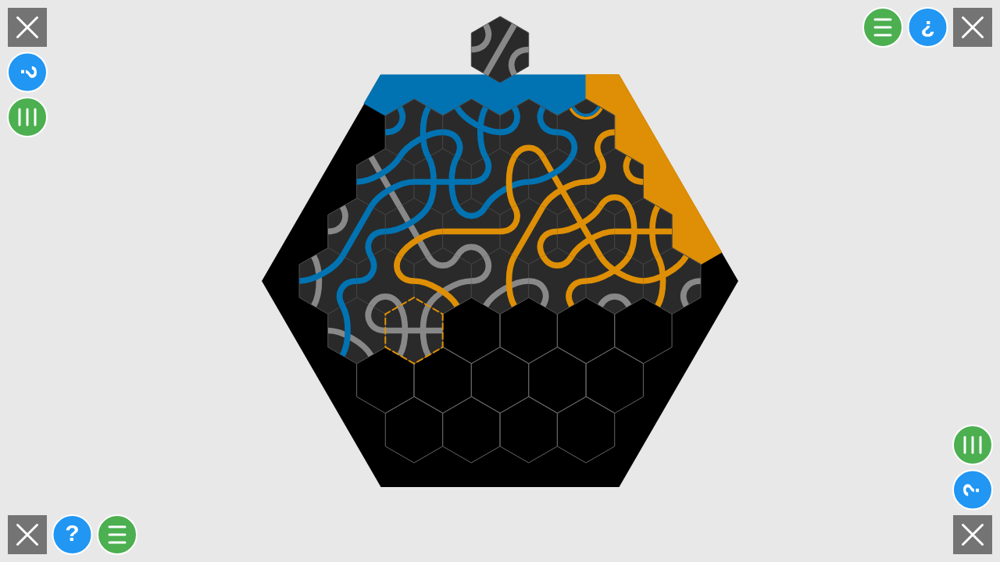

- **Action**: Player 1 clicks tile to rotate (rotation 1)
- **State**: Tile rotated via mouse click
- **Redux State**: `currentRotation = 1`
- **What to verify**: Tile preview shows rotation 1, achieved by clicking tile

### 0138-move-25-tile-placed.png

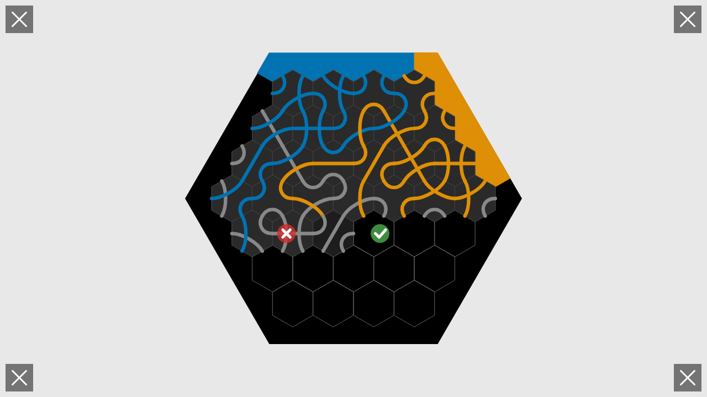

- **Action**: Player 1 clicks hex position to place tile
- **State**: Tile tentatively placed, awaiting confirmation
- **Redux State**: `selectedPosition` set to clicked position
- **What to verify**: Tile at selected position, checkmark (✓) and X buttons visible

### 0139-move-25-complete.png

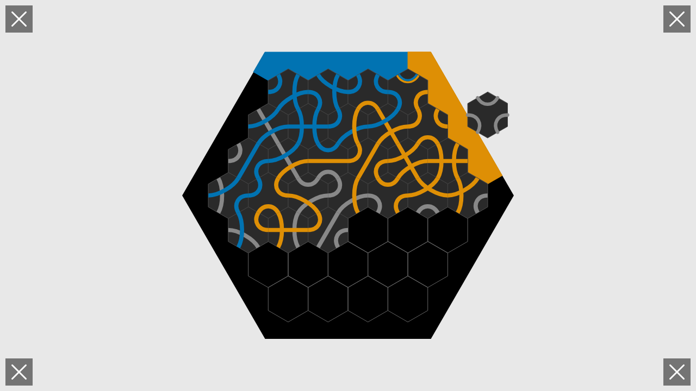

- **Action**: Player 1 clicks checkmark (✓) to confirm
- **State**: Tile committed, turn advances
- **Redux State**: Tile in `board` Map, `selectedPosition = null`, turn advanced
- **What to verify**: Tile permanent on board, confirmation buttons gone, flows updated, next player's turn

### 0140-before-move-26.png

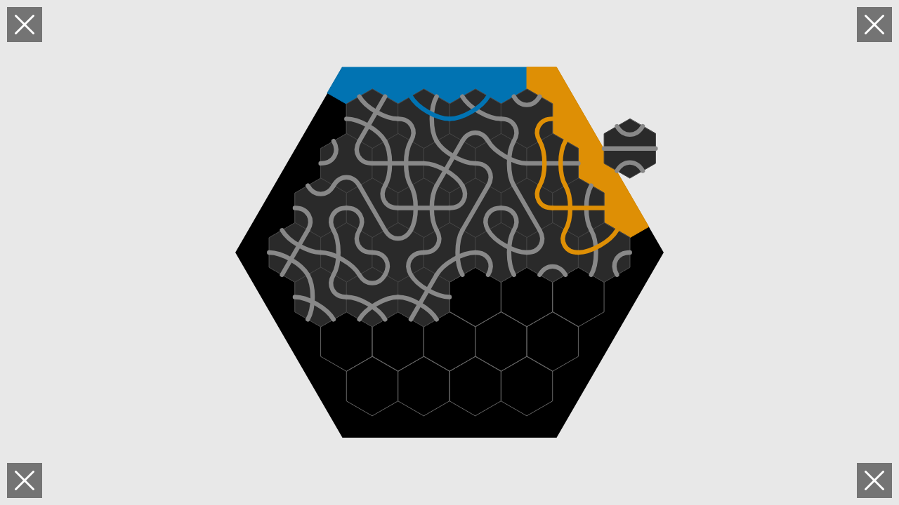

- **Action**: New tile available for Player 2 (Orange)
- **State**: Waiting for player interaction
- **Redux State**: `currentTile` set, `currentRotation = 0`, `selectedPosition = null`
- **What to verify**: Current tile preview at player's edge, previous tiles on board, correct turn

### 0141-move-26-rotation-1.png

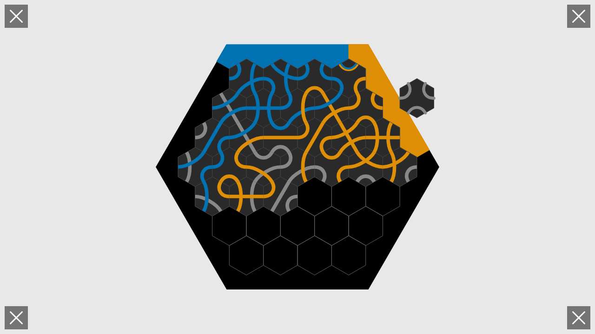

- **Action**: Player 2 clicks tile to rotate (rotation 1)
- **State**: Tile rotated via mouse click
- **Redux State**: `currentRotation = 1`
- **What to verify**: Tile preview shows rotation 1, achieved by clicking tile

### 0142-move-26-rotation-2.png

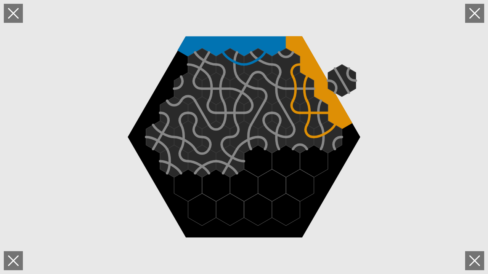

- **Action**: Player 2 clicks tile to rotate (rotation 2)
- **State**: Tile rotated via mouse click
- **Redux State**: `currentRotation = 2`
- **What to verify**: Tile preview shows rotation 2, achieved by clicking tile

### 0143-move-26-tile-placed.png

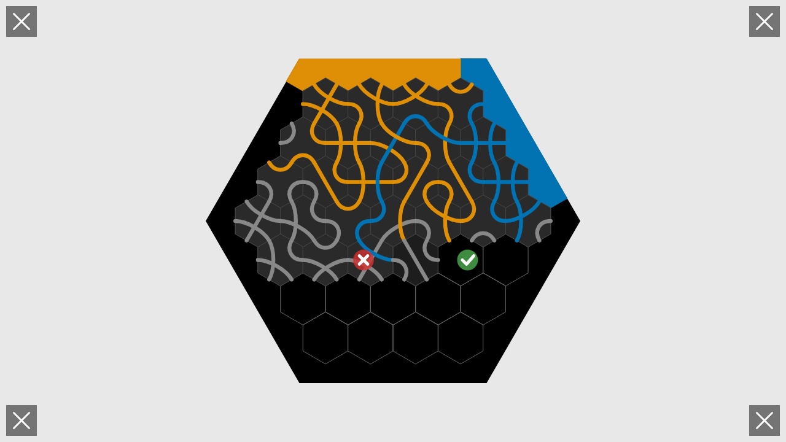

- **Action**: Player 2 clicks hex position to place tile
- **State**: Tile tentatively placed, awaiting confirmation
- **Redux State**: `selectedPosition` set to clicked position
- **What to verify**: Tile at selected position, checkmark (✓) and X buttons visible

### 0144-move-26-complete.png

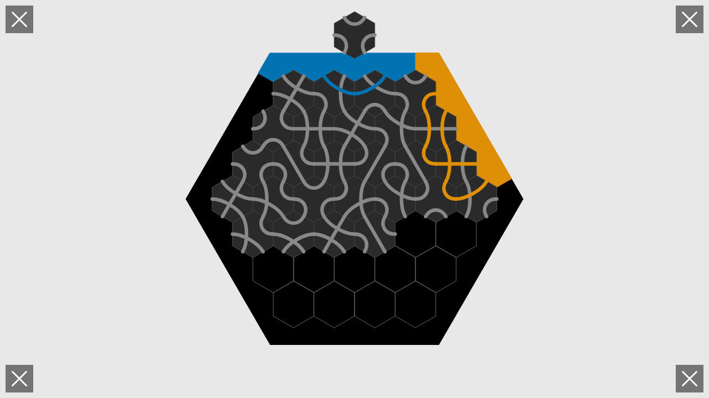

- **Action**: Player 2 clicks checkmark (✓) to confirm
- **State**: Tile committed, turn advances
- **Redux State**: Tile in `board` Map, `selectedPosition = null`, turn advanced
- **What to verify**: Tile permanent on board, confirmation buttons gone, flows updated, next player's turn

### 0145-before-move-27.png

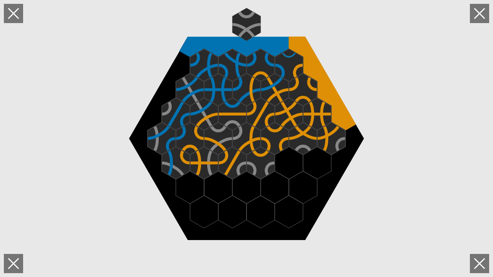

- **Action**: New tile available for Player 1 (Blue)
- **State**: Waiting for player interaction
- **Redux State**: `currentTile` set, `currentRotation = 0`, `selectedPosition = null`
- **What to verify**: Current tile preview at player's edge, previous tiles on board, correct turn

### 0146-move-27-rotation-1.png

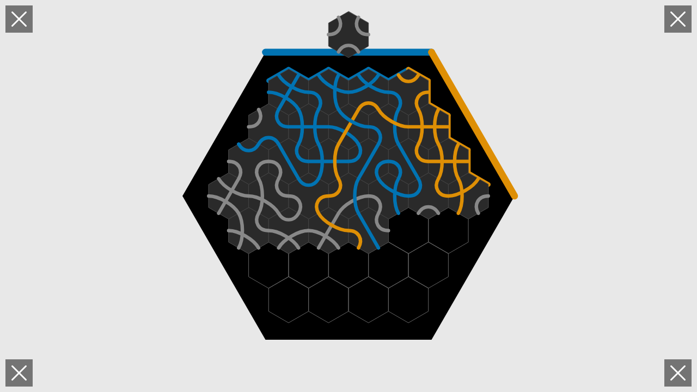

- **Action**: Player 1 clicks tile to rotate (rotation 1)
- **State**: Tile rotated via mouse click
- **Redux State**: `currentRotation = 1`
- **What to verify**: Tile preview shows rotation 1, achieved by clicking tile

### 0147-move-27-rotation-2.png

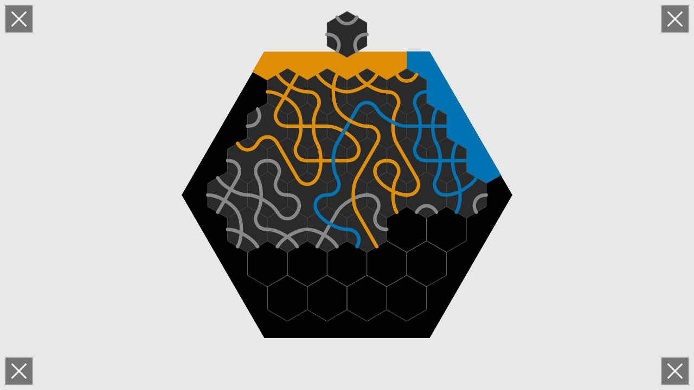

- **Action**: Player 1 clicks tile to rotate (rotation 2)
- **State**: Tile rotated via mouse click
- **Redux State**: `currentRotation = 2`
- **What to verify**: Tile preview shows rotation 2, achieved by clicking tile

### 0148-move-27-rotation-3.png

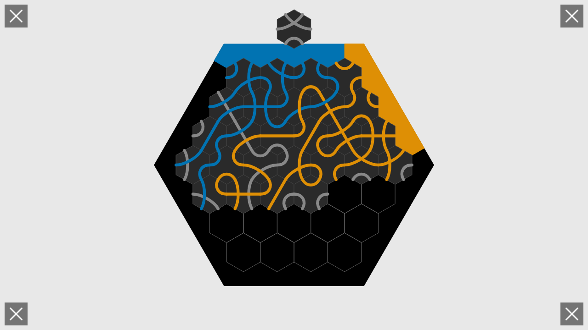

- **Action**: Player 1 clicks tile to rotate (rotation 3)
- **State**: Tile rotated via mouse click
- **Redux State**: `currentRotation = 3`
- **What to verify**: Tile preview shows rotation 3, achieved by clicking tile

### 0149-move-27-tile-placed.png

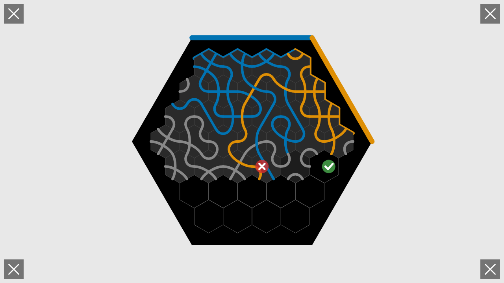

- **Action**: Player 1 clicks hex position to place tile
- **State**: Tile tentatively placed, awaiting confirmation
- **Redux State**: `selectedPosition` set to clicked position
- **What to verify**: Tile at selected position, checkmark (✓) and X buttons visible

### 0150-move-27-complete.png

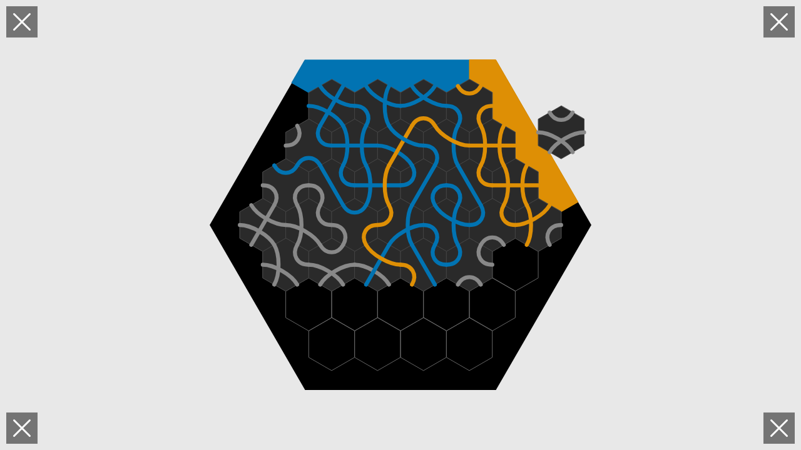

- **Action**: Player 1 clicks checkmark (✓) to confirm
- **State**: Tile committed, turn advances
- **Redux State**: Tile in `board` Map, `selectedPosition = null`, turn advanced
- **What to verify**: Tile permanent on board, confirmation buttons gone, flows updated, next player's turn

### 0151-before-move-28.png

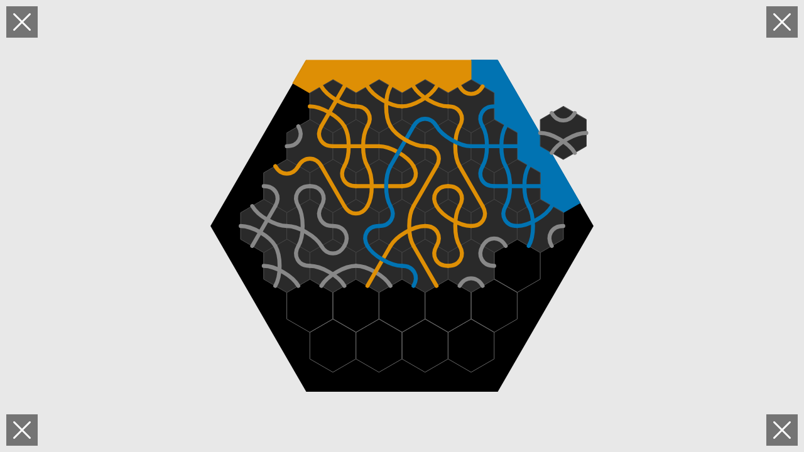

- **Action**: New tile available for Player 2 (Orange)
- **State**: Waiting for player interaction
- **Redux State**: `currentTile` set, `currentRotation = 0`, `selectedPosition = null`
- **What to verify**: Current tile preview at player's edge, previous tiles on board, correct turn

### 0152-move-28-rotation-1.png

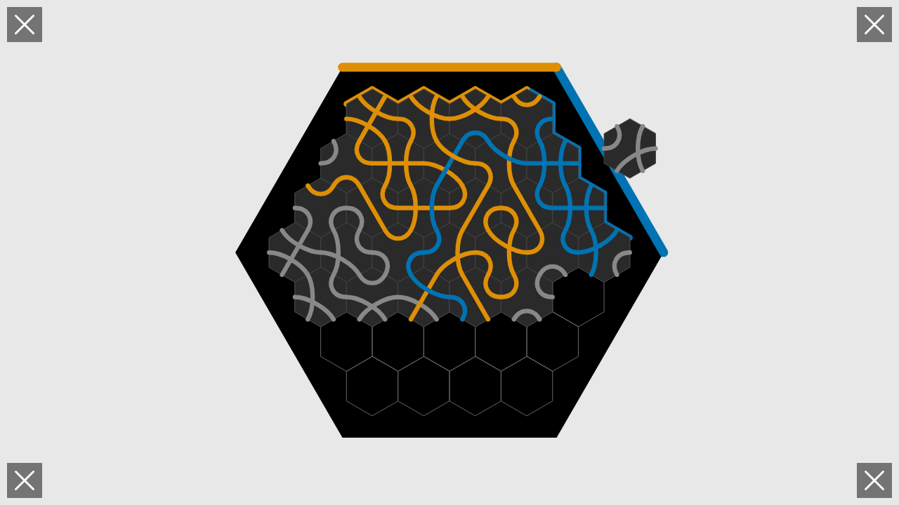

- **Action**: Player 2 clicks tile to rotate (rotation 1)
- **State**: Tile rotated via mouse click
- **Redux State**: `currentRotation = 1`
- **What to verify**: Tile preview shows rotation 1, achieved by clicking tile

### 0153-move-28-rotation-2.png

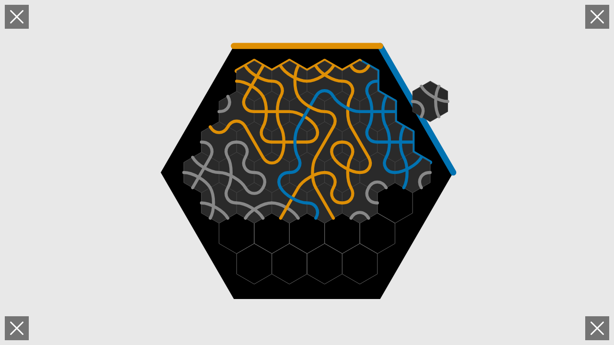

- **Action**: Player 2 clicks tile to rotate (rotation 2)
- **State**: Tile rotated via mouse click
- **Redux State**: `currentRotation = 2`
- **What to verify**: Tile preview shows rotation 2, achieved by clicking tile

### 0154-move-28-rotation-3.png

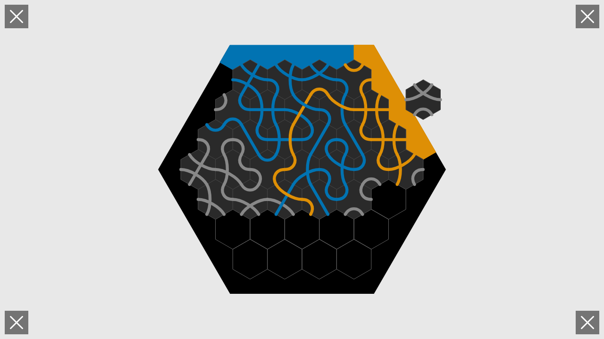

- **Action**: Player 2 clicks tile to rotate (rotation 3)
- **State**: Tile rotated via mouse click
- **Redux State**: `currentRotation = 3`
- **What to verify**: Tile preview shows rotation 3, achieved by clicking tile

### 0155-move-28-rotation-4.png

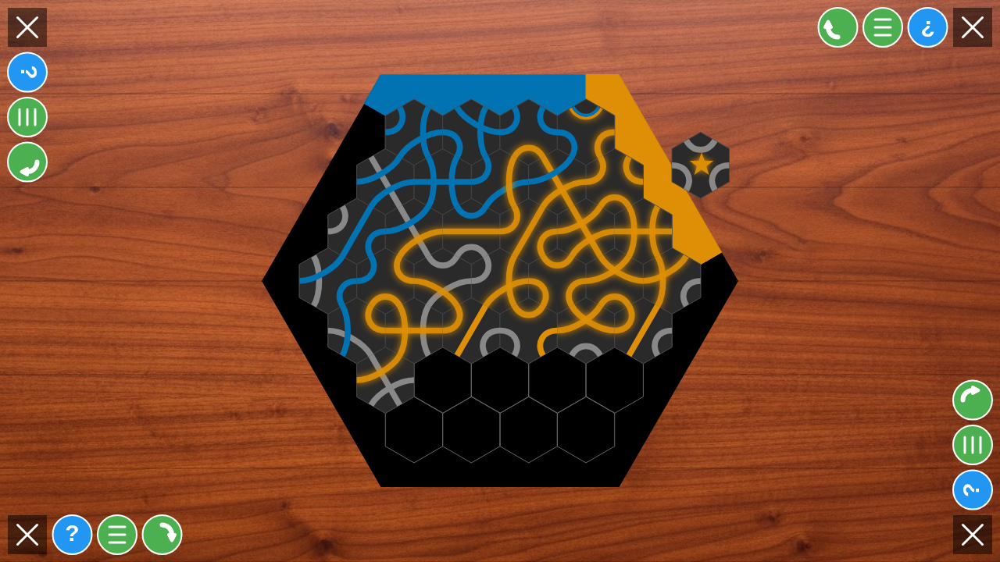

- **Action**: Player 2 clicks tile to rotate (rotation 4)
- **State**: Tile rotated via mouse click
- **Redux State**: `currentRotation = 4`
- **What to verify**: Tile preview shows rotation 4, achieved by clicking tile

### 0156-move-28-tile-placed.png

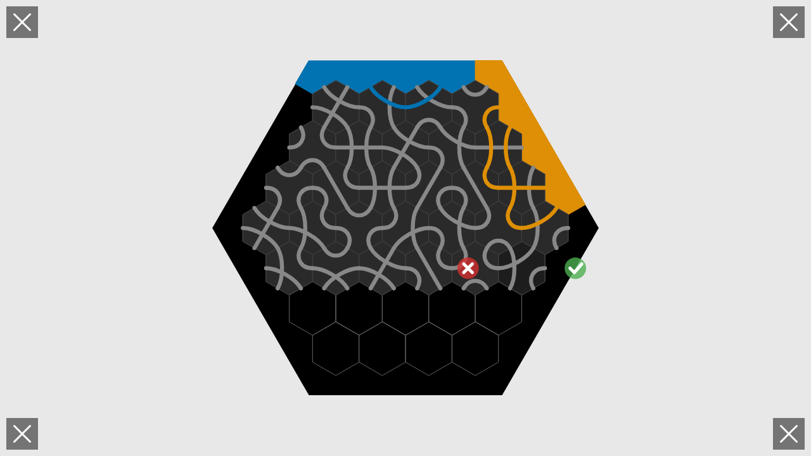

- **Action**: Player 2 clicks hex position to place tile
- **State**: Tile tentatively placed, awaiting confirmation
- **Redux State**: `selectedPosition` set to clicked position
- **What to verify**: Tile at selected position, checkmark (✓) and X buttons visible

### 0157-move-28-complete.png

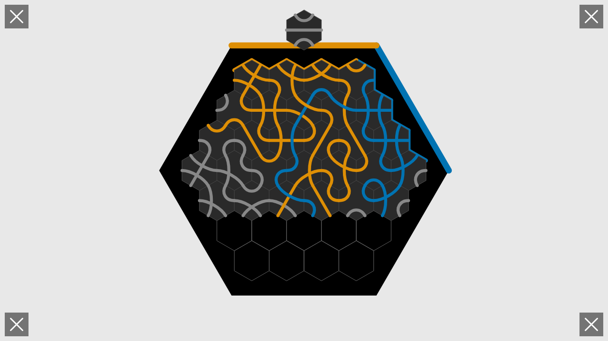

- **Action**: Player 2 clicks checkmark (✓) to confirm
- **State**: Tile committed, turn advances
- **Redux State**: Tile in `board` Map, `selectedPosition = null`, turn advanced
- **What to verify**: Tile permanent on board, confirmation buttons gone, flows updated, next player's turn

### 0158-before-move-29.png

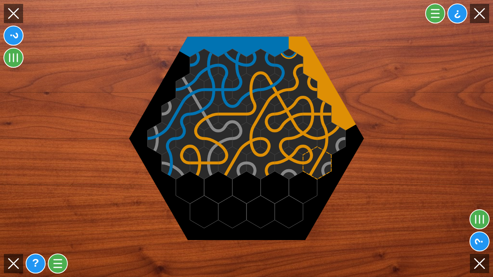

- **Action**: New tile available for Player 1 (Blue)
- **State**: Waiting for player interaction
- **Redux State**: `currentTile` set, `currentRotation = 0`, `selectedPosition = null`
- **What to verify**: Current tile preview at player's edge, previous tiles on board, correct turn

### 0159-move-29-rotation-1.png

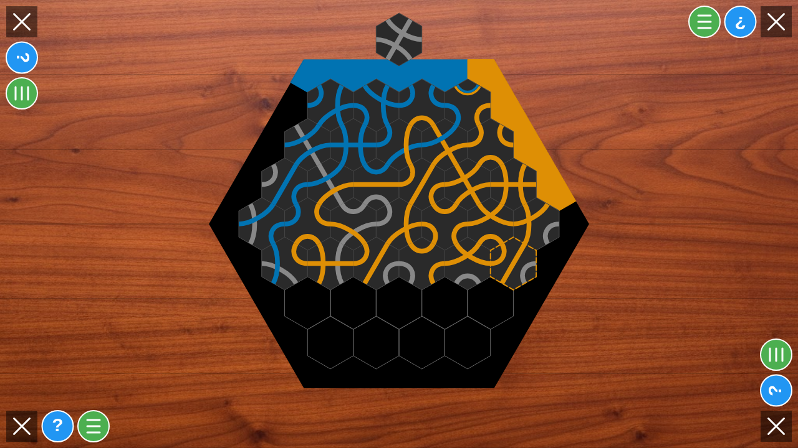

- **Action**: Player 1 clicks tile to rotate (rotation 1)
- **State**: Tile rotated via mouse click
- **Redux State**: `currentRotation = 1`
- **What to verify**: Tile preview shows rotation 1, achieved by clicking tile

### 0160-move-29-rotation-2.png

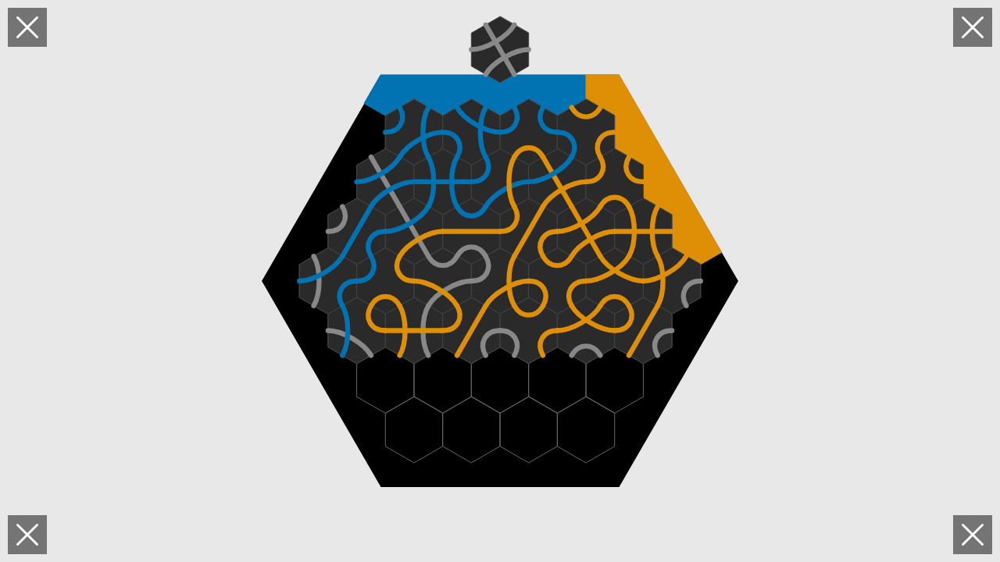

- **Action**: Player 1 clicks tile to rotate (rotation 2)
- **State**: Tile rotated via mouse click
- **Redux State**: `currentRotation = 2`
- **What to verify**: Tile preview shows rotation 2, achieved by clicking tile

### 0161-move-29-rotation-3.png

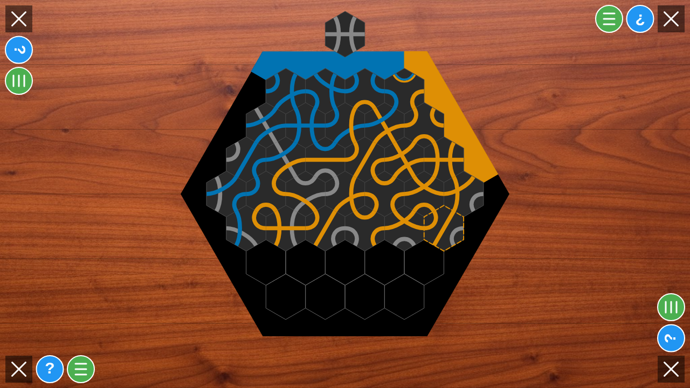

- **Action**: Player 1 clicks tile to rotate (rotation 3)
- **State**: Tile rotated via mouse click
- **Redux State**: `currentRotation = 3`
- **What to verify**: Tile preview shows rotation 3, achieved by clicking tile

### 0162-move-29-rotation-4.png

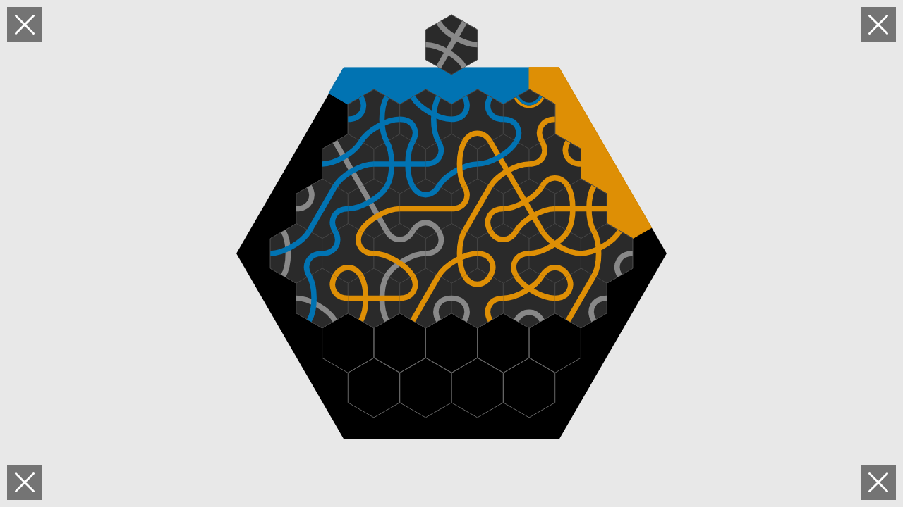

- **Action**: Player 1 clicks tile to rotate (rotation 4)
- **State**: Tile rotated via mouse click
- **Redux State**: `currentRotation = 4`
- **What to verify**: Tile preview shows rotation 4, achieved by clicking tile

### 0163-move-29-rotation-5.png

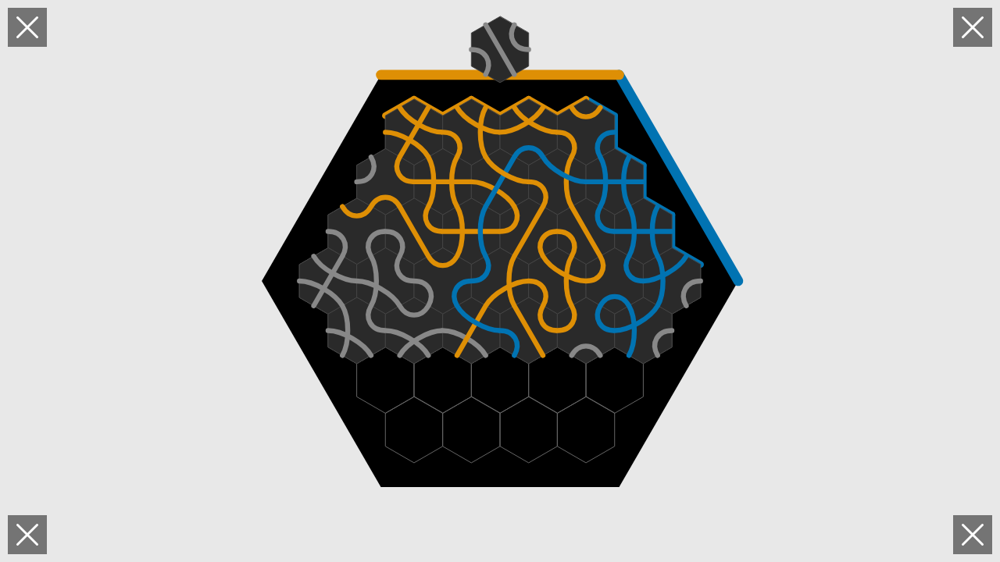

- **Action**: Player 1 clicks tile to rotate (rotation 5)
- **State**: Tile rotated via mouse click
- **Redux State**: `currentRotation = 5`
- **What to verify**: Tile preview shows rotation 5, achieved by clicking tile

### 0164-move-29-tile-placed.png

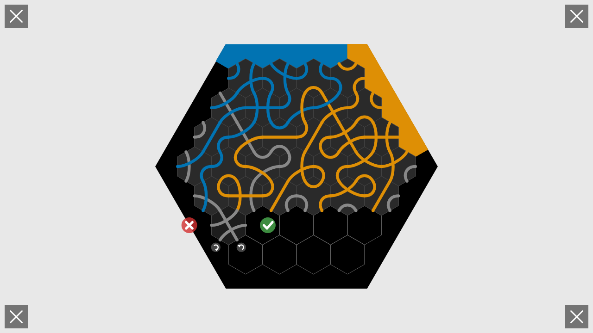

- **Action**: Player 1 clicks hex position to place tile
- **State**: Tile tentatively placed, awaiting confirmation
- **Redux State**: `selectedPosition` set to clicked position
- **What to verify**: Tile at selected position, checkmark (✓) and X buttons visible

### 0165-move-29-complete.png

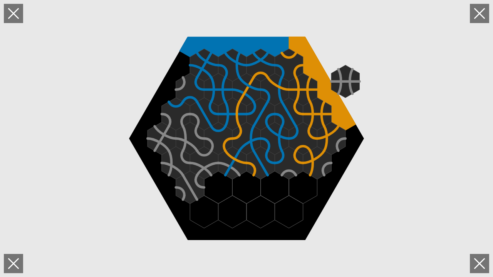

- **Action**: Player 1 clicks checkmark (✓) to confirm
- **State**: Tile committed, turn advances
- **Redux State**: Tile in `board` Map, `selectedPosition = null`, turn advanced
- **What to verify**: Tile permanent on board, confirmation buttons gone, flows updated, next player's turn

### 0166-before-move-30.png

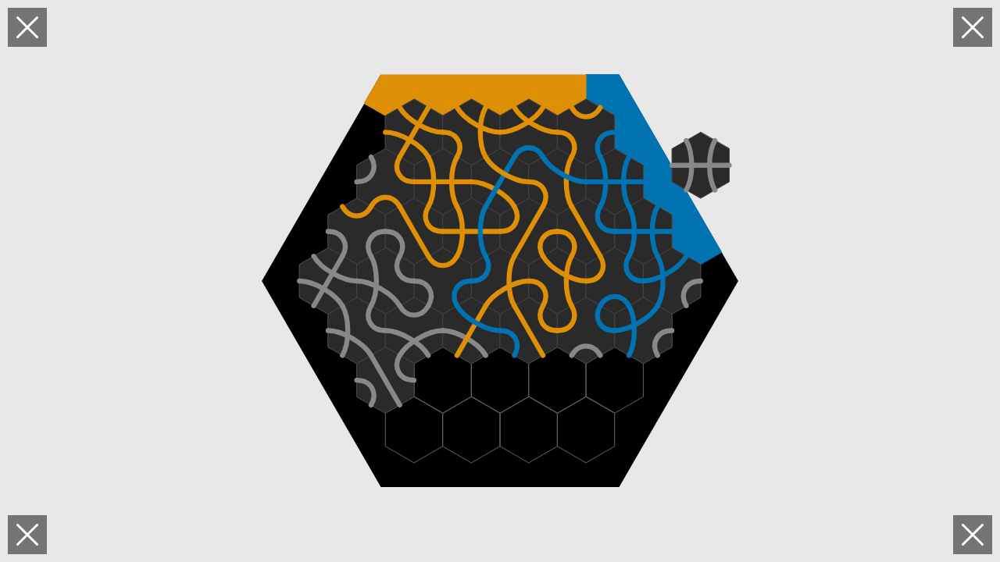

- **Action**: New tile available for Player 2 (Orange)
- **State**: Waiting for player interaction
- **Redux State**: `currentTile` set, `currentRotation = 0`, `selectedPosition = null`
- **What to verify**: Current tile preview at player's edge, previous tiles on board, correct turn

### 0167-move-30-tile-placed.png

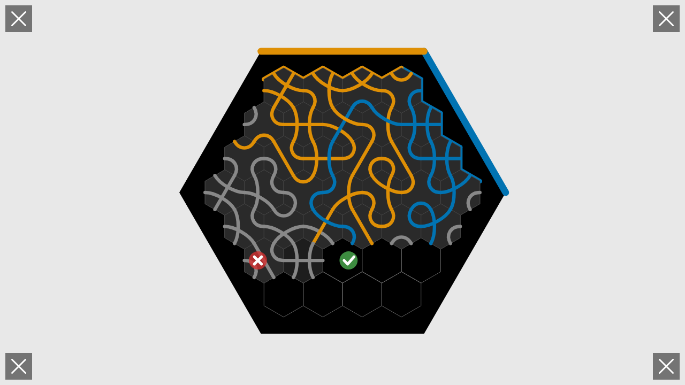

- **Action**: Player 2 clicks hex position to place tile
- **State**: Tile tentatively placed, awaiting confirmation
- **Redux State**: `selectedPosition` set to clicked position
- **What to verify**: Tile at selected position, checkmark (✓) and X buttons visible

### 0168-move-30-complete.png

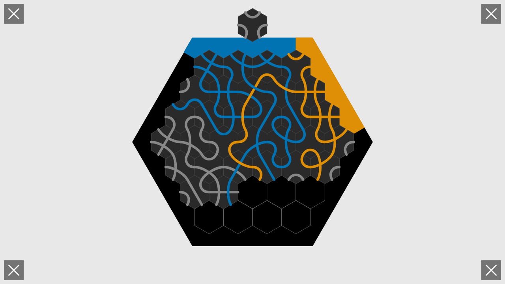

- **Action**: Player 2 clicks checkmark (✓) to confirm
- **State**: Tile committed, turn advances
- **Redux State**: Tile in `board` Map, `selectedPosition = null`, turn advanced
- **What to verify**: Tile permanent on board, confirmation buttons gone, flows updated, next player's turn

### 0169-before-move-31.png

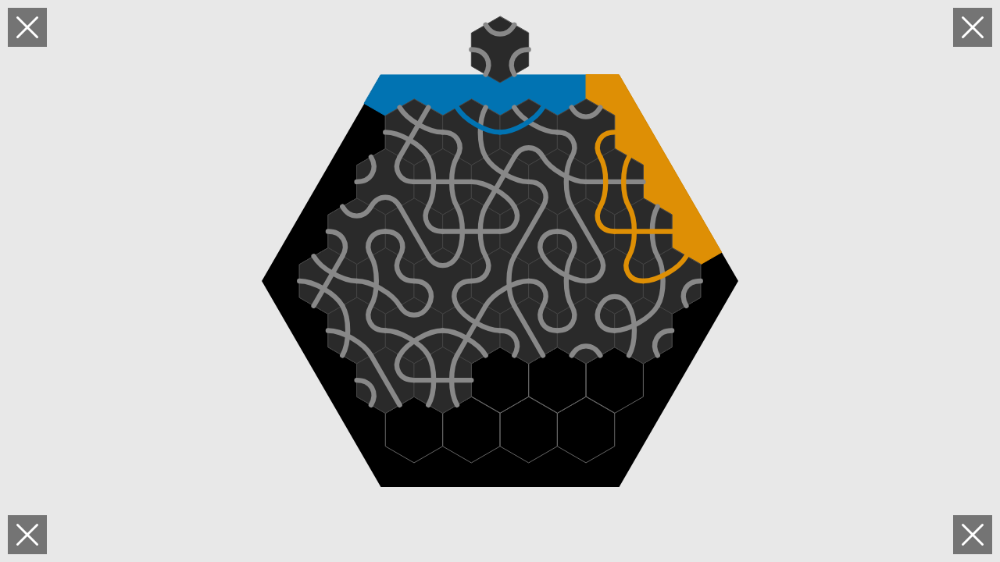

- **Action**: New tile available for Player 1 (Blue)
- **State**: Waiting for player interaction
- **Redux State**: `currentTile` set, `currentRotation = 0`, `selectedPosition = null`
- **What to verify**: Current tile preview at player's edge, previous tiles on board, correct turn

### 0170-move-31-rotation-1.png

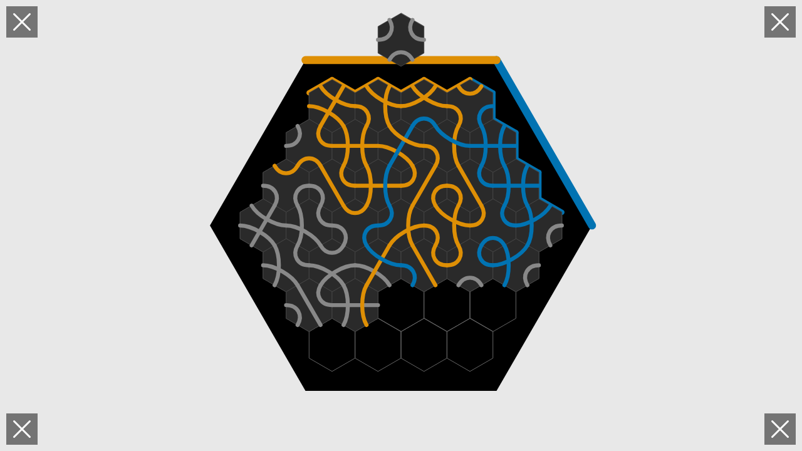

- **Action**: Player 1 clicks tile to rotate (rotation 1)
- **State**: Tile rotated via mouse click
- **Redux State**: `currentRotation = 1`
- **What to verify**: Tile preview shows rotation 1, achieved by clicking tile

### 0171-move-31-tile-placed.png

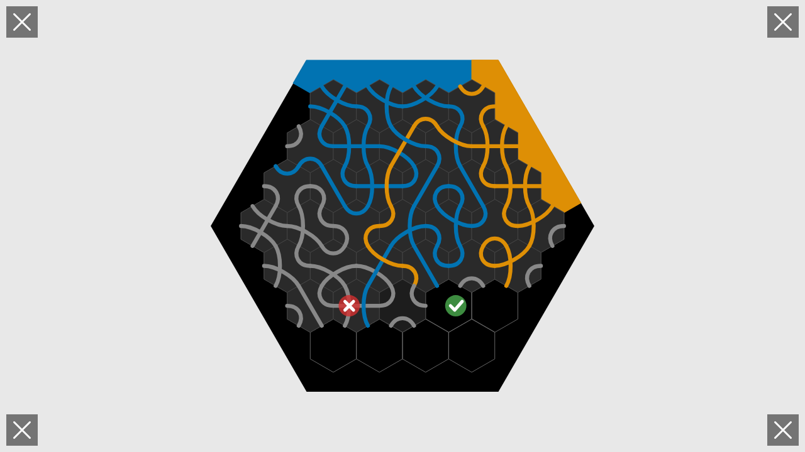

- **Action**: Player 1 clicks hex position to place tile
- **State**: Tile tentatively placed, awaiting confirmation
- **Redux State**: `selectedPosition` set to clicked position
- **What to verify**: Tile at selected position, checkmark (✓) and X buttons visible

### 0172-move-31-complete.png

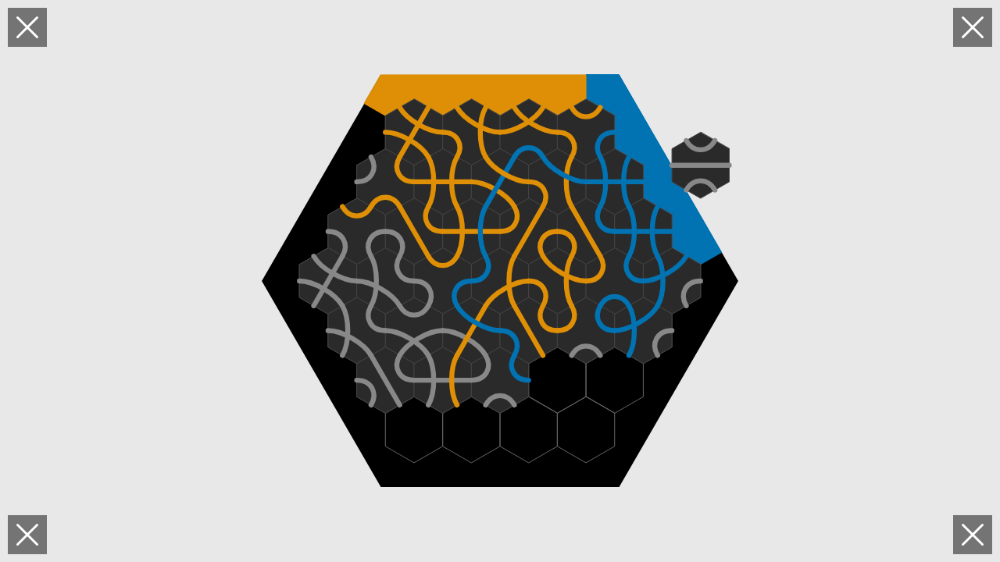

- **Action**: Player 1 clicks checkmark (✓) to confirm
- **State**: Tile committed, turn advances
- **Redux State**: Tile in `board` Map, `selectedPosition = null`, turn advanced
- **What to verify**: Tile permanent on board, confirmation buttons gone, flows updated, next player's turn

### 0173-before-move-32.png

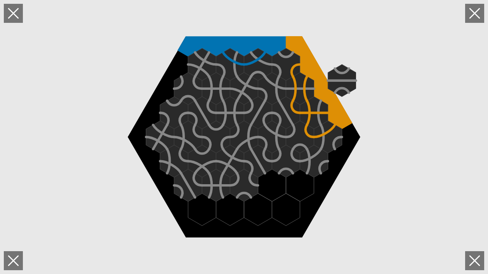

- **Action**: New tile available for Player 2 (Orange)
- **State**: Waiting for player interaction
- **Redux State**: `currentTile` set, `currentRotation = 0`, `selectedPosition = null`
- **What to verify**: Current tile preview at player's edge, previous tiles on board, correct turn

### 0174-move-32-rotation-1.png

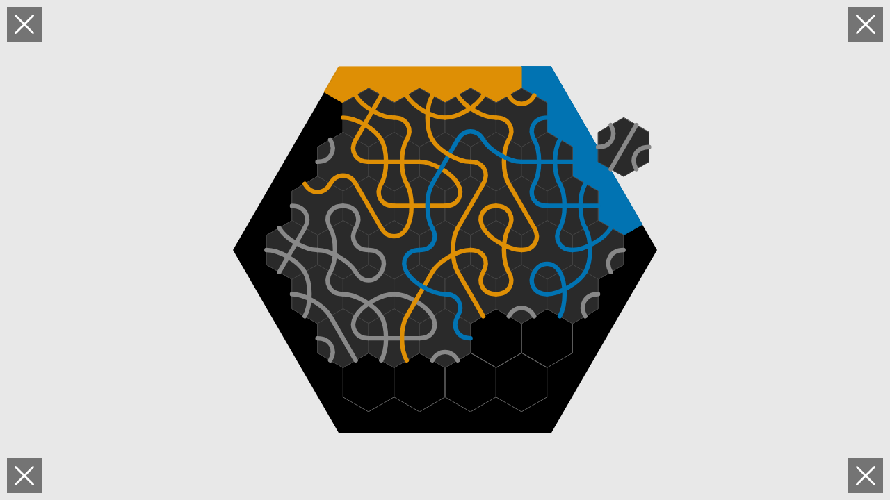

- **Action**: Player 2 clicks tile to rotate (rotation 1)
- **State**: Tile rotated via mouse click
- **Redux State**: `currentRotation = 1`
- **What to verify**: Tile preview shows rotation 1, achieved by clicking tile

### 0175-move-32-rotation-2.png

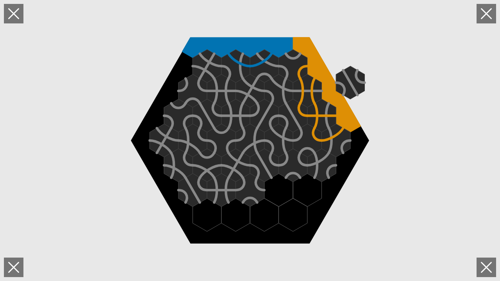

- **Action**: Player 2 clicks tile to rotate (rotation 2)
- **State**: Tile rotated via mouse click
- **Redux State**: `currentRotation = 2`
- **What to verify**: Tile preview shows rotation 2, achieved by clicking tile

### 0176-move-32-tile-placed.png

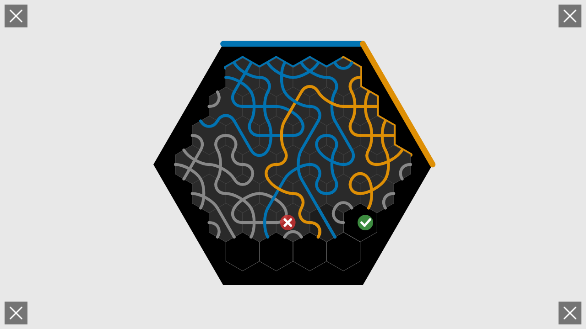

- **Action**: Player 2 clicks hex position to place tile
- **State**: Tile tentatively placed, awaiting confirmation
- **Redux State**: `selectedPosition` set to clicked position
- **What to verify**: Tile at selected position, checkmark (✓) and X buttons visible

### 0177-move-32-complete.png

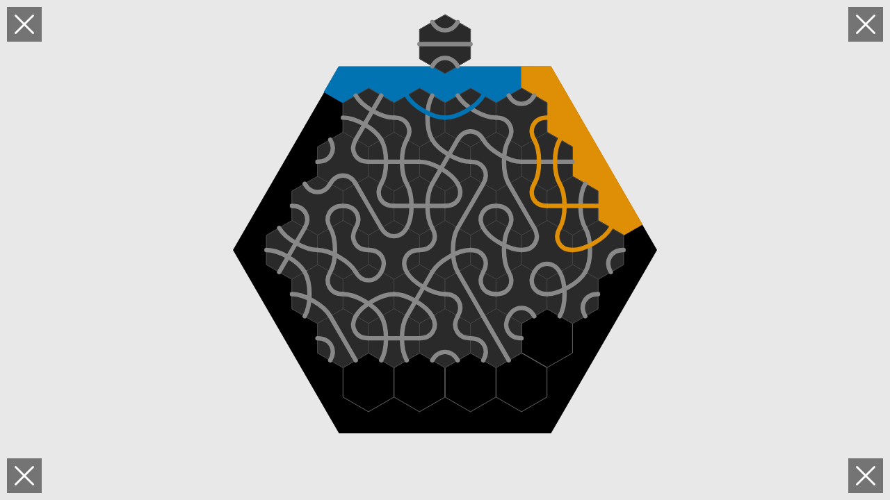

- **Action**: Player 2 clicks checkmark (✓) to confirm
- **State**: Tile committed, turn advances
- **Redux State**: Tile in `board` Map, `selectedPosition = null`, turn advanced
- **What to verify**: Tile permanent on board, confirmation buttons gone, flows updated, next player's turn

### 0178-before-move-33.png

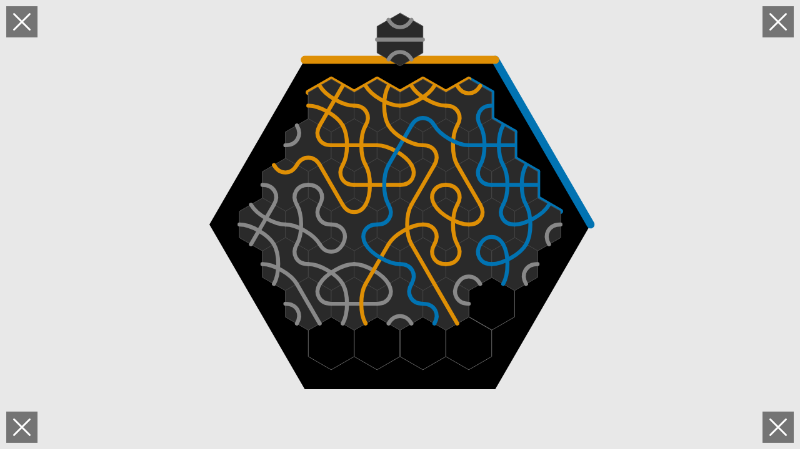

- **Action**: New tile available for Player 1 (Blue)
- **State**: Waiting for player interaction
- **Redux State**: `currentTile` set, `currentRotation = 0`, `selectedPosition = null`
- **What to verify**: Current tile preview at player's edge, previous tiles on board, correct turn

### 0179-move-33-rotation-1.png

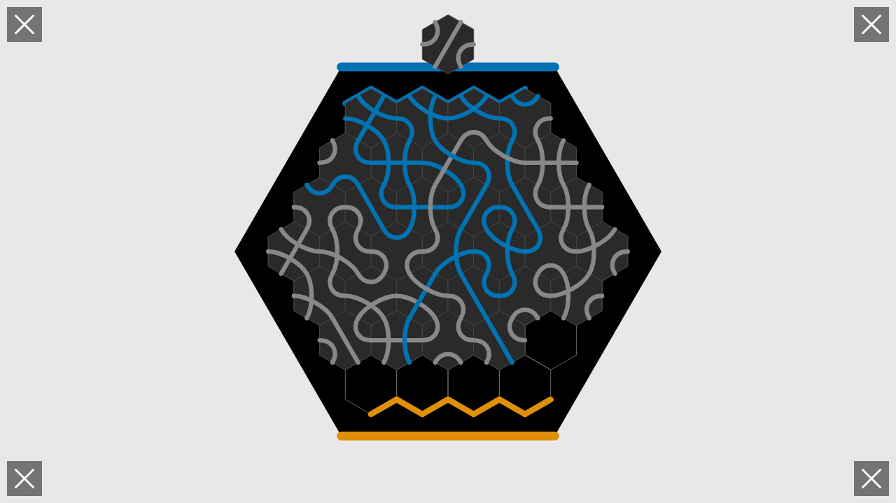

- **Action**: Player 1 clicks tile to rotate (rotation 1)
- **State**: Tile rotated via mouse click
- **Redux State**: `currentRotation = 1`
- **What to verify**: Tile preview shows rotation 1, achieved by clicking tile

### 0180-move-33-rotation-2.png

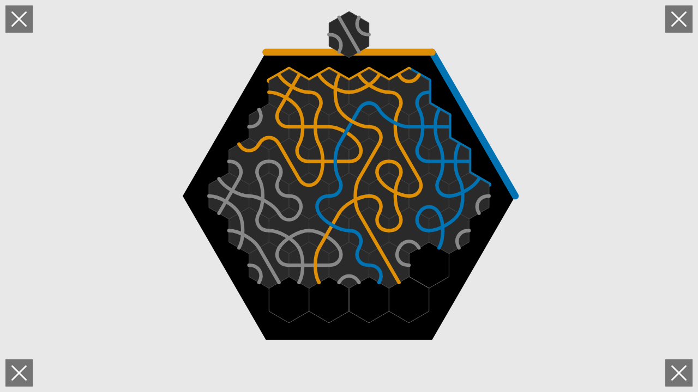

- **Action**: Player 1 clicks tile to rotate (rotation 2)
- **State**: Tile rotated via mouse click
- **Redux State**: `currentRotation = 2`
- **What to verify**: Tile preview shows rotation 2, achieved by clicking tile

### 0181-move-33-rotation-3.png

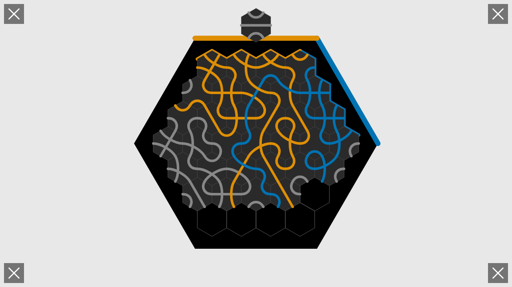

- **Action**: Player 1 clicks tile to rotate (rotation 3)
- **State**: Tile rotated via mouse click
- **Redux State**: `currentRotation = 3`
- **What to verify**: Tile preview shows rotation 3, achieved by clicking tile

### 0182-move-33-tile-placed.png

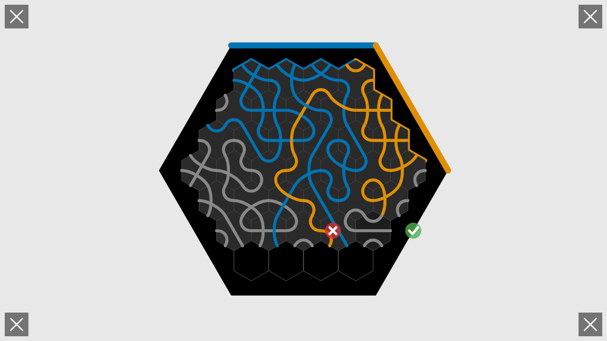

- **Action**: Player 1 clicks hex position to place tile
- **State**: Tile tentatively placed, awaiting confirmation
- **Redux State**: `selectedPosition` set to clicked position
- **What to verify**: Tile at selected position, checkmark (✓) and X buttons visible

### 0183-move-33-complete.png

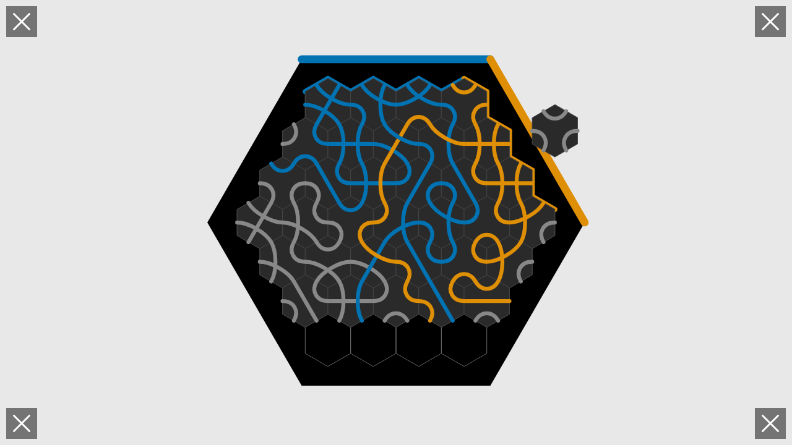

- **Action**: Player 1 clicks checkmark (✓) to confirm
- **State**: Tile committed, turn advances
- **Redux State**: Tile in `board` Map, `selectedPosition = null`, turn advanced
- **What to verify**: Tile permanent on board, confirmation buttons gone, flows updated, next player's turn

### 0184-before-move-34.png

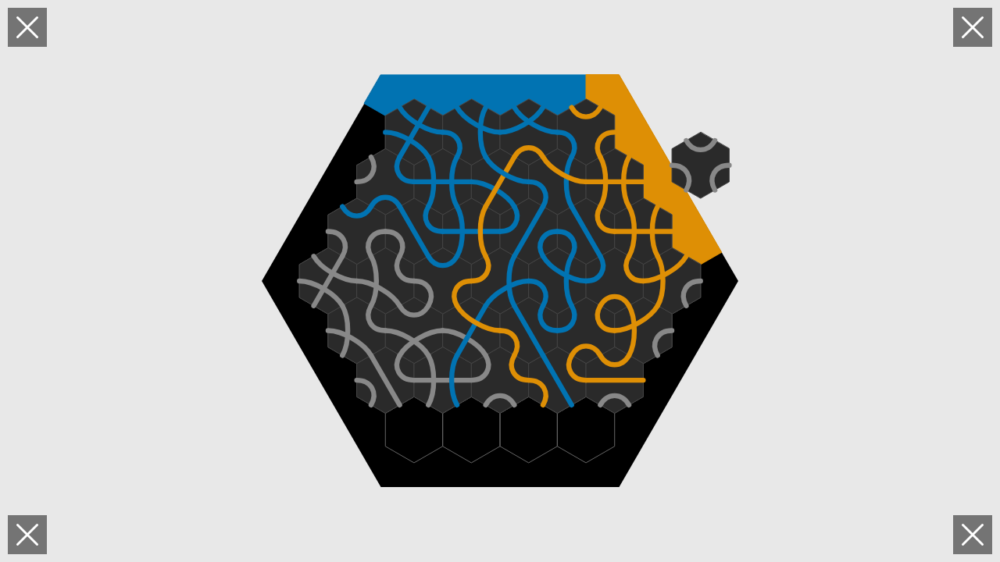

- **Action**: New tile available for Player 2 (Orange)
- **State**: Waiting for player interaction
- **Redux State**: `currentTile` set, `currentRotation = 0`, `selectedPosition = null`
- **What to verify**: Current tile preview at player's edge, previous tiles on board, correct turn

### 0185-move-34-rotation-1.png

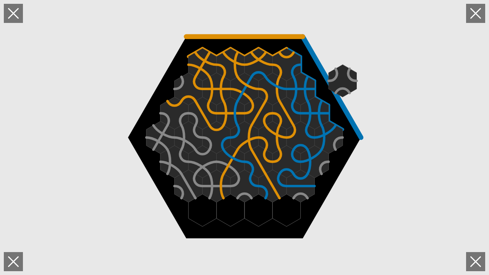

- **Action**: Player 2 clicks tile to rotate (rotation 1)
- **State**: Tile rotated via mouse click
- **Redux State**: `currentRotation = 1`
- **What to verify**: Tile preview shows rotation 1, achieved by clicking tile

### 0186-move-34-rotation-2.png

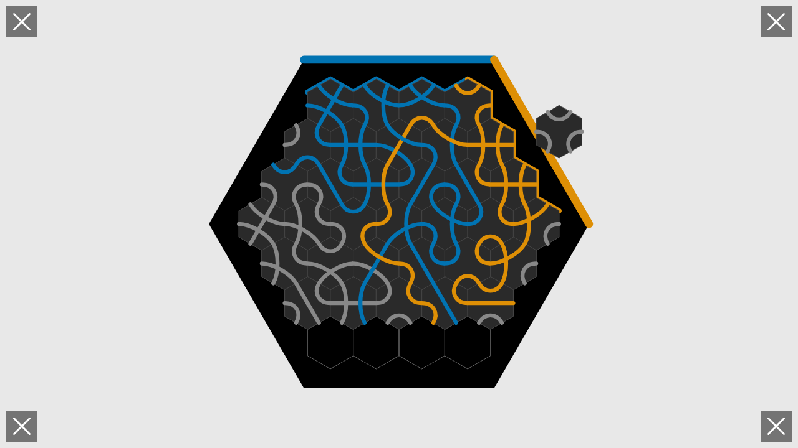

- **Action**: Player 2 clicks tile to rotate (rotation 2)
- **State**: Tile rotated via mouse click
- **Redux State**: `currentRotation = 2`
- **What to verify**: Tile preview shows rotation 2, achieved by clicking tile

### 0187-move-34-rotation-3.png

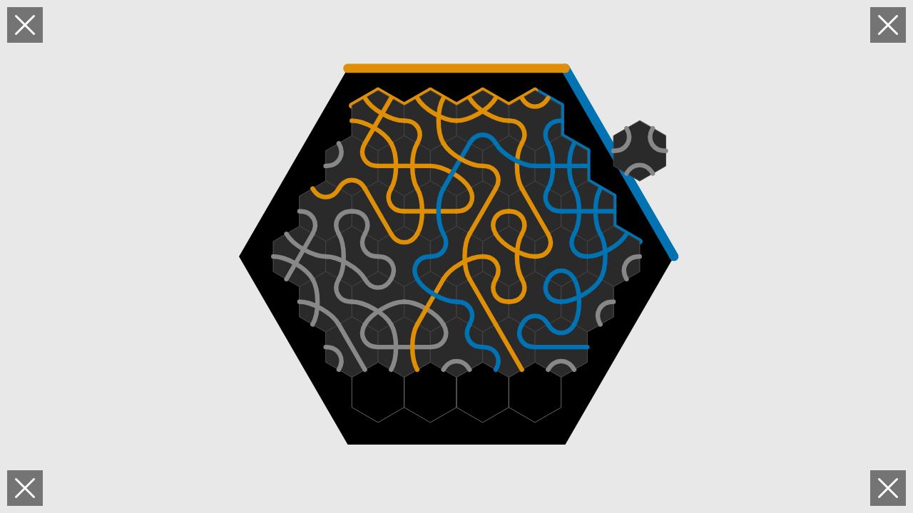

- **Action**: Player 2 clicks tile to rotate (rotation 3)
- **State**: Tile rotated via mouse click
- **Redux State**: `currentRotation = 3`
- **What to verify**: Tile preview shows rotation 3, achieved by clicking tile

### 0188-move-34-rotation-4.png

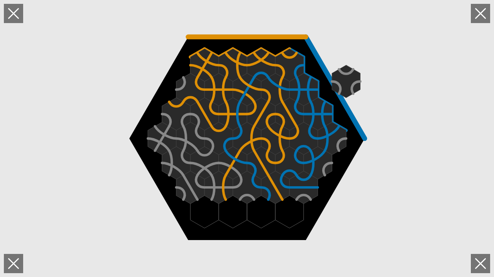

- **Action**: Player 2 clicks tile to rotate (rotation 4)
- **State**: Tile rotated via mouse click
- **Redux State**: `currentRotation = 4`
- **What to verify**: Tile preview shows rotation 4, achieved by clicking tile

### 0189-move-34-tile-placed.png

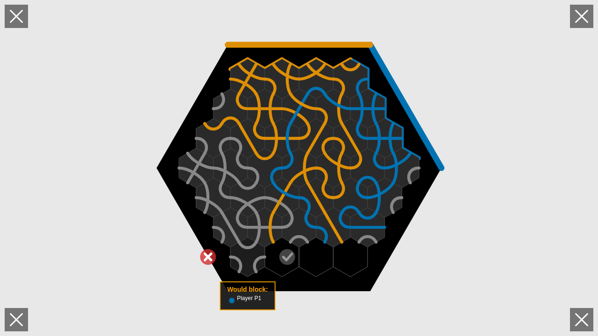

- **Action**: Player 2 clicks hex position to place tile
- **State**: Tile tentatively placed, awaiting confirmation
- **Redux State**: `selectedPosition` set to clicked position
- **What to verify**: Tile at selected position, checkmark (✓) and X buttons visible

### 0190-move-34-complete.png

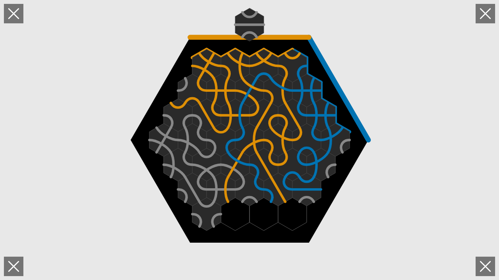

- **Action**: Player 2 clicks checkmark (✓) to confirm
- **State**: Tile committed, turn advances
- **Redux State**: Tile in `board` Map, `selectedPosition = null`, turn advanced
- **What to verify**: Tile permanent on board, confirmation buttons gone, flows updated, next player's turn

### 0191-before-move-35.png

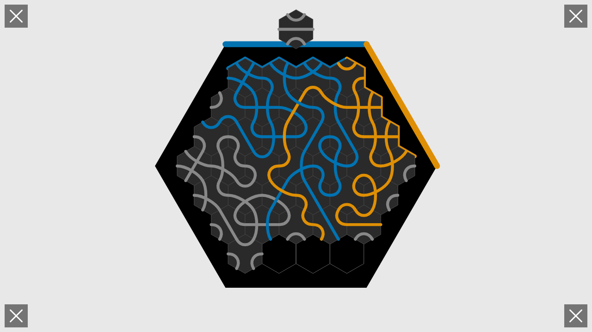

- **Action**: New tile available for Player 1 (Blue)
- **State**: Waiting for player interaction
- **Redux State**: `currentTile` set, `currentRotation = 0`, `selectedPosition = null`
- **What to verify**: Current tile preview at player's edge, previous tiles on board, correct turn

### 0192-move-35-rotation-1.png

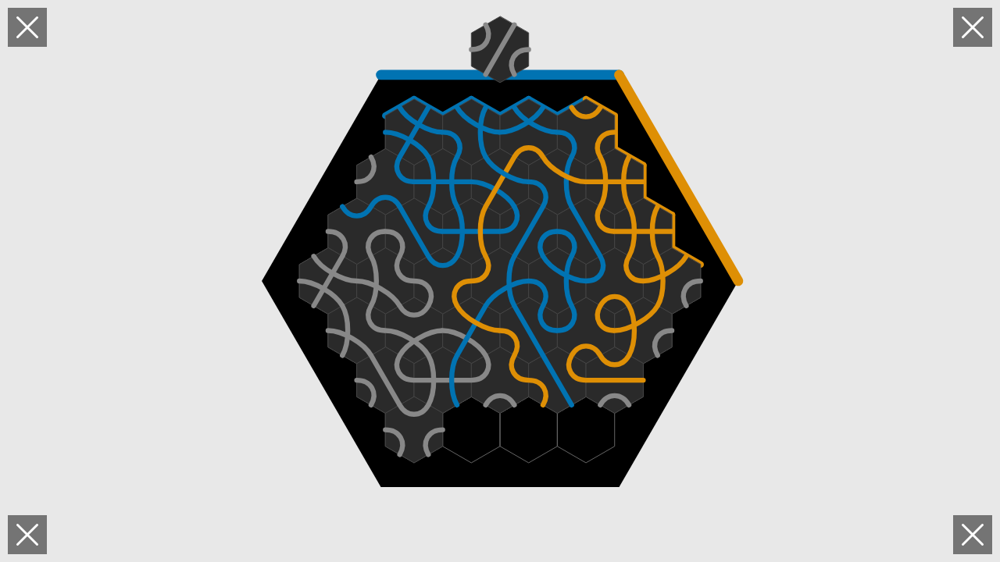

- **Action**: Player 1 clicks tile to rotate (rotation 1)
- **State**: Tile rotated via mouse click
- **Redux State**: `currentRotation = 1`
- **What to verify**: Tile preview shows rotation 1, achieved by clicking tile

### 0193-move-35-rotation-2.png

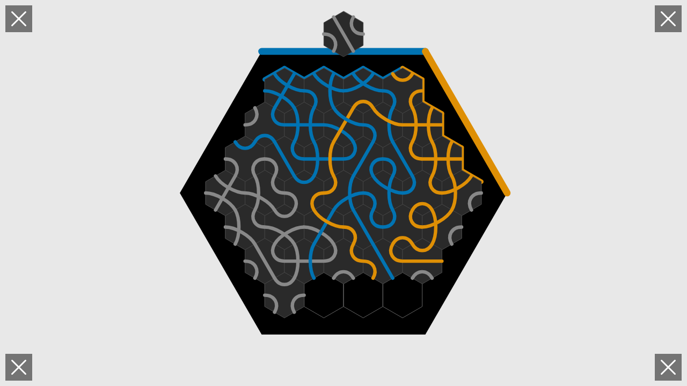

- **Action**: Player 1 clicks tile to rotate (rotation 2)
- **State**: Tile rotated via mouse click
- **Redux State**: `currentRotation = 2`
- **What to verify**: Tile preview shows rotation 2, achieved by clicking tile

### 0194-move-35-rotation-3.png

- **Action**: Player 1 clicks tile to rotate (rotation 3)
- **State**: Tile rotated via mouse click
- **Redux State**: `currentRotation = 3`
- **What to verify**: Tile preview shows rotation 3, achieved by clicking tile

### 0195-move-35-rotation-4.png

- **Action**: Player 1 clicks tile to rotate (rotation 4)
- **State**: Tile rotated via mouse click
- **Redux State**: `currentRotation = 4`
- **What to verify**: Tile preview shows rotation 4, achieved by clicking tile

### 0196-move-35-rotation-5.png

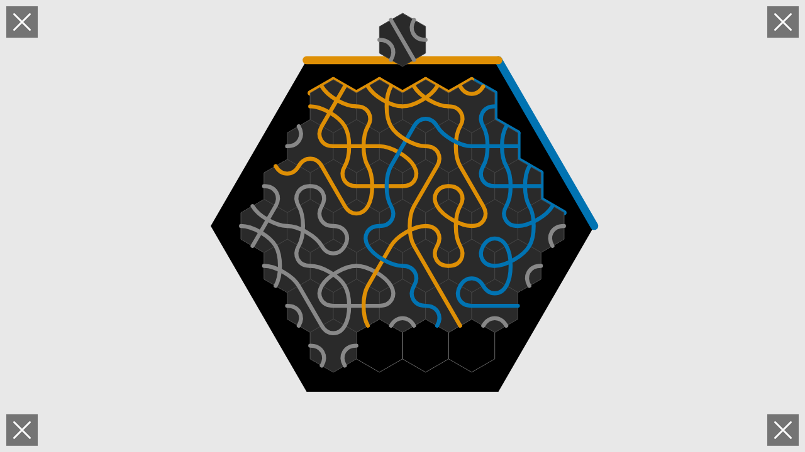

- **Action**: Player 1 clicks tile to rotate (rotation 5)
- **State**: Tile rotated via mouse click
- **Redux State**: `currentRotation = 5`
- **What to verify**: Tile preview shows rotation 5, achieved by clicking tile

### 0197-move-35-tile-placed.png

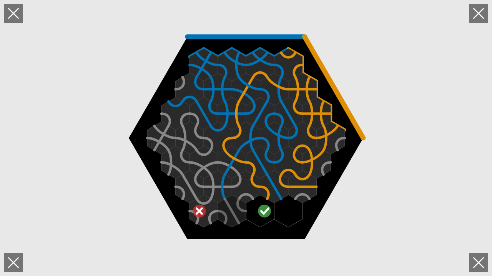

- **Action**: Player 1 clicks hex position to place tile
- **State**: Tile tentatively placed, awaiting confirmation
- **Redux State**: `selectedPosition` set to clicked position
- **What to verify**: Tile at selected position, checkmark (✓) and X buttons visible

### 0198-move-35-complete.png

- **Action**: Player 1 clicks checkmark (✓) to confirm
- **State**: Tile committed, turn advances
- **Redux State**: Tile in `board` Map, `selectedPosition = null`, turn advanced
- **What to verify**: Tile permanent on board, confirmation buttons gone, flows updated, next player's turn

### 0199-victory-final.png

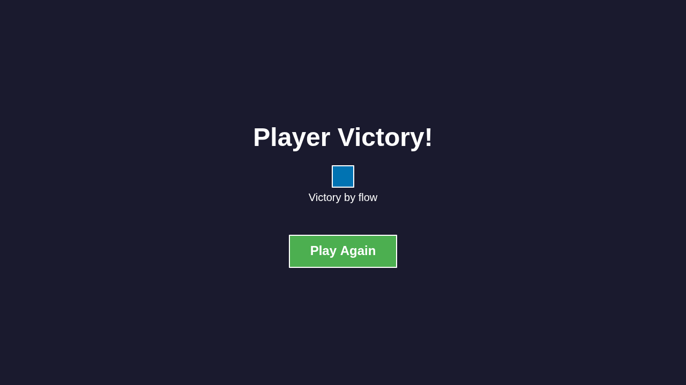

- **Action**: Game reaches conclusion
- **State**: Game finished
- **Redux State**: `phase = 'finished'`, `winners` array populated, `winType` set
- **What to verify**: Victory screen displayed, game phase 'finished', winners identified, final board state

## Summary

This test documents a complete 2-player game using only mouse interactions. All 199 screenshots show every mouse click action from start to finish: rotating tiles by clicking, selecting positions by clicking hexes, and confirming with the checkmark button. Each screenshot validates that the UI correctly responds to mouse input and that game state updates appropriately. This proves the entire game is playable via UI alone without any Redux action "cheating" during gameplay.
