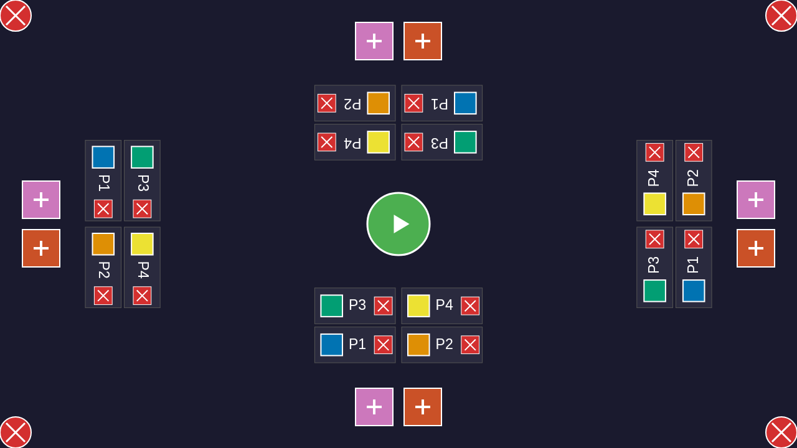
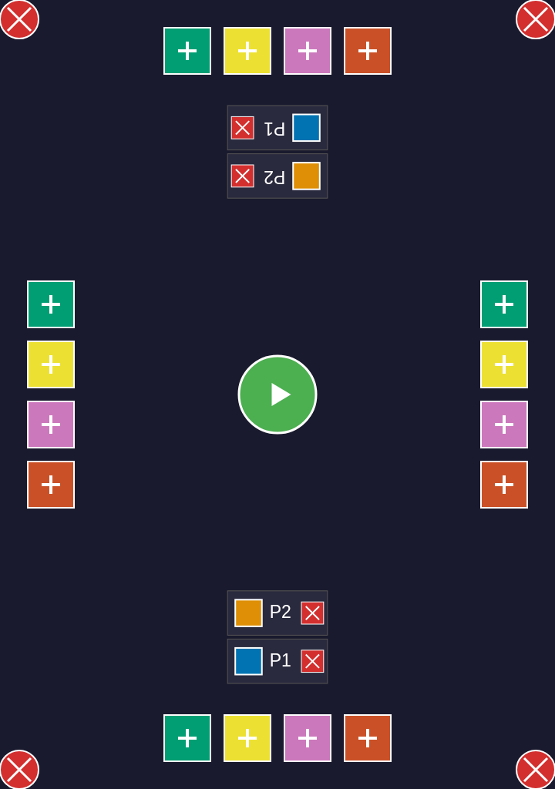

# User Story 007: Lobby Mouse Interactions

This user story demonstrates the lobby interaction functionality with mouse clicks, showing how players can be added from any of the four edges and removed using the X button.

## Test Flow

### 1. Initial Lobby State

The lobby starts with no players configured. Color buttons are visible on all four edges (bottom, right, top, left) allowing players to join from any edge.

### 2. Adding Players from All Edges

Players can join from any of the four edges by clicking the colored + buttons:
- Blue player joins from the bottom edge
- Orange player joins from the right edge  
- Green player joins from the top edge
- Yellow player joins from the left edge

Player labels appear near their chosen edge with their color indicator and player number (P1, P2, P3, P4).

### 3. Removing Player from Bottom Edge

A single player is added at the bottom edge, showing the player label with a red X button.

Clicking the X button removes the player, returning to an empty lobby.

### 4. Removing Player from Right Edge

Demonstrates that players at the right edge can be removed by clicking their X button. The player label is positioned to the left of the right edge buttons.

### 5. Removing Player from Top Edge

Shows a player added at the top edge with their label positioned below the top edge buttons. The X button successfully removes the player.

### 6. Removing Player from Left Edge

Demonstrates player removal from the left edge, with the player label positioned to the right of the left edge buttons.

### 7. Multiple Players with Sequential Removal

Four players are configured, one at each edge.

The orange player from the right edge is removed, leaving three players.

The green player from the top edge is removed, leaving just the blue (bottom) and yellow (left) players.

This demonstrates that the player list updates correctly and remaining players maintain their positions after removals.

### 8. Portrait Orientation Support

The lobby in portrait mode (720x1024).

Two players added from bottom and top edges in portrait mode.

One player removed, showing the UI works correctly in portrait orientation.

### 9. Known Bug: Left/Right Edge Players in Portrait Mode

This screenshot demonstrates a rendering bug where players added from left and right edges in portrait mode are translated off-screen. The player labels, colors, and X buttons are not visible, although hit detection still works correctly. This is a production code issue with the aspect ratio adjustment calculation for rotated labels in portrait orientation.

## Key Features Demonstrated

1. **Multi-edge Support**: Players can join from any of the four edges (bottom, right, top, left)
2. **Player Labels**: Each player gets a label with their color and number positioned near their edge
3. **Remove Functionality**: Every player has an X button that removes them from the lobby
4. **Dynamic Updates**: The player list and available colors update correctly after additions and removals
5. **Responsive Design**: The lobby works in both landscape and portrait orientations
6. **Touch-Friendly**: All buttons are sized appropriately for touch interaction

## Test Coverage

The test suite verifies:
- Adding players from all four edges
- Removing players from each individual edge
- Handling multiple players and sequential removals
- Maintaining correct state after player operations
- Portrait orientation compatibility (with bottom/top edges)
- Correct edge assignment for each player
- Proper cleanup when all players are removed
- Documents known rendering bug for left/right edges in portrait mode
