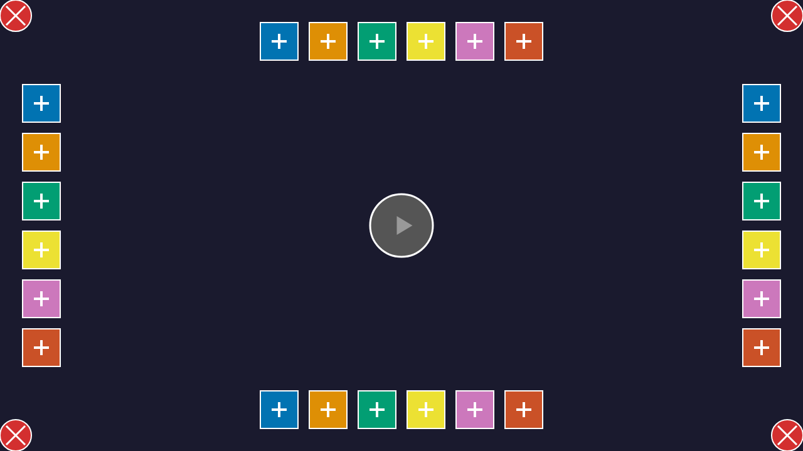
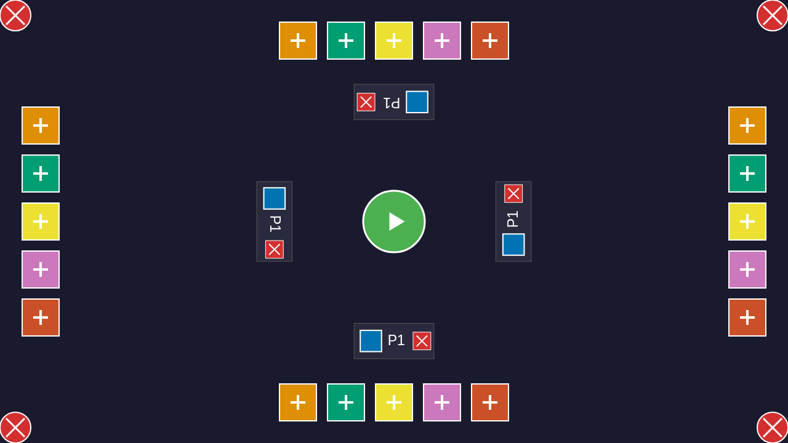
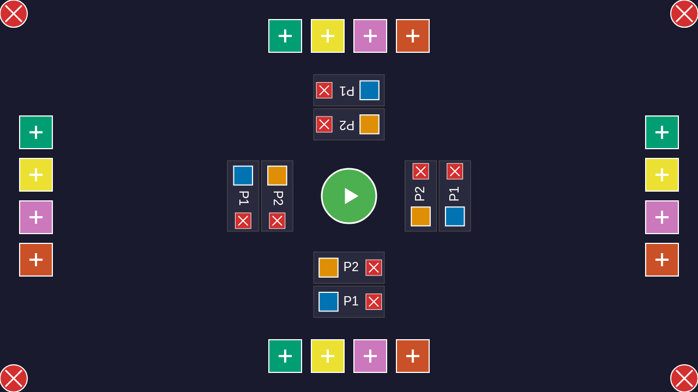
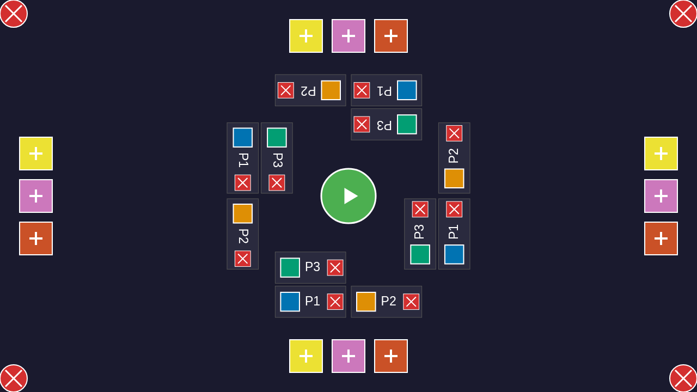

# User Story: Lobby with Rotated Player Labels

**As a player, I want to see player labels oriented towards my edge of the table so I can easily read them from my seating position**

## Flow Description

This story demonstrates the multi-directional lobby interface where player labels are rotated to face their respective edges. Players can be added from any of the four edges (bottom, right, top, left), and the labels rotate appropriately (0°, 90°, 180°, 270°) to be readable from each edge's perspective. The remove (X) buttons also work correctly after rotation.

## Screenshots

### 001-initial-lobby.png

- **Action**: User loads the application
- **State**: Lobby screen with + buttons at all four edges
- **What to verify**: 
  - + buttons visible at all edges (top, right, bottom, left)
  - Center START button visible but disabled (gray)
  - Exit buttons in corners
  - No players yet

### 002-player-added-bottom.png

- **Action**: User clicks blue + button at bottom edge
- **State**: Player P1 added to bottom edge with 0° rotation (upright)
- **What to verify**:
  - Player label shows "P1" with blue color indicator
  - Label is upright and readable from bottom
  - Remove (X) button visible on right side of label
  - Player labels appear at all four edges showing P1

### 003-player-added-right.png

- **Action**: User clicks orange + button at right edge
- **State**: Player P2 added to right edge
- **What to verify**:
  - P2 label at right edge is rotated 90° clockwise
  - Label readable from the right side
  - Remove (X) button correctly positioned after rotation
  - Both P1 and P2 visible at all edges

### 004-player-added-top.png

- **Action**: User clicks green + button at top edge  
- **State**: Player P3 added to top edge
- **What to verify**:
  - P3 label at top edge is rotated 180° (upside down)
  - Label readable from the top
  - Remove (X) button correctly positioned
  - All three players visible at all edges

### 005-player-added-left.png

- **Action**: User clicks yellow + button at left edge
- **State**: Player P4 added to left edge
- **What to verify**:
  - P4 label at left edge is rotated 270° clockwise
  - Label readable from the left side
  - Remove (X) button correctly positioned
  - **All four players (P1, P2, P3, P4) visible at all four edges**
  - Each edge shows all players with appropriate rotation

### 006-remove-from-bottom.png

- **Action**: User clicks X button on P1 (bottom edge, 0° rotation)
- **State**: P1 removed from all edges
- **What to verify**:
  - P1 no longer appears at any edge
  - Remaining players (P2, P3, P4) still visible
  - Layout adjusts correctly

### 007-remove-from-right.png

- **Action**: User clicks X button on P2 (right edge, 90° rotation)
- **State**: P2 removed from all edges
- **What to verify**:
  - P2 no longer appears at any edge
  - Rotated X button at right edge worked correctly
  - Remaining players (P3, P4) still visible

### 008-remove-from-top.png

- **Action**: User clicks X button on P3 (top edge, 180° rotation)
- **State**: P3 removed from all edges
- **What to verify**:
  - P3 no longer appears at any edge
  - Upside-down X button at top edge worked correctly
  - Only P4 remains

### 009-remove-from-left.png

- **Action**: User clicks X button on P4 (left edge, 270° rotation)
- **State**: P4 removed, back to empty lobby
- **What to verify**:
  - P4 no longer appears at any edge
  - Rotated X button at left edge worked correctly
  - Lobby empty again with all + buttons available

### 010-multiple-players-same-edge.png

- **Action**: User adds multiple players from the same edge
- **State**: Multiple player labels stacked at each edge
- **What to verify**:
  - Labels properly stacked/arranged
  - All labels have correct rotation
  - All X buttons functional

### 011-portrait-mode.png

- **Action**: Browser resized to portrait orientation
- **State**: Labels adjust for narrow screen
- **What to verify**:
  - Left/right edge labels don't overlap + buttons
  - Aspect ratio adjustment working correctly
  - All labels still readable and properly rotated

## Test Coverage

This story validates:
- Player labels rotate correctly for each edge (0°, 90°, 180°, 270°)
- Labels are readable from their respective edge perspectives
- Remove (X) buttons work correctly after rotation transformation
- Hit detection accounts for rotated coordinate spaces
- Multiple players can be added to any edge
- Layout works in both landscape and portrait orientations
- Player labels don't overlap + buttons in any orientation
- Labels positioned near + buttons with proper spacing

## Technical Details

The rotation implementation uses a multi-step transformation:
1. Calculate all label positions as if on the bottom edge
2. Rotate around screen center by edge angle
3. Apply aspect ratio adjustment for left/right edges
4. Transform remove button coordinates through same rotation

This ensures consistent positioning and proper hit detection across all edges.

## Related Files
- Test: `tests/e2e/lobby-interactions.spec.ts`
- Redux: `src/redux/gameReducer.ts` (ADD_PLAYER, REMOVE_PLAYER actions)
- Layout: `src/rendering/lobbyLayout.ts` (calculateLobbyLayout, transformPoint)
- Renderer: `src/rendering/lobbyRenderer.ts` (renderPlayerEntry with rotation)
- Input: `src/input/lobbyInputHandler.ts` (hit detection for rotated buttons)
