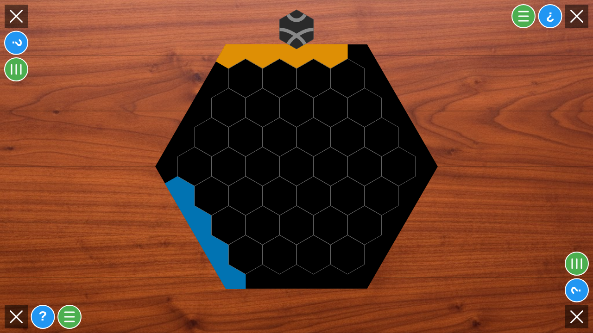
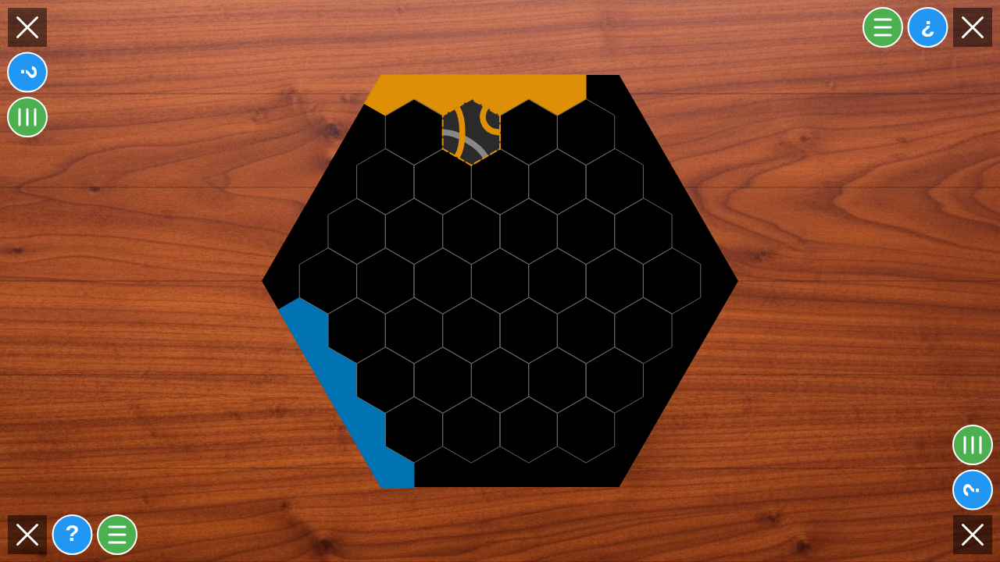
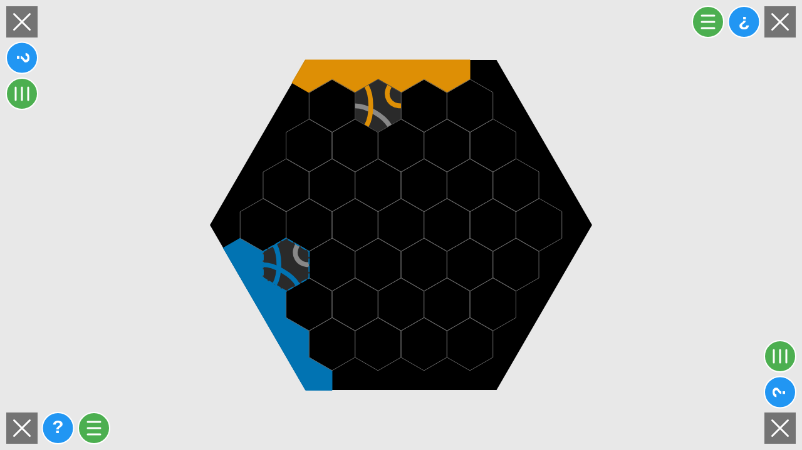
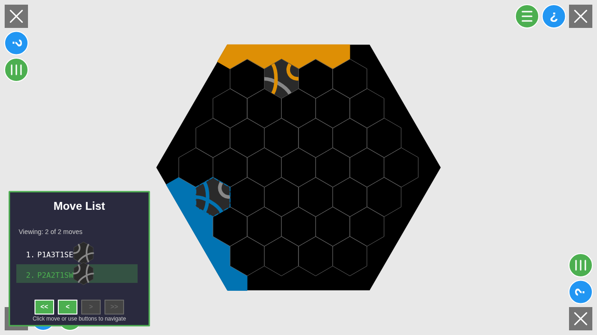
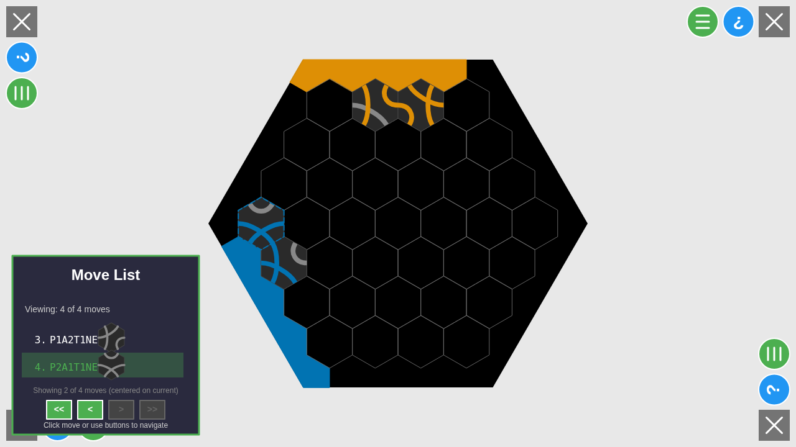

# User Story 007: Move Notation with Rotation

## Overview

This user story demonstrates the move notation system for tiles with specific rotations, specifically Type 1 (OneSharp) tiles which make rotation clearly visible.

## Test Setup

- **Players**: 2 players
- **Player 1** (P2): Seated on edge 0 (NW edge / top edge) - Orange color (#DE8F05)
- **Player 2** (P1): Seated on edge 4 (SW edge) - Blue color (#0173B2)
- **Tile Distribution**: Only Type 1 (OneSharp) tiles - configured via game settings
- **Tile Rotation**: Both players place tiles with rotation 5
- **Deterministic Seed**: 54321 for reproducible results

## Expected Rotation Behavior

For Type 1 (OneSharp) tiles:
- **Canonical orientation (rotation 0)**: Sharp corner at south (bottom), connecting SW (dir 0) and SE (dir 5)
- **Rotation 5**: The sharp corner rotates 300° clockwise (or 60° counter-clockwise)

## Screenshots

### 001-initial-state.png
Initial game state after seating phase completes, showing both players on their respective edges with an empty board.

### 002-first-player-placed.png
First player (P2 on edge 0) has placed a Type 1 tile at position (-3, 1) with rotation 5.

### 003-second-player-placed.png
Second player (P1 on edge 4) has placed a Type 1 tile at position (1, -3) with rotation 5.

### 004-move-list-opened.png
Screenshot showing the move list dialog with the notation for the first two moves:
- **Move 1**: P1A3T1SE (Player on edge 0, position A3, Type 1, SE orientation)
- **Move 2**: P2A2T1SW (Player on edge 4, position A2, Type 1, SW orientation)

### 005-four-moves-list.png
**Extended test screenshot** showing the move list with all four moves to validate notation with different rotations:
- **Move 1**: P1A3T1SE (Player on edge 0, position (-3, 1), rotation 5 → SE) ✓
- **Move 2**: P2A2T1SW (Player on edge 4, position (1, -3), rotation 5 → SW) ✓
- **Move 3**: P1A2T1NW (Player on edge 0, position (-3, 2), rotation 2 → NW) ✓
- **Move 4**: P2A1T1NW (Player on edge 4, position (0, -3), rotation 0 → NW) ✓

## Notable Findings

### Internal vs Display Player Numbers
The move notation shows "P1" and "P2" based on the order players were added, not their internal IDs:
- Internal player P2 (edge 0) → displays as P1 in notation
- Internal player P1 (edge 4) → displays as P2 in notation

### Position Notation
Columns are counted **right-to-left** from each player's perspective:
- Player on edge 0, position (-3, 1): col 1 maps to **A3** (rightmost is A1, leftmost is A4)
- Player on edge 4, position (1, -3): after rotation, maps to **A2**

### Rotation Notation Translation
The notation system adjusts rotation values based on each player's perspective (edge position). The formula is `(rotation - playerEdge + 3) % 6`, where the `+3` offset (180 degrees) accounts for how the coordinate system relates to player perspective.

This formula was systematically validated using a 6-player test with all edges (see user story 008).

**Validated examples from the test:**
- Player on edge 0:
  - Rotation 5 → **SE** orientation ✓
  - Rotation 2 → **NW** orientation ✓
- Player on edge 4:
  - Rotation 5 → **SW** orientation ✓
  - Rotation 0 → **NW** orientation ✓

## Purpose

This test creates a reproducible scenario for validating the move notation system, particularly:
1. Position notation relative to player perspective
2. Rotation/orientation notation relative to player perspective
3. Visual confirmation that Type 1 tiles make rotation differences visible
4. Testing multiple rotations (0, 2, 5) to identify potential orientation issues

The test now includes 4 moves with different rotations for comprehensive validation. The user will review the screenshots to identify which moves have correct notation and which need correction.
