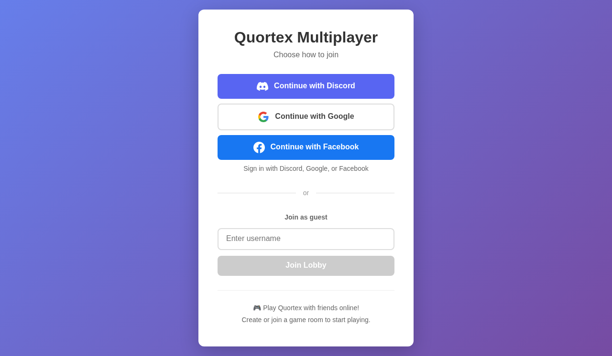
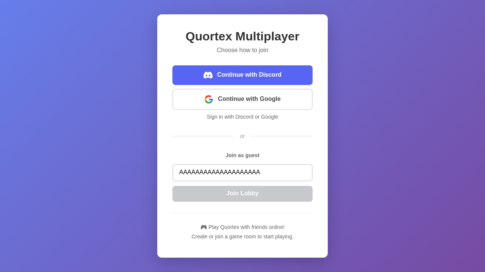
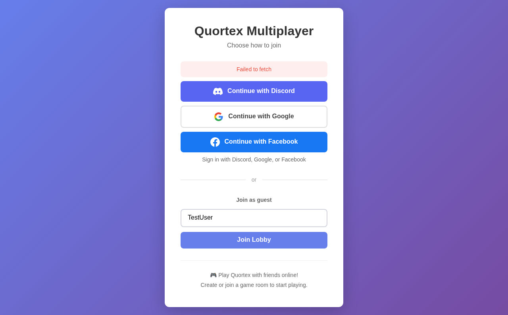
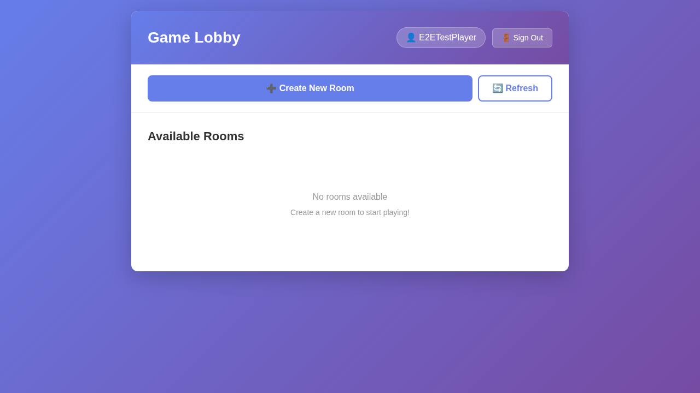

# User Story: Multiplayer Anonymous User Flow

## Overview

This user story documents the end-to-end flow for an anonymous user joining the multiplayer mode of Quortex. Anonymous users can create a temporary account by entering a username without requiring OAuth authentication.

## Test Coverage

### UI Tests (No Server Required)

These tests verify the client-side UI behavior without requiring a backend server:

1. **Login Screen Display** - Verifies the multiplayer login screen loads correctly
2. **Guest Login Option** - Confirms guest login UI is visible and accessible
3. **Username Input Validation** - Tests that join button is disabled/enabled based on username
4. **Maxlength Enforcement** - Verifies username is limited to 20 characters
5. **Placeholder Text** - Confirms proper placeholder text is shown
6. **Info Section** - Verifies informational text about multiplayer is displayed
7. **Styling and Layout** - Documents the visual layout of the login screen
8. **Connecting State** - Shows the UI changes to "Connecting..." when join is clicked

### Integration Tests (With Server)

With the backend server running on `localhost:3001`, all tests pass including:

1. **Join Lobby** - Complete flow of entering username and joining the game lobby
2. **Create Game Room** - Flow of creating a new multiplayer game room with custom settings

**All 9 tests pass when the server is running**, providing complete screenshot documentation of the entire flow from login through room creation.

## Running the Tests

### UI Tests Only (No Server)

```bash
# Run all multiplayer UI tests
npx playwright test tests/e2e/multiplayer-anonymous.spec.ts

# Run with UI mode for debugging
npx playwright test tests/e2e/multiplayer-anonymous.spec.ts --ui
```

These tests will pass without a backend server and focus on the client-side UI behavior.

### Full Integration Tests

To run tests that create real lobby connections and game rooms:

```bash
# Terminal 1: Start the backend server
npm run dev:server

# Terminal 2: Run the tests
npx playwright test tests/e2e/multiplayer-anonymous.spec.ts
```

The integration tests will be automatically skipped if the server is not running.

## Screenshots

### 001-login-screen.png
Initial multiplayer login screen with OAuth and guest login options


### 002-empty-username-disabled.png
Join button is disabled when username field is empty



### 003-username-entered-enabled.png
Join button becomes enabled when a valid username is entered


### 004-maxlength-enforced.png
Username input enforces 20 character maximum



### 005-info-section.png
Informational text about playing Quortex with friends


### 006-full-layout.png
Complete layout of the login screen showing all elements


### 007-connecting-state.png
UI shows "Connecting..." state when join button is clicked



### 008-lobby-screen.png
Game lobby after successful anonymous login showing username, create room button, and available rooms list



### 009-create-room-modal.png
Modal for creating a new game room with room name and max players settings


### 010-room-created.png
Room screen after creating a game, showing host badge, player list, and waiting for more players message


## User Flow

1. User navigates to multiplayer mode (index.html)
2. User sees login screen with three options:
   - Continue with Discord (OAuth)
   - Continue with Google (OAuth)
   - Join as guest (anonymous)
3. User chooses "Join as guest"
4. User enters a username (2-20 characters)
5. User clicks "Join Lobby" or presses Enter
6. System creates anonymous user account with temporary credentials
7. User is taken to the game lobby
8. User can create a new game room or join an existing one
9. When creating a room, user can set:
   - Room name (pre-filled with username's game)
   - Max players (2-6)
10. User enters the room and waits for other players

## Technical Notes

- Anonymous users are created via `/auth/anonymous` API endpoint
- A session token is stored in localStorage for persistence
- Anonymous sessions are temporary and tied to the browser
- The username is validated both client-side and server-side
- Socket.IO connection is established after authentication

## Related Files

- `tests/e2e/multiplayer-anonymous.spec.ts` - Test implementation
- `src/multiplayer/components/LoginScreen.svelte` - Login UI component
- `src/multiplayer/components/LobbyScreen.svelte` - Lobby UI component
- `src/multiplayer/socket.ts` - WebSocket connection handling
- `server/src/routes/auth.ts` - Authentication endpoints

## Future Enhancements

- Add tests for username validation edge cases (special characters, unicode, etc.)
- Test for session persistence across page reloads
- Test for connection error handling and retry logic
- Add tests for joining existing rooms as an anonymous user
- Test for anonymous user limitations (if any)
