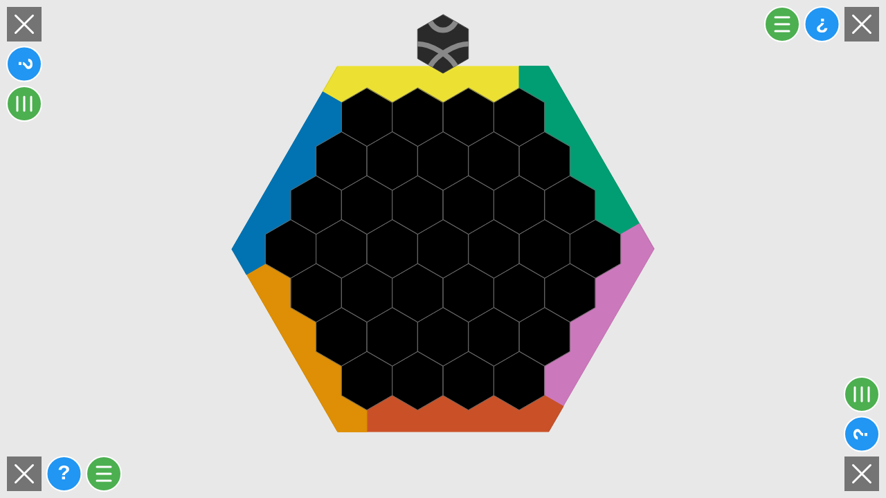
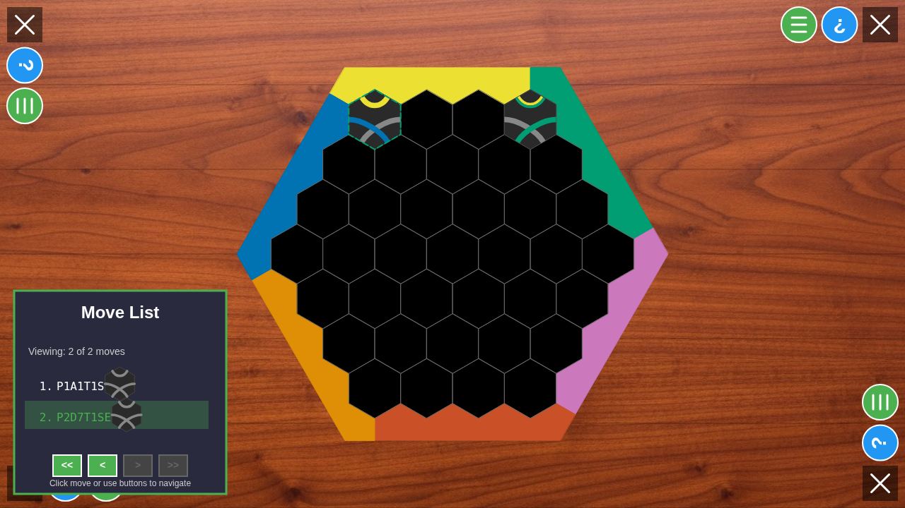
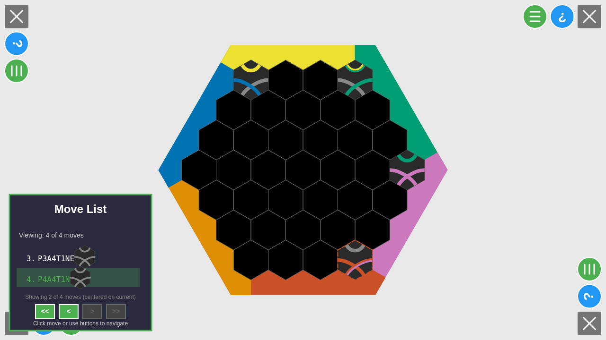
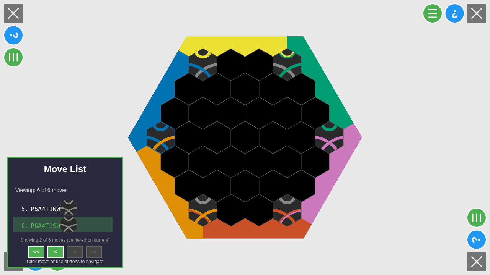

# Move Notation - Six Player Test

This test validates the rotation notation formula by placing Type 1 (OneSharp) tiles with the same absolute rotation (rotation 0) on all 6 edges of the board. Since all tiles have the same absolute orientation, the differences in notation reveal how the formula translates absolute rotations to player-relative orientations.

## Test Setup

- **Players**: 6 players, one on each edge (0, 1, 2, 3, 4, 5)
- **Tile Type**: Type 1 (OneSharp) only - rotation is visually obvious
- **Rotation**: All tiles placed with rotation 0 (sharp corner pointing North in absolute terms)
- **Seed**: 123456 (deterministic)

## Edge Assignments

- Player 1 (P4): Edge 0 (NW / Top edge)
- Player 2 (P3): Edge 1 (NE edge)
- Player 3 (P5): Edge 2 (E / Right edge)
- Player 4 (P6): Edge 3 (SE / Bottom edge)
- Player 5 (P2): Edge 4 (SW edge)
- Player 6 (P1): Edge 5 (W / Left edge)

## Screenshots

### 001-initial-state.png
Initial board state after all 6 players have selected their edges.



### 002-moves-0-1.png
Move list after players 1 and 2 have placed their tiles:
- **Move 1**: P1A1T1S (Edge 0, rotation 0 → S) ✓
- **Move 2**: P2D7T1SE (Edge 1, rotation 0 → SE) ✓



### 003-moves-2-3.png
Move list after players 3 and 4 have placed their tiles:
- **Move 3**: P3A4T1NE (Edge 2, rotation 0 → NE) ✓
- **Move 4**: P4A4T1N (Edge 3, rotation 0 → N) ✓



### 004-moves-4-5.png
Move list after players 5 and 6 have placed their tiles:
- **Move 5**: P5A4T1NW (Edge 4, rotation 0 → NW) ✓
- **Move 6**: P6A4T1SW (Edge 5, rotation 0 → SW) ✓



## Test Results - Orientations for Rotation 0 ✓

All tiles have **rotation 0** (North in absolute terms), but show different orientations from each player's perspective:

| Edge | Player | Notation | Orientation | Formula Result |
|------|--------|----------|-------------|----------------|
| 0 (NW) | P1 | P1A1T1S | S | (0 - 0 + 3) % 6 = 3 ✓ |
| 1 (NE) | P2 | P2D7T1SE | SE | (0 - 1 + 3) % 6 = 2 ✓ |
| 2 (E)  | P3 | P3A4T1NE  | NE  | (0 - 2 + 3) % 6 = 1 ✓ |
| 3 (SE) | P4 | P4A4T1N | N | (0 - 3 + 3) % 6 = 0 ✓ |
| 4 (SW) | P5 | P5A4T1NW | NW | (0 - 4 + 3) % 6 = -1 = 5 ✓ |
| 5 (W)  | P6 | P6A4T1SW  | SW  | (0 - 5 + 3) % 6 = -2 = 4 ✓ |

## Corrected Formula

The correct formula is: `(rotation - playerEdge + 3) % 6`

The `+3` offset (180 degrees) accounts for how the coordinate system relates to player perspective. This formula was systematically validated across all 6 edges and works correctly for all cases without requiring special cases.

**Validation:**
```
Edge 0: (0 - 0 + 3) % 6 = 3 → S  ✓
Edge 1: (0 - 1 + 3) % 6 = 2 → SE ✓
Edge 2: (0 - 2 + 3) % 6 = 1 → NE ✓
Edge 3: (0 - 3 + 3) % 6 = 0 → N  ✓
Edge 4: (0 - 4 + 3) % 6 = -1 % 6 = 5 → NW ✓
Edge 5: (0 - 5 + 3) % 6 = -2 % 6 = 4 → SW ✓
```

All results match the expected notation provided by the user.

## Notes on Position Notation

The position notation (A1, D7, A4, etc.) varies because the tiles aren't all in the same relative position from each player's perspective. Move 1 shows A1 (rightmost position), while others show different columns. This is a separate issue from the rotation notation.
