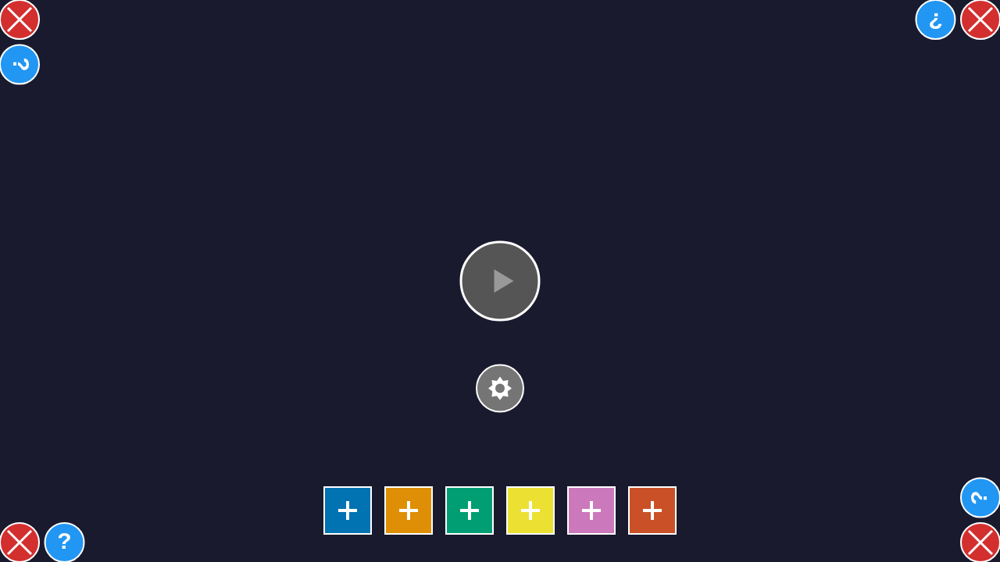

# User Story: Multiplayer Two-Player Flow

## Overview

This user story documents the complete end-to-end flow for two players creating, joining, and playing a multiplayer game. It demonstrates:

1. **Isolated Sessions**: Two separate browser contexts ensure independent cookie sessions
2. **Login Flow**: Both users authenticate as anonymous users with different usernames
3. **Room Creation**: First user creates a game room with custom settings
4. **Room Joining**: Second user joins the created room
5. **Game Start**: Host starts the game, transitioning both players to the game canvas
6. **Edge Selection**: Both players select their starting edges during the seating phase
7. **Gameplay**: First two moves are demonstrated with real-time synchronization

## Current Status

✅ **Complete**: Full multiplayer flow from login through first moves

This test covers the complete multiplayer flow including login, lobby, room creation, joining, game start, edge selection, and the first two moves of gameplay.

## Key Technical Details

- **Separate Browser Contexts**: Uses `browser.newContext()` to create isolated sessions for each player
- **Cookie Isolation**: Each context has its own cookies, ensuring separate anonymous user sessions
- **Real-time Updates**: Screenshots show how room state updates when the second player joins
- **Programmatic Validation**: Test validates UI state and element visibility at each step
- **Canvas Game Integration**: Game transitions from Svelte UI to canvas-based gameplay
- **Action Synchronization**: Redux actions are synchronized between players via Socket.IO

## Test Coverage

This test verifies:
- Anonymous user authentication for multiple users
- Room creation and listing functionality
- Real-time room updates via Socket.IO
- Player synchronization when joining rooms
- UI state consistency across both browser contexts
- Game start flow from host perspective
- Canvas game integration for multiplayer
- Seating phase (edge selection) for both players
- Gameplay phase with tile placement
- Real-time game state synchronization during moves

## Running the Test

This test automatically manages its own server instance:

```bash
# Run the test - it will start/stop its own server with clean state
npx playwright test tests/e2e/multiplayer-two-player-flow.spec.ts

# Or run with UI mode for debugging
npx playwright test tests/e2e/multiplayer-two-player-flow.spec.ts --ui
```

**How it works**:
- Test automatically starts a fresh server instance with a temporary data directory
- Runs the test with completely clean server state
- Automatically stops the server and cleans up the temporary directory after the test completes
- No manual server management required

## Screenshots with Programmatic Validation

### Login and Lobby (Steps 1-6)

#### Step 1: Player 1 Login Screen


**Validation**: Page title contains "Quortex Multiplayer"  
**Player 1 Perspective**: Initial login screen showing OAuth options (Discord, Google) and guest login section with username input field.

---

#### Step 2: Player 1 Username Entered


**Validation**: Username input field contains "Alice", Join Lobby button is visible  
**Player 1 Perspective**: Username "Alice" entered in the input field, Join Lobby button becomes enabled (purple background).

---

#### Step 3: Player 1 in Lobby


**Validation**: Page heading contains "Game Lobby"  
**Player 1 Perspective**: Successfully joined the lobby. Alice can see the "Create New Room" button and any available rooms. Username "Alice" appears in the header.

---

#### Step 4: Player 2 Login Screen


**Validation**: Page title contains "Quortex Multiplayer"  
**Player 2 Perspective**: Initial login screen from Player 2's separate browser context. This demonstrates **cookie isolation** - Player 2 is NOT automatically logged in as Player 1 despite being on the same URL.

---

#### Step 5: Player 2 Username Entered


**Validation**: Username input contains "Bob", Join Lobby button is visible  
**Player 2 Perspective**: Username "Bob" entered, Join Lobby button enabled with the same purple styling.

---

#### Step 6: Player 2 in Lobby


**Validation**: Page heading contains "Game Lobby"  
**Player 2 Perspective**: Bob successfully joined the lobby with his own independent session. Username "Bob" appears in the header, confirming separate authentication.

---

### Room Creation and Joining (Steps 7-13)

#### Step 7: Create Room Modal


**Validation**: Modal heading contains "Create New Room"  
**Player 1 Perspective**: Alice clicks "Create New Room" button. Modal appears with room name input (pre-filled) and max players dropdown.

---

#### Step 8: Room Settings Configured


**Validation**: Room name input shows "E2E Test: Alice and Bob", dropdown shows 2 players selected  
**Player 1 Perspective**: Alice has set the room name to "E2E Test: Alice and Bob" and selected 2 as max players. "Create Room" button is ready to click. The test uses a fixed room name for repeatable screenshots with a fresh server instance for each test run.

---

#### Step 9: Player 1 Waiting in Room


**Validation**: "Host" badge is visible on the page  
**Player 1 Perspective**: Alice is now inside the room she created. She has a "👑 You are the host" badge. Room shows "1/2 players". Alice's name appears in the player list. The room is waiting for another player to join.

---

#### Step 10: Player 2 Sees Room in Lobby


**Validation**: Room card with text "E2E Test: Alice and Bob" is visible  
**Player 2 Perspective**: Bob's lobby view has updated in **real-time via Socket.IO** to show the newly created room "E2E Test: Alice and Bob" in the available rooms list. The room card shows "👥 1/2 players".

---

#### Step 11: Player 2 Joined Room


**Validation**: Page displays room content (after clicking room card)  
**Player 2 Perspective**: Bob has clicked on the room card and successfully joined the test room. He can see both players in the room (Alice with host icon, and himself). Room now shows "2/2 players".

---

#### Step 12: Player 1 Sees Player 2 Joined


**Validation**: Real-time update via Socket.IO  
**Player 1 Perspective**: Alice's view automatically updates to show Bob has joined the room. Both players are now listed. This demonstrates **real-time synchronization** between the two browser contexts.

---

#### Step 13: Room Ready to Start


**Validation**: Room has 2/2 players, Start Game button is enabled  
**Player 1 Perspective**: The room is now full with both players. The host (Alice) can now start the game by clicking the "🎮 Start Game" button.

---

### Game Start and Seating Phase (Steps 14-20)

#### Step 14: Player 1 Game Started


**Validation**: Canvas element is visible  
**Player 1 Perspective**: Alice clicks "Start Game" and the game canvas appears. The UI transitions from the Svelte room screen to the canvas-based game.

---

#### Step 15: Player 2 Game Started


**Validation**: Canvas element is visible via real-time sync  
**Player 2 Perspective**: Bob's view automatically updates to show the game canvas. This demonstrates **real-time game start synchronization** via Socket.IO.

---

#### Step 16: Player 1 Seating Phase


**Validation**: Seating phase UI displayed  
**Player 1 Perspective**: Alice sees the edge selection screen where she must choose her starting position on the hexagonal board.

---

#### Step 17: Player 2 Seating Phase


**Validation**: Seating phase UI displayed  
**Player 2 Perspective**: Bob also sees the edge selection screen, ready to choose his starting position.

---

#### Step 18: Player 1 Edge Selected


**Validation**: Edge 0 (bottom) selected  
**Player 1 Perspective**: Alice clicks on the bottom edge (edge 0) to select her starting position.

---

#### Step 19: Player 2 Edge Selected


**Validation**: Edge 3 (top) selected  
**Player 2 Perspective**: Bob clicks on the top edge (edge 3), opposite from Alice, to select his starting position.

---

#### Step 20: Player 1 Gameplay Started


**Validation**: Seating complete, gameplay phase active  
**Player 1 Perspective**: After both players select edges, the game transitions to the gameplay phase. The board is now visible with player edges marked.

---

### First Moves (Steps 21-27)

#### Step 21: Player 2 Gameplay Started


**Validation**: Gameplay phase synchronized  
**Player 2 Perspective**: Bob's view also shows the gameplay phase with both players' edges marked on the board.

---

#### Step 22: Player 1 First Move Position



**Validation**: Position selected for tile placement  
**Player 1 Perspective**: Alice selects the center position on the board to place her first tile.

---

#### Step 23: Player 1 Tile Placed


**Validation**: Tile placed at center position  
**Player 1 Perspective**: Alice confirms the placement and her tile appears on the board at the center position.

---

#### Step 24: Player 2 Sees First Tile


**Validation**: Tile placement synchronized via Socket.IO  
**Player 2 Perspective**: Bob's view updates to show Alice's placed tile. This demonstrates **real-time gameplay synchronization**.

---

#### Step 25: Player 2 Second Move Position


**Validation**: Position selected for second tile  
**Player 2 Perspective**: Bob selects an adjacent position for his tile placement.

---

#### Step 26: Player 2 Tile Placed


**Validation**: Second tile placed  
**Player 2 Perspective**: Bob confirms placement and his tile appears on the board.

---

#### Step 27: Player 1 Sees Second Tile


**Validation**: Second tile synchronized  
**Player 1 Perspective**: Alice's view updates to show Bob's placed tile, completing the demonstration of the first two moves.

---

## User Flow Summary

1. **Player 1 (Alice)** logs in as anonymous user → sees lobby
2. **Player 2 (Bob)** logs in as anonymous user in separate browser context → sees lobby
3. **Alice** creates test room "E2E Test: Alice and Bob" (2 max players) → enters room as host
4. **Bob** sees the test room appear in lobby list → joins that room
5. **Both players** are in the room together → Alice clicks "Start Game"
6. **Game starts** → both players see the game canvas (real-time sync)
7. **Edge selection** → Alice selects bottom edge, Bob selects top edge
8. **Gameplay begins** → Alice places first tile at center
9. **Turn progression** → Bob places second tile adjacent to first
10. **Both players** see all moves synchronized in real-time

**Note**: The test starts a fresh server instance with a temporary data directory for each test run, ensuring completely clean state and truly repeatable results. The temporary directory is cleaned up after the test completes.

## Programmatic Validations Performed

At each step, the test validates:
- ✅ Page headings and titles match expected screen
- ✅ Input fields contain expected values
- ✅ Buttons and UI elements are visible when expected
- ✅ Navigation between screens works correctly
- ✅ Real-time updates propagate between browser contexts
- ✅ Cookie isolation maintains separate sessions
- ✅ Canvas game integration works correctly
- ✅ Edge selection is synchronized between players
- ✅ Tile placements are synchronized in real-time

## Technical Notes

- **Browser Contexts**: Uses `browser.newContext()` for cookie isolation
- **Anonymous Auth**: Uses `/auth/anonymous` endpoint with unique session IDs
- **Socket.IO**: Real-time room updates and game action synchronization
- **Fixed Room Name**: Uses "E2E Test: Alice and Bob" for repeatable, stable screenshots
- **Isolated Server**: Test starts its own server instance with a temporary data directory
- **Clean State**: Each test run has completely fresh server state (no pre-existing rooms/users)
- **Automatic Cleanup**: Temporary data directory is removed after test completes
- **Playwright Testing**: Comprehensive e2e testing with visual validation
- **Canvas Interaction**: Uses coordinate calculations to click edge buttons and board positions
- **Redux + Socket.IO**: Game actions are dispatched via Redux and synchronized via Socket.IO

## Related Files

- `tests/e2e/multiplayer-two-player-flow.spec.ts` - Test implementation
- `src/multiplayer/components/LoginScreen.svelte` - Login UI
- `src/multiplayer/components/LobbyScreen.svelte` - Lobby UI
- `src/multiplayer/components/RoomScreen.svelte` - Room UI
- `src/multiplayer/socket.ts` - Socket.IO client
- `src/multiplayer/gameCoordinator.ts` - Game action coordination
- `server/src/index.ts` - Multiplayer server

## Success Criteria

✅ Two separate browser contexts maintain independent sessions  
✅ Both users log in with different anonymous accounts  
✅ Room creation and listing works  
✅ Player can join another player's room  
✅ Real-time synchronization via Socket.IO  
✅ Game start flow from host works correctly  
✅ Canvas game integration functional  
✅ Edge selection (seating phase) works for both players  
✅ Gameplay phase with tile placement  
✅ Real-time game state synchronization during moves  
✅ Screenshots from both perspectives with validation
