# User Story: Multiplayer Two-Player Flow

## Overview

This user story documents the complete end-to-end flow for two players creating, joining, and playing a multiplayer game. It demonstrates:

1. **Isolated Sessions**: Two separate browser contexts ensure independent cookie sessions
2. **Login Flow**: Both users authenticate as anonymous users with different usernames
3. **Room Creation**: First user creates a game room with custom settings
4. **Room Joining**: Second user joins the created room
5. **Game Initialization**: Host starts the game, transitioning both players to the configuration canvas
6. **Configuration Phase**: Players add themselves with colors via ADD_PLAYER actions
7. **Game Start**: START_GAME with SHUFFLE_TILES seed 888 for deterministic behavior
8. **Seating Phase**: Both players select their starting edge positions
9. **Gameplay Phase**: First tile placement with validated state

## Current Status

✅ **Complete through first tile placement** (Login → Lobby → Room → Configuration → Seating → Gameplay → Tile Placement)

This test validates the complete multiplayer flow from login through first tile placement, including all major phase transitions with proper Redux state validation at each step. Uses deterministic seed 888 for repeatable tile sequence.

## Key Technical Details

- **Separate Browser Contexts**: Uses `browser.newContext()` to create isolated sessions for each player
- **Cookie Isolation**: Each context has its own cookies, ensuring separate anonymous user sessions
- **Real-time Updates**: Screenshots show how state updates synchronize between players via Socket.IO
- **Programmatic Validation**: Test validates Redux state at each step to ensure correct phase transitions
- **Canvas Game Integration**: Game transitions from Svelte UI to canvas-based game
- **Action Synchronization**: Redux actions (ADD_PLAYER, PLACE_TILE, etc.) synchronized via Socket.IO
- **GameCoordinator Integration**: Properly handles multiplayer action routing
- **Deterministic Tiles**: SHUFFLE_TILES with seed 888 ensures repeatable tile order for consistent testing

## Test Coverage

This test verifies:
- Anonymous user authentication for multiple users
- Room creation and listing functionality
- Real-time room updates via Socket.IO
- Player synchronization when joining rooms
- UI state consistency across both browser contexts
- Game initialization and configuration phase
- ADD_PLAYER action synchronization with color selection
- START_GAME with SHUFFLE_TILES seed 888 for repeatability
- Seating phase with SELECT_EDGE action synchronization
- Transition to gameplay phase
- First tile placement at position (-3, 0) with rotation 1
- Board state synchronization after tile placement
- Redux state validation at all phase transitions

## Running the Test

This test automatically manages its own server instance:

```bash
# Run the test - it will start/stop its own server with clean state
npx playwright test tests/e2e/multiplayer-two-player-flow.spec.ts

# Or run with UI mode for debugging
npx playwright test tests/e2e/multiplayer-two-player-flow.spec.ts --ui
```

**How it works**:
- Test automatically starts a fresh server instance with a temporary data directory
- Runs the test with completely clean server state
- Automatically stops the server and cleans up the temporary directory after the test completes
- No manual server management required

## Screenshots with Programmatic Validation

### Login and Lobby (Steps 1-6)

#### Step 1: Player 1 Login Screen


**Validation**: Page title contains "Quortex Multiplayer"  
**Player 1 Perspective**: Initial login screen showing OAuth options (Discord, Google) and guest login section with username input field.

---

#### Step 2: Player 1 Username Entered


**Validation**: Username input field contains "Alice", Join Lobby button is visible  
**Player 1 Perspective**: Username "Alice" entered in the input field, Join Lobby button becomes enabled (purple background).

---

#### Step 3: Player 1 in Lobby

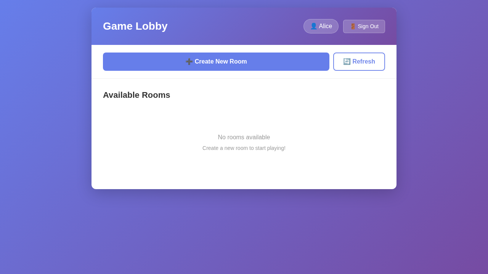

**Validation**: Page heading contains "Game Lobby"  
**Player 1 Perspective**: Successfully joined the lobby. Alice can see the "Create New Room" button and any available rooms. Username "Alice" appears in the header.

---

#### Step 4: Player 2 Login Screen

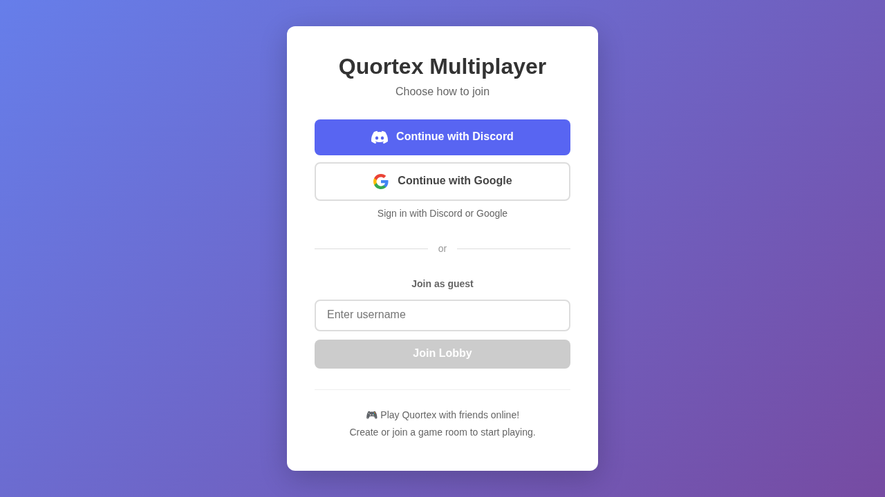

**Validation**: Page title contains "Quortex Multiplayer"  
**Player 2 Perspective**: Initial login screen from Player 2's separate browser context. This demonstrates **cookie isolation** - Player 2 is NOT automatically logged in as Player 1 despite being on the same URL.

---

#### Step 5: Player 2 Username Entered

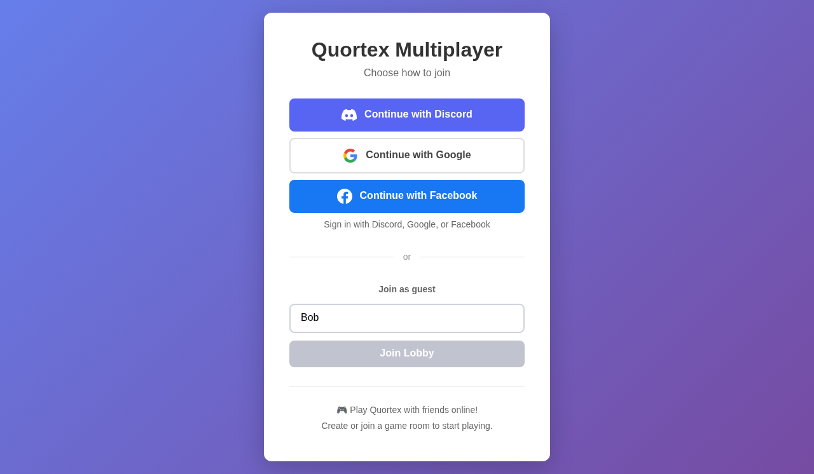

**Validation**: Username input contains "Bob", Join Lobby button is visible  
**Player 2 Perspective**: Username "Bob" entered, Join Lobby button enabled with the same purple styling.

---

#### Step 6: Player 2 in Lobby


**Validation**: Page heading contains "Game Lobby"  
**Player 2 Perspective**: Bob successfully joined the lobby with his own independent session. Username "Bob" appears in the header, confirming separate authentication.

---

### Room Creation and Joining (Steps 7-13)

#### Step 7: Create Room Modal

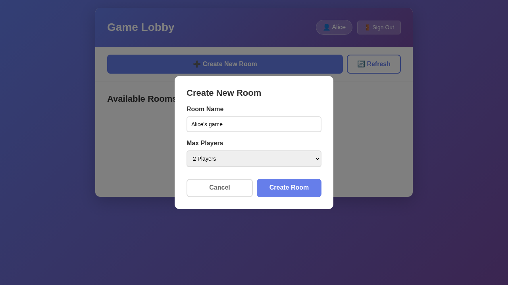

**Validation**: Modal heading contains "Create New Room"  
**Player 1 Perspective**: Alice clicks "Create New Room" button. Modal appears with room name input (pre-filled) and max players dropdown.

---

#### Step 8: Room Settings Configured

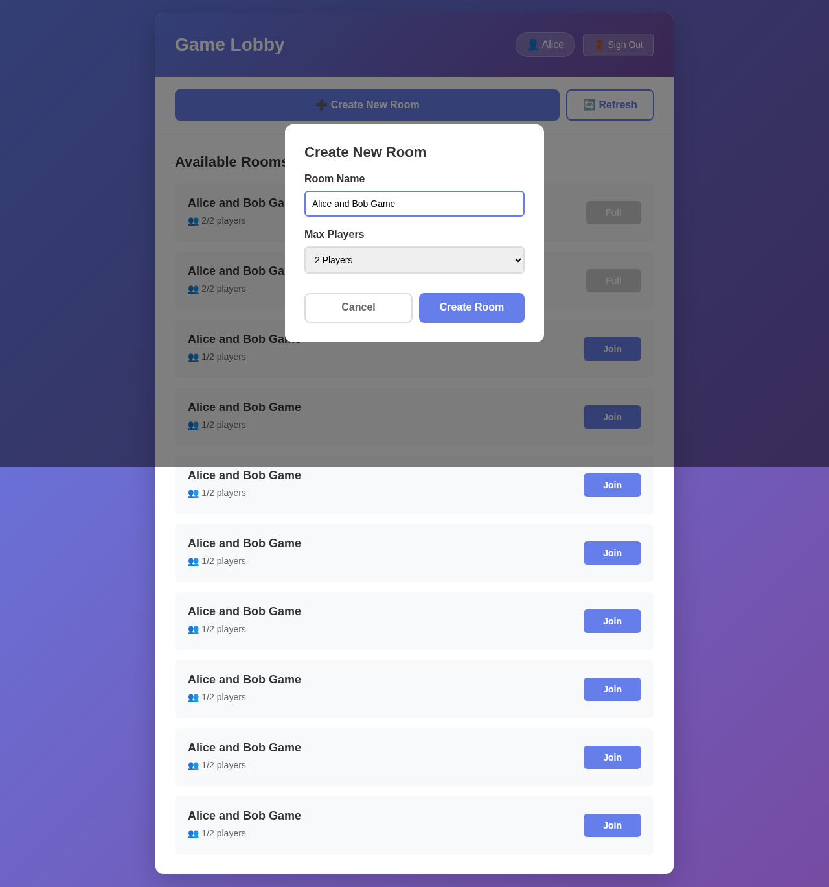

**Validation**: Room name input shows "E2E Test: Alice and Bob", dropdown shows 2 players selected  
**Player 1 Perspective**: Alice has set the room name to "E2E Test: Alice and Bob" and selected 2 as max players. "Create Room" button is ready to click. The test uses a fixed room name for repeatable screenshots with a fresh server instance for each test run.

---

#### Step 9: Player 1 Waiting in Room

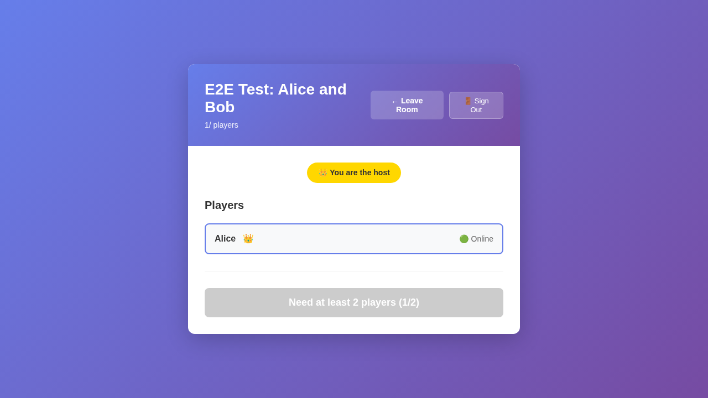

**Validation**: "Host" badge is visible on the page  
**Player 1 Perspective**: Alice is now inside the room she created. She has a "👑 You are the host" badge. Room shows "1/2 players". Alice's name appears in the player list. The room is waiting for another player to join.

---

#### Step 10: Player 2 Sees Room in Lobby

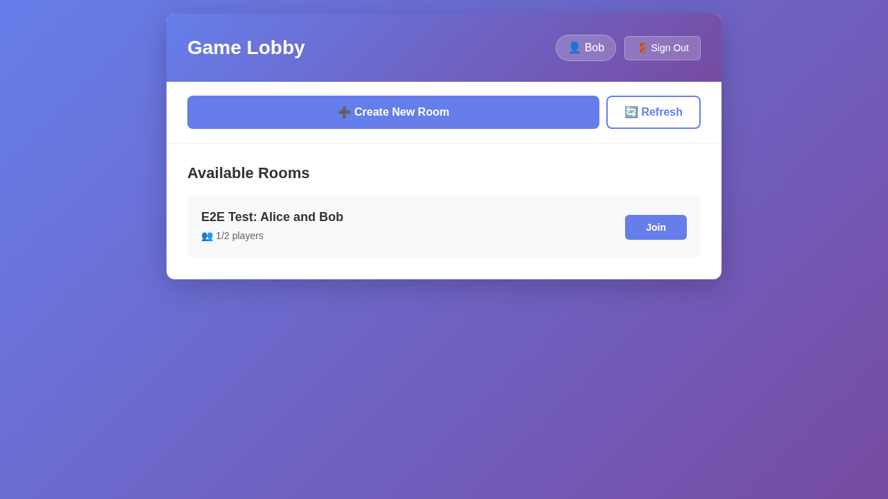

**Validation**: Room card with text "E2E Test: Alice and Bob" is visible  
**Player 2 Perspective**: Bob's lobby view has updated in **real-time via Socket.IO** to show the newly created room "E2E Test: Alice and Bob" in the available rooms list. The room card shows "👥 1/2 players".

---

#### Step 11: Player 2 Joined Room

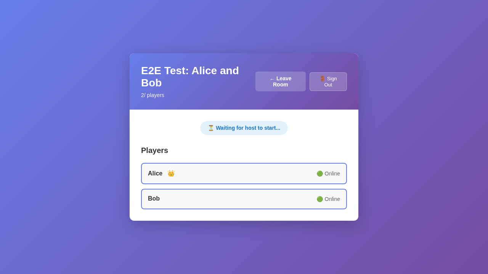

**Validation**: Page displays room content (after clicking room card)  
**Player 2 Perspective**: Bob has clicked on the room card and successfully joined the test room. He can see both players in the room (Alice with host icon, and himself). Room now shows "2/2 players".

---

#### Step 12: Player 1 Sees Player 2 Joined

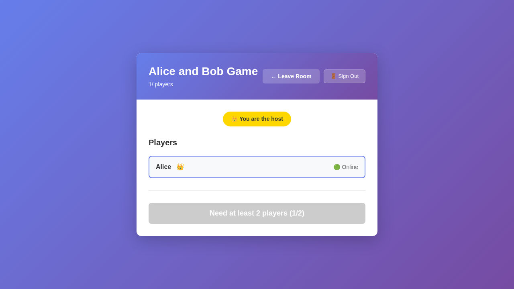

**Validation**: Real-time update via Socket.IO  
**Player 1 Perspective**: Alice's view automatically updates to show Bob has joined the room. Both players are now listed. This demonstrates **real-time synchronization** between the two browser contexts.

---

#### Step 13: Room Ready to Start


**Validation**: Room has 2/2 players, Start Game button is enabled  
**Player 1 Perspective**: The room is now full with both players. The host (Alice) can now start the game by clicking the "🎮 Start Game" button.

---

### Game Initialization (Steps 14-15)

#### Step 14: Player 1 - Game Canvas Visible


**Validation**: Canvas element visible, Redux state shows `screen: "configuration"`, `configPlayers: 0`  
**Player 1 Perspective**: Alice clicks "Start Game" and the game canvas appears. The UI transitions from the Svelte room screen to the canvas-based configuration screen where players will add themselves with colors.

---

#### Step 15: Player 2 - Game Canvas Synchronized


**Validation**: Canvas element visible via real-time sync, Redux state shows `screen: "configuration"`  
**Player 2 Perspective**: Bob's view automatically updates to show the game canvas. This demonstrates **real-time game start synchronization** via Socket.IO. Both players are now on the configuration screen.

---

## Next Steps for Full Gameplay Flow

---

### Configuration Phase (Steps 16-18)

#### Step 16: Player 1 Added to Configuration

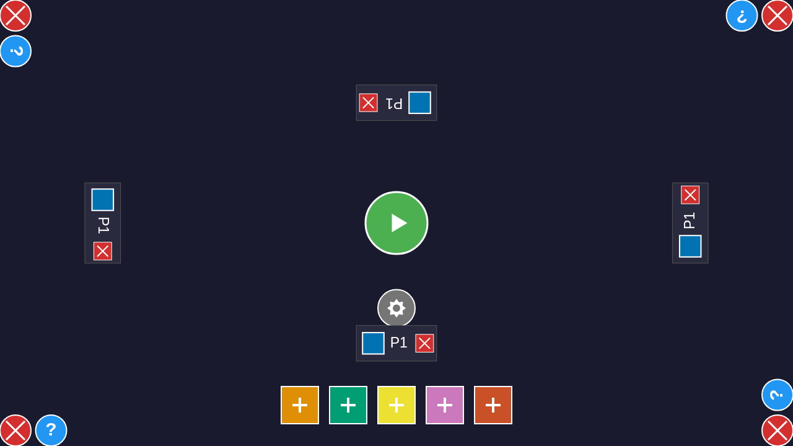

**Validation**: Redux state shows `configPlayers: 1`  
**Player 1 Perspective**: Alice dispatches ADD_PLAYER action with color #0173B2 (blue) at edge 0, adding herself to the game configuration.

---

#### Step 17: Player 2 Added to Configuration


**Validation**: Redux state shows `configPlayers: 2`  
**Player 2 Perspective**: Bob dispatches ADD_PLAYER action with color #DE8F05 (orange) at edge 1, adding himself to the game configuration.

---

#### Step 18: Both Players in Configuration

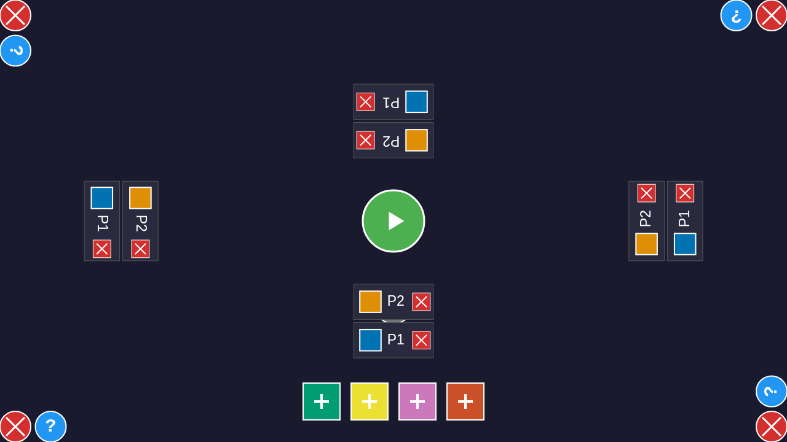

**Validation**: Both players see `configPlayers: 2` in synchronized state  
**Player 1 Perspective**: Alice's view shows both players configured and ready to start.

---

### Seating Phase (Steps 19-22)

#### Step 19: Player 1 Seating Phase


**Validation**: Redux state shows `screen: "seating"` after START_GAME action  
**Player 1 Perspective**: START_GAME dispatched without seed (GameCoordinator generates one and broadcasts). Alice transitions to seating phase where she selects her starting edge.

---

#### Step 20: Player 2 Seating Phase


**Validation**: Redux state synchronized to `screen: "seating"` via Socket.IO  
**Player 2 Perspective**: Bob's view updates to seating phase via real-time synchronization.

---

#### Step 21: Player 1 Edge Selected


**Validation**: SELECT_EDGE action for edge 0 broadcasted  
**Player 1 Perspective**: Alice selects edge 0 (bottom) as her starting position.

---

#### Step 22: Player 2 Edge Selected


**Validation**: SELECT_EDGE action for edge 3 broadcasted  
**Player 2 Perspective**: Bob selects edge 3 (top) as his starting position, opposite from Alice.

---

### Gameplay Phase (Steps 23-28)

#### Step 23: Player 1 Gameplay Started

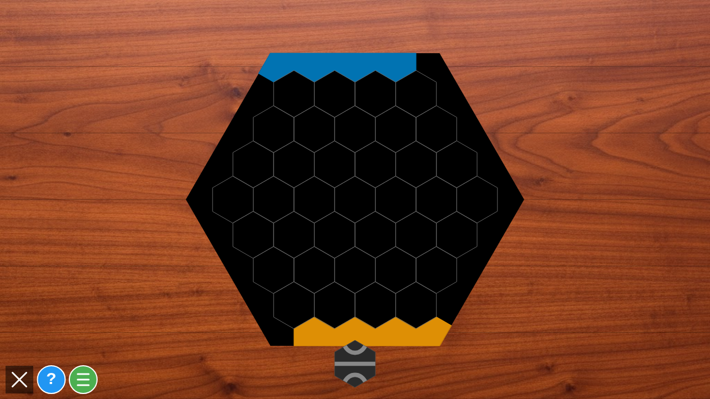

**Validation**: Redux state shows `screen: "gameplay"`, `players: 2`  
**Player 1 Perspective**: After both players select edges, the game transitions to gameplay phase.

---

#### Step 24: Player 2 Gameplay Started

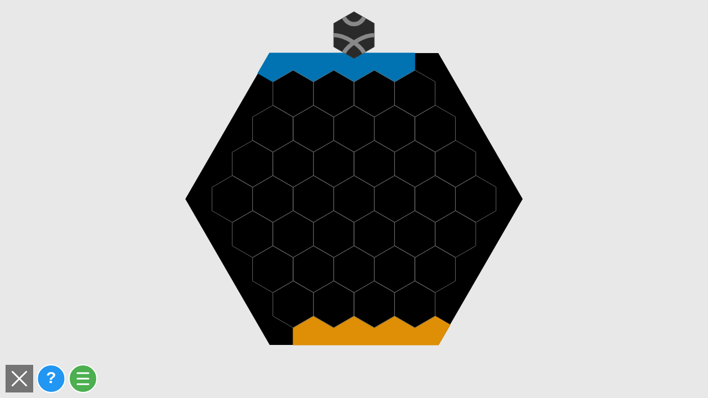

**Validation**: Gameplay state synchronized to Player 2  
**Player 2 Perspective**: Bob's view shows gameplay phase with both players ready.

---

### First Tile Placement (Steps 25-28)

#### Step 25: Player 1 Selects Tile Position


**Validation**: Position (-3, 0) selected for first tile placement  
**Player 1 Perspective**: Alice clicks on position (-3, 0) to place the first tile. With seed 888, this follows the deterministic tile sequence.

---

#### Step 26: Player 1 Rotates Tile

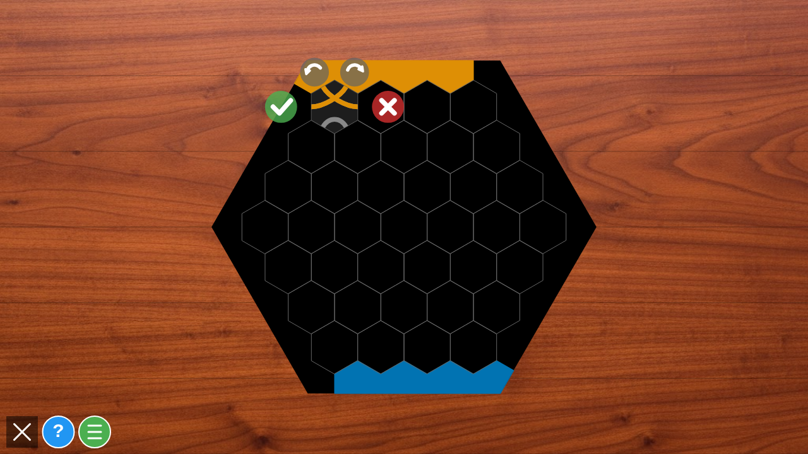

**Validation**: Tile rotated to rotation 1  
**Player 1 Perspective**: Alice presses 'r' to rotate the tile to rotation 1, matching the expected placement for seed 888.

---

#### Step 27: Player 1 Places Tile


**Validation**: Board has 1 tile, PLACE_TILE action broadcasted  
**Player 1 Perspective**: Alice confirms placement (presses Enter or dispatches PLACE_TILE action), and the tile appears on the board.

---

#### Step 28: Player 2 Sees Tile Placement


**Validation**: Board synchronized with 1 tile via Socket.IO  
**Player 2 Perspective**: Bob's view updates to show the placed tile, demonstrating **real-time tile placement synchronization**.

---

## User Flow Summary

1. **Player 1 (Alice)** logs in as anonymous user → sees lobby
2. **Player 2 (Bob)** logs in as anonymous user in separate browser context → sees lobby
3. **Alice** creates test room "E2E Test: Alice and Bob" (2 max players) → enters room as host
4. **Bob** sees the test room appear in lobby list → joins that room
5. **Both players** are in the room together → Alice clicks "Start Game"
6. **Game initializes** → both players see the configuration canvas
7. **Configuration** → Alice and Bob add themselves with colors via ADD_PLAYER
8. **Start game** → Alice dispatches START_GAME, then SHUFFLE_TILES with seed 888
9. **Seating** → Both players select their starting edges (Alice: edge 0, Bob: edge 3)
10. **Gameplay** → Game transitions to gameplay phase
11. **First tile** → Alice places tile at position (-3, 0) with rotation 1
12. **Synchronization** → Bob sees the placed tile via real-time Socket.IO sync

**Note**: The test starts a fresh server instance with a temporary data directory for each test run, ensuring completely clean state and truly repeatable results. SHUFFLE_TILES with seed 888 ensures deterministic tile order for consistent test validation. The temporary directory is cleaned up after the test completes.

## Programmatic Validations Performed

At each step, the test validates:
- ✅ Page headings and titles match expected screen
- ✅ Input fields contain expected values
- ✅ Buttons and UI elements are visible when expected
- ✅ Navigation between screens works correctly
- ✅ Real-time updates propagate between browser contexts via Socket.IO
- ✅ Cookie isolation maintains separate sessions
- ✅ Canvas game integration works correctly
- ✅ Redux state validation at all phase transitions
- ✅ Configuration phase: configPlayers count increases correctly
- ✅ Seating phase: screen transitions and edge selections
- ✅ Gameplay phase: screen transition and player count validation
- ✅ Tile placement: PLACE_TILE action synchronized between players
- ✅ Board state: tile appears on both players' boards after placement

## Technical Notes

- **Browser Contexts**: Uses `browser.newContext()` for cookie isolation
- **Anonymous Auth**: Uses `/auth/anonymous` endpoint with unique session IDs
- **Socket.IO**: Real-time room updates and game action synchronization
- **Fixed Room Name**: Uses "E2E Test: Alice and Bob" for repeatable, stable screenshots
- **Deterministic Tiles**: SHUFFLE_TILES with seed 888 ensures consistent tile order
- **Isolated Server**: Test starts its own server instance with a temporary data directory
- **Clean State**: Each test run has completely fresh server state (no pre-existing rooms/users)
- **Automatic Cleanup**: Temporary data directory is removed after test completes
- **Playwright Testing**: Comprehensive e2e testing with visual validation
- **Redux State Checks**: Validates game state at initialization via `page.evaluate()`
- **Redux + Socket.IO**: Game actions are dispatched via Redux and synchronized via Socket.IO

## Related Files

- `tests/e2e/multiplayer-two-player-flow.spec.ts` - Test implementation
- `src/multiplayer/components/LoginScreen.svelte` - Login UI
- `src/multiplayer/components/LobbyScreen.svelte` - Lobby UI
- `src/multiplayer/components/RoomScreen.svelte` - Room UI
- `src/multiplayer/socket.ts` - Socket.IO client
- `src/multiplayer/gameCoordinator.ts` - Game action coordination
- `src/multiplayer/gameIntegration.ts` - Canvas game integration
- `server/src/index.ts` - Multiplayer server

## Success Criteria

✅ Two separate browser contexts maintain independent sessions  
✅ Both users log in with different anonymous accounts  
✅ Room creation and listing works  
✅ Player can join another player's room  
✅ Real-time synchronization via Socket.IO  
✅ Game initialization transitions to configuration canvas  
✅ Configuration phase: ADD_PLAYER actions synchronized  
✅ START_GAME with SHUFFLE_TILES seed 888 for repeatability  
✅ Seating phase: SELECT_EDGE actions synchronized  
✅ Gameplay phase initialization  
✅ First tile placement at position (-3, 0) with rotation 1  
✅ Tile synchronization between players via Socket.IO  
✅ Board state validation after tile placement  
✅ Redux state validated at all phase transitions  
✅ Screenshots from both perspectives with validation (32 total)
