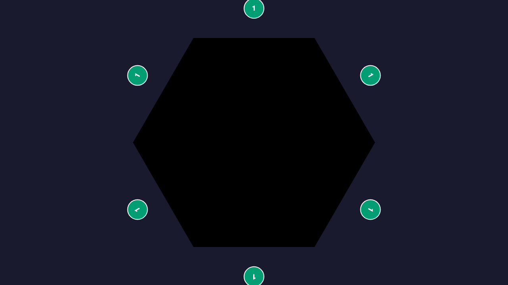
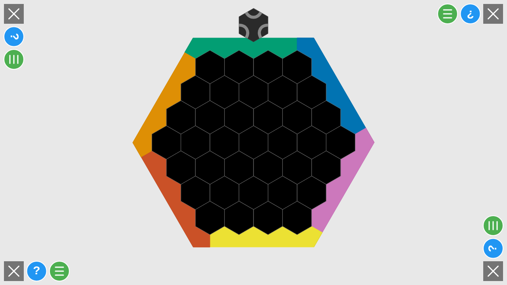
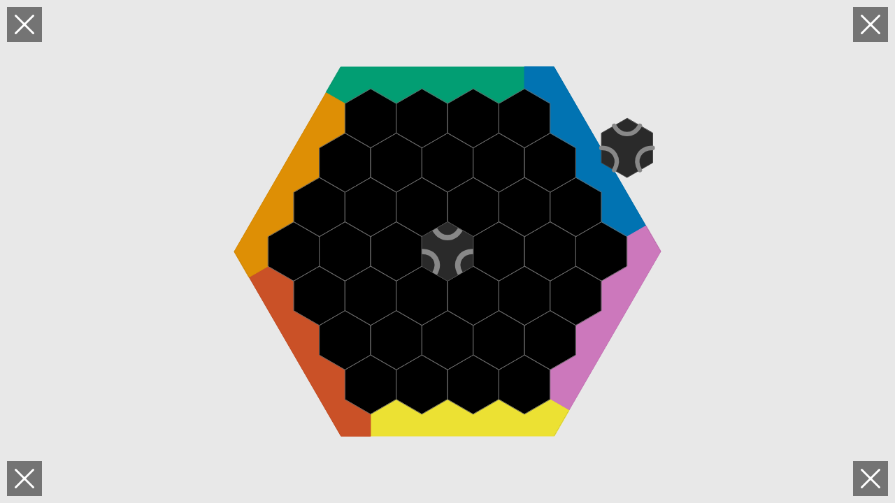
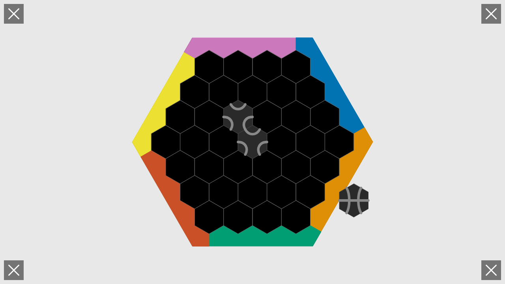
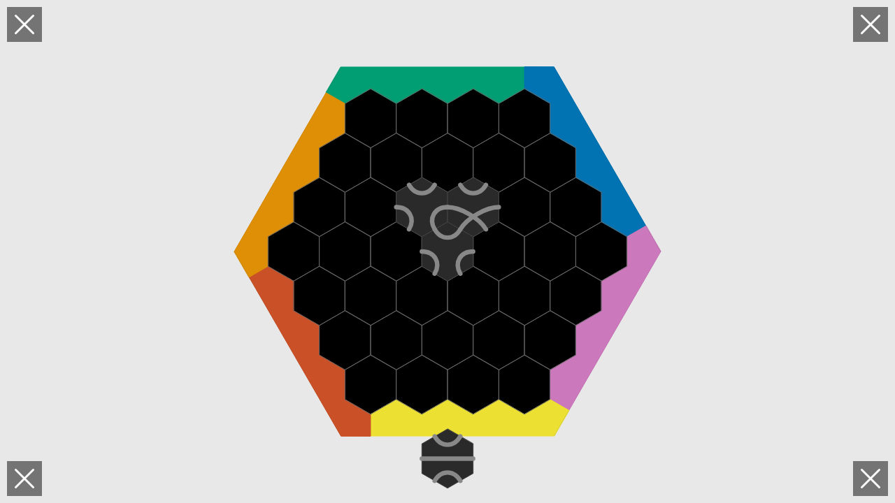
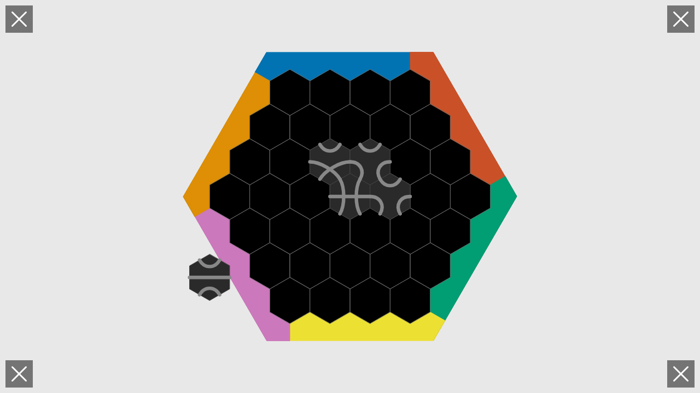
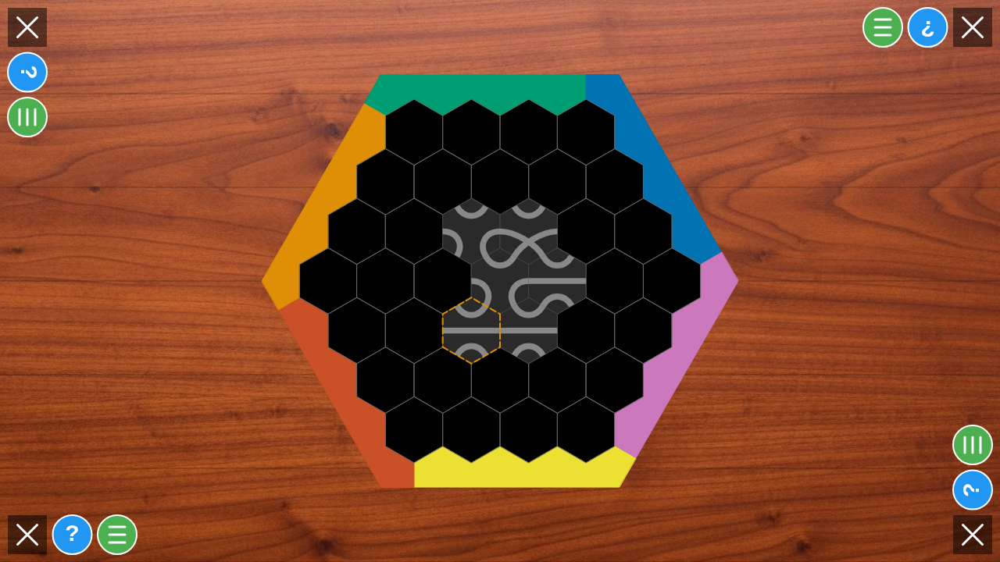
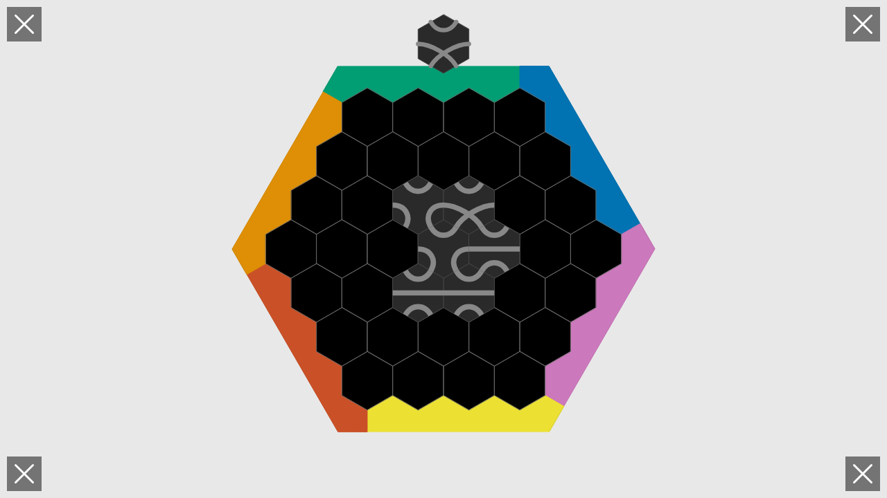

# User Story: Player Order Validation

**As a user, I want players to take turns in clockwise order around the hexagonal board**

## Flow Description

This story validates that after the seating phase, players take turns in the correct clockwise order starting from the starting player, regardless of the randomized seating selection order or the original join order.

## Problem Being Tested

Previously, the player turn order did not follow the clockwise seating arrangement. The `players` array was not reordered to match the gameplay sequence, causing players to take turns in the wrong order. This test validates the fix.

## Screenshots

### 001-six-players-configured.png

- **Action**: Six players join the game (Blue, Orange, Green, Yellow, Purple, Red)
- **State**: Configuration screen with all 6 players configured
- **Redux State**: `configPlayers.length = 6`, `screen = 'configuration'`
- **What to verify**: All 6 players visible, ready to start game

### 002-seating-phase.png

- **Action**: User clicks START button
- **State**: Transition to seating phase with randomized selection order
- **Redux State**: `screen = 'seating'`, `seatingPhase.active = true`, `seatingPhase.seatingOrder` is randomized
- **What to verify**: Seating screen with edge selection buttons, seating order is randomized (not join order)

### 003-gameplay-started.png

- **Action**: All 6 players select their edges in seating order (edges 0, 1, 2, 3, 4, 5)
- **State**: Gameplay begins with starting player at index 0
- **Redux State**: `screen = 'gameplay'`, `players` array ordered clockwise from starting player
- **What to verify**: Board visible, players array ordered by edge position (0→1→2→3→4→5), starting player is first in array

### 004-turn-1-player-[ID].png through 004-turn-6-player-[ID].png

Each screenshot shows one player's turn placing a tile. With deterministic seed 54321, the turn order is:

- **Action**: Each player places one tile in turn
- **State**: Tiles accumulate on board, turn advances to next player
- **Redux State**: `currentPlayerIndex` increments from 0→1→2→3→4→5
- **What to verify**: 
  - Turn order follows clockwise edge positions (edge 0 → edge 1 → edge 2 → edge 3 → edge 4 → edge 5)
  - Starting player (edge 0) goes first
  - Each subsequent turn goes to the next player clockwise

### 005-all-turns-complete.png

- **Action**: All 6 players have placed one tile each
- **State**: 6 tiles on board, move history shows correct order
- **Redux State**: `moveHistory.length = 6`, each move by expected player in clockwise order
- **What to verify**: Move history confirms clockwise turn order from starting player

## Key Validation Points

This test specifically validates:

1. **Randomized seating order**: The `seatingPhase.seatingOrder` is randomized (not join order)
2. **Edge assignments**: Players select edges 0-5 in their randomized seating order
3. **Player array reordering**: After seating, `players` array is reordered to match clockwise gameplay order
4. **Starting player**: Starting player (first in seating order) becomes index 0 in players array
5. **Turn sequence**: Turns proceed in order: edge 0 → edge 1 → edge 2 → edge 3 → edge 4 → edge 5
6. **Move history**: Move history records show players took turns in correct clockwise order

## Actual Flow (with seed 54321)

This test uses a deterministic seed (54321) to ensure reproducible results. The seating order generated is: `[P3, P1, P5, P4, P6, P2]`

1. P3 selects edge 0 (starting player)
2. P1 selects edge 1
3. P5 selects edge 2
4. P4 selects edge 3
5. P6 selects edge 4
6. P2 selects edge 5

Expected turn order (clockwise from edge 0):
- Turn 1: P3 (edge 0) - starting player
- Turn 2: P1 (edge 1) - next clockwise
- Turn 3: P5 (edge 2)
- Turn 4: P4 (edge 3)
- Turn 5: P6 (edge 4)
- Turn 6: P2 (edge 5)

The `players` array after seating is reordered to: `[P3, P1, P5, P4, P6, P2]` (clockwise from starting player), and `currentPlayerIndex` simply increments 0→1→2→3→4→5.

## Continuous Flow with Deterministic Seed

This test is generated by a **single continuous execution** using a deterministic seed (54321) that:
1. Adds 6 players to configuration
2. Starts game with seed 54321 (transitions to seating with predictable order)
3. Each player selects an edge in seating order
4. Verifies players array is ordered clockwise
5. Each player places one tile
6. Verifies turn order matches clockwise edge positions

**Note:** The test uses a deterministic seed to ensure reproducible screenshots and consistent player order across test runs. All screenshots in this directory are from a single test execution.

## Test Coverage

This story validates:
- Seating order randomization
- Player array reordering after seating phase
- Clockwise turn order from starting player
- Turn advancement via `currentPlayerIndex`
- Move history accuracy

## Related Files
- Test: `tests/e2e/player-order-validation.spec.ts`
- Redux: `src/redux/gameReducer.ts` (SELECT_EDGE action, determineGameplayOrder function)
- Types: `src/redux/types.ts` (SeatingPhaseState)
